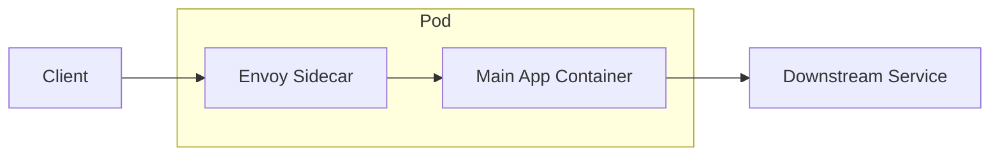
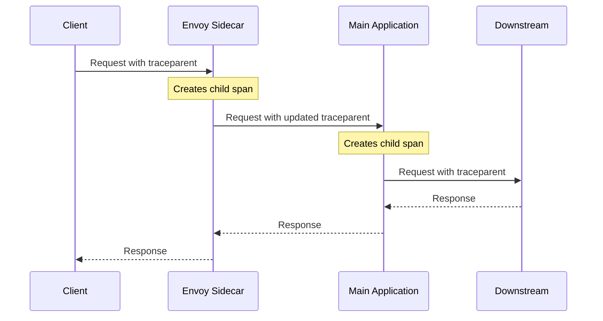

# How to Instrument Kubernetes Sidecar Containers for Any Language Runtime

Author: [nawazdhandala](https://www.github.com/nawazdhandala)

Tags: OpenTelemetry, Kubernetes, Sidecar, Instrumentation, Containers, Cloud Native

Description: Learn how to instrument Kubernetes sidecar containers with OpenTelemetry regardless of the programming language runtime used by the main application.

---

Sidecar containers in Kubernetes handle cross-cutting concerns like proxying, logging, and secret management alongside your main application container. They run in the same pod, share the same network namespace, and often play a critical role in request processing. But when it comes to observability, sidecars are frequently overlooked. Your traces show the main application but miss the time spent in the Envoy proxy, the NGINX reverse proxy, or the custom auth sidecar. This creates gaps in your distributed traces that make debugging harder.

This post covers practical approaches to instrumenting sidecar containers with OpenTelemetry, covering both pre-built instrumentations and custom solutions that work regardless of the language runtime.

## Why Sidecar Instrumentation Matters

Consider a typical pod with an Envoy sidecar proxy:



When a request arrives, it first hits the Envoy sidecar, which may perform TLS termination, rate limiting, authentication, and routing. The sidecar then forwards the request to the main application container. Without sidecar instrumentation, the trace jumps from the client directly to the main application, and you lose visibility into the sidecar processing time. If the sidecar adds 50ms of latency, you will not see it in your traces.

## The OpenTelemetry Collector as a Sidecar

The most common sidecar pattern for OpenTelemetry is running the collector itself as a sidecar. This is different from instrumenting an existing sidecar. Here, the collector runs alongside your application and receives telemetry over localhost:

```yaml
# Pod spec with the OpenTelemetry Collector as a sidecar.
# The app sends telemetry to localhost:4318, which the collector
# receives and forwards to the central gateway.
apiVersion: v1
kind: Pod
metadata:
  name: my-app
spec:
  containers:
    # Main application container
    - name: app
      image: mycompany/my-app:latest
      env:
        # Point the SDK to the sidecar collector on localhost
        - name: OTEL_EXPORTER_OTLP_ENDPOINT
          value: "http://localhost:4318"
        - name: OTEL_SERVICE_NAME
          value: "my-app"

    # OpenTelemetry Collector sidecar
    - name: otel-collector
      image: otel/opentelemetry-collector-contrib:0.96.0
      args: ["--config=/etc/otel/config.yaml"]
      volumeMounts:
        - name: otel-config
          mountPath: /etc/otel
      ports:
        - containerPort: 4317
        - containerPort: 4318

  volumes:
    - name: otel-config
      configMap:
        name: otel-sidecar-config
```

The sidecar collector configuration is intentionally lightweight. It receives, does minimal processing, and forwards to a gateway:

```yaml
# ConfigMap for the sidecar collector.
# Keeps processing minimal since the gateway handles the heavy lifting.
apiVersion: v1
kind: ConfigMap
metadata:
  name: otel-sidecar-config
data:
  config.yaml: |
    receivers:
      otlp:
        protocols:
          grpc:
            endpoint: 0.0.0.0:4317
          http:
            endpoint: 0.0.0.0:4318

    processors:
      batch:
        timeout: 2s
        send_batch_size: 256

      resource:
        attributes:
          - key: k8s.pod.name
            from_attribute: ""
            action: insert
            value: "${K8S_POD_NAME}"

    exporters:
      otlphttp:
        endpoint: http://otel-gateway.observability.svc:4318

    service:
      pipelines:
        traces:
          receivers: [otlp]
          processors: [resource, batch]
          exporters: [otlphttp]
```

## Instrumenting Envoy Sidecar Proxies

Envoy has built-in OpenTelemetry support. If you are running Envoy as a sidecar (either directly or through Istio), you can configure it to emit traces:

```yaml
# Envoy bootstrap configuration for OpenTelemetry tracing.
# This configures Envoy to create spans for every proxied request
# and send them to the sidecar collector.
static_resources:
  clusters:
    - name: opentelemetry_collector
      type: STRICT_DNS
      lb_policy: ROUND_ROBIN
      typed_extension_protocol_options:
        envoy.extensions.upstreams.http.v3.HttpProtocolOptions:
          "@type": type.googleapis.com/envoy.extensions.upstreams.http.v3.HttpProtocolOptions
          explicit_http_config:
            http2_protocol_options: {}
      load_assignment:
        cluster_name: opentelemetry_collector
        endpoints:
          - lb_endpoints:
              - endpoint:
                  address:
                    socket_address:
                      address: localhost
                      port_value: 4317

tracing:
  http:
    name: envoy.tracers.opentelemetry
    typed_config:
      "@type": type.googleapis.com/envoy.config.trace.v3.OpenTelemetryConfig
      grpc_service:
        envoy_grpc:
          cluster_name: opentelemetry_collector
        timeout: 0.250s
      service_name: envoy-sidecar
```

With Istio, the configuration is simpler. You configure tracing at the mesh level:

```yaml
# Istio MeshConfig for OpenTelemetry tracing.
# This enables tracing for all Envoy sidecars in the mesh.
apiVersion: install.istio.io/v1alpha1
kind: IstioOperator
spec:
  meshConfig:
    enableTracing: true
    extensionProviders:
      - name: otel
        opentelemetry:
          service: otel-gateway.observability.svc.cluster.local
          port: 4317
    defaultProviders:
      tracing:
        - otel
```

## Instrumenting NGINX Sidecar Containers

NGINX sidecars are common for TLS termination and static file serving. Use the OpenTelemetry NGINX module:

```dockerfile
# Dockerfile for NGINX with OpenTelemetry instrumentation.
# The OTel module is loaded as a dynamic module.
FROM nginx:1.25

# Install the OpenTelemetry NGINX module
RUN apt-get update && apt-get install -y \
    libcurl4-openssl-dev \
    libprotobuf-dev \
    protobuf-compiler

# Copy the pre-built OTel module (or build from source)
COPY otel_ngx_module.so /etc/nginx/modules/

# Load the module in the NGINX configuration
COPY nginx.conf /etc/nginx/nginx.conf
```

Configure the module in your NGINX configuration:

```nginx
# nginx.conf with OpenTelemetry instrumentation enabled.
# Traces are sent to the sidecar collector on localhost.
load_module modules/otel_ngx_module.so;

http {
    otel_exporter {
        endpoint localhost:4317;
    }

    otel_service_name nginx-sidecar;

    # Enable tracing for all server blocks
    otel_trace on;

    server {
        listen 8080;

        location / {
            # The trace context is automatically propagated to the upstream
            otel_trace_context propagate;
            proxy_pass http://localhost:8081;
        }
    }
}
```

## Using the OpenTelemetry Operator for Auto-Injection

The OpenTelemetry Operator for Kubernetes can automatically inject sidecar collectors and auto-instrumentation into your pods:

```yaml
# OpenTelemetry Instrumentation resource.
# The operator watches for pods with the annotation and injects the sidecar.
apiVersion: opentelemetry.io/v1alpha1
kind: Instrumentation
metadata:
  name: my-instrumentation
  namespace: default
spec:
  exporter:
    endpoint: http://otel-gateway.observability.svc:4318
  propagators:
    - tracecontext
    - baggage
  sampler:
    type: parentbased_traceidratio
    argument: "0.25"
  # Language-specific configuration
  java:
    image: ghcr.io/open-telemetry/opentelemetry-operator/autoinstrumentation-java:latest
  python:
    image: ghcr.io/open-telemetry/opentelemetry-operator/autoinstrumentation-python:latest
  nodejs:
    image: ghcr.io/open-telemetry/opentelemetry-operator/autoinstrumentation-nodejs:latest
```

Annotate your pods to opt into auto-instrumentation:

```yaml
# Annotate the pod to trigger auto-instrumentation injection.
# The operator detects the annotation and injects the appropriate
# init container and environment variables.
apiVersion: apps/v1
kind: Deployment
metadata:
  name: my-java-app
spec:
  template:
    metadata:
      annotations:
        # This tells the operator to inject Java auto-instrumentation
        instrumentation.opentelemetry.io/inject-java: "true"
        # For a sidecar collector instead of auto-instrumentation:
        sidecar.opentelemetry.io/inject: "true"
    spec:
      containers:
        - name: app
          image: mycompany/my-java-app:latest
```

## Correlating Sidecar and Application Spans

The trickiest part of sidecar instrumentation is making sure the sidecar spans and the application spans are part of the same trace. This requires proper context propagation between the sidecar and the main container.

For HTTP-based communication, the sidecar must propagate the `traceparent` header. Most instrumented proxies (Envoy, NGINX with OTel module) do this automatically. The flow looks like this:



If your sidecar uses a custom protocol instead of HTTP, you need to handle context propagation manually. Extract the trace context from the incoming request in the sidecar, and inject it into whatever format the sidecar uses to communicate with the main container.

## Resource Attributes for Sidecars

Set distinct resource attributes for sidecar containers so you can differentiate their spans from the main application:

```yaml
# Use the k8s.container.name attribute to distinguish between
# the sidecar and the main application in the same pod.
processors:
  resource:
    attributes:
      - key: k8s.container.name
        value: "envoy-sidecar"
        action: upsert
      - key: service.name
        value: "envoy-sidecar"
        action: upsert
```

## Conclusion

Sidecar containers are often invisible in traces, which creates blind spots in your observability. Instrumenting them with OpenTelemetry closes these gaps and gives you complete visibility into every step of request processing within a pod. Whether you are running Envoy, NGINX, or custom sidecars, the approach follows the same pattern: configure the sidecar to emit spans, ensure trace context propagation between the sidecar and the main container, and use a sidecar collector to aggregate and forward the telemetry. The OpenTelemetry Operator simplifies this further by automating injection and configuration.
