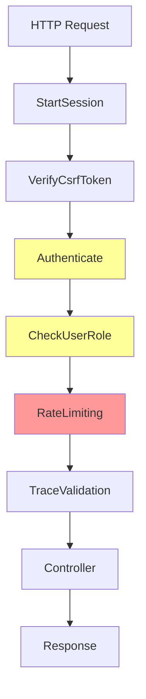

# How to Instrument Laravel HTTP Middleware with OpenTelemetry

Author: [nawazdhandala](https://www.github.com/nawazdhandala)

Tags: OpenTelemetry, PHP, Laravel, Middleware, HTTP, Tracing

Description: Implement OpenTelemetry tracing in Laravel HTTP middleware to track authentication, rate limiting, and request processing pipelines.

Middleware sits between the request and your application logic. Authentication checks, rate limiting, logging, request transformation - all happen in middleware before your controller runs. When requests slow down or fail, middleware is often the culprit, but it's invisible without proper instrumentation.

OpenTelemetry tracing in middleware reveals exactly what happens in this critical layer. You see which middleware executes, how long each takes, and where requests get blocked or transformed.

## Understanding Laravel's Middleware Pipeline

Laravel processes requests through a middleware stack. Each middleware can inspect the request, modify it, call the next middleware, then inspect and modify the response.

```php
// Typical middleware stack
Request -> StartSession -> Authenticate -> RateLimiter -> Controller -> Response
```

Without tracing, you can't see:

- Which middleware executed
- How long each middleware took
- Why a request was rejected
- What data was added or modified

OpenTelemetry makes this pipeline visible.

## Creating a Traced Middleware Base Class

Build a base middleware class that automatically creates spans for any middleware that extends it.

Create `app/Http/Middleware/TracedMiddleware.php`:

```php
<?php

namespace App\Http\Middleware;

use Closure;
use Illuminate\Http\Request;
use OpenTelemetry\API\Globals;
use OpenTelemetry\API\Trace\SpanKind;
use OpenTelemetry\API\Trace\StatusCode;

abstract class TracedMiddleware
{
    /**
     * Handle an incoming request with automatic tracing
     */
    public function handle(Request $request, Closure $next, ...$parameters)
    {
        $tracer = Globals::tracerProvider()->getTracer('laravel-middleware');

        $middlewareName = class_basename(static::class);

        $span = $tracer->spanBuilder("middleware.{$middlewareName}")
            ->setSpanKind(SpanKind::KIND_INTERNAL)
            ->startSpan();

        $scope = $span->activate();

        try {
            // Add request metadata
            $span->setAttribute('http.method', $request->method());
            $span->setAttribute('http.route', $request->route()?->uri() ?? 'unknown');
            $span->setAttribute('http.url', $request->fullUrl());
            $span->setAttribute('middleware.name', static::class);
            $span->setAttribute('middleware.parameters', json_encode($parameters));

            // Add user context if authenticated
            if ($request->user()) {
                $span->setAttribute('user.id', $request->user()->id);
                $span->setAttribute('user.authenticated', true);
            }

            // Call the actual middleware logic
            $response = $this->process($request, $next, ...$parameters);

            // Add response metadata
            $span->setAttribute('http.status_code', $response->status());
            $span->setAttribute('middleware.passed', true);

            return $response;

        } catch (\Throwable $e) {
            // Record exception
            $span->recordException($e);
            $span->setStatus(StatusCode::ERROR, $e->getMessage());
            $span->setAttribute('middleware.passed', false);
            $span->setAttribute('middleware.exception', get_class($e));

            throw $e;

        } finally {
            $span->end();
            $scope->detach();
        }
    }

    /**
     * Subclasses implement this instead of handle()
     */
    abstract protected function process(Request $request, Closure $next, ...$parameters);
}
```

Now any middleware extending `TracedMiddleware` gets automatic instrumentation:

```php
<?php

namespace App\Http\Middleware;

use Closure;
use Illuminate\Http\Request;

class CheckUserRole extends TracedMiddleware
{
    protected function process(Request $request, Closure $next, string $role)
    {
        // Get current span to add custom attributes
        $span = \OpenTelemetry\API\Trace\Span::getCurrent();
        $span->setAttribute('authorization.required_role', $role);
        $span->setAttribute('authorization.user_role', $request->user()?->role);

        if (!$request->user() || $request->user()->role !== $role) {
            $span->addEvent('authorization_failed', [
                'reason' => 'Role mismatch',
                'required' => $role,
                'actual' => $request->user()?->role ?? 'none',
            ]);

            abort(403, 'Unauthorized');
        }

        $span->addEvent('authorization_passed');

        return $next($request);
    }
}
```

## Tracing Authentication Middleware

Authentication is a critical middleware layer. Track authentication checks, failures, and token validation.

Create `app/Http/Middleware/TraceAuthentication.php`:

```php
<?php

namespace App\Http\Middleware;

use Closure;
use Illuminate\Http\Request;
use Illuminate\Auth\Middleware\Authenticate as BaseAuthenticate;
use OpenTelemetry\API\Globals;
use OpenTelemetry\API\Trace\StatusCode;

class TraceAuthentication extends BaseAuthenticate
{
    public function handle($request, Closure $next, ...$guards)
    {
        $tracer = Globals::tracerProvider()->getTracer('laravel-middleware');

        $span = $tracer->spanBuilder('middleware.authenticate')
            ->startSpan();

        $scope = $span->activate();

        try {
            $span->setAttribute('auth.guards', json_encode($guards ?: ['web']));
            $span->setAttribute('auth.attempted', true);

            // Check authentication token/session
            $span->addEvent('checking_authentication');

            // Call parent authentication logic
            $response = parent::handle($request, $next, ...$guards);

            // Authentication successful
            $user = $request->user();
            $span->setAttribute('auth.success', true);
            $span->setAttribute('auth.user_id', $user->id);
            $span->setAttribute('auth.method', $this->detectAuthMethod($request));

            $span->addEvent('authentication_successful', [
                'user_id' => $user->id,
                'email' => $user->email,
            ]);

            return $response;

        } catch (\Illuminate\Auth\AuthenticationException $e) {
            // Authentication failed
            $span->setAttribute('auth.success', false);
            $span->setAttribute('auth.failure_reason', 'No valid credentials');

            $span->addEvent('authentication_failed', [
                'reason' => $e->getMessage(),
                'guards' => $e->guards(),
            ]);

            $span->setStatus(StatusCode::ERROR, 'Authentication failed');

            throw $e;

        } catch (\Throwable $e) {
            $span->recordException($e);
            $span->setStatus(StatusCode::ERROR, $e->getMessage());

            throw $e;

        } finally {
            $span->end();
            $scope->detach();
        }
    }

    /**
     * Detect which authentication method was used
     */
    private function detectAuthMethod(Request $request): string
    {
        if ($request->bearerToken()) {
            return 'bearer_token';
        }

        if ($request->hasSession() && $request->session()->has('auth')) {
            return 'session';
        }

        if ($request->getUser() && $request->getPassword()) {
            return 'basic_auth';
        }

        return 'unknown';
    }
}
```

Replace Laravel's default authentication middleware in `app/Http/Kernel.php`:

```php
protected $middlewareAliases = [
    'auth' => \App\Http\Middleware\TraceAuthentication::class,
    // Other middleware...
];
```

## Instrumenting Rate Limiting Middleware

Rate limiting prevents abuse but can block legitimate traffic. Trace rate limit checks to understand when and why requests are throttled.

Create `app/Http/Middleware/TraceRateLimiting.php`:

```php
<?php

namespace App\Http\Middleware;

use Closure;
use Illuminate\Http\Request;
use Illuminate\Routing\Middleware\ThrottleRequests;
use Illuminate\Support\Facades\RateLimiter;
use OpenTelemetry\API\Globals;
use OpenTelemetry\API\Trace\StatusCode;

class TraceRateLimiting extends ThrottleRequests
{
    public function handle($request, Closure $next, $maxAttempts = 60, $decayMinutes = 1, $prefix = '')
    {
        $tracer = Globals::tracerProvider()->getTracer('laravel-middleware');

        $span = $tracer->spanBuilder('middleware.rate_limit')
            ->startSpan();

        $scope = $span->activate();

        try {
            // Determine rate limit key
            $key = $this->resolveRequestSignature($request);

            $span->setAttribute('rate_limit.key', $key);
            $span->setAttribute('rate_limit.max_attempts', $maxAttempts);
            $span->setAttribute('rate_limit.decay_minutes', $decayMinutes);

            // Check current usage
            $attempts = RateLimiter::attempts($key);
            $remaining = max(0, $maxAttempts - $attempts);

            $span->setAttribute('rate_limit.attempts', $attempts);
            $span->setAttribute('rate_limit.remaining', $remaining);
            $span->setAttribute('rate_limit.limit_reached', $remaining === 0);

            // Add event for high usage
            if ($remaining < $maxAttempts * 0.2) {
                $span->addEvent('rate_limit_approaching', [
                    'remaining' => $remaining,
                    'max' => $maxAttempts,
                    'percentage_used' => round(($attempts / $maxAttempts) * 100, 2),
                ]);
            }

            // Call parent throttle logic
            $response = parent::handle($request, $next, $maxAttempts, $decayMinutes, $prefix);

            $span->setAttribute('rate_limit.passed', true);

            return $response;

        } catch (\Illuminate\Http\Exceptions\ThrottleRequestsException $e) {
            // Rate limit exceeded
            $retryAfter = $e->getHeaders()['Retry-After'] ?? null;

            $span->setAttribute('rate_limit.passed', false);
            $span->setAttribute('rate_limit.exceeded', true);
            $span->setAttribute('rate_limit.retry_after', $retryAfter);

            $span->addEvent('rate_limit_exceeded', [
                'retry_after_seconds' => $retryAfter,
                'attempts' => $attempts,
                'max_attempts' => $maxAttempts,
            ]);

            $span->setStatus(StatusCode::ERROR, 'Rate limit exceeded');

            throw $e;

        } finally {
            $span->end();
            $scope->detach();
        }
    }
}
```

## Tracing Request Validation Middleware

Validation middleware rejects malformed requests. Track what gets validated and why requests fail.

Create `app/Http/Middleware/TraceValidation.php`:

```php
<?php

namespace App\Http\Middleware;

use Closure;
use Illuminate\Http\Request;
use Illuminate\Support\Facades\Validator;
use OpenTelemetry\API\Globals;
use OpenTelemetry\API\Trace\StatusCode;

class TraceValidation
{
    public function handle(Request $request, Closure $next)
    {
        $tracer = Globals::tracerProvider()->getTracer('laravel-middleware');

        $span = $tracer->spanBuilder('middleware.validation')
            ->startSpan();

        $scope = $span->activate();

        try {
            // Get validation rules from route
            $rules = $this->getValidationRules($request);

            if (empty($rules)) {
                // No validation required
                $span->setAttribute('validation.required', false);
                return $next($request);
            }

            $span->setAttribute('validation.required', true);
            $span->setAttribute('validation.rules_count', count($rules));
            $span->setAttribute('validation.input_fields', array_keys($request->all()));

            // Validate request
            $validator = Validator::make($request->all(), $rules);

            if ($validator->fails()) {
                $errors = $validator->errors();

                $span->setAttribute('validation.passed', false);
                $span->setAttribute('validation.error_count', $errors->count());
                $span->setAttribute('validation.failed_fields', array_keys($errors->messages()));

                $span->addEvent('validation_failed', [
                    'errors' => $errors->toArray(),
                ]);

                $span->setStatus(StatusCode::ERROR, 'Validation failed');

                return response()->json([
                    'message' => 'Validation failed',
                    'errors' => $errors,
                ], 422);
            }

            $span->setAttribute('validation.passed', true);
            $span->addEvent('validation_successful');

            return $next($request);

        } finally {
            $span->end();
            $scope->detach();
        }
    }

    /**
     * Extract validation rules from request
     */
    private function getValidationRules(Request $request): array
    {
        // This is simplified - actual implementation depends on your routing strategy
        $action = $request->route()?->getAction();

        if (isset($action['validation'])) {
            return $action['validation'];
        }

        return [];
    }
}
```

## Creating a Middleware Pipeline Visualization

Visualize the entire middleware stack with timing information:

```php
<?php

namespace App\Http\Middleware;

use Closure;
use Illuminate\Http\Request;
use OpenTelemetry\API\Globals;

class TraceMiddlewarePipeline
{
    private static $middlewareStack = [];

    public function handle(Request $request, Closure $next)
    {
        $tracer = Globals::tracerProvider()->getTracer('laravel-middleware');

        $span = $tracer->spanBuilder('middleware.pipeline')
            ->startSpan();

        $scope = $span->activate();

        try {
            // Capture middleware stack
            $middlewares = $this->getMiddlewareStack($request);

            $span->setAttribute('middleware.count', count($middlewares));
            $span->setAttribute('middleware.stack', json_encode($middlewares));

            $span->addEvent('pipeline_started', [
                'middlewares' => $middlewares,
            ]);

            $response = $next($request);

            $span->addEvent('pipeline_completed');

            return $response;

        } finally {
            $span->end();
            $scope->detach();
        }
    }

    /**
     * Get the full middleware stack for this request
     */
    private function getMiddlewareStack(Request $request): array
    {
        $route = $request->route();

        if (!$route) {
            return [];
        }

        return array_map(function ($middleware) {
            return is_string($middleware) ? $middleware : get_class($middleware);
        }, $route->gatherMiddleware());
    }
}
```

The resulting trace shows the complete middleware flow:



## Tracing Custom Business Logic Middleware

Create traced middleware for custom business logic:

```php
<?php

namespace App\Http\Middleware;

use Closure;
use Illuminate\Http\Request;
use App\Services\FeatureFlagService;
use OpenTelemetry\API\Globals;
use OpenTelemetry\API\Trace\StatusCode;

class CheckFeatureFlag extends TracedMiddleware
{
    private $featureFlags;

    public function __construct(FeatureFlagService $featureFlags)
    {
        $this->featureFlags = $featureFlags;
    }

    protected function process(Request $request, Closure $next, string $featureName)
    {
        $span = \OpenTelemetry\API\Trace\Span::getCurrent();

        $span->setAttribute('feature_flag.name', $featureName);

        // Check if feature is enabled
        $enabled = $this->featureFlags->isEnabled($featureName, $request->user());

        $span->setAttribute('feature_flag.enabled', $enabled);
        $span->setAttribute('feature_flag.user_id', $request->user()?->id);

        if (!$enabled) {
            $span->addEvent('feature_flag_disabled', [
                'feature' => $featureName,
                'user_id' => $request->user()?->id,
            ]);

            return response()->json([
                'message' => 'Feature not available',
            ], 403);
        }

        $span->addEvent('feature_flag_enabled');

        return $next($request);
    }
}
```

Use this middleware on routes:

```php
Route::middleware(['auth', 'feature:new-dashboard'])
    ->get('/dashboard/v2', [DashboardController::class, 'index']);
```

## Measuring Middleware Performance Impact

Create a middleware to measure performance of the entire middleware stack:

```php
<?php

namespace App\Http\Middleware;

use Closure;
use Illuminate\Http\Request;
use OpenTelemetry\API\Globals;

class MeasureMiddlewarePerformance
{
    private static $timings = [];

    public function handle(Request $request, Closure $next)
    {
        $startTime = microtime(true);

        $response = $next($request);

        $totalTime = (microtime(true) - $startTime) * 1000;

        $tracer = Globals::tracerProvider()->getTracer('laravel-middleware');
        $span = $tracer->spanBuilder('middleware.performance_summary')->startSpan();

        $span->setAttribute('middleware.total_time_ms', $totalTime);

        // Flag slow middleware processing
        if ($totalTime > 100) {
            $span->addEvent('slow_middleware_detected', [
                'total_time_ms' => $totalTime,
                'threshold_ms' => 100,
            ]);
        }

        $span->end();

        return $response;
    }
}
```

Register this middleware first in your global middleware stack in `app/Http/Kernel.php`:

```php
protected $middleware = [
    \App\Http\Middleware\MeasureMiddlewarePerformance::class,
    \App\Http\Middleware\TraceMiddlewarePipeline::class,
    // Other middleware...
];
```

## Correlating Middleware Spans with Controller Spans

Ensure middleware spans appear as parents to controller spans:

```php
<?php

namespace App\Http\Middleware;

use Closure;
use Illuminate\Http\Request;
use OpenTelemetry\API\Globals;
use OpenTelemetry\Context\Context;

class PropagateTraceContext
{
    public function handle(Request $request, Closure $next)
    {
        $tracer = Globals::tracerProvider()->getTracer('laravel-http');

        $span = $tracer->spanBuilder('http.request')
            ->startSpan();

        $scope = $span->activate();

        // Store span in request attributes for controller access
        $request->attributes->set('otel.span', $span);
        $request->attributes->set('otel.context', Context::getCurrent());

        try {
            $span->setAttribute('http.method', $request->method());
            $span->setAttribute('http.route', $request->route()?->uri());
            $span->setAttribute('http.url', $request->fullUrl());

            $response = $next($request);

            $span->setAttribute('http.status_code', $response->status());

            return $response;

        } finally {
            $span->end();
            $scope->detach();
        }
    }
}
```

Access the span in controllers:

```php
class OrderController extends Controller
{
    public function store(Request $request)
    {
        $parentSpan = $request->attributes->get('otel.span');

        $tracer = Globals::tracerProvider()->getTracer('order-service');

        // This span becomes a child of the middleware span
        $span = $tracer->spanBuilder('order.create')
            ->startSpan();

        // Controller logic...

        $span->end();

        return response()->json(['order_id' => $order->id]);
    }
}
```

## Troubleshooting Middleware Issues

Common middleware problems revealed by tracing:

**Slow authentication**: Authentication checks taking more than 50ms indicate slow database queries or external API calls.

**Rate limit false positives**: Rate limiting using incorrect keys can block legitimate users.

**Validation overhead**: Complex validation rules executing on every request add unnecessary latency.

**CSRF token mismatches**: Trace CSRF verification to understand why valid requests get rejected.

Create a middleware debugging command:

```php
<?php

namespace App\Console\Commands;

use Illuminate\Console\Command;
use Illuminate\Support\Facades\Route;

class AnalyzeMiddleware extends Command
{
    protected $signature = 'middleware:analyze';
    protected $description = 'Analyze middleware configuration';

    public function handle()
    {
        $routes = Route::getRoutes();

        $middlewareStats = [];

        foreach ($routes as $route) {
            $middlewares = $route->gatherMiddleware();

            foreach ($middlewares as $middleware) {
                $name = is_string($middleware) ? $middleware : get_class($middleware);

                if (!isset($middlewareStats[$name])) {
                    $middlewareStats[$name] = 0;
                }

                $middlewareStats[$name]++;
            }
        }

        arsort($middlewareStats);

        $this->info('Middleware usage across routes:');
        $this->table(['Middleware', 'Usage Count'],
            array_map(fn($k, $v) => [$k, $v], array_keys($middlewareStats), $middlewareStats)
        );
    }
}
```

Middleware tracing with OpenTelemetry exposes the hidden request processing pipeline. You see authentication failures, rate limit decisions, and validation errors in context with the complete request flow, making debugging faster and optimization data-driven.
