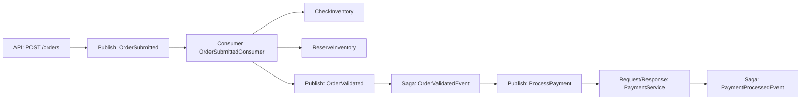

# How to Instrument MassTransit Message Bus with OpenTelemetry in .NET

Author: [nawazdhandala](https://www.github.com/nawazdhandala)

Tags: OpenTelemetry, MassTransit, .NET, Message Bus, RabbitMQ, Tracing

Description: Complete guide to instrumenting MassTransit with OpenTelemetry for full visibility into your message-based distributed system.

MassTransit provides a robust abstraction over message brokers like RabbitMQ, Azure Service Bus, and Amazon SQS. When messages flow through your system, you need to see the complete journey: from publisher to consumer, including retries, failures, and processing time. OpenTelemetry makes this possible with distributed tracing that spans process boundaries.

## Understanding MassTransit's Telemetry Model

MassTransit has built-in support for OpenTelemetry since version 8.0. The framework automatically creates spans for:

- Message publishing and sending
- Consumer execution
- Saga state transitions
- Request/response patterns
- Scheduled messages
- Retry and redelivery attempts

This automatic instrumentation gives you a solid foundation, but adding custom telemetry helps track business-specific metrics and operations.

## Initial Setup

Add the required NuGet packages:

```bash
dotnet add package MassTransit
dotnet add package MassTransit.RabbitMQ
dotnet add package OpenTelemetry.Extensions.Hosting
dotnet add package OpenTelemetry.Instrumentation.AspNetCore
dotnet add package OpenTelemetry.Exporter.OpenTelemetryProtocol
```

Configure MassTransit with OpenTelemetry in your application:

```csharp
using MassTransit;
using OpenTelemetry.Resources;
using OpenTelemetry.Trace;

var builder = WebApplication.CreateBuilder(args);

// Configure OpenTelemetry
builder.Services.AddOpenTelemetry()
    .ConfigureResource(resource => resource
        .AddService("order-service", serviceVersion: "1.0.0")
        .AddAttributes(new Dictionary<string, object>
        {
            ["deployment.environment"] = builder.Environment.EnvironmentName,
            ["service.instance.id"] = Environment.MachineName
        }))
    .WithTracing(tracing => tracing
        .AddAspNetCoreInstrumentation()
        .AddHttpClientInstrumentation()
        .AddSource("MassTransit") // MassTransit's ActivitySource
        .AddOtlpExporter(options =>
        {
            options.Endpoint = new Uri("http://localhost:4317");
        }));

// Configure MassTransit
builder.Services.AddMassTransit(x =>
{
    // Register consumers
    x.AddConsumer<OrderSubmittedConsumer>();
    x.AddConsumer<PaymentProcessedConsumer>();

    x.UsingRabbitMq((context, cfg) =>
    {
        cfg.Host("rabbitmq://localhost", h =>
        {
            h.Username("guest");
            h.Password("guest");
        });

        // Configure receive endpoints
        cfg.ReceiveEndpoint("order-submitted", e =>
        {
            e.ConfigureConsumer<OrderSubmittedConsumer>(context);
        });

        cfg.ReceiveEndpoint("payment-processed", e =>
        {
            e.ConfigureConsumer<PaymentProcessedConsumer>(context);
        });

        // Enable OpenTelemetry integration
        cfg.ConfigureEndpoints(context);
    });
});

var app = builder.Build();
app.Run();
```

## Publishing Messages with Telemetry

MassTransit automatically creates spans when you publish messages. Add custom tags to enrich the telemetry data:

```csharp
using System.Diagnostics;
using MassTransit;

public class OrderController : ControllerBase
{
    private static readonly ActivitySource ActivitySource =
        new ActivitySource("OrderService");

    private readonly IPublishEndpoint _publishEndpoint;
    private readonly ILogger<OrderController> _logger;

    public OrderController(
        IPublishEndpoint publishEndpoint,
        ILogger<OrderController> logger)
    {
        _publishEndpoint = publishEndpoint;
        _logger = logger;
    }

    [HttpPost("orders")]
    public async Task<IActionResult> CreateOrder([FromBody] CreateOrderRequest request)
    {
        using var activity = ActivitySource.StartActivity("CreateOrder", ActivityKind.Producer);

        var orderId = Guid.NewGuid();
        activity?.SetTag("order.id", orderId);
        activity?.SetTag("order.customer_id", request.CustomerId);
        activity?.SetTag("order.total_amount", request.TotalAmount);
        activity?.SetTag("order.item_count", request.Items.Count);

        try
        {
            // Validate order
            using (var validateActivity = ActivitySource.StartActivity("ValidateOrder"))
            {
                if (request.Items.Count == 0)
                {
                    validateActivity?.SetStatus(ActivityStatusCode.Error, "No items in order");
                    return BadRequest("Order must contain items");
                }

                validateActivity?.SetTag("validation.passed", true);
            }

            // Publish order submitted event
            // MassTransit creates a child span automatically
            await _publishEndpoint.Publish(new OrderSubmitted
            {
                OrderId = orderId,
                CustomerId = request.CustomerId,
                Items = request.Items.Select(i => new OrderItem
                {
                    Sku = i.Sku,
                    Quantity = i.Quantity,
                    Price = i.Price
                }).ToList(),
                TotalAmount = request.TotalAmount,
                SubmittedAt = DateTime.UtcNow
            });

            activity?.SetTag("publish.success", true);
            activity?.AddEvent(new ActivityEvent("OrderPublished"));

            _logger.LogInformation("Order {OrderId} published successfully", orderId);

            return Ok(new { orderId });
        }
        catch (Exception ex)
        {
            activity?.SetStatus(ActivityStatusCode.Error, ex.Message);
            activity?.RecordException(ex);
            _logger.LogError(ex, "Failed to create order");
            throw;
        }
    }
}

public record CreateOrderRequest(
    string CustomerId,
    List<CreateOrderItem> Items,
    decimal TotalAmount
);

public record CreateOrderItem(string Sku, int Quantity, decimal Price);

public record OrderSubmitted
{
    public Guid OrderId { get; init; }
    public string CustomerId { get; init; } = string.Empty;
    public List<OrderItem> Items { get; init; } = new();
    public decimal TotalAmount { get; init; }
    public DateTime SubmittedAt { get; init; }
}

public record OrderItem
{
    public string Sku { get; init; } = string.Empty;
    public int Quantity { get; init; }
    public decimal Price { get; init; }
}
```

## Consuming Messages with Custom Instrumentation

Consumers automatically get instrumented, but you can add detailed telemetry for internal operations:

```csharp
using System.Diagnostics;
using MassTransit;

public class OrderSubmittedConsumer : IConsumer<OrderSubmitted>
{
    private static readonly ActivitySource ActivitySource =
        new ActivitySource("OrderService");

    private readonly IInventoryService _inventoryService;
    private readonly IPublishEndpoint _publishEndpoint;
    private readonly ILogger<OrderSubmittedConsumer> _logger;

    public OrderSubmittedConsumer(
        IInventoryService inventoryService,
        IPublishEndpoint publishEndpoint,
        ILogger<OrderSubmittedConsumer> logger)
    {
        _inventoryService = inventoryService;
        _publishEndpoint = publishEndpoint;
        _logger = logger;
    }

    public async Task Consume(ConsumeContext<OrderSubmitted> context)
    {
        // MassTransit creates a parent span for the consumer
        // Add custom child spans for internal operations
        using var activity = ActivitySource.StartActivity(
            "ProcessOrderSubmitted",
            ActivityKind.Internal);

        var message = context.Message;

        activity?.SetTag("order.id", message.OrderId);
        activity?.SetTag("order.customer_id", message.CustomerId);
        activity?.SetTag("order.item_count", message.Items.Count);
        activity?.SetTag("messaging.message_id", context.MessageId);
        activity?.SetTag("messaging.conversation_id", context.ConversationId);

        try
        {
            _logger.LogInformation(
                "Processing order {OrderId} for customer {CustomerId}",
                message.OrderId,
                message.CustomerId);

            // Check inventory for all items
            using (var inventoryActivity = ActivitySource.StartActivity("CheckInventory"))
            {
                var inventoryResults = new List<InventoryCheckResult>();

                foreach (var item in message.Items)
                {
                    var available = await _inventoryService.CheckAvailabilityAsync(
                        item.Sku,
                        item.Quantity);

                    inventoryResults.Add(new InventoryCheckResult
                    {
                        Sku = item.Sku,
                        RequestedQuantity = item.Quantity,
                        Available = available
                    });
                }

                var allAvailable = inventoryResults.All(r => r.Available);
                inventoryActivity?.SetTag("inventory.all_available", allAvailable);
                inventoryActivity?.SetTag("inventory.items_checked", inventoryResults.Count);

                if (!allAvailable)
                {
                    var unavailableItems = inventoryResults
                        .Where(r => !r.Available)
                        .Select(r => r.Sku)
                        .ToList();

                    inventoryActivity?.SetTag("inventory.unavailable_items",
                        string.Join(", ", unavailableItems));

                    // Publish inventory shortage event
                    await _publishEndpoint.Publish(new OrderInventoryShortage
                    {
                        OrderId = message.OrderId,
                        UnavailableItems = unavailableItems
                    });

                    activity?.AddEvent(new ActivityEvent("InventoryShortageDetected"));
                    return;
                }
            }

            // Reserve inventory
            using (var reserveActivity = ActivitySource.StartActivity("ReserveInventory"))
            {
                foreach (var item in message.Items)
                {
                    await _inventoryService.ReserveAsync(item.Sku, item.Quantity);
                }

                reserveActivity?.SetTag("inventory.reserved", true);
            }

            // Publish order validated event
            using (var publishActivity = ActivitySource.StartActivity("PublishOrderValidated"))
            {
                await _publishEndpoint.Publish(new OrderValidated
                {
                    OrderId = message.OrderId,
                    CustomerId = message.CustomerId,
                    TotalAmount = message.TotalAmount,
                    ValidatedAt = DateTime.UtcNow
                });

                publishActivity?.SetTag("event.type", "OrderValidated");
            }

            activity?.SetTag("processing.success", true);
            activity?.AddEvent(new ActivityEvent("OrderProcessedSuccessfully"));

            _logger.LogInformation("Order {OrderId} validated successfully", message.OrderId);
        }
        catch (Exception ex)
        {
            activity?.SetStatus(ActivityStatusCode.Error, ex.Message);
            activity?.RecordException(ex);
            _logger.LogError(ex, "Failed to process order {OrderId}", message.OrderId);
            throw;
        }
    }
}

public record OrderValidated
{
    public Guid OrderId { get; init; }
    public string CustomerId { get; init; } = string.Empty;
    public decimal TotalAmount { get; init; }
    public DateTime ValidatedAt { get; init; }
}

public record OrderInventoryShortage
{
    public Guid OrderId { get; init; }
    public List<string> UnavailableItems { get; init; } = new();
}

public interface IInventoryService
{
    Task<bool> CheckAvailabilityAsync(string sku, int quantity);
    Task ReserveAsync(string sku, int quantity);
}

public class InventoryCheckResult
{
    public string Sku { get; init; } = string.Empty;
    public int RequestedQuantity { get; init; }
    public bool Available { get; init; }
}
```

## Instrumenting Sagas with OpenTelemetry

Sagas coordinate long-running business processes. Tracking saga state transitions is critical for understanding workflow execution:

```csharp
using System.Diagnostics;
using MassTransit;

public class OrderStateMachine : MassTransitStateMachine<OrderState>
{
    private static readonly ActivitySource ActivitySource =
        new ActivitySource("OrderService");

    public State Submitted { get; private set; } = null!;
    public State Validated { get; private set; } = null!;
    public State PaymentProcessing { get; private set; } = null!;
    public State Completed { get; private set; } = null!;
    public State Failed { get; private set; } = null!;

    public Event<OrderSubmitted> OrderSubmittedEvent { get; private set; } = null!;
    public Event<OrderValidated> OrderValidatedEvent { get; private set; } = null!;
    public Event<PaymentProcessed> PaymentProcessedEvent { get; private set; } = null!;

    public OrderStateMachine()
    {
        InstanceState(x => x.CurrentState);

        Event(() => OrderSubmittedEvent, x => x.CorrelateById(m => m.Message.OrderId));
        Event(() => OrderValidatedEvent, x => x.CorrelateById(m => m.Message.OrderId));
        Event(() => PaymentProcessedEvent, x => x.CorrelateById(m => m.Message.OrderId));

        Initially(
            When(OrderSubmittedEvent)
                .Then(context =>
                {
                    using var activity = ActivitySource.StartActivity(
                        "Saga.OrderSubmitted",
                        ActivityKind.Internal);

                    activity?.SetTag("saga.correlation_id", context.Saga.CorrelationId);
                    activity?.SetTag("saga.state", "Submitted");
                    activity?.SetTag("order.id", context.Message.OrderId);

                    context.Saga.OrderId = context.Message.OrderId;
                    context.Saga.CustomerId = context.Message.CustomerId;
                    context.Saga.TotalAmount = context.Message.TotalAmount;
                    context.Saga.SubmittedAt = DateTime.UtcNow;
                })
                .TransitionTo(Submitted));

        During(Submitted,
            When(OrderValidatedEvent)
                .Then(context =>
                {
                    using var activity = ActivitySource.StartActivity(
                        "Saga.OrderValidated",
                        ActivityKind.Internal);

                    activity?.SetTag("saga.correlation_id", context.Saga.CorrelationId);
                    activity?.SetTag("saga.state_transition", "Submitted->Validated");
                    activity?.SetTag("order.id", context.Message.OrderId);

                    context.Saga.ValidatedAt = DateTime.UtcNow;
                })
                .TransitionTo(Validated)
                .Publish(context => new ProcessPayment
                {
                    OrderId = context.Saga.OrderId,
                    Amount = context.Saga.TotalAmount,
                    CustomerId = context.Saga.CustomerId
                }));

        During(Validated,
            When(PaymentProcessedEvent)
                .Then(context =>
                {
                    using var activity = ActivitySource.StartActivity(
                        "Saga.PaymentProcessed",
                        ActivityKind.Internal);

                    activity?.SetTag("saga.correlation_id", context.Saga.CorrelationId);
                    activity?.SetTag("saga.state_transition", "Validated->Completed");
                    activity?.SetTag("order.id", context.Message.OrderId);
                    activity?.SetTag("payment.success", context.Message.Success);

                    if (context.Message.Success)
                    {
                        context.Saga.CompletedAt = DateTime.UtcNow;
                        activity?.SetTag("saga.completed", true);
                    }
                    else
                    {
                        activity?.SetTag("saga.completed", false);
                        activity?.SetStatus(ActivityStatusCode.Error, "Payment failed");
                    }
                })
                .If(context => context.Message.Success,
                    binder => binder.TransitionTo(Completed))
                .Else(binder => binder.TransitionTo(Failed)));
    }
}

public class OrderState : SagaStateMachineInstance
{
    public Guid CorrelationId { get; set; }
    public string CurrentState { get; set; } = string.Empty;
    public Guid OrderId { get; set; }
    public string CustomerId { get; set; } = string.Empty;
    public decimal TotalAmount { get; set; }
    public DateTime SubmittedAt { get; set; }
    public DateTime? ValidatedAt { get; set; }
    public DateTime? CompletedAt { get; set; }
}

public record ProcessPayment
{
    public Guid OrderId { get; init; }
    public decimal Amount { get; init; }
    public string CustomerId { get; init; } = string.Empty;
}

public record PaymentProcessed
{
    public Guid OrderId { get; init; }
    public bool Success { get; init; }
    public string? TransactionId { get; init; }
}
```

Register the saga with MassTransit:

```csharp
builder.Services.AddMassTransit(x =>
{
    x.AddConsumer<OrderSubmittedConsumer>();
    x.AddSagaStateMachine<OrderStateMachine, OrderState>()
        .InMemoryRepository(); // Use Redis or SQL for production

    x.UsingRabbitMq((context, cfg) =>
    {
        cfg.Host("rabbitmq://localhost");
        cfg.ConfigureEndpoints(context);
    });
});
```

## Request/Response Pattern Tracing

MassTransit's request/response pattern maintains trace context automatically:

```csharp
using System.Diagnostics;
using MassTransit;

public class PaymentService
{
    private static readonly ActivitySource ActivitySource =
        new ActivitySource("PaymentService");

    private readonly IRequestClient<ProcessPaymentRequest> _requestClient;

    public PaymentService(IRequestClient<ProcessPaymentRequest> requestClient)
    {
        _requestClient = requestClient;
    }

    public async Task<PaymentResult> ProcessPaymentAsync(
        Guid orderId,
        decimal amount,
        string customerId)
    {
        using var activity = ActivitySource.StartActivity(
            "ProcessPayment",
            ActivityKind.Client);

        activity?.SetTag("payment.order_id", orderId);
        activity?.SetTag("payment.amount", amount);
        activity?.SetTag("payment.customer_id", customerId);

        try
        {
            // Send request and wait for response
            // Trace context is automatically propagated
            var response = await _requestClient.GetResponse<PaymentResponse>(
                new ProcessPaymentRequest
                {
                    OrderId = orderId,
                    Amount = amount,
                    CustomerId = customerId
                },
                timeout: RequestTimeout.After(s: 30));

            var result = response.Message;

            activity?.SetTag("payment.success", result.Success);
            activity?.SetTag("payment.transaction_id", result.TransactionId);

            if (!result.Success)
            {
                activity?.SetStatus(ActivityStatusCode.Error, result.ErrorMessage);
            }

            return new PaymentResult
            {
                Success = result.Success,
                TransactionId = result.TransactionId,
                ErrorMessage = result.ErrorMessage
            };
        }
        catch (RequestTimeoutException ex)
        {
            activity?.SetStatus(ActivityStatusCode.Error, "Payment request timeout");
            activity?.RecordException(ex);
            throw;
        }
    }
}

public record ProcessPaymentRequest
{
    public Guid OrderId { get; init; }
    public decimal Amount { get; init; }
    public string CustomerId { get; init; } = string.Empty;
}

public record PaymentResponse
{
    public bool Success { get; init; }
    public string? TransactionId { get; init; }
    public string? ErrorMessage { get; init; }
}

public record PaymentResult
{
    public bool Success { get; init; }
    public string? TransactionId { get; init; }
    public string? ErrorMessage { get; init; }
}
```

## Visualizing Message Flow

With OpenTelemetry instrumentation, your traces show the complete message flow:



Each node represents a span with timing information, tags, and potential error details.

## Monitoring Retry Behavior

MassTransit's retry policies are transparent in traces. Configure retry with custom telemetry:

```csharp
x.UsingRabbitMq((context, cfg) =>
{
    cfg.Host("rabbitmq://localhost");

    cfg.ReceiveEndpoint("order-submitted", e =>
    {
        e.UseMessageRetry(r =>
        {
            r.Intervals(
                TimeSpan.FromSeconds(1),
                TimeSpan.FromSeconds(5),
                TimeSpan.FromSeconds(10));

            r.Handle<HttpRequestException>();
            r.Handle<InvalidOperationException>();

            r.OnRetry(retryContext =>
            {
                var activity = Activity.Current;
                activity?.AddEvent(new ActivityEvent("MessageRetry",
                    tags: new ActivityTagsCollection
                    {
                        ["retry.attempt"] = retryContext.RetryAttempt,
                        ["retry.delay_ms"] = retryContext.Delay.TotalMilliseconds,
                        ["exception.type"] = retryContext.Exception.GetType().Name
                    }));
            });
        });

        e.ConfigureConsumer<OrderSubmittedConsumer>(context);
    });
});
```

## Performance Optimization

Reduce telemetry overhead in high-throughput scenarios:

```csharp
.WithTracing(tracing => tracing
    .SetSampler(new ParentBasedSampler(
        new TraceIdRatioBasedSampler(0.1))) // Sample 10% of traces
    .AddSource("MassTransit")
    .AddOtlpExporter(options =>
    {
        options.Endpoint = new Uri("http://localhost:4317");
        options.ExportProcessorType = ExportProcessorType.Batch;
        options.BatchExportProcessorOptions = new BatchExportProcessorOptions<Activity>
        {
            MaxQueueSize = 2048,
            ScheduledDelayMilliseconds = 5000,
            MaxExportBatchSize = 512
        };
    }));
```

Your MassTransit application now has complete observability. Every message published, consumed, or retried appears in your distributed traces, making it straightforward to diagnose issues, optimize performance, and understand message flow across your entire system.
