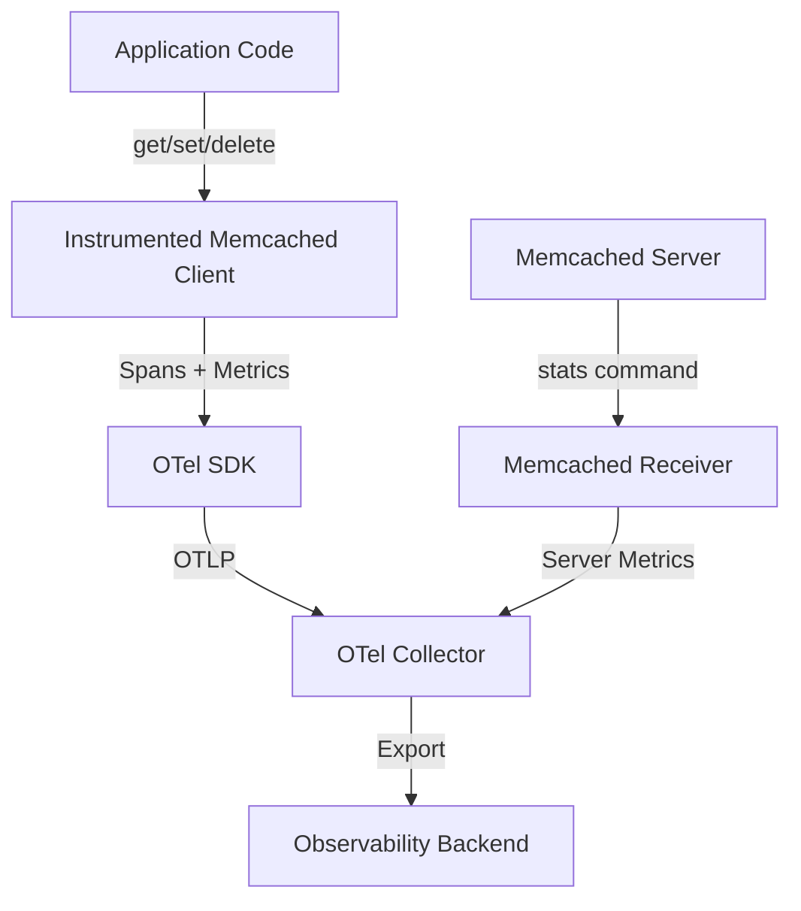
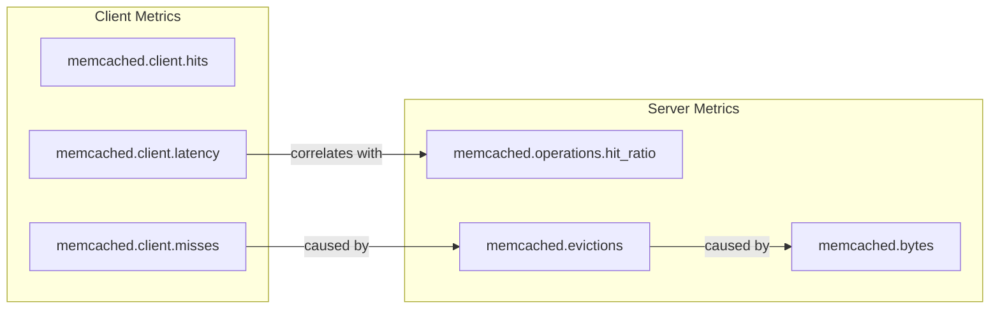

# How to Instrument Memcached Operations with OpenTelemetry

Author: [nawazdhandala](https://www.github.com/nawazdhandala)

Tags: OpenTelemetry, Memcached, Caching, Instrumentation, Distributed Tracing, Observability

Description: A hands-on guide to instrumenting Memcached operations with OpenTelemetry for tracing, metrics, and full cache observability.

---

Memcached is a workhorse. It sits in front of your database, serves millions of requests per second, and does it all with minimal overhead. But that simplicity comes with a tradeoff: Memcached itself offers very little in terms of observability. There is no built-in dashboard, no query log, and no easy way to trace a slow cache lookup back to the code that caused it.

OpenTelemetry fills that gap. By instrumenting your Memcached client and configuring the collector to scrape server stats, you get full visibility into how your caching layer is performing. This guide covers both approaches.

## What We Are Building

By the end of this guide, you will have tracing for every Memcached operation, custom metrics for cache hit rates and latency, and server-level metrics from the Memcached instance itself.



## Client-Side Instrumentation with Python

Python's `pymemcache` is one of the most popular Memcached clients, and OpenTelemetry provides instrumentation for it. Let's set it up.

Install the required packages first.

```bash
# Install the OpenTelemetry SDK, exporter, and Memcached instrumentation
pip install opentelemetry-api \
    opentelemetry-sdk \
    opentelemetry-exporter-otlp \
    opentelemetry-instrumentation-pymemcache \
    pymemcache
```

Now configure the tracing and instrumentation.

```python
# setup_tracing.py
from opentelemetry import trace, metrics
from opentelemetry.sdk.trace import TracerProvider
from opentelemetry.sdk.trace.export import BatchSpanProcessor
from opentelemetry.sdk.metrics import MeterProvider
from opentelemetry.sdk.metrics.export import PeriodicExportingMetricReader
from opentelemetry.exporter.otlp.proto.grpc.trace_exporter import OTLPSpanExporter
from opentelemetry.exporter.otlp.proto.grpc.metric_exporter import OTLPMetricExporter
from opentelemetry.instrumentation.pymemcache import PymemcacheInstrumentor

# Configure trace export to the collector
trace_provider = TracerProvider()
trace_provider.add_span_processor(
    BatchSpanProcessor(OTLPSpanExporter(endpoint="http://otel-collector:4317"))
)
trace.set_tracer_provider(trace_provider)

# Configure metric export
metric_reader = PeriodicExportingMetricReader(
    OTLPMetricExporter(endpoint="http://otel-collector:4317"),
    export_interval_millis=30000,
)
metric_provider = MeterProvider(metric_readers=[metric_reader])
metrics.set_meter_provider(metric_provider)

# Instrument pymemcache - all client instances created after this
# call will automatically generate spans for every operation
PymemcacheInstrumentor().instrument()
```

With the instrumentation active, using pymemcache normally will produce spans.

```python
# app.py - Normal Memcached usage, spans are created automatically
from pymemcache.client.base import Client

# Create a Memcached client (instrumentation wraps this automatically)
mc = Client(('memcached-server', 11211))

# Each of these operations produces an OpenTelemetry span with attributes:
# - db.system: "memcached"
# - db.operation: "get", "set", etc.
# - db.memcached.key: the key being accessed
mc.set('user:1234:profile', '{"name": "Alice"}', expire=300)
result = mc.get('user:1234:profile')

# Multi-key operations also get traced
results = mc.get_many(['user:1234:profile', 'user:5678:profile'])
```

## Adding Custom Cache Metrics

Auto-instrumentation handles spans, but for cache-specific metrics like hit rates, you need a thin wrapper layer. Here is a reusable cache wrapper that tracks everything you need.

```python
# cache_wrapper.py
from opentelemetry import metrics
from pymemcache.client.base import Client
import time

meter = metrics.get_meter("memcached.client")

# Define the custom metrics
hit_counter = meter.create_counter(
    "memcached.client.hits",
    description="Number of cache hits",
    unit="1",
)
miss_counter = meter.create_counter(
    "memcached.client.misses",
    description="Number of cache misses",
    unit="1",
)
latency_histogram = meter.create_histogram(
    "memcached.client.latency",
    description="Latency of Memcached operations in milliseconds",
    unit="ms",
)
value_size_histogram = meter.create_histogram(
    "memcached.client.value_size",
    description="Size of values stored in or retrieved from Memcached",
    unit="By",
)


class InstrumentedMemcacheClient:
    """Wraps a pymemcache client to add hit/miss and latency metrics."""

    def __init__(self, host, port=11211):
        self.client = Client((host, port))

    def get(self, key):
        # Extract the key prefix for grouping metrics (e.g., "user" from "user:1234")
        prefix = key.split(":")[0] if ":" in key else key
        attrs = {"memcached.key_prefix": prefix, "memcached.operation": "get"}

        start = time.monotonic()
        result = self.client.get(key)
        duration_ms = (time.monotonic() - start) * 1000

        # Record the operation latency
        latency_histogram.record(duration_ms, attrs)

        if result is not None:
            hit_counter.add(1, attrs)
            value_size_histogram.record(len(result), attrs)
        else:
            miss_counter.add(1, attrs)

        return result

    def set(self, key, value, expire=0):
        prefix = key.split(":")[0] if ":" in key else key
        attrs = {"memcached.key_prefix": prefix, "memcached.operation": "set"}

        start = time.monotonic()
        result = self.client.set(key, value, expire=expire)
        duration_ms = (time.monotonic() - start) * 1000

        latency_histogram.record(duration_ms, attrs)
        value_size_histogram.record(len(value) if isinstance(value, (str, bytes)) else 0, attrs)

        return result

    def delete(self, key):
        prefix = key.split(":")[0] if ":" in key else key
        attrs = {"memcached.key_prefix": prefix, "memcached.operation": "delete"}

        start = time.monotonic()
        result = self.client.delete(key)
        duration_ms = (time.monotonic() - start) * 1000

        latency_histogram.record(duration_ms, attrs)
        return result
```

## Server-Side Metrics with the Memcached Receiver

The OpenTelemetry Collector has a Memcached receiver that connects to the server and collects stats. This gives you server-level metrics that complement the client-side data.

```yaml
# otel-collector-config.yaml
receivers:
  # Collect Memcached server stats every 60 seconds
  memcached:
    endpoint: "memcached-server:11211"
    collection_interval: 60s
    # Timeout for the stats command
    timeout: 10s

  # Receive application telemetry
  otlp:
    protocols:
      grpc:
        endpoint: 0.0.0.0:4317

processors:
  # Tag all metrics with the instance name for multi-server setups
  resource:
    attributes:
      - key: memcached.instance
        value: "cache-pool-01"
        action: upsert
  batch:
    timeout: 10s
    send_batch_size: 512

exporters:
  otlp:
    endpoint: "http://your-backend:4317"
    tls:
      insecure: true

service:
  pipelines:
    metrics:
      receivers: [memcached, otlp]
      processors: [resource, batch]
      exporters: [otlp]
    traces:
      receivers: [otlp]
      processors: [batch]
      exporters: [otlp]
```

## Key Server Metrics

The Memcached receiver exposes several important metrics that help you understand server health.

**Throughput and hit rate:**
- `memcached.commands` - Count of get, set, and other commands processed
- `memcached.operations.hit_ratio` - Ratio of get hits to total gets
- `memcached.network.sent` and `memcached.network.received` - Bytes transferred

**Memory and eviction:**
- `memcached.bytes` - Current number of bytes used for storage
- `memcached.current_items` - Number of items currently stored
- `memcached.evictions` - Number of items evicted to make room for new ones

**Connections:**
- `memcached.connections.current` - Current open connections
- `memcached.connections.total` - Total connections since startup
- `memcached.threads` - Number of worker threads

Eviction rate is particularly important. If Memcached is evicting items frequently, it means you either need more memory or your TTLs are too aggressive. High eviction rates directly cause cache misses, which in turn increase database load.

## Correlating Client and Server Data

When you have both client and server metrics flowing through the collector, you can build powerful dashboards. Here is how the data correlates.



A common debugging scenario: your client-side miss rate suddenly increases. You check the server-side metrics and see that evictions have spiked. You look at `memcached.bytes` and see it is at the limit. The fix is either to increase the Memcached memory allocation or to reduce TTLs on less critical cache entries.

## Alert Configuration

Here are some practical alert rules for Memcached monitoring.

```yaml
# memcached-alerts.yaml
groups:
  - name: memcached_alerts
    rules:
      # Alert when the client-side cache hit rate drops below 70%
      - alert: MemcachedLowHitRate
        expr: |
          sum(rate(memcached_client_hits_total[5m])) by (memcached_key_prefix)
          /
          (sum(rate(memcached_client_hits_total[5m])) by (memcached_key_prefix)
           + sum(rate(memcached_client_misses_total[5m])) by (memcached_key_prefix))
          < 0.70
        for: 10m
        labels:
          severity: warning
        annotations:
          summary: "Memcached hit rate below 70% for {{ $labels.memcached_key_prefix }}"

      # Alert when evictions are happening rapidly
      - alert: MemcachedHighEvictions
        expr: |
          rate(memcached_evictions_total[5m]) > 100
        for: 5m
        labels:
          severity: warning
        annotations:
          summary: "High eviction rate on {{ $labels.memcached_instance }}"
          description: >
            Memcached is evicting more than 100 items per second.
            This indicates the cache is too small for the workload.

      # Alert when memory is nearly full
      - alert: MemcachedMemoryNearLimit
        expr: |
          memcached_bytes / memcached_limit_bytes > 0.95
        for: 5m
        labels:
          severity: critical
        annotations:
          summary: "Memcached memory at 95% on {{ $labels.memcached_instance }}"
```

## Handling Multiple Memcached Instances

In production, you often run a pool of Memcached instances with consistent hashing on the client side. Each instance needs its own receiver configuration.

```yaml
# Collector config for monitoring a pool of Memcached servers
receivers:
  memcached/node1:
    endpoint: "memcached-1:11211"
    collection_interval: 60s
  memcached/node2:
    endpoint: "memcached-2:11211"
    collection_interval: 60s
  memcached/node3:
    endpoint: "memcached-3:11211"
    collection_interval: 60s

service:
  pipelines:
    metrics:
      # All three receivers feed into a single metrics pipeline
      receivers: [memcached/node1, memcached/node2, memcached/node3, otlp]
      processors: [resource, batch]
      exporters: [otlp]
```

Each receiver instance will tag its metrics with the endpoint, so you can distinguish between nodes in your dashboards and alerts.

## Wrapping Up

Memcached's simplicity is its strength, but it does leave a gap in observability. OpenTelemetry closes that gap by providing client-side span instrumentation, custom metrics for cache hit rates, and server-level monitoring through the collector receiver.

The combination of client and server metrics gives you the full picture. When cache misses spike, you can trace the problem from the specific application request all the way down to the Memcached server's eviction behavior. That level of visibility turns caching problems from mysterious performance degradations into straightforward debugging sessions.
