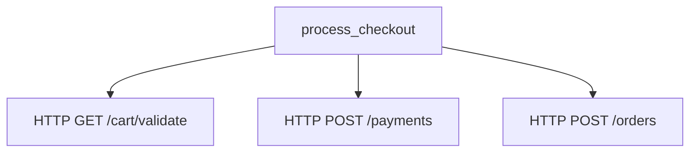

# How to Instrument Network Requests in iOS with OpenTelemetry URLSessionInstrumentation

Author: [nawazdhandala](https://www.github.com/nawazdhandala)

Tags: OpenTelemetry, Swift, iOS, URLSession, Network, Instrumentation

Description: Automatically trace all network requests in your iOS app using OpenTelemetry's URLSession instrumentation for complete visibility into API calls and their performance.

Network requests are the lifeline of most modern iOS applications. Understanding their performance, failure rates, and behavior in production is critical for delivering a good user experience. OpenTelemetry's URLSession instrumentation automatically captures detailed traces for every network request your app makes, without requiring manual span creation for each call.

## The Challenge of Network Observability

Network requests in mobile apps fail more often than in server environments. Users move between WiFi and cellular networks, enter areas with poor coverage, or lose connectivity entirely. Response times vary wildly based on network conditions and server load. Without proper instrumentation, debugging network-related issues becomes a guessing game.

Manual instrumentation of network calls is tedious and error-prone. You need to wrap every URLSession call, remember to record timing information, handle errors consistently, and extract relevant metadata. The URLSessionInstrumentation library handles all of this automatically.

## Installing URLSessionInstrumentation

The URLSessionInstrumentation package is part of the opentelemetry-swift ecosystem. Add it to your project through Swift Package Manager alongside the core OpenTelemetry SDK.

```swift
// Package.swift dependencies
dependencies: [
    .package(
        url: "https://github.com/open-telemetry/opentelemetry-swift",
        from: "1.5.0"
    )
]

// Target dependencies
.target(
    name: "YourApp",
    dependencies: [
        .product(name: "OpenTelemetryApi", package: "opentelemetry-swift"),
        .product(name: "OpenTelemetrySdk", package: "opentelemetry-swift"),
        .product(name: "URLSessionInstrumentation", package: "opentelemetry-swift")
    ]
)
```

Import the instrumentation library wherever you configure your URLSession instances. Typically, this happens in a networking service class or during app initialization.

```swift
import Foundation
import OpenTelemetryApi
import OpenTelemetrySdk
import URLSessionInstrumentation
```

## Basic URLSession Instrumentation Setup

URLSessionInstrumentation works by wrapping URLSession instances with tracing capabilities. You configure it once and all requests made through that session automatically create spans.

```swift
import Foundation
import OpenTelemetryApi
import OpenTelemetrySdk
import URLSessionInstrumentation

class NetworkService {
    static let shared = NetworkService()

    private let session: URLSession
    private let instrumentation: URLSessionInstrumentation

    private init() {
        // Get the tracer for network operations
        let tracer = OpenTelemetry.instance.tracerProvider.get(
            instrumentationName: "network",
            instrumentationVersion: "1.0.0"
        )

        // Create instrumentation configuration
        let configuration = URLSessionInstrumentationConfiguration()

        // Initialize the instrumentation
        instrumentation = URLSessionInstrumentation(configuration: configuration)

        // Create a URLSession with default configuration
        let sessionConfig = URLSessionConfiguration.default
        sessionConfig.timeoutIntervalForRequest = 30
        sessionConfig.timeoutIntervalForResource = 60

        // Wrap the session with instrumentation
        session = instrumentation.instrumentedSession(
            configuration: sessionConfig
        )
    }

    func makeRequest(url: URL, completion: @escaping (Result<Data, Error>) -> Void) {
        let task = session.dataTask(with: url) { data, response, error in
            if let error = error {
                completion(.failure(error))
                return
            }

            guard let data = data else {
                completion(.failure(NetworkError.noData))
                return
            }

            completion(.success(data))
        }

        task.resume()
    }
}

enum NetworkError: Error {
    case noData
    case invalidResponse
    case serverError(Int)
}
```

Now every request made through this session automatically creates a span. The instrumentation captures HTTP method, URL, status code, request and response sizes, and timing information.

## Understanding Auto-Generated Spans

When you make a network request, URLSessionInstrumentation creates a span following OpenTelemetry semantic conventions for HTTP operations. The span includes standardized attributes that make it easy to filter and analyze network activity.

```swift
class UserRepository {
    private let networkService = NetworkService.shared
    private let baseURL = "https://api.example.com"

    func fetchUser(id: String, completion: @escaping (Result<User, Error>) -> Void) {
        guard let url = URL(string: "\(baseURL)/users/\(id)") else {
            completion(.failure(NetworkError.invalidURL))
            return
        }

        // This request automatically creates a span with attributes:
        // - http.method: "GET"
        // - http.url: "https://api.example.com/users/123"
        // - http.status_code: 200 (after response)
        // - http.response_content_length: size in bytes
        // - net.peer.name: "api.example.com"
        // - net.peer.port: 443

        networkService.makeRequest(url: url) { result in
            switch result {
            case .success(let data):
                do {
                    let user = try JSONDecoder().decode(User.self, from: data)
                    completion(.success(user))
                } catch {
                    completion(.failure(error))
                }
            case .failure(let error):
                completion(.failure(error))
            }
        }
    }
}

struct User: Codable {
    let id: String
    let name: String
    let email: String
}

enum NetworkError: Error {
    case invalidURL
}
```

## Customizing Instrumentation Behavior

URLSessionInstrumentationConfiguration provides several options to control what gets traced and how spans are created. You can filter requests, add custom attributes, or modify span names.

```swift
import URLSessionInstrumentation

class AdvancedNetworkService {
    static let shared = AdvancedNetworkService()

    private let session: URLSession

    private init() {
        var configuration = URLSessionInstrumentationConfiguration()

        // Only instrument requests to specific domains
        configuration.shouldInstrument = { request in
            guard let host = request.url?.host else { return false }
            return host.contains("example.com") || host.contains("api.myapp.com")
        }

        // Add custom attributes to every span
        configuration.spanCustomizer = { span, request, response in
            // Add request headers that are safe to log
            if let contentType = request.value(forHTTPHeaderField: "Content-Type") {
                span.setAttribute(
                    key: "http.request.content_type",
                    value: contentType
                )
            }

            // Add custom app-specific attributes
            if let url = request.url,
               let userId = extractUserId(from: url) {
                span.setAttribute(key: "user.id", value: userId)
            }

            // Add response timing information
            if let response = response as? HTTPURLResponse {
                if let timing = response.value(forHTTPHeaderField: "Server-Timing") {
                    span.setAttribute(key: "http.server_timing", value: timing)
                }
            }
        }

        // Customize span names for better readability
        configuration.nameSpan = { request in
            guard let url = request.url else { return "HTTP Request" }

            if let path = url.path.split(separator: "/").first {
                return "HTTP \(request.httpMethod ?? "GET") /\(path)"
            }

            return "HTTP \(request.httpMethod ?? "GET")"
        }

        let instrumentation = URLSessionInstrumentation(configuration: configuration)

        let sessionConfig = URLSessionConfiguration.default
        session = instrumentation.instrumentedSession(configuration: sessionConfig)
    }

    private static func extractUserId(from url: URL) -> String? {
        // Extract user ID from URL patterns like /users/123
        let pattern = #"/users/(\d+)"#
        let regex = try? NSRegularExpression(pattern: pattern)
        let nsString = url.path as NSString
        let range = NSRange(location: 0, length: nsString.length)

        if let match = regex?.firstMatch(in: url.path, range: range) {
            return nsString.substring(with: match.range(at: 1))
        }

        return nil
    }

    func performRequest(
        _ request: URLRequest,
        completion: @escaping (Result<Data, Error>) -> Void
    ) {
        let task = session.dataTask(with: request) { data, response, error in
            if let error = error {
                completion(.failure(error))
                return
            }

            guard let data = data else {
                completion(.failure(NetworkError.noData))
                return
            }

            completion(.success(data))
        }

        task.resume()
    }
}
```

## Handling Authentication Headers

Many apps need to include authentication tokens in network requests. You can add these headers while still benefiting from automatic instrumentation.

```swift
class AuthenticatedNetworkService {
    private let session: URLSession
    private var authToken: String?

    init() {
        let configuration = URLSessionInstrumentationConfiguration()

        // Filter sensitive headers from span attributes
        configuration.sanitizeHeaders = { headers in
            var sanitized = headers
            sanitized["Authorization"] = "REDACTED"
            sanitized["X-API-Key"] = "REDACTED"
            return sanitized
        }

        let instrumentation = URLSessionInstrumentation(configuration: configuration)
        let sessionConfig = URLSessionConfiguration.default

        session = instrumentation.instrumentedSession(configuration: sessionConfig)
    }

    func setAuthToken(_ token: String) {
        self.authToken = token
    }

    func makeAuthenticatedRequest(
        url: URL,
        method: String = "GET",
        body: Data? = nil,
        completion: @escaping (Result<Data, Error>) -> Void
    ) {
        var request = URLRequest(url: url)
        request.httpMethod = method
        request.httpBody = body

        // Add authentication header
        if let token = authToken {
            request.setValue("Bearer \(token)", forHTTPHeaderField: "Authorization")
        }

        // Add standard headers
        request.setValue("application/json", forHTTPHeaderField: "Content-Type")
        request.setValue("application/json", forHTTPHeaderField: "Accept")

        // The request is automatically instrumented
        let task = session.dataTask(with: request) { data, response, error in
            if let error = error {
                completion(.failure(error))
                return
            }

            guard let httpResponse = response as? HTTPURLResponse else {
                completion(.failure(NetworkError.invalidResponse))
                return
            }

            guard (200...299).contains(httpResponse.statusCode) else {
                completion(.failure(NetworkError.serverError(httpResponse.statusCode)))
                return
            }

            guard let data = data else {
                completion(.failure(NetworkError.noData))
                return
            }

            completion(.success(data))
        }

        task.resume()
    }
}
```

## Tracing Upload and Download Progress

For operations that transfer large amounts of data, tracking progress provides valuable insights into network performance and user experience.

```swift
class FileUploadService: NSObject {
    private let session: URLSession
    private var progressHandlers: [Int: (Double) -> Void] = [:]

    override init() {
        let configuration = URLSessionInstrumentationConfiguration()
        let instrumentation = URLSessionInstrumentation(configuration: configuration)

        let sessionConfig = URLSessionConfiguration.default
        session = instrumentation.instrumentedSession(
            configuration: sessionConfig,
            delegate: self,
            delegateQueue: nil
        )

        super.init()
    }

    func uploadFile(
        data: Data,
        to url: URL,
        progressHandler: @escaping (Double) -> Void,
        completion: @escaping (Result<Void, Error>) -> Void
    ) {
        var request = URLRequest(url: url)
        request.httpMethod = "POST"
        request.setValue("application/octet-stream", forHTTPHeaderField: "Content-Type")

        let task = session.uploadTask(with: request, from: data) { data, response, error in
            if let error = error {
                completion(.failure(error))
                return
            }

            guard let httpResponse = response as? HTTPURLResponse,
                  (200...299).contains(httpResponse.statusCode) else {
                completion(.failure(NetworkError.invalidResponse))
                return
            }

            completion(.success(()))
        }

        // Store progress handler for this task
        progressHandlers[task.taskIdentifier] = progressHandler

        task.resume()
    }
}

extension FileUploadService: URLSessionTaskDelegate {
    func urlSession(
        _ session: URLSession,
        task: URLSessionTask,
        didSendBodyData bytesSent: Int64,
        totalBytesSent: Int64,
        totalBytesExpectedToSend: Int64
    ) {
        let progress = Double(totalBytesSent) / Double(totalBytesExpectedToSend)

        // Call the progress handler
        progressHandlers[task.taskIdentifier]?(progress)

        // You could also add a custom span event here
        // to record progress milestones
    }

    func urlSession(
        _ session: URLSession,
        task: URLSessionTask,
        didCompleteWithError error: Error?
    ) {
        // Clean up progress handler
        progressHandlers.removeValue(forKey: task.taskIdentifier)
    }
}
```

## Correlating Network Spans with Business Logic

Network requests rarely happen in isolation. They're usually part of larger operations like loading a screen or processing user input. Creating parent spans for these operations provides context for network traces.

```swift
class CheckoutService {
    private let networkService = AuthenticatedNetworkService()
    private let tracer = OpenTelemetry.instance.tracerProvider.get(
        instrumentationName: "checkout",
        instrumentationVersion: "1.0.0"
    )

    func processCheckout(
        cartId: String,
        paymentInfo: PaymentInfo,
        completion: @escaping (Result<Order, Error>) -> Void
    ) {
        // Create a parent span for the entire checkout process
        let checkoutSpan = tracer.spanBuilder(spanName: "process_checkout")
            .setSpanKind(spanKind: .client)
            .startSpan()

        checkoutSpan.setAttribute(key: "cart.id", value: cartId)
        checkoutSpan.setAttribute(key: "payment.method", value: paymentInfo.method)

        // Set the checkout span as the active context
        // Network requests will automatically become children of this span
        OpenTelemetry.instance.contextProvider.setActiveSpan(checkoutSpan)

        // Validate cart - creates a child network span
        validateCart(cartId: cartId) { result in
            switch result {
            case .success:
                // Process payment - creates another child network span
                self.processPayment(paymentInfo) { paymentResult in
                    switch paymentResult {
                    case .success(let transactionId):
                        // Create order - creates a final child network span
                        self.createOrder(
                            cartId: cartId,
                            transactionId: transactionId
                        ) { orderResult in
                            checkoutSpan.end()
                            completion(orderResult)
                        }
                    case .failure(let error):
                        checkoutSpan.status = .error(description: error.localizedDescription)
                        checkoutSpan.end()
                        completion(.failure(error))
                    }
                }
            case .failure(let error):
                checkoutSpan.status = .error(description: error.localizedDescription)
                checkoutSpan.end()
                completion(.failure(error))
            }
        }
    }

    private func validateCart(
        cartId: String,
        completion: @escaping (Result<Void, Error>) -> Void
    ) {
        guard let url = URL(string: "https://api.example.com/cart/\(cartId)/validate") else {
            completion(.failure(NetworkError.invalidURL))
            return
        }

        networkService.makeAuthenticatedRequest(url: url) { result in
            completion(result.map { _ in () })
        }
    }

    private func processPayment(
        _ info: PaymentInfo,
        completion: @escaping (Result<String, Error>) -> Void
    ) {
        guard let url = URL(string: "https://api.example.com/payments") else {
            completion(.failure(NetworkError.invalidURL))
            return
        }

        let payloadData = try? JSONEncoder().encode(info)

        networkService.makeAuthenticatedRequest(
            url: url,
            method: "POST",
            body: payloadData
        ) { result in
            switch result {
            case .success(let data):
                if let response = try? JSONDecoder().decode(
                    PaymentResponse.self,
                    from: data
                ) {
                    completion(.success(response.transactionId))
                } else {
                    completion(.failure(NetworkError.invalidResponse))
                }
            case .failure(let error):
                completion(.failure(error))
            }
        }
    }

    private func createOrder(
        cartId: String,
        transactionId: String,
        completion: @escaping (Result<Order, Error>) -> Void
    ) {
        guard let url = URL(string: "https://api.example.com/orders") else {
            completion(.failure(NetworkError.invalidURL))
            return
        }

        let payload = ["cart_id": cartId, "transaction_id": transactionId]
        let payloadData = try? JSONSerialization.data(withJSONObject: payload)

        networkService.makeAuthenticatedRequest(
            url: url,
            method: "POST",
            body: payloadData
        ) { result in
            switch result {
            case .success(let data):
                if let order = try? JSONDecoder().decode(Order.self, from: data) {
                    completion(.success(order))
                } else {
                    completion(.failure(NetworkError.invalidResponse))
                }
            case .failure(let error):
                completion(.failure(error))
            }
        }
    }
}

struct PaymentInfo: Codable {
    let method: String
    let token: String
}

struct PaymentResponse: Codable {
    let transactionId: String
}

struct Order: Codable {
    let id: String
    let status: String
}
```

This creates a trace hierarchy that shows the complete checkout flow:



## Analyzing Network Performance

With automatic instrumentation in place, you can analyze network performance patterns across your user base. Look for these key metrics in your tracing backend:

- Request duration by endpoint
- Error rates for different API calls
- Success rates by network type (WiFi vs cellular)
- Geographic performance differences
- Peak usage times and load patterns

URLSessionInstrumentation captures all the data needed for this analysis. The standardized HTTP semantic conventions make it easy to create dashboards and alerts that work across different endpoints and services.

## Performance Considerations

Automatic instrumentation has minimal overhead, but it's worth understanding the impact. Each instrumented request allocates memory for span data and performs some additional processing. For most apps, this overhead is negligible compared to network latency.

If your app makes hundreds of requests per second, consider using sampling to reduce the data volume. Sample a percentage of requests rather than tracing everything. You'll still get representative performance data while reducing overhead and backend storage costs.

## Taking Control of Your Network Layer

URLSessionInstrumentation transforms network observability from a manual chore into an automatic capability. Every request generates detailed trace data without requiring changes to your existing networking code. You gain visibility into API performance, error patterns, and user experience across different network conditions.

The automatic instrumentation follows OpenTelemetry standards, making your trace data portable across different backend systems. As your observability needs evolve, you can add custom attributes or create manual spans for business-critical operations while still benefiting from automatic network tracing.
