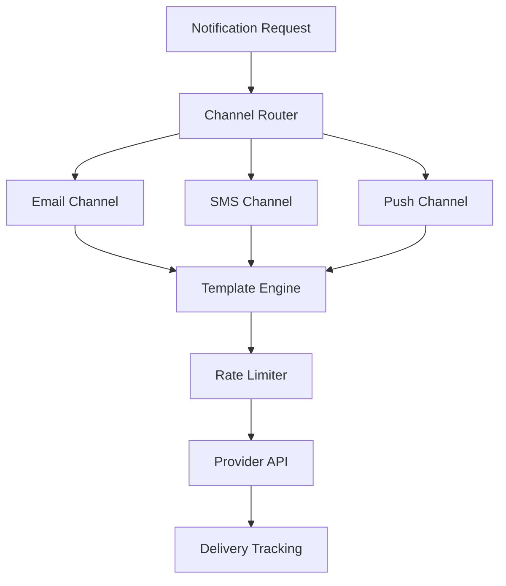

# How to Instrument Notification Systems (Email, SMS, Push) with OpenTelemetry

Author: [nawazdhandala](https://www.github.com/nawazdhandala)

Tags: OpenTelemetry, Notifications, Email, SMS, Push Notifications, Tracing, Monitoring

Description: Learn how to instrument email, SMS, and push notification systems with OpenTelemetry for delivery tracking, latency monitoring, and failure diagnosis.

---

Notification systems are one of those things that seem simple until they break. Sending an email, an SMS, or a push notification involves multiple external providers, retry logic, template rendering, rate limiting, and delivery confirmation. When a user says they never received a notification, you need to be able to trace exactly what happened from the moment the notification was triggered to the point where it either reached the provider or failed.

OpenTelemetry gives you the ability to trace notification workflows end to end, track delivery metrics across channels, and quickly diagnose why a specific notification never arrived. In this guide, we will instrument a multi-channel notification system covering email, SMS, and push notifications.

## The Notification Pipeline

A typical notification system receives a request, determines the delivery channel, renders the content from a template, sends it through a provider, and tracks the delivery status. Each step is a potential failure point.



## Setting Up the Notification Service Tracer

Start with a shared tracer configuration that all notification channels use. This ensures consistent resource attributes and exporter settings across the entire notification system.

```python
# notification_tracing.py - Shared tracing setup for notification service
from opentelemetry import trace, metrics
from opentelemetry.sdk.trace import TracerProvider
from opentelemetry.sdk.trace.export import BatchSpanProcessor
from opentelemetry.exporter.otlp.proto.grpc.trace_exporter import OTLPSpanExporter
from opentelemetry.sdk.metrics import MeterProvider
from opentelemetry.sdk.metrics.export import PeriodicExportingMetricReader
from opentelemetry.exporter.otlp.proto.grpc.metric_exporter import OTLPMetricExporter
from opentelemetry.sdk.resources import Resource

# Shared resource for all notification components
resource = Resource.create({
    "service.name": "notification-service",
    "service.version": "3.2.0",
    "deployment.environment": "production",
})

# Initialize tracing
trace_provider = TracerProvider(resource=resource)
trace_provider.add_span_processor(
    BatchSpanProcessor(OTLPSpanExporter(endpoint="grpc://otel-collector:4317"))
)
trace.set_tracer_provider(trace_provider)

# Initialize metrics
metric_reader = PeriodicExportingMetricReader(OTLPMetricExporter())
meter_provider = MeterProvider(resource=resource, metric_readers=[metric_reader])
metrics.set_meter_provider(meter_provider)

# Create shared tracer and meter
tracer = trace.get_tracer("notification-service", "3.2.0")
meter = metrics.get_meter("notification-service", "3.2.0")

# Metrics for notification tracking
notifications_sent = meter.create_counter(
    "notifications.sent",
    description="Total notifications sent by channel and status",
)

notification_latency = meter.create_histogram(
    "notifications.send_latency_ms",
    description="Time to send a notification through the provider",
    unit="ms",
)

notifications_failed = meter.create_counter(
    "notifications.failed",
    description="Total failed notification attempts",
)
```

Having a shared meter means all your notification metrics use the same resource attributes, making it easy to build dashboards that compare delivery rates across email, SMS, and push in a single view.

## Instrumenting Email Delivery

Email is the most common notification channel and has its own set of complications: template rendering, SMTP or API-based delivery, bounce handling, and spam filtering. Let's instrument the full email sending flow.

```python
import time

async def send_email_notification(notification):
    """Send an email notification with full tracing."""
    with tracer.start_as_current_span("notification.send_email") as span:
        span.set_attribute("notification.id", notification.id)
        span.set_attribute("notification.channel", "email")
        span.set_attribute("notification.recipient", notification.recipient_email)
        span.set_attribute("notification.template", notification.template_name)
        span.set_attribute("notification.priority", notification.priority)

        # Step 1: Render the email template
        with tracer.start_as_current_span("notification.render_template") as template_span:
            template_span.set_attribute("template.name", notification.template_name)
            template_span.set_attribute("template.locale", notification.locale)

            rendered = template_engine.render(
                notification.template_name,
                context=notification.template_data,
                locale=notification.locale,
            )

            template_span.set_attribute("template.subject_length", len(rendered.subject))
            template_span.set_attribute("template.body_length", len(rendered.body))
            template_span.set_attribute("template.has_attachments", bool(rendered.attachments))

        # Step 2: Check rate limits
        with tracer.start_as_current_span("notification.check_rate_limit") as rl_span:
            rate_limit_result = await rate_limiter.check(
                key=f"email:{notification.recipient_email}",
                limit=10,       # max 10 emails per hour
                window=3600,
            )
            rl_span.set_attribute("rate_limit.allowed", rate_limit_result.allowed)
            rl_span.set_attribute("rate_limit.remaining", rate_limit_result.remaining)

            if not rate_limit_result.allowed:
                span.add_event("rate_limited", {
                    "notification.recipient": notification.recipient_email,
                    "rate_limit.retry_after_seconds": rate_limit_result.retry_after,
                })
                notifications_failed.add(1, {
                    "notification.channel": "email",
                    "notification.failure_reason": "rate_limited",
                })
                return {"status": "rate_limited", "retry_after": rate_limit_result.retry_after}

        # Step 3: Send through the email provider
        with tracer.start_as_current_span("notification.provider_send",
                                          kind=trace.SpanKind.CLIENT) as send_span:
            send_span.set_attribute("provider.name", "sendgrid")
            start_time = time.monotonic()

            try:
                result = await email_provider.send(
                    to=notification.recipient_email,
                    subject=rendered.subject,
                    html_body=rendered.body,
                    attachments=rendered.attachments,
                )

                duration_ms = (time.monotonic() - start_time) * 1000
                send_span.set_attribute("provider.message_id", result.message_id)
                send_span.set_attribute("provider.response_time_ms", duration_ms)

                # Record metrics
                notifications_sent.add(1, {
                    "notification.channel": "email",
                    "notification.status": "sent",
                    "provider.name": "sendgrid",
                })
                notification_latency.record(duration_ms, {
                    "notification.channel": "email",
                })

                return {"status": "sent", "message_id": result.message_id}

            except Exception as e:
                duration_ms = (time.monotonic() - start_time) * 1000
                send_span.set_attribute("provider.response_time_ms", duration_ms)
                send_span.record_exception(e)

                notifications_failed.add(1, {
                    "notification.channel": "email",
                    "notification.failure_reason": type(e).__name__,
                })
                raise
```

The three child spans (template rendering, rate limiting, and provider send) give you a clear breakdown of where time is spent in the email path. If template rendering suddenly takes 500ms instead of 5ms, that shows up immediately in the trace waterfall.

## Instrumenting SMS Delivery

SMS has its own quirks. Providers have per-second rate limits, messages have character limits that affect segmentation, and delivery receipts arrive asynchronously.

```python
async def send_sms_notification(notification):
    """Send an SMS notification with segment and delivery tracking."""
    with tracer.start_as_current_span("notification.send_sms") as span:
        span.set_attribute("notification.id", notification.id)
        span.set_attribute("notification.channel", "sms")
        span.set_attribute("notification.recipient", notification.phone_number)
        span.set_attribute("notification.country_code", notification.country_code)

        # Render the SMS body from template
        message_body = template_engine.render_plain(
            notification.template_name,
            context=notification.template_data,
        )

        # Calculate SMS segments (important for cost tracking)
        message_length = len(message_body)
        segments = (message_length // 160) + (1 if message_length % 160 else 0)
        span.set_attribute("sms.message_length", message_length)
        span.set_attribute("sms.segments", segments)

        # Send via SMS provider
        with tracer.start_as_current_span("notification.sms_provider_send",
                                          kind=trace.SpanKind.CLIENT) as send_span:
            send_span.set_attribute("provider.name", "twilio")
            start_time = time.monotonic()

            try:
                result = await sms_provider.send(
                    to=notification.phone_number,
                    body=message_body,
                    from_number=get_sender_number(notification.country_code),
                )

                duration_ms = (time.monotonic() - start_time) * 1000
                send_span.set_attribute("provider.message_sid", result.sid)
                send_span.set_attribute("provider.response_time_ms", duration_ms)
                send_span.set_attribute("sms.price", result.price or 0)

                notifications_sent.add(1, {
                    "notification.channel": "sms",
                    "notification.status": "queued",
                    "notification.country_code": notification.country_code,
                })

                # Store the trace context so we can link the delivery callback later
                await store_trace_context(
                    message_id=result.sid,
                    trace_id=span.get_span_context().trace_id,
                    span_id=span.get_span_context().span_id,
                )

                return {"status": "queued", "sid": result.sid, "segments": segments}

            except Exception as e:
                duration_ms = (time.monotonic() - start_time) * 1000
                send_span.record_exception(e)
                notifications_failed.add(1, {
                    "notification.channel": "sms",
                    "notification.failure_reason": type(e).__name__,
                })
                raise
```

Notice the `store_trace_context` call near the end. SMS delivery confirmations arrive asynchronously via webhooks, sometimes minutes after the send. By storing the trace context alongside the message ID, you can link the delivery callback back to the original trace.

## Handling Asynchronous Delivery Callbacks

When the SMS provider sends a delivery receipt, you want to connect it back to the original notification trace. This is where span links come in handy.

```python
from opentelemetry.trace import Link, SpanContext, TraceFlags

async def handle_sms_delivery_webhook(webhook_data):
    """Process an SMS delivery status callback and link to original trace."""
    with tracer.start_as_current_span("notification.delivery_callback") as span:
        message_sid = webhook_data.get("MessageSid")
        delivery_status = webhook_data.get("MessageStatus")

        span.set_attribute("notification.channel", "sms")
        span.set_attribute("sms.message_sid", message_sid)
        span.set_attribute("sms.delivery_status", delivery_status)

        # Retrieve the original trace context
        original_context = await get_trace_context(message_sid)

        if original_context:
            # Create a link back to the original send span
            original_span_context = SpanContext(
                trace_id=original_context["trace_id"],
                span_id=original_context["span_id"],
                is_remote=True,
                trace_flags=TraceFlags(0x01),
            )
            span.add_link(Link(original_span_context))
            span.set_attribute("notification.original_trace_linked", True)

        # Update delivery metrics
        notifications_sent.add(1, {
            "notification.channel": "sms",
            "notification.status": delivery_status,   # delivered, failed, undelivered
        })

        if delivery_status in ("failed", "undelivered"):
            error_code = webhook_data.get("ErrorCode", "unknown")
            span.set_attribute("sms.error_code", error_code)
            span.add_event("delivery_failed", {
                "sms.error_code": error_code,
                "sms.error_message": webhook_data.get("ErrorMessage", ""),
            })
```

Span links are different from parent-child relationships. They let you say "this span is related to that other span" without implying a direct causal relationship. This is perfect for asynchronous workflows where the callback happens in a completely separate request context.

## Instrumenting Push Notifications

Push notifications add another layer of complexity because you are dealing with device tokens, platform-specific APIs (APNs for iOS, FCM for Android), and the possibility that tokens become stale.

```python
async def send_push_notification(notification):
    """Send a push notification with platform-specific tracking."""
    with tracer.start_as_current_span("notification.send_push") as span:
        span.set_attribute("notification.id", notification.id)
        span.set_attribute("notification.channel", "push")
        span.set_attribute("notification.user_id", notification.user_id)

        # Look up device tokens for the user
        devices = await device_registry.get_devices(notification.user_id)
        span.set_attribute("push.device_count", len(devices))

        results = []
        stale_tokens = []

        for device in devices:
            # Create a child span for each device delivery attempt
            with tracer.start_as_current_span("notification.push_device_send") as device_span:
                device_span.set_attribute("push.platform", device.platform)
                device_span.set_attribute("push.token_age_days", device.token_age_days)

                try:
                    if device.platform == "ios":
                        result = await apns_client.send(
                            device_token=device.token,
                            title=notification.title,
                            body=notification.body,
                            badge=notification.badge_count,
                        )
                    elif device.platform == "android":
                        result = await fcm_client.send(
                            registration_token=device.token,
                            title=notification.title,
                            body=notification.body,
                            data=notification.extra_data,
                        )

                    device_span.set_attribute("push.send_status", "success")
                    results.append({"device": device.id, "status": "sent"})

                except InvalidTokenError:
                    # Token is stale, mark for cleanup
                    device_span.set_attribute("push.send_status", "invalid_token")
                    device_span.add_event("stale_token_detected", {
                        "push.platform": device.platform,
                        "push.token_age_days": device.token_age_days,
                    })
                    stale_tokens.append(device.token)

                except Exception as e:
                    device_span.record_exception(e)
                    device_span.set_attribute("push.send_status", "error")

        # Clean up stale tokens
        if stale_tokens:
            span.set_attribute("push.stale_tokens_removed", len(stale_tokens))
            await device_registry.remove_tokens(stale_tokens)

        span.set_attribute("push.successful_sends", len([r for r in results if r["status"] == "sent"]))
        return results
```

The per-device child spans are important because push notification delivery can vary wildly between platforms. If APNs is slow but FCM is fast, you will see that immediately in the trace. Tracking stale tokens also helps you maintain a healthy device registry over time.

## Building a Notification Health Dashboard

With all three channels instrumented, you can build a unified dashboard that shows notification system health. The key metrics to display are delivery rate by channel (email, SMS, push), average send latency by channel and provider, failure rate by failure reason, rate limiting frequency, and stale push token accumulation over time.

```python
# Useful gauge for tracking pending notifications in the queue
pending_notifications = meter.create_up_down_counter(
    "notifications.pending",
    description="Number of notifications waiting to be sent",
)

# Track retry attempts separately
retry_counter = meter.create_counter(
    "notifications.retries",
    description="Number of notification retry attempts",
)

def record_retry(notification_id, channel, attempt_number, reason):
    """Record a retry attempt for monitoring."""
    retry_counter.add(1, {
        "notification.channel": channel,
        "notification.retry_attempt": attempt_number,
        "notification.retry_reason": reason,
    })
```

## Wrapping Up

Notification systems touch nearly every user-facing feature in modern applications. By instrumenting email, SMS, and push channels with OpenTelemetry, you gain the ability to trace any notification from its trigger point through template rendering, rate limiting, provider delivery, and asynchronous callbacks. The combination of traces for individual notification workflows and metrics for aggregate delivery health gives you both the detail you need for debugging and the big picture you need for operational awareness. When a user reports a missing notification, you can look up their notification ID and see exactly where in the pipeline things went sideways.
