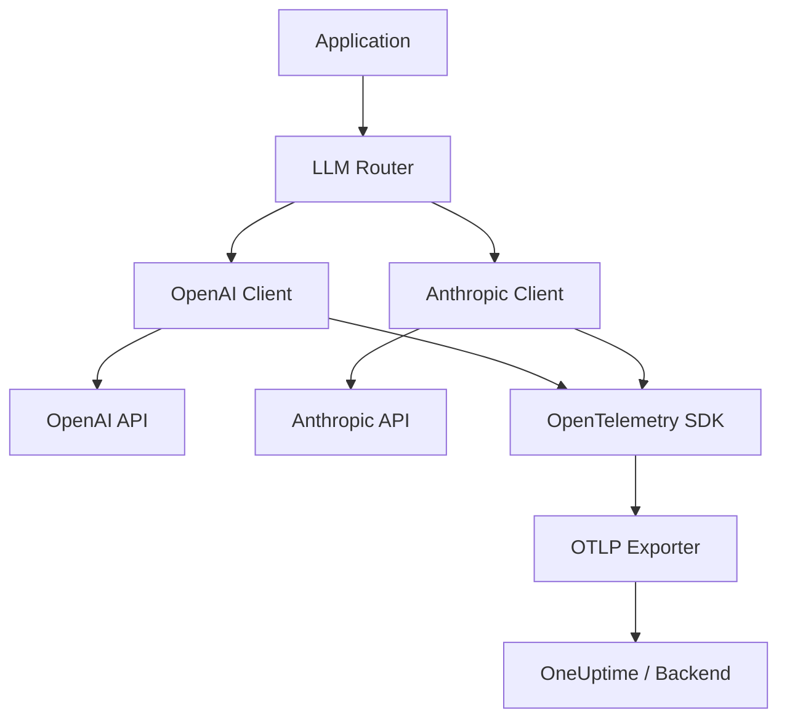

# How to Instrument OpenAI and Anthropic API Calls with OpenTelemetry

Author: [nawazdhandala](https://www.github.com/nawazdhandala)

Tags: OpenTelemetry, OpenAI, Anthropic, LLM, Tracing, Python, Observability, API Instrumentation

Description: Step-by-step guide to instrumenting OpenAI and Anthropic API calls with OpenTelemetry, including chat completions, streaming responses, error handling, and unified multi-provider tracing.

---

If your application calls OpenAI or Anthropic APIs, you need visibility into those calls. How long did the API take to respond? How many tokens were consumed? Did the request fail, and why? These are basic questions that become hard to answer without proper instrumentation.

OpenTelemetry gives you a standardized way to capture this data for both providers using the same tracing patterns and attribute conventions. This means you can compare performance across models, track costs, and debug issues from a single observability dashboard.

In this guide, we'll instrument both OpenAI and Anthropic API calls with OpenTelemetry, covering synchronous calls, streaming, error handling, and a unified wrapper that works for both providers.

---

## Architecture Overview

Here is how the instrumentation fits into a typical application that uses multiple LLM providers:



---

## Prerequisites and Setup

Install the necessary packages. You'll need the OpenTelemetry SDK, both LLM client libraries, and the OTLP exporter.

```bash
# Install OpenTelemetry core packages
pip install opentelemetry-api opentelemetry-sdk opentelemetry-exporter-otlp

# Install the LLM client libraries
pip install openai anthropic

# Install semantic conventions for standard attribute names
pip install opentelemetry-semantic-conventions
```

Set up the tracer provider that both instrumentations will share.

```python
from opentelemetry import trace
from opentelemetry.sdk.trace import TracerProvider
from opentelemetry.sdk.trace.export import BatchSpanProcessor
from opentelemetry.exporter.otlp.proto.grpc.trace_exporter import OTLPSpanExporter
from opentelemetry.sdk.resources import Resource

# Both providers share the same tracer configuration
resource = Resource.create({
    "service.name": "multi-llm-service",
    "service.version": "1.0.0",
})

provider = TracerProvider(resource=resource)
exporter = OTLPSpanExporter(endpoint="https://oneuptime.com/otlp")
provider.add_span_processor(BatchSpanProcessor(exporter))
trace.set_tracer_provider(provider)

tracer = trace.get_tracer("multi-llm-service")
```

---

## Instrumenting OpenAI Chat Completions

Let's start with OpenAI. The most common operation is a chat completion. We'll capture the model, token usage, finish reason, and any errors.

```python
import openai
from opentelemetry import trace

tracer = trace.get_tracer("multi-llm-service")

def openai_chat(messages: list, model: str = "gpt-4o", **kwargs) -> dict:
    """Instrumented OpenAI chat completion call."""

    with tracer.start_as_current_span("gen_ai.chat") as span:
        # Set provider-specific and standard GenAI attributes
        span.set_attribute("gen_ai.system", "openai")
        span.set_attribute("gen_ai.request.model", model)
        span.set_attribute("gen_ai.request.temperature", kwargs.get("temperature", 1.0))
        span.set_attribute("gen_ai.request.max_tokens", kwargs.get("max_tokens", 0))

        try:
            client = openai.OpenAI()
            response = client.chat.completions.create(
                model=model,
                messages=messages,
                **kwargs,
            )

            # Extract and record response metadata
            choice = response.choices[0]
            span.set_attribute("gen_ai.response.model", response.model)
            span.set_attribute("gen_ai.response.finish_reasons", [choice.finish_reason])
            span.set_attribute("gen_ai.usage.input_tokens", response.usage.prompt_tokens)
            span.set_attribute("gen_ai.usage.output_tokens", response.usage.completion_tokens)

            # Record the OpenAI-specific request ID for debugging
            if hasattr(response, '_request_id'):
                span.set_attribute("openai.request_id", response._request_id)

            return {
                "content": choice.message.content,
                "model": response.model,
                "usage": {
                    "input_tokens": response.usage.prompt_tokens,
                    "output_tokens": response.usage.completion_tokens,
                },
                "finish_reason": choice.finish_reason,
            }

        except openai.RateLimitError as e:
            # Tag rate limit errors specifically so you can alert on them
            span.set_status(trace.StatusCode.ERROR, "Rate limited")
            span.set_attribute("error.type", "rate_limit")
            span.record_exception(e)
            raise

        except openai.APIError as e:
            span.set_status(trace.StatusCode.ERROR, str(e))
            span.set_attribute("error.type", "api_error")
            span.set_attribute("openai.error.code", e.code if hasattr(e, 'code') else "unknown")
            span.record_exception(e)
            raise
```

---

## Instrumenting Anthropic Messages API

Anthropic's API is structured differently from OpenAI's, but the instrumentation pattern is the same. The key differences are the attribute values and how you extract token counts from the response.

```python
import anthropic
from opentelemetry import trace

tracer = trace.get_tracer("multi-llm-service")

def anthropic_chat(messages: list, model: str = "claude-sonnet-4-20250514", **kwargs) -> dict:
    """Instrumented Anthropic messages API call."""

    with tracer.start_as_current_span("gen_ai.chat") as span:
        # Use "anthropic" as the system identifier
        span.set_attribute("gen_ai.system", "anthropic")
        span.set_attribute("gen_ai.request.model", model)
        span.set_attribute("gen_ai.request.max_tokens", kwargs.get("max_tokens", 1024))
        span.set_attribute("gen_ai.request.temperature", kwargs.get("temperature", 1.0))

        try:
            client = anthropic.Anthropic()
            response = client.messages.create(
                model=model,
                messages=messages,
                max_tokens=kwargs.get("max_tokens", 1024),
                temperature=kwargs.get("temperature", 1.0),
                system=kwargs.get("system", ""),
            )

            # Anthropic reports usage differently than OpenAI
            span.set_attribute("gen_ai.response.model", response.model)
            span.set_attribute("gen_ai.response.finish_reasons", [response.stop_reason])
            span.set_attribute("gen_ai.usage.input_tokens", response.usage.input_tokens)
            span.set_attribute("gen_ai.usage.output_tokens", response.usage.output_tokens)

            # Anthropic includes a unique request ID in response headers
            if hasattr(response, '_request_id'):
                span.set_attribute("anthropic.request_id", response._request_id)

            # Extract text content from the response blocks
            content = ""
            for block in response.content:
                if block.type == "text":
                    content += block.text

            return {
                "content": content,
                "model": response.model,
                "usage": {
                    "input_tokens": response.usage.input_tokens,
                    "output_tokens": response.usage.output_tokens,
                },
                "finish_reason": response.stop_reason,
            }

        except anthropic.RateLimitError as e:
            span.set_status(trace.StatusCode.ERROR, "Rate limited")
            span.set_attribute("error.type", "rate_limit")
            span.record_exception(e)
            raise

        except anthropic.APIError as e:
            span.set_status(trace.StatusCode.ERROR, str(e))
            span.set_attribute("error.type", "api_error")
            span.record_exception(e)
            raise
```

---

## Instrumenting Streaming Responses

Streaming is trickier to instrument because you don't get token counts until the stream finishes. The strategy is to keep the span open while consuming the stream, then record the final metadata.

Here's how to handle OpenAI streaming:

```python
def openai_chat_stream(messages: list, model: str = "gpt-4o", **kwargs):
    """Instrumented OpenAI streaming chat completion."""

    with tracer.start_as_current_span("gen_ai.chat") as span:
        span.set_attribute("gen_ai.system", "openai")
        span.set_attribute("gen_ai.request.model", model)
        span.set_attribute("gen_ai.request.stream", True)

        client = openai.OpenAI()
        stream = client.chat.completions.create(
            model=model,
            messages=messages,
            stream=True,
            stream_options={"include_usage": True},  # Request token counts in stream
            **kwargs,
        )

        collected_content = []
        finish_reason = None
        response_model = None

        try:
            # Iterate through the stream, collecting chunks
            for chunk in stream:
                if chunk.choices:
                    delta = chunk.choices[0].delta
                    if delta.content:
                        collected_content.append(delta.content)
                        # Yield each chunk so the caller can stream to the client
                        yield delta.content

                    if chunk.choices[0].finish_reason:
                        finish_reason = chunk.choices[0].finish_reason

                # The last chunk with stream_options contains usage data
                if chunk.usage:
                    span.set_attribute("gen_ai.usage.input_tokens", chunk.usage.prompt_tokens)
                    span.set_attribute("gen_ai.usage.output_tokens", chunk.usage.completion_tokens)

                if chunk.model:
                    response_model = chunk.model

            span.set_attribute("gen_ai.response.model", response_model or model)
            span.set_attribute("gen_ai.response.finish_reasons", [finish_reason or "unknown"])

        except Exception as e:
            span.set_status(trace.StatusCode.ERROR, str(e))
            span.record_exception(e)
            raise
```

And here's the Anthropic streaming version:

```python
def anthropic_chat_stream(messages: list, model: str = "claude-sonnet-4-20250514", **kwargs):
    """Instrumented Anthropic streaming messages call."""

    with tracer.start_as_current_span("gen_ai.chat") as span:
        span.set_attribute("gen_ai.system", "anthropic")
        span.set_attribute("gen_ai.request.model", model)
        span.set_attribute("gen_ai.request.stream", True)

        client = anthropic.Anthropic()

        # Anthropic uses a context manager for streaming
        with client.messages.stream(
            model=model,
            messages=messages,
            max_tokens=kwargs.get("max_tokens", 1024),
        ) as stream:
            try:
                for text in stream.text_stream:
                    yield text

                # After the stream completes, get the final message with usage data
                final_message = stream.get_final_message()
                span.set_attribute("gen_ai.response.model", final_message.model)
                span.set_attribute("gen_ai.response.finish_reasons", [final_message.stop_reason])
                span.set_attribute("gen_ai.usage.input_tokens", final_message.usage.input_tokens)
                span.set_attribute("gen_ai.usage.output_tokens", final_message.usage.output_tokens)

            except Exception as e:
                span.set_status(trace.StatusCode.ERROR, str(e))
                span.record_exception(e)
                raise
```

---

## Building a Unified Multi-Provider Wrapper

In many applications, you want to switch between providers dynamically. A unified wrapper keeps your instrumentation consistent while routing to the right client.

```python
class LLMClient:
    """Unified LLM client with built-in OpenTelemetry instrumentation."""

    def __init__(self):
        self.tracer = trace.get_tracer("multi-llm-service")
        self.openai_client = openai.OpenAI()
        self.anthropic_client = anthropic.Anthropic()

    def chat(self, messages: list, model: str, **kwargs) -> dict:
        """Route to the correct provider based on model name."""

        # Determine the provider from the model name
        provider = self._detect_provider(model)

        with self.tracer.start_as_current_span("gen_ai.chat") as span:
            span.set_attribute("gen_ai.system", provider)
            span.set_attribute("gen_ai.request.model", model)

            if provider == "openai":
                return self._call_openai(span, messages, model, **kwargs)
            elif provider == "anthropic":
                return self._call_anthropic(span, messages, model, **kwargs)
            else:
                raise ValueError(f"Unsupported model: {model}")

    def _detect_provider(self, model: str) -> str:
        """Detect the provider based on the model name prefix."""
        if model.startswith(("gpt-", "o1", "o3")):
            return "openai"
        elif model.startswith(("claude-",)):
            return "anthropic"
        return "unknown"

    def _call_openai(self, span, messages, model, **kwargs) -> dict:
        """Make an instrumented call to OpenAI."""
        response = self.openai_client.chat.completions.create(
            model=model, messages=messages, **kwargs
        )
        choice = response.choices[0]
        span.set_attribute("gen_ai.response.model", response.model)
        span.set_attribute("gen_ai.usage.input_tokens", response.usage.prompt_tokens)
        span.set_attribute("gen_ai.usage.output_tokens", response.usage.completion_tokens)
        span.set_attribute("gen_ai.response.finish_reasons", [choice.finish_reason])
        return {"content": choice.message.content, "usage": response.usage}

    def _call_anthropic(self, span, messages, model, **kwargs) -> dict:
        """Make an instrumented call to Anthropic."""
        response = self.anthropic_client.messages.create(
            model=model, messages=messages,
            max_tokens=kwargs.get("max_tokens", 1024), **kwargs
        )
        content = "".join(b.text for b in response.content if b.type == "text")
        span.set_attribute("gen_ai.response.model", response.model)
        span.set_attribute("gen_ai.usage.input_tokens", response.usage.input_tokens)
        span.set_attribute("gen_ai.usage.output_tokens", response.usage.output_tokens)
        span.set_attribute("gen_ai.response.finish_reasons", [response.stop_reason])
        return {"content": content, "usage": response.usage}
```

Usage is straightforward:

```python
# Use the unified client to call either provider
llm = LLMClient()

# Call OpenAI
result = llm.chat(
    messages=[{"role": "user", "content": "Explain distributed tracing"}],
    model="gpt-4o",
)

# Call Anthropic with the same interface
result = llm.chat(
    messages=[{"role": "user", "content": "Explain distributed tracing"}],
    model="claude-sonnet-4-20250514",
)
```

---

## Environment Configuration

Configure your instrumentation through environment variables for easy deployment.

```bash
# Service identification
export OTEL_SERVICE_NAME="multi-llm-service"
export OTEL_EXPORTER_OTLP_ENDPOINT="https://oneuptime.com/otlp"

# API keys for the LLM providers
export OPENAI_API_KEY="sk-..."
export ANTHROPIC_API_KEY="sk-ant-..."

# Control content logging (disable in production for privacy)
export OTEL_GENAI_LOG_CONTENT="false"
```

---

## Wrapping Up

Instrumenting OpenAI and Anthropic calls with OpenTelemetry gives you consistent, comparable observability across providers. The GenAI semantic conventions mean your traces look the same regardless of which model you're calling, which makes dashboarding and alerting much simpler.

The key takeaways are: use `gen_ai.system` to identify the provider, always record token usage for cost tracking, handle streaming by keeping the span open until the stream completes, and use a unified wrapper if you call multiple providers. With these patterns in place, you'll have full visibility into your LLM layer before production issues catch you by surprise.
