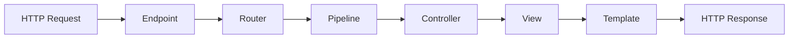
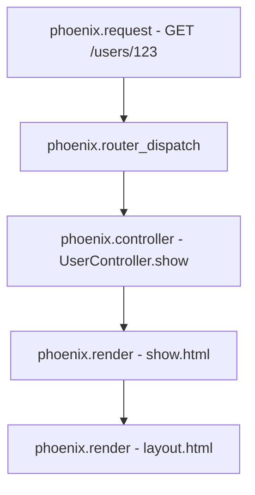

# How to Instrument a Phoenix Application with opentelemetry_phoenix

Author: [nawazdhandala](https://www.github.com/nawazdhandala)

Tags: OpenTelemetry, Elixir, Phoenix, opentelemetry_phoenix, Tracing

Description: Complete guide to instrumenting Phoenix applications with opentelemetry_phoenix library for automatic tracing of HTTP requests, controllers, and views.

Phoenix is one of the most popular web frameworks in the Elixir ecosystem, known for its performance and developer experience. When running Phoenix applications in production, observability becomes critical for understanding request flows, identifying bottlenecks, and debugging issues. OpenTelemetry provides standardized instrumentation for Phoenix through the `opentelemetry_phoenix` library.

This guide walks through setting up automatic instrumentation for your Phoenix application, capturing HTTP requests, controller actions, and view rendering spans.

## Understanding Phoenix Request Lifecycle

Before instrumenting your application, it's helpful to understand what gets traced. A typical Phoenix request flows through multiple stages:



The `opentelemetry_phoenix` library automatically creates spans for each of these stages, giving you complete visibility into request processing.

## Installing Dependencies

Add the required OpenTelemetry packages to your `mix.exs` file:

```elixir
defp deps do
  [
    {:phoenix, "~> 1.7"},
    # Core OpenTelemetry SDK for Elixir
    {:opentelemetry, "~> 1.4"},
    {:opentelemetry_api, "~> 1.3"},
    # Phoenix-specific instrumentation
    {:opentelemetry_phoenix, "~> 1.2"},
    # OTLP exporter for sending traces to collectors
    {:opentelemetry_exporter, "~> 1.7"}
  ]
end
```

Run `mix deps.get` to fetch the dependencies. The `opentelemetry_phoenix` library provides automatic instrumentation through Telemetry event handlers that hook into Phoenix's built-in telemetry events.

## Configuring the OpenTelemetry SDK

Create or update your `config/runtime.exs` to configure the OpenTelemetry SDK:

```elixir
import Config

# Configure the OpenTelemetry resource attributes
# These identify your service in the observability backend
config :opentelemetry,
  resource: [
    service: [
      name: "my_phoenix_app",
      namespace: "production",
      version: "1.0.0"
    ]
  ]

# Configure the span processor and exporter
config :opentelemetry, :processors,
  otel_batch_processor: %{
    # Export spans via OTLP protocol
    exporter: {:otel_exporter_otlp, %{
      # Configure your collector endpoint
      endpoint: System.get_env("OTEL_EXPORTER_OTLP_ENDPOINT") || "http://localhost:4318",
      # Use HTTP protocol (gRPC also available)
      protocol: :http_protobuf,
      # Compression reduces bandwidth
      compression: :gzip
    }}
  }
```

This configuration sets up batch processing of spans and exports them using the OTLP (OpenTelemetry Protocol) format to a collector endpoint.

## Setting Up Phoenix Instrumentation

The key step is attaching the Phoenix instrumentation handlers. Add this to your `application.ex` file in the `start/2` function:

```elixir
defmodule MyPhoenixApp.Application do
  use Application

  @impl true
  def start(_type, _args) do
    # Attach Phoenix instrumentation BEFORE starting the supervision tree
    # This ensures all HTTP requests are traced from application start
    OpentelemetryPhoenix.setup(adapter: :cowboy2)

    children = [
      MyPhoenixAppWeb.Endpoint,
      # ... other children
    ]

    opts = [strategy: :one_for_one, name: MyPhoenixApp.Supervisor]
    Supervisor.start_link(children, opts)
  end
end
```

The `setup/1` function attaches Telemetry handlers for Phoenix events. The `:cowboy2` adapter option ensures compatibility with Phoenix's default web server.

## Understanding Generated Spans

Once instrumentation is active, `opentelemetry_phoenix` automatically creates spans for:

**HTTP Request Span**: The root span for each request with attributes including:
- HTTP method (GET, POST, etc.)
- URL path and query parameters
- Response status code
- Request and response headers (configurable)

**Router Span**: Captures route matching and dispatching with:
- Matched route pattern
- Controller and action names
- Route parameters

**Controller Span**: Tracks controller action execution with:
- Controller module and function
- Action parameters
- Response format (HTML, JSON, etc.)

**View Render Span**: Measures template rendering time with:
- Template name and format
- Layout information
- Render duration

Here's the span hierarchy for a typical request:



## Customizing Span Attributes

You can customize which attributes are captured by providing options to `setup/1`:

```elixir
# In your application.ex
OpentelemetryPhoenix.setup(
  adapter: :cowboy2,
  # Customize endpoint prefix for span names
  endpoint_prefix: [:my_app, :endpoint],
  # Add custom attributes to all spans
  span_attributes: fn conn ->
    %{
      "user.id" => get_user_id(conn),
      "tenant.id" => get_tenant_id(conn),
      "request.id" => Logger.metadata()[:request_id]
    }
  end
)

defp get_user_id(conn) do
  case conn.assigns[:current_user] do
    %{id: id} -> id
    _ -> nil
  end
end

defp get_tenant_id(conn) do
  conn.assigns[:tenant_id]
end
```

This approach adds business-specific context to every span, making traces more valuable for debugging and analysis.

## Filtering Sensitive Data

Production applications often need to redact sensitive information from traces:

```elixir
# Create a custom plug to sanitize conn before tracing
defmodule MyPhoenixAppWeb.SanitizeTracingPlug do
  @behaviour Plug

  def init(opts), do: opts

  def call(conn, _opts) do
    # Remove sensitive headers before they reach tracing
    conn
    |> Plug.Conn.delete_req_header("authorization")
    |> Plug.Conn.delete_req_header("cookie")
    |> sanitize_params()
  end

  defp sanitize_params(conn) do
    # Redact sensitive parameter values
    sanitized_params =
      conn.params
      |> Map.drop(["password", "password_confirmation", "credit_card"])
      |> Map.new(fn {k, v} -> {k, maybe_redact(k, v)} end)

    %{conn | params: sanitized_params}
  end

  defp maybe_redact(key, _value) when key in ["ssn", "api_key", "secret"],
    do: "[REDACTED]"
  defp maybe_redact(_key, value),
    do: value
end
```

Add this plug to your endpoint before the router to ensure sensitive data never enters your traces.

## Monitoring Health Check Endpoints

Health check endpoints can create noise in your traces. Filter them out:

```elixir
# In your router.ex
defmodule MyPhoenixAppWeb.Router do
  use MyPhoenixAppWeb, :router

  pipeline :api do
    plug :accepts, ["json"]
  end

  # Separate pipeline for health checks without tracing overhead
  pipeline :health do
    plug :accepts, ["json"]
    plug MyPhoenixAppWeb.DisableTracingPlug
  end

  scope "/health", MyPhoenixAppWeb do
    pipe_through :health
    get "/live", HealthController, :live
    get "/ready", HealthController, :ready
  end

  # Regular routes with full tracing
  scope "/api", MyPhoenixAppWeb do
    pipe_through :api
    resources "/users", UserController
  end
end
```

The `DisableTracingPlug` can conditionally disable span creation for high-frequency, low-value endpoints.

## Verifying Instrumentation

After starting your application, generate some traffic and verify traces are being created:

```elixir
# Start your Phoenix server
mix phx.server

# In another terminal, make requests
curl http://localhost:4000/users
curl http://localhost:4000/api/v1/posts/123
```

Check your OpenTelemetry collector or observability backend for traces. Each request should show:

1. A root span with the HTTP method and path
2. Child spans for routing, controller, and view operations
3. Timing information for each stage
4. Relevant attributes like status codes and route patterns

## Troubleshooting Common Issues

**No traces appearing**: Verify the collector endpoint is accessible and the exporter configuration is correct. Check logs for connection errors.

**Missing spans**: Ensure `OpentelemetryPhoenix.setup/1` is called before your endpoint starts in the supervision tree.

**High overhead**: Adjust batch processing settings and sampling rates for high-traffic applications. Use head-based sampling to reduce volume while maintaining visibility.

**Incomplete traces**: Make sure all async operations and background jobs are properly instrumented with parent span context propagation.

## Performance Considerations

The `opentelemetry_phoenix` instrumentation is designed for production use with minimal overhead. However, for extremely high-traffic applications, consider:

- Using tail-based sampling to reduce exported span volume
- Adjusting batch processor settings to optimize throughput
- Implementing custom sampling logic based on route importance
- Monitoring the OpenTelemetry SDK's own metrics

The default configuration handles thousands of requests per second without noticeable performance impact.

## Conclusion

Instrumenting Phoenix applications with `opentelemetry_phoenix` provides automatic, production-ready observability for your HTTP layer. The library integrates seamlessly with Phoenix's Telemetry system, requires minimal configuration, and produces standardized traces compatible with any OpenTelemetry backend.

With proper instrumentation in place, you gain detailed visibility into request processing, can identify performance bottlenecks, and debug production issues with confidence. The next step is instrumenting database queries with `opentelemetry_ecto` to get end-to-end visibility across your entire application stack.
