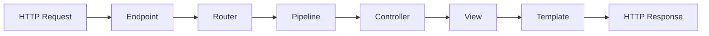
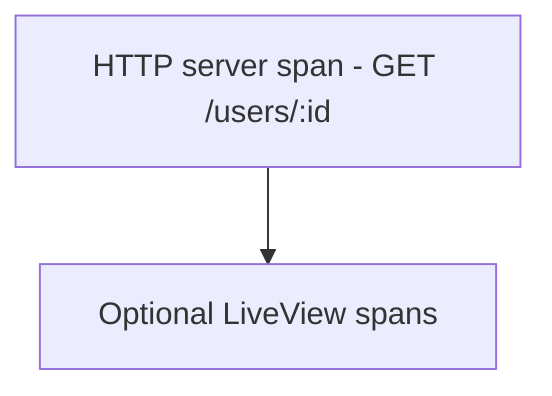

# How to Instrument a Phoenix Application with opentelemetry_phoenix

Author: [nawazdhandala](https://www.github.com/nawazdhandala)

Tags: OpenTelemetry, Elixir, Phoenix, Opentelemetry_phoenix, Tracing

Description: Complete guide to instrumenting Phoenix applications with opentelemetry_phoenix library for automatic tracing of HTTP requests, controllers, and views.

Phoenix is one of the most popular web frameworks in the Elixir ecosystem, known for its performance and developer experience. When running Phoenix applications in production, observability becomes critical for understanding request flows, identifying bottlenecks, and debugging issues. OpenTelemetry provides standardized instrumentation for Phoenix through the `opentelemetry_phoenix` library.

This guide walks through setting up automatic instrumentation for your Phoenix application, capturing HTTP request spans enriched with Phoenix route information and optional LiveView spans.

## Understanding Phoenix Request Lifecycle

Before instrumenting your application, it's helpful to understand what gets traced. A typical Phoenix request flows through multiple stages:


```mermaid
graph LR
    A[HTTP Request] --> B[Endpoint]
    B --> C[Router]
    C --> D[Pipeline]
    D --> E[Controller]
    E --> F[View]
    F --> G[Template]
    G --> H[HTTP Response]
```

The `opentelemetry_phoenix` library does not create a separate span for every stage in this diagram. It uses Phoenix telemetry events to enrich the active HTTP request span with endpoint and router information, and it can create additional spans for LiveView callbacks.

## Installing Dependencies

Add the required OpenTelemetry packages to your `mix.exs` file:

```elixir
defp deps do
  [
    {:phoenix, "~> 1.7"},
    # OTLP exporter for sending traces to collectors
    {:opentelemetry_exporter, "~> 1.8"},
    # Core OpenTelemetry SDK for Elixir
    {:opentelemetry, "~> 1.5"},
    {:opentelemetry_api, "~> 1.4"},
    # Phoenix-specific instrumentation
    {:opentelemetry_phoenix, "~> 2.0"},
    # Cowboy instrumentation for Phoenix apps using Plug.Cowboy
    {:opentelemetry_cowboy, "~> 1.0"}
  ]
end
```

Run `mix deps.get` to fetch the dependencies. The `opentelemetry_phoenix` library provides automatic instrumentation through Telemetry event handlers that hook into Phoenix's built-in telemetry events.

## Configuring the OpenTelemetry SDK

Create or update your `config/runtime.exs` to configure the OpenTelemetry SDK:

```elixir
import Config

# Configure the OpenTelemetry resource attributes

# These identify your service in the observability backend
config :opentelemetry,
  resource: %{
    service: %{
      name: "my_phoenix_app",
      namespace: "production",
      version: "1.0.0"
    }
  },
  span_processor: :batch,
  traces_exporter: :otlp

# Configure the OTLP exporter
config :opentelemetry_exporter,
  # Configure your collector endpoint
  otlp_endpoint: System.get_env("OTEL_EXPORTER_OTLP_ENDPOINT") || "http://localhost:4318",
  # Use HTTP protocol (gRPC also available)
  otlp_protocol: :http_protobuf,
  # Compression reduces bandwidth
  otlp_compression: :gzip
```

This configuration sets up batch processing of spans and exports them using the OTLP (OpenTelemetry Protocol) format to a collector endpoint.

## Setting Up Phoenix Instrumentation

The key step is attaching the Phoenix instrumentation handlers. Add this to your `application.ex` file in the `start/2` function:

```elixir
defmodule MyPhoenixApp.Application do
  use Application

  @impl true
  def start(_type, _args) do
    # Attach Phoenix instrumentation BEFORE starting the supervision tree
    # This ensures all HTTP requests are traced from application start
    :opentelemetry_cowboy.setup()
    OpentelemetryPhoenix.setup(adapter: :cowboy2)

    children = [
      MyPhoenixAppWeb.Endpoint,
      # ... other children
    ]

    opts = [strategy: :one_for_one, name: MyPhoenixApp.Supervisor]
    Supervisor.start_link(children, opts)
  end
end
```

The `setup/1` function attaches Telemetry handlers for Phoenix events. The `:cowboy2` adapter option tells `opentelemetry_phoenix` to continue the span created by `opentelemetry_cowboy`, which gives more accurate request timing for apps using Plug.Cowboy.

Make sure your endpoint includes `Plug.Telemetry` with the same endpoint prefix:

```elixir
defmodule MyPhoenixAppWeb.Endpoint do
  use Phoenix.Endpoint, otp_app: :my_phoenix_app

  plug Plug.Telemetry, event_prefix: [:phoenix, :endpoint]

  # ... other plugs
  plug MyPhoenixAppWeb.Router
end
```

## Understanding Generated Spans

Once instrumentation is active, `opentelemetry_cowboy` creates the HTTP server span and `opentelemetry_phoenix` enriches it from Phoenix telemetry events. `opentelemetry_phoenix` supports endpoint start/stop, router start/stop, router exceptions, and optional LiveView events.

**HTTP Request Span**: The root span for each request with attributes including:
- HTTP method (GET, POST, etc.)
- Matched route pattern
- Response status code
- Phoenix plug and action metadata

**Router Attributes**: Captures route matching and dispatching with:
- Matched route pattern
- Controller and action names
- Route metadata emitted by Phoenix

**LiveView Spans**: When LiveView instrumentation is enabled, tracks LiveView mount, handle_params, handle_event, live component update, and live component handle_event callbacks.

Here's the span hierarchy for a typical request:


```mermaid
graph TD
    A[HTTP server span - GET /users/:id]
    A --> B[Optional LiveView spans]
```

## Customizing Span Attributes

`OpentelemetryPhoenix.setup/1` supports `:adapter`, `:endpoint_prefix`, and `:liveview` options. To add business-specific attributes, set them on the active span from a plug or controller code that runs during the request:

```elixir
defmodule MyPhoenixAppWeb.TracingAttributesPlug do
  @behaviour Plug

  def init(opts), do: opts

  def call(conn, _opts) do
    attributes =
      %{
        "user.id" => get_user_id(conn),
        "tenant.id" => get_tenant_id(conn),
        "request.id" => Logger.metadata()[:request_id]
      }
      |> Map.reject(fn {_key, value} -> is_nil(value) end)

    OpenTelemetry.Tracer.set_attributes(attributes)

    conn
  end

  defp get_user_id(conn) do
    case conn.assigns[:current_user] do
      %{id: id} -> id
      _ -> nil
    end
  end

  defp get_tenant_id(conn) do
    conn.assigns[:tenant_id]
  end
end
```

You can still customize the endpoint telemetry prefix if your endpoint uses a non-default `Plug.Telemetry` prefix:

```elixir
OpentelemetryPhoenix.setup(
  adapter: :cowboy2,
  endpoint_prefix: [:my_app, :endpoint]
)
```

This approach adds business-specific context to every span, making traces more valuable for debugging and analysis.

## Filtering Sensitive Data

Production applications often need to redact sensitive information from logs and telemetry-derived attributes. Phoenix supports parameter filtering through `:filter_parameters`:

```elixir
config :phoenix, :filter_parameters, [
  "password",
  "password_confirmation",
  "credit_card",
  "ssn",
  "api_key",
  "secret"
]
```

Avoid adding raw headers, cookies, full query strings, or unfiltered request parameters as custom span attributes. If you add custom attributes in your own plug, only attach identifiers that are safe to export.

## Monitoring Health Check Endpoints

Health check endpoints can create noise in your traces. `opentelemetry_phoenix` does not provide a per-route ignore option, so keep health check routes easy to identify and filter them in your OpenTelemetry Collector or observability backend by `http.route`, path, or route metadata:

```elixir
# In your router.ex
defmodule MyPhoenixAppWeb.Router do
  use MyPhoenixAppWeb, :router

  pipeline :api do
    plug :accepts, ["json"]
  end

  # Separate pipeline for health checks so route-based filtering is easy
  pipeline :health do
    plug :accepts, ["json"]
  end

  scope "/health", MyPhoenixAppWeb do
    pipe_through :health
    get "/live", HealthController, :live
    get "/ready", HealthController, :ready
  end

  # Regular routes with full tracing
  scope "/api", MyPhoenixAppWeb do
    pipe_through :api
    resources "/users", UserController
  end
end
```

For high-frequency, low-value endpoints, configure sampling or filtering outside the router so those spans are dropped before storage.

## Verifying Instrumentation

After starting your application, generate some traffic and verify traces are being created:

```bash
# Start your Phoenix server
mix phx.server

# In another terminal, make requests
curl http://localhost:4000/users
curl http://localhost:4000/api/v1/posts/123
```

Check your OpenTelemetry collector or observability backend for traces. Each request should show:

1. A root span with the HTTP method and path
2. Phoenix route attributes added to that span
3. Timing information for the HTTP request
4. Relevant attributes like status codes and route patterns

## Troubleshooting Common Issues

**No traces appearing**: Verify the collector endpoint is accessible and the exporter configuration is correct. Check logs for connection errors.

**Missing spans**: Ensure `:opentelemetry_cowboy.setup/0` and `OpentelemetryPhoenix.setup/1` are called before your endpoint starts in the supervision tree, and confirm your endpoint has `plug Plug.Telemetry, event_prefix: [:phoenix, :endpoint]`.

**High overhead**: Adjust batch processing settings and sampling rates for high-traffic applications. Use head-based sampling to reduce volume while maintaining visibility.

**Incomplete traces**: Make sure all async operations and background jobs are properly instrumented with parent span context propagation.

## Performance Considerations

The `opentelemetry_phoenix` instrumentation is designed for production use with minimal overhead. However, for extremely high-traffic applications, consider:

- Using tail-based sampling to reduce exported span volume
- Adjusting batch processor settings to optimize throughput
- Implementing custom sampling logic based on route importance
- Monitoring the OpenTelemetry SDK's own metrics

Measure overhead in your own workload before increasing sampling rates or adding high-cardinality custom attributes.

## Conclusion

Instrumenting Phoenix applications with `opentelemetry_phoenix` provides automatic observability for your HTTP layer. The library integrates with Phoenix's Telemetry system, requires minimal configuration, and produces standardized traces compatible with any OpenTelemetry backend.

With proper instrumentation in place, you gain detailed visibility into request processing, can identify performance bottlenecks, and debug production issues with confidence. The next step is instrumenting database queries with `opentelemetry_ecto` to get end-to-end visibility across your entire application stack.
