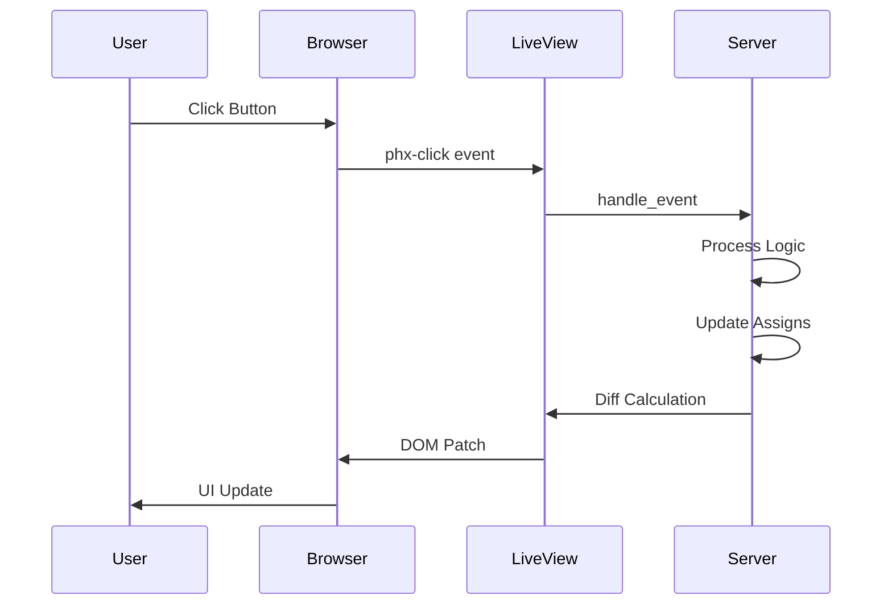

# How to Instrument Phoenix LiveView User Interactions with OpenTelemetry

Author: [nawazdhandala](https://www.github.com/nawazdhandala)

Tags: OpenTelemetry, Elixir, Phoenix, LiveView, User Interactions, Tracing

Description: Build comprehensive frontend observability for Phoenix LiveView applications by tracing user interactions, form submissions, and client-side events with OpenTelemetry.

Phoenix LiveView bridges the gap between server and client, handling user interactions through server-side rendering without writing JavaScript. While this simplifies development, it creates observability challenges. User interactions trigger server-side event handlers through WebSocket messages, making it difficult to understand frontend performance, user experience, and interaction patterns. OpenTelemetry instrumentation connects client-side user actions with server-side processing traces.

This guide demonstrates instrumenting LiveView for complete visibility into user interactions, from button clicks through server processing to DOM updates.

## LiveView Interaction Flow

Understanding the interaction lifecycle helps identify instrumentation points:



Each stage needs instrumentation to provide end-to-end visibility.

## Client-Side Instrumentation Setup

Start by adding OpenTelemetry to your LiveView JavaScript:

```javascript
// assets/js/app.js
import {Socket} from "phoenix"
import {LiveSocket} from "phoenix_live_view"
import topbar from "../vendor/topbar"

// Import OpenTelemetry Web SDK
import { WebTracerProvider } from '@opentelemetry/sdk-trace-web';
import { BatchSpanProcessor } from '@opentelemetry/sdk-trace-base';
import { OTLPTraceExporter } from '@opentelemetry/exporter-trace-otlp-http';
import { ZoneContextManager } from '@opentelemetry/context-zone';
import { registerInstrumentations } from '@opentelemetry/instrumentation';
import { DocumentLoadInstrumentation } from '@opentelemetry/instrumentation-document-load';

// Configure OpenTelemetry
const provider = new WebTracerProvider({
  resource: {
    attributes: {
      'service.name': 'my-app-frontend',
      'service.version': '1.0.0',
    },
  },
});

// Configure exporter to send traces to collector
const exporter = new OTLPTraceExporter({
  url: 'http://localhost:4318/v1/traces',
});

provider.addSpanProcessor(new BatchSpanProcessor(exporter));
provider.register({
  contextManager: new ZoneContextManager(),
});

// Register automatic instrumentations
registerInstrumentations({
  instrumentations: [
    new DocumentLoadInstrumentation(),
  ],
});

// Get tracer for manual instrumentation
const tracer = provider.getTracer('liveview-frontend');

// Hooks for LiveView event tracing
let Hooks = {}

Hooks.TracedButton = {
  mounted() {
    // Instrument button clicks
    this.el.addEventListener('click', (e) => {
      const span = tracer.startSpan('liveview.client.click', {
        attributes: {
          'event.type': 'click',
          'element.id': this.el.id,
          'element.text': this.el.textContent.trim(),
          'user.timestamp': Date.now(),
        }
      });

      // Store span context to correlate with server response
      this.el.dataset.spanContext = JSON.stringify({
        traceId: span.spanContext().traceId,
        spanId: span.spanContext().spanId,
      });

      // Span will be ended when server responds
      this.el.dataset.activeSpan = 'true';

      // Store span for later access
      this.activeSpan = span;
    });
  },

  updated() {
    // End span when LiveView updates (server responded)
    if (this.activeSpan && this.el.dataset.activeSpan === 'true') {
      this.activeSpan.addEvent('server.response.received');
      this.activeSpan.end();
      delete this.el.dataset.activeSpan;
      delete this.activeSpan;
    }
  }
}

// Form submission tracing
Hooks.TracedForm = {
  mounted() {
    this.el.addEventListener('submit', (e) => {
      const span = tracer.startSpan('liveview.client.form_submit', {
        attributes: {
          'form.id': this.el.id,
          'form.action': this.el.action,
          'form.method': this.el.method,
        }
      });

      // Add form field count
      const fields = this.el.querySelectorAll('input, textarea, select');
      span.setAttribute('form.field_count', fields.length);

      this.activeSpan = span;
    });
  },

  updated() {
    if (this.activeSpan) {
      this.activeSpan.addEvent('form.validation.completed');
      this.activeSpan.end();
      delete this.activeSpan;
    }
  }
}

let csrfToken = document.querySelector("meta[name='csrf-token']").getAttribute("content")
let liveSocket = new LiveSocket("/live", Socket, {
  hooks: Hooks,
  params: {_csrf_token: csrfToken},
  // Add metadata to all LiveView events
  metadata: {
    click: (event, el) => {
      return {
        client_timestamp: Date.now(),
        element_id: el.id,
        element_class: el.className,
      }
    }
  }
})

// Show progress bar on live navigation and form submits
topbar.config({barColors: {0: "#29d"}, shadowColor: "rgba(0, 0, 0, .3)"})
window.addEventListener("phx:page-loading-start", info => topbar.show())
window.addEventListener("phx:page-loading-stop", info => topbar.hide())

// Connect if there are any LiveViews on the page
liveSocket.connect()

// Make available for browser console
window.liveSocket = liveSocket
window.otelTracer = tracer
```

Install the required npm packages:

```bash
npm install --save \
  @opentelemetry/api \
  @opentelemetry/sdk-trace-web \
  @opentelemetry/exporter-trace-otlp-http \
  @opentelemetry/context-zone \
  @opentelemetry/instrumentation \
  @opentelemetry/instrumentation-document-load
```

## Server-Side Event Handler Tracing

Instrument LiveView event handlers to correlate with client spans:

```elixir
defmodule MyAppWeb.DashboardLive do
  use MyAppWeb, :live_view
  require OpenTelemetry.Tracer

  @impl true
  def mount(_params, _session, socket) do
    OpenTelemetry.Tracer.with_span "liveview.mount.dashboard" do
      OpenTelemetry.Tracer.set_attributes(%{
        "liveview.module" => "DashboardLive",
        "liveview.action" => socket.assigns.live_action
      })

      socket =
        socket
        |> assign(:page_title, "Dashboard")
        |> assign(:stats, load_stats())
        |> assign(:recent_activity, load_recent_activity())

      {:ok, socket}
    end
  end

  @impl true
  def handle_event("refresh_stats", metadata, socket) do
    # Extract client-side timing from metadata
    client_timestamp = Map.get(metadata, "client_timestamp")
    server_timestamp = System.system_time(:millisecond)
    network_latency = if client_timestamp, do: server_timestamp - client_timestamp, else: nil

    OpenTelemetry.Tracer.with_span "liveview.handle_event.refresh_stats" do
      OpenTelemetry.Tracer.set_attributes(%{
        "event.name" => "refresh_stats",
        "user.id" => socket.assigns.current_user.id,
        "client.timestamp" => client_timestamp,
        "network.latency_ms" => network_latency,
        "element.id" => Map.get(metadata, "element_id")
      })

      # Load fresh data
      stats = load_stats()

      # Record data loading time
      OpenTelemetry.Tracer.add_event("stats.loaded", %{
        "stats.count" => map_size(stats)
      })

      socket = assign(socket, :stats, stats)

      {:noreply, socket}
    end
  end

  @impl true
  def handle_event("filter_activity", %{"type" => activity_type} = metadata, socket) do
    OpenTelemetry.Tracer.with_span "liveview.handle_event.filter_activity" do
      OpenTelemetry.Tracer.set_attributes(%{
        "event.name" => "filter_activity",
        "filter.type" => activity_type,
        "user.id" => socket.assigns.current_user.id
      })

      filtered_activity =
        load_recent_activity()
        |> Enum.filter(fn activity -> activity.type == activity_type end)

      OpenTelemetry.Tracer.add_event("activity.filtered", %{
        "result.count" => length(filtered_activity)
      })

      socket = assign(socket, :recent_activity, filtered_activity)

      {:noreply, socket}
    end
  end

  defp load_stats do
    # This will create database spans automatically from Ecto instrumentation
    MyApp.Analytics.get_dashboard_stats()
  end

  defp load_recent_activity do
    MyApp.Activity.recent(limit: 20)
  end
end
```

## Template Instrumentation

Add hooks to your templates to enable client-side tracing:

```heex
<div class="dashboard">
  <div class="stats-section">
    <h2>Statistics</h2>

    <%!-- Add hook for button click tracing --%>
    <button
      phx-click="refresh_stats"
      phx-hook="TracedButton"
      id="refresh-stats-btn"
      class="btn btn-primary"
    >
      Refresh Stats
    </button>

    <div class="stats-grid">
      <%= for {key, value} <- @stats do %>
        <div class="stat-card">
          <span class="stat-label"><%= humanize(key) %></span>
          <span class="stat-value"><%= value %></span>
        </div>
      <% end %>
    </div>
  </div>

  <div class="activity-section">
    <h2>Recent Activity</h2>

    <%!-- Traced form for filtering --%>
    <form phx-change="filter_activity" phx-hook="TracedForm" id="filter-form">
      <select name="type" id="activity-type">
        <option value="all">All Activity</option>
        <option value="login">Logins</option>
        <option value="purchase">Purchases</option>
        <option value="update">Updates</option>
      </select>
    </form>

    <ul class="activity-list">
      <%= for activity <- @recent_activity do %>
        <li class="activity-item">
          <span class="activity-type"><%= activity.type %></span>
          <span class="activity-description"><%= activity.description %></span>
          <span class="activity-time"><%= format_timestamp(activity.inserted_at) %></span>
        </li>
      <% end %>
    </ul>
  </div>
</div>
```

## Tracing Form Submissions

Form submissions are critical interactions that need detailed instrumentation:

```elixir
defmodule MyAppWeb.UserLive.Form do
  use MyAppWeb, :live_view
  require OpenTelemetry.Tracer

  @impl true
  def mount(_params, _session, socket) do
    changeset = MyApp.Accounts.change_user(%MyApp.Accounts.User{})

    socket =
      socket
      |> assign(:changeset, changeset)
      |> assign(:form_errors, [])

    {:ok, socket}
  end

  @impl true
  def handle_event("validate", %{"user" => user_params}, socket) do
    OpenTelemetry.Tracer.with_span "liveview.validate.user_form" do
      OpenTelemetry.Tracer.set_attributes(%{
        "form.action" => "validate",
        "form.params_count" => map_size(user_params)
      })

      changeset =
        %MyApp.Accounts.User{}
        |> MyApp.Accounts.change_user(user_params)
        |> Map.put(:action, :validate)

      # Track validation errors
      if changeset.valid? do
        OpenTelemetry.Tracer.add_event("form.validation.passed")
      else
        error_count = length(changeset.errors)
        OpenTelemetry.Tracer.add_event("form.validation.failed", %{
          "validation.error_count" => error_count
        })
      end

      {:noreply, assign(socket, :changeset, changeset)}
    end
  end

  @impl true
  def handle_event("save", %{"user" => user_params} = metadata, socket) do
    OpenTelemetry.Tracer.with_span "liveview.submit.user_form" do
      # Capture form submission timing
      client_timestamp = Map.get(metadata, "client_timestamp")
      OpenTelemetry.Tracer.set_attributes(%{
        "form.action" => "save",
        "form.params" => inspect(Map.keys(user_params)),
        "client.timestamp" => client_timestamp
      })

      case MyApp.Accounts.create_user(user_params) do
        {:ok, user} ->
          OpenTelemetry.Tracer.add_event("user.created", %{
            "user.id" => user.id
          })

          socket =
            socket
            |> put_flash(:info, "User created successfully")
            |> push_navigate(to: ~p"/users/#{user.id}")

          {:noreply, socket}

        {:error, %Ecto.Changeset{} = changeset} ->
          OpenTelemetry.Tracer.set_status(:error, "validation_failed")

          errors = extract_errors(changeset)
          OpenTelemetry.Tracer.add_event("user.creation.failed", %{
            "errors" => inspect(errors)
          })

          {:noreply, assign(socket, :changeset, changeset)}
      end
    end
  end

  defp extract_errors(changeset) do
    Ecto.Changeset.traverse_errors(changeset, fn {msg, opts} ->
      Enum.reduce(opts, msg, fn {key, value}, acc ->
        String.replace(acc, "%{#{key}}", to_string(value))
      end)
    end)
  end
end
```

Template with form tracing:

```heex
<div class="user-form-container">
  <h1>New User</h1>

  <.form
    for={@changeset}
    phx-change="validate"
    phx-submit="save"
    phx-hook="TracedForm"
    id="user-form"
  >
    <div class="form-field">
      <.input
        field={@changeset[:name]}
        label="Name"
        phx-debounce="300"
        phx-hook="TracedInput"
        id="user-name"
      />
    </div>

    <div class="form-field">
      <.input
        field={@changeset[:email]}
        type="email"
        label="Email"
        phx-debounce="300"
      />
    </div>

    <div class="form-field">
      <.input
        field={@changeset[:password]}
        type="password"
        label="Password"
      />
    </div>

    <div class="form-actions">
      <.button phx-hook="TracedButton" id="submit-btn">
        Create User
      </.button>
    </div>
  </.form>
</div>
```

## Tracing Navigation Events

Track LiveView navigation and page transitions:

```javascript
// In app.js, add navigation tracking
Hooks.PageTracker = {
  mounted() {
    // Track page mount timing
    const span = tracer.startSpan('liveview.page.mounted', {
      attributes: {
        'page.url': window.location.href,
        'page.title': document.title,
      }
    });

    span.end();
  }
}

// Track live navigation
window.addEventListener('phx:page-loading-start', (e) => {
  const span = tracer.startSpan('liveview.navigation.start', {
    attributes: {
      'navigation.from': window.location.href,
      'navigation.to': e.detail?.to || 'unknown',
    }
  });

  // Store span to end on completion
  window.currentNavigationSpan = span;
});

window.addEventListener('phx:page-loading-stop', (e) => {
  if (window.currentNavigationSpan) {
    window.currentNavigationSpan.addEvent('navigation.completed', {
      'page.url': window.location.href,
    });
    window.currentNavigationSpan.end();
    delete window.currentNavigationSpan;
  }
});
```

Server-side navigation tracking:

```elixir
defmodule MyAppWeb.NavLive do
  use MyAppWeb, :live_view
  require OpenTelemetry.Tracer

  @impl true
  def handle_params(params, uri, socket) do
    OpenTelemetry.Tracer.with_span "liveview.handle_params" do
      OpenTelemetry.Tracer.set_attributes(%{
        "navigation.uri" => uri,
        "navigation.params" => inspect(params),
        "navigation.live_action" => socket.assigns.live_action
      })

      socket = apply_action(socket, socket.assigns.live_action, params)

      {:noreply, socket}
    end
  end

  defp apply_action(socket, :index, _params) do
    OpenTelemetry.Tracer.add_event("page.action.index")
    assign(socket, :page_title, "Listing Items")
  end

  defp apply_action(socket, :show, %{"id" => id}) do
    OpenTelemetry.Tracer.add_event("page.action.show", %{"item.id" => id})

    item = MyApp.Items.get_item!(id)

    socket
    |> assign(:page_title, "Item #{id}")
    |> assign(:item, item)
  end
end
```

## Monitoring Real-Time Updates

Track server-initiated updates (not triggered by user interaction):

```elixir
defmodule MyAppWeb.RealtimeLive do
  use MyAppWeb, :live_view
  require OpenTelemetry.Tracer

  @impl true
  def mount(_params, _session, socket) do
    if connected?(socket) do
      # Subscribe to real-time updates
      Phoenix.PubSub.subscribe(MyApp.PubSub, "updates")
    end

    {:ok, assign(socket, :items, load_items())}
  end

  @impl true
  def handle_info({:new_item, item}, socket) do
    OpenTelemetry.Tracer.with_span "liveview.push_update.new_item" do
      OpenTelemetry.Tracer.set_attributes(%{
        "update.type" => "push",
        "update.trigger" => "pubsub",
        "item.id" => item.id,
        "connected_users" => count_connected_users()
      })

      items = [item | socket.assigns.items]

      OpenTelemetry.Tracer.add_event("liveview.updated", %{
        "items.total" => length(items)
      })

      {:noreply, assign(socket, :items, items)}
    end
  end

  defp count_connected_users do
    Phoenix.Tracker.list(MyApp.Presence, "liveview:users")
    |> length()
  end
end
```

## Performance Monitoring

Add custom metrics for LiveView performance:

```elixir
defmodule MyAppWeb.LiveViewMetrics do
  def setup do
    :telemetry.attach_many(
      "liveview-metrics",
      [
        [:phoenix, :live_view, :mount, :start],
        [:phoenix, :live_view, :mount, :stop],
        [:phoenix, :live_view, :handle_event, :start],
        [:phoenix, :live_view, :handle_event, :stop],
        [:phoenix, :live_view, :handle_params, :start],
        [:phoenix, :live_view, :handle_params, :stop]
      ],
      &handle_event/4,
      %{}
    )
  end

  def handle_event([:phoenix, :live_view, :mount, :stop], measurements, metadata, _) do
    require OpenTelemetry.Tracer

    OpenTelemetry.Tracer.with_span "telemetry.liveview.mount" do
      OpenTelemetry.Tracer.set_attributes(%{
        "liveview.module" => inspect(metadata.socket.view),
        "liveview.duration_us" => measurements.duration,
        "liveview.connected" => metadata.socket.transport_pid != nil
      })
    end
  end

  def handle_event([:phoenix, :live_view, :handle_event, :stop], measurements, metadata, _) do
    require OpenTelemetry.Tracer

    OpenTelemetry.Tracer.with_span "telemetry.liveview.handle_event" do
      OpenTelemetry.Tracer.set_attributes(%{
        "liveview.event" => metadata.event,
        "liveview.duration_us" => measurements.duration
      })
    end
  end

  def handle_event(_, _, _, _), do: :ok
end
```

Add to your application.ex:

```elixir
# In application.ex start/2
MyAppWeb.LiveViewMetrics.setup()
```

## Analyzing User Experience

Use traces to calculate user experience metrics:

**Time to Interactive**: Measure from page load to first interaction

**Interaction Latency**: Time from user action to UI update

**Form Completion Time**: Duration from form mount to submission

**Navigation Performance**: Time taken for live navigation vs full page loads

Query your observability platform for these metrics:

```
# Example queries (syntax varies by platform)

# Average interaction latency
avg(span.duration)
where span.name = "liveview.handle_event.*"
group by user.id

# Slow form submissions
span.duration > 1000ms
where span.name = "liveview.submit.*"

# Navigation performance comparison
avg(span.duration)
where span.name in ("liveview.navigation.*", "http.request.*")
group by span.name
```

## Conclusion

Instrumenting Phoenix LiveView with OpenTelemetry provides unprecedented visibility into user interactions and application behavior. By tracing both client-side events and server-side handlers, you gain a complete picture of user experience, can identify performance bottlenecks, and understand exactly how users interact with your application.

Combined with Phoenix, Ecto, and Channel instrumentation covered in previous posts, you now have comprehensive observability across your entire Phoenix application stack. The final post in this series covers configuring the OpenTelemetry SDK for production Elixir/Erlang deployments.
