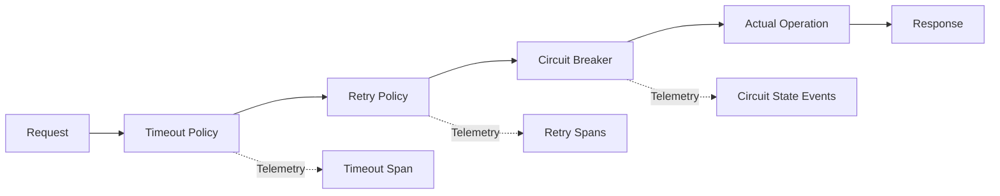

# How to Instrument Polly Resilience Policies with OpenTelemetry in .NET

Author: [nawazdhandala](https://www.github.com/nawazdhandala)

Tags: OpenTelemetry, Polly, .NET, Resilience, Circuit Breaker, Retry

Description: Learn how to instrument Polly resilience policies with OpenTelemetry to gain visibility into retry attempts, circuit breaker states, and fault handling in .NET applications.

Polly is the de facto standard for implementing resilience patterns in .NET applications. It handles retries, circuit breakers, timeouts, and fallbacks elegantly. However, without proper instrumentation, these resilience mechanisms operate as black boxes. You see the final outcome but miss the story of how many retries occurred, when circuit breakers opened, or why a fallback was triggered.

OpenTelemetry instrumentation for Polly transforms these resilience policies into observable components. Every retry becomes a span, every circuit breaker state transition becomes an event, and every timeout becomes a recorded exception. This visibility is critical for understanding system behavior under stress and tuning policy parameters.

## Understanding Polly's Architecture

Polly v8+ uses a pipeline-based architecture where policies wrap operations and handle different failure scenarios. Each policy in the pipeline gets an opportunity to handle results and exceptions. This architecture provides clean extension points for observability.

The key insight is that Polly fires telemetry events at critical points: before and after executing operations, when retrying, when circuit breakers change state, and when timeouts occur. OpenTelemetry hooks into these events to create spans and record metrics.



## Setting Up Polly with OpenTelemetry

Start by installing the required packages including Polly v8 with its telemetry support.

```xml
<PackageReference Include="Microsoft.Extensions.Http.Polly" Version="8.0.0" />
<PackageReference Include="Polly" Version="8.2.0" />
<PackageReference Include="Polly.Core" Version="8.2.0" />
<PackageReference Include="Polly.Extensions" Version="8.2.0" />
<PackageReference Include="OpenTelemetry" Version="1.7.0" />
<PackageReference Include="OpenTelemetry.Exporter.OpenTelemetryProtocol" Version="1.7.0" />
<PackageReference Include="OpenTelemetry.Extensions.Hosting" Version="1.7.0" />
<PackageReference Include="OpenTelemetry.Instrumentation.Http" Version="1.7.0" />
```

Configure OpenTelemetry to listen to Polly's telemetry.

```csharp
using OpenTelemetry.Metrics;
using OpenTelemetry.Resources;
using OpenTelemetry.Trace;
using Polly;

var builder = WebApplication.CreateBuilder(args);

// Configure OpenTelemetry
builder.Services.AddOpenTelemetry()
    .ConfigureResource(resource => resource
        .AddService("payment-service", "1.0.0"))
    .WithTracing(tracing => tracing
        .AddAspNetCoreInstrumentation()
        .AddHttpClientInstrumentation()
        .AddSource("Polly")
        .AddOtlpExporter())
    .WithMetrics(metrics => metrics
        .AddAspNetCoreInstrumentation()
        .AddHttpClientInstrumentation()
        .AddMeter("Polly")
        .AddOtlpExporter());

var app = builder.Build();
```

## Creating Instrumented Resilience Pipelines

Build resilience pipelines with Polly v8's new API, which has built-in telemetry support.

```csharp
using Polly;
using Polly.Retry;
using Polly.CircuitBreaker;
using Polly.Timeout;

namespace PaymentService.Resilience
{
    public static class ResiliencePipelineFactory
    {
        public static ResiliencePipeline<HttpResponseMessage> CreateHttpPipeline()
        {
            return new ResiliencePipelineBuilder<HttpResponseMessage>()
                .AddRetry(new RetryStrategyOptions<HttpResponseMessage>
                {
                    ShouldHandle = new PredicateBuilder<HttpResponseMessage>()
                        .Handle<HttpRequestException>()
                        .HandleResult(response =>
                            (int)response.StatusCode >= 500 ||
                            response.StatusCode == System.Net.HttpStatusCode.RequestTimeout),
                    MaxRetryAttempts = 3,
                    Delay = TimeSpan.FromSeconds(1),
                    BackoffType = DelayBackoffType.Exponential,
                    UseJitter = true,
                    OnRetry = args =>
                    {
                        // This will automatically create telemetry spans
                        Console.WriteLine(
                            $"Retry attempt {args.AttemptNumber} after {args.RetryDelay}");
                        return default;
                    }
                })
                .AddCircuitBreaker(new CircuitBreakerStrategyOptions<HttpResponseMessage>
                {
                    FailureRatio = 0.5,
                    SamplingDuration = TimeSpan.FromSeconds(30),
                    MinimumThroughput = 10,
                    BreakDuration = TimeSpan.FromSeconds(30),
                    ShouldHandle = new PredicateBuilder<HttpResponseMessage>()
                        .Handle<HttpRequestException>()
                        .HandleResult(response => (int)response.StatusCode >= 500),
                    OnOpened = args =>
                    {
                        Console.WriteLine("Circuit breaker opened");
                        return default;
                    },
                    OnClosed = args =>
                    {
                        Console.WriteLine("Circuit breaker closed");
                        return default;
                    },
                    OnHalfOpened = args =>
                    {
                        Console.WriteLine("Circuit breaker half-opened");
                        return default;
                    }
                })
                .AddTimeout(TimeSpan.FromSeconds(10))
                .Build();
        }

        public static ResiliencePipeline CreateDatabasePipeline()
        {
            return new ResiliencePipelineBuilder()
                .AddRetry(new RetryStrategyOptions
                {
                    MaxRetryAttempts = 2,
                    Delay = TimeSpan.FromMilliseconds(100),
                    BackoffType = DelayBackoffType.Constant,
                    ShouldHandle = new PredicateBuilder()
                        .Handle<TimeoutException>()
                        .Handle<System.Data.Common.DbException>(ex =>
                            ex.Message.Contains("deadlock") ||
                            ex.Message.Contains("timeout"))
                })
                .AddTimeout(TimeSpan.FromSeconds(5))
                .Build();
        }
    }
}
```

## Custom Telemetry Enrichment for Polly Events

Create a custom telemetry listener to enrich spans with additional context.

```csharp
using System.Diagnostics;
using System.Diagnostics.Metrics;
using Polly.Telemetry;

namespace PaymentService.Resilience
{
    public class PollyTelemetryEnricher : TelemetryListener
    {
        private readonly ActivitySource _activitySource;
        private readonly Meter _meter;
        private readonly Counter<long> _retryCounter;
        private readonly Counter<long> _circuitBreakerCounter;
        private readonly Histogram<double> _retryDelayHistogram;

        public PollyTelemetryEnricher()
        {
            _activitySource = new ActivitySource("PaymentService.Resilience");
            _meter = new Meter("PaymentService.Resilience", "1.0.0");

            _retryCounter = _meter.CreateCounter<long>(
                "polly_retry_attempts_total",
                description: "Total number of retry attempts");

            _circuitBreakerCounter = _meter.CreateCounter<long>(
                "polly_circuit_breaker_state_changes_total",
                description: "Total number of circuit breaker state changes");

            _retryDelayHistogram = _meter.CreateHistogram<double>(
                "polly_retry_delay_seconds",
                unit: "s",
                description: "Retry delay duration");
        }

        public override void Write<TResult, TArgs>(in TelemetryEventArguments<TResult, TArgs> args)
        {
            var activity = Activity.Current;

            if (activity != null)
            {
                // Add Polly context to the current span
                activity.SetTag("polly.pipeline", args.Source.PipelineName ?? "unnamed");
                activity.SetTag("polly.strategy", args.Source.StrategyName);
                activity.SetTag("polly.event", args.Event.EventName);
            }

            switch (args.Event.EventName)
            {
                case "OnRetry":
                    HandleRetryEvent(args);
                    break;
                case "OnCircuitOpened":
                case "OnCircuitClosed":
                case "OnCircuitHalfOpened":
                    HandleCircuitBreakerEvent(args);
                    break;
                case "OnTimeout":
                    HandleTimeoutEvent(args);
                    break;
            }
        }

        private void HandleRetryEvent<TResult, TArgs>(in TelemetryEventArguments<TResult, TArgs> args)
        {
            if (args.Arguments is RetryArguments retryArgs)
            {
                var tags = new TagList
                {
                    { "pipeline", args.Source.PipelineName ?? "unnamed" },
                    { "attempt", retryArgs.AttemptNumber },
                    { "exception_type", args.Outcome.Exception?.GetType().Name ?? "none" }
                };

                _retryCounter.Add(1, tags);
                _retryDelayHistogram.Record(retryArgs.RetryDelay.TotalSeconds, tags);

                Activity.Current?.AddEvent(new ActivityEvent(
                    "Retry",
                    tags: new ActivityTagsCollection
                    {
                        { "attempt", retryArgs.AttemptNumber },
                        { "delay_ms", retryArgs.RetryDelay.TotalMilliseconds },
                        { "exception", args.Outcome.Exception?.Message }
                    }));
            }
        }

        private void HandleCircuitBreakerEvent<TResult, TArgs>(in TelemetryEventArguments<TResult, TArgs> args)
        {
            var tags = new TagList
            {
                { "pipeline", args.Source.PipelineName ?? "unnamed" },
                { "event", args.Event.EventName }
            };

            _circuitBreakerCounter.Add(1, tags);

            Activity.Current?.AddEvent(new ActivityEvent(
                args.Event.EventName,
                tags: new ActivityTagsCollection
                {
                    { "state", args.Event.EventName.Replace("OnCircuit", "") }
                }));
        }

        private void HandleTimeoutEvent<TResult, TArgs>(in TelemetryEventArguments<TResult, TArgs> args)
        {
            if (args.Arguments is TimeoutArguments timeoutArgs)
            {
                Activity.Current?.AddEvent(new ActivityEvent(
                    "Timeout",
                    tags: new ActivityTagsCollection
                    {
                        { "timeout_ms", timeoutArgs.Timeout.TotalMilliseconds }
                    }));
            }
        }
    }
}
```

Register the telemetry enricher with Polly.

```csharp
builder.Services.AddResiliencePipeline("http-pipeline", builder =>
{
    builder
        .AddRetry(/* options */)
        .AddCircuitBreaker(/* options */)
        .AddTimeout(/* options */)
        .ConfigureTelemetry(telemetry =>
        {
            telemetry.TelemetryListeners.Add(new PollyTelemetryEnricher());
        });
});
```

## Integrating with HttpClient

Use Polly resilience pipelines with HttpClient for automatic fault handling and telemetry.

```csharp
using Microsoft.Extensions.Http.Resilience;

namespace PaymentService.Http
{
    public static class HttpClientConfiguration
    {
        public static IServiceCollection AddResilientHttpClients(this IServiceCollection services)
        {
            // Standard resilience pipeline for external APIs
            services.AddHttpClient("payment-gateway")
                .AddStandardResilienceHandler(options =>
                {
                    // Configure retry
                    options.Retry.MaxRetryAttempts = 3;
                    options.Retry.Delay = TimeSpan.FromSeconds(1);
                    options.Retry.BackoffType = DelayBackoffType.Exponential;
                    options.Retry.UseJitter = true;

                    // Configure circuit breaker
                    options.CircuitBreaker.FailureRatio = 0.5;
                    options.CircuitBreaker.SamplingDuration = TimeSpan.FromSeconds(30);
                    options.CircuitBreaker.MinimumThroughput = 10;
                    options.CircuitBreaker.BreakDuration = TimeSpan.FromSeconds(30);

                    // Configure timeout
                    options.AttemptTimeout.Timeout = TimeSpan.FromSeconds(10);
                    options.TotalRequestTimeout.Timeout = TimeSpan.FromSeconds(30);
                });

            // Custom resilience pipeline for critical services
            services.AddHttpClient("critical-service")
                .AddResilienceHandler("critical-pipeline", builder =>
                {
                    builder
                        .AddRetry(new HttpRetryStrategyOptions
                        {
                            MaxRetryAttempts = 5,
                            Delay = TimeSpan.FromMilliseconds(500),
                            BackoffType = DelayBackoffType.Exponential,
                            UseJitter = true,
                            ShouldHandle = args => args.Outcome switch
                            {
                                { Exception: HttpRequestException } => PredicateResult.True(),
                                { Result.StatusCode: >= System.Net.HttpStatusCode.InternalServerError } => PredicateResult.True(),
                                _ => PredicateResult.False()
                            }
                        })
                        .AddCircuitBreaker(new HttpCircuitBreakerStrategyOptions
                        {
                            FailureRatio = 0.3,
                            SamplingDuration = TimeSpan.FromSeconds(60),
                            MinimumThroughput = 20,
                            BreakDuration = TimeSpan.FromMinutes(1)
                        })
                        .AddTimeout(TimeSpan.FromSeconds(15));
                });

            return services;
        }
    }
}

// Usage in a service
public class PaymentGatewayService
{
    private readonly IHttpClientFactory _httpClientFactory;

    public PaymentGatewayService(IHttpClientFactory httpClientFactory)
    {
        _httpClientFactory = httpClientFactory;
    }

    public async Task<PaymentResult> ProcessPaymentAsync(PaymentRequest request)
    {
        var httpClient = _httpClientFactory.CreateClient("payment-gateway");

        // All resilience policies are automatically applied
        // All telemetry is automatically captured
        var response = await httpClient.PostAsJsonAsync("/api/payments", request);

        response.EnsureSuccessStatusCode();

        return await response.Content.ReadFromJsonAsync<PaymentResult>();
    }
}
```

## Creating Custom Resilience Strategies with Telemetry

Build custom resilience strategies for domain-specific scenarios.

```csharp
using Polly;
using Polly.Telemetry;
using System.Diagnostics;

namespace PaymentService.Resilience
{
    public class RateLimitStrategy : ResilienceStrategy
    {
        private readonly SemaphoreSlim _semaphore;
        private readonly ActivitySource _activitySource;

        public RateLimitStrategy(int maxConcurrency)
        {
            _semaphore = new SemaphoreSlim(maxConcurrency, maxConcurrency);
            _activitySource = new ActivitySource("PaymentService.RateLimit");
        }

        protected override async ValueTask<Outcome<TResult>> ExecuteCore<TResult, TState>(
            Func<ResilienceContext, TState, ValueTask<Outcome<TResult>>> callback,
            ResilienceContext context,
            TState state)
        {
            using var activity = _activitySource.StartActivity("RateLimit");

            activity?.SetTag("rate_limit.max_concurrency", _semaphore.CurrentCount);

            var waitStarted = DateTime.UtcNow;
            await _semaphore.WaitAsync(context.CancellationToken);
            var waitDuration = DateTime.UtcNow - waitStarted;

            activity?.SetTag("rate_limit.wait_time_ms", waitDuration.TotalMilliseconds);

            try
            {
                return await callback(context, state);
            }
            finally
            {
                _semaphore.Release();
                activity?.SetTag("rate_limit.available_slots", _semaphore.CurrentCount);
            }
        }
    }

    // Extension method for easy pipeline integration
    public static class RateLimitExtensions
    {
        public static ResiliencePipelineBuilder AddRateLimit(
            this ResiliencePipelineBuilder builder,
            int maxConcurrency)
        {
            return builder.AddStrategy(
                context => new RateLimitStrategy(maxConcurrency),
                new RateLimitOptions());
        }
    }

    public class RateLimitOptions : ResilienceStrategyOptions
    {
        public RateLimitOptions()
        {
            Name = "RateLimit";
        }
    }
}
```

## Monitoring Circuit Breaker States with Metrics

Create detailed metrics for circuit breaker behavior.

```csharp
using System.Diagnostics.Metrics;
using Polly.CircuitBreaker;

namespace PaymentService.Resilience
{
    public class CircuitBreakerMonitor
    {
        private readonly Meter _meter;
        private readonly ObservableGauge<int> _stateGauge;
        private readonly Counter<long> _stateChanges;
        private readonly Dictionary<string, CircuitState> _circuitStates;

        public CircuitBreakerMonitor()
        {
            _meter = new Meter("PaymentService.CircuitBreaker", "1.0.0");
            _circuitStates = new Dictionary<string, CircuitState>();

            _stateGauge = _meter.CreateObservableGauge(
                "circuit_breaker_state",
                () => GetStateObservations(),
                description: "Current circuit breaker state (0=closed, 1=open, 2=half-open)");

            _stateChanges = _meter.CreateCounter<long>(
                "circuit_breaker_state_changes_total",
                description: "Total number of circuit breaker state changes");
        }

        public void RecordStateChange(string circuitName, CircuitState newState)
        {
            _circuitStates[circuitName] = newState;

            _stateChanges.Add(1, new TagList
            {
                { "circuit", circuitName },
                { "new_state", newState.ToString().ToLowerInvariant() }
            });
        }

        private IEnumerable<Measurement<int>> GetStateObservations()
        {
            foreach (var kvp in _circuitStates)
            {
                var stateValue = kvp.Value switch
                {
                    CircuitState.Closed => 0,
                    CircuitState.Open => 1,
                    CircuitState.HalfOpen => 2,
                    CircuitState.Isolated => 3,
                    _ => -1
                };

                yield return new Measurement<int>(
                    stateValue,
                    new TagList
                    {
                        { "circuit", kvp.Key },
                        { "state", kvp.Value.ToString().ToLowerInvariant() }
                    });
            }
        }
    }
}
```

## Fallback Patterns with Telemetry

Implement fallback strategies that record telemetry when activated.

```csharp
using Polly;
using Polly.Fallback;
using System.Diagnostics;

namespace PaymentService.Resilience
{
    public static class FallbackPipelines
    {
        public static ResiliencePipeline<string> CreateCacheablePipeline(
            ICache cache,
            ActivitySource activitySource)
        {
            return new ResiliencePipelineBuilder<string>()
                .AddFallback(new FallbackStrategyOptions<string>
                {
                    ShouldHandle = new PredicateBuilder<string>()
                        .Handle<HttpRequestException>()
                        .Handle<TimeoutException>(),
                    FallbackAction = async args =>
                    {
                        using var activity = activitySource.StartActivity("Fallback");
                        activity?.SetTag("fallback.reason", "primary_failed");

                        var cacheKey = args.Context.Properties.GetValue(
                            new ResiliencePropertyKey<string>("CacheKey"),
                            "");

                        var cachedValue = await cache.GetAsync<string>(cacheKey);

                        if (cachedValue != null)
                        {
                            activity?.SetTag("fallback.source", "cache");
                            activity?.AddEvent(new ActivityEvent("Cache hit"));
                            return Outcome.FromResult(cachedValue);
                        }

                        activity?.SetTag("fallback.source", "default");
                        activity?.AddEvent(new ActivityEvent("Using default value"));
                        return Outcome.FromResult("default-value");
                    },
                    OnFallback = args =>
                    {
                        Activity.Current?.AddEvent(new ActivityEvent(
                            "Fallback triggered",
                            tags: new ActivityTagsCollection
                            {
                                { "exception", args.Outcome.Exception?.GetType().Name }
                            }));
                        return default;
                    }
                })
                .AddRetry(new RetryStrategyOptions<string>
                {
                    MaxRetryAttempts = 2,
                    Delay = TimeSpan.FromMilliseconds(100)
                })
                .AddTimeout(TimeSpan.FromSeconds(5))
                .Build();
        }
    }
}
```

## Analyzing Resilience Patterns in Production

Query your observability platform to understand resilience pattern effectiveness.

Example queries for understanding retry behavior:

```promql
# Average retry attempts per request
avg(polly_retry_attempts_total) by (pipeline)

# Circuit breaker open percentage
(circuit_breaker_state{state="open"} /
 ignoring(state) group_left circuit_breaker_state) * 100

# P95 retry delay
histogram_quantile(0.95, polly_retry_delay_seconds_bucket)

# Timeout rate
rate(polly_timeout_total[5m])
```

## Best Practices for Production

Configure different resilience policies for different failure modes. A transient network error deserves aggressive retries, while a 404 error should not trigger retries at all. Use Polly's predicate builders to handle each scenario appropriately.

Monitor circuit breaker states closely. If circuits are opening frequently, investigate the root cause rather than just increasing the failure threshold. The circuit breaker is telling you something is wrong.

Be careful with retry policies in distributed systems. Retries multiply load, so a retry storm can cascade through your system. Use exponential backoff with jitter, and consider implementing service-level retry budgets.

Tune timeout values based on actual telemetry data. Start conservative and adjust based on P95 and P99 latency measurements. A timeout that's too short causes unnecessary failures, while a timeout that's too long delays error detection.

Polly with OpenTelemetry transforms resilience from a black box into a transparent, observable system component. The insights gained from this telemetry are essential for tuning policies and understanding application behavior under failure conditions.