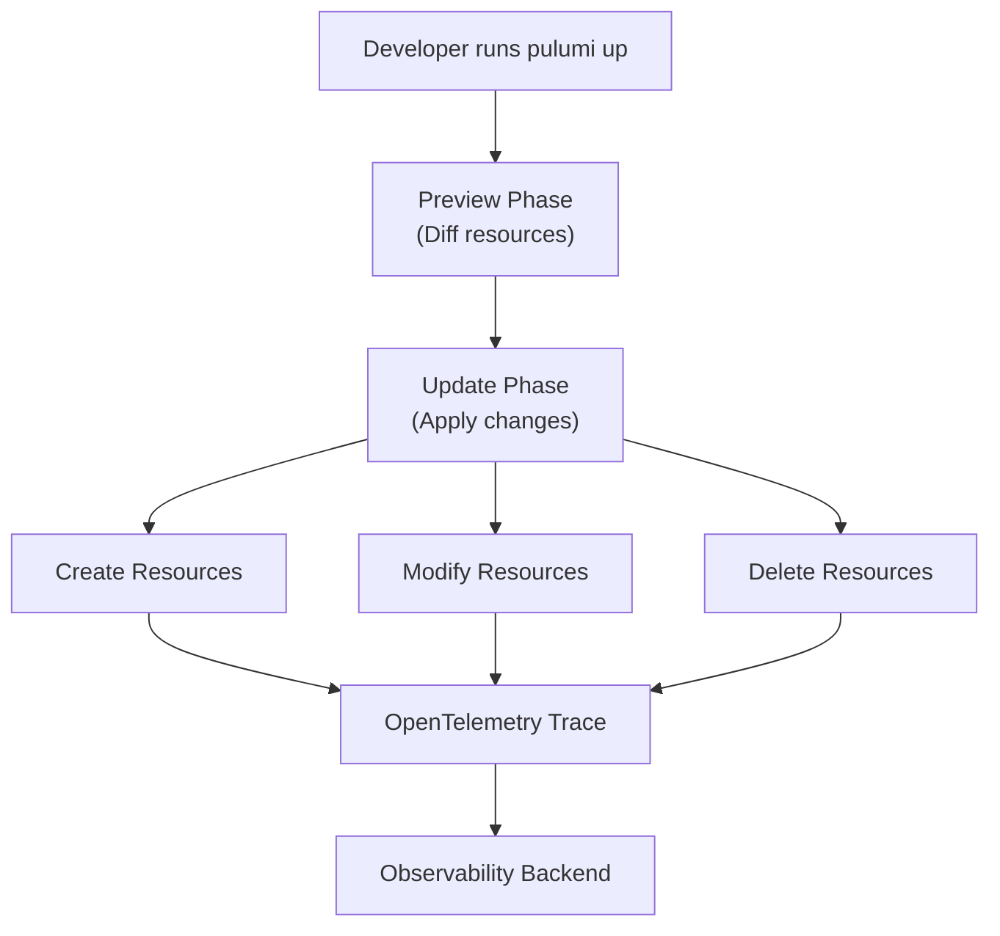

# How to Instrument Pulumi Infrastructure Changes with OpenTelemetry

Author: [nawazdhandala](https://www.github.com/nawazdhandala)

Tags: OpenTelemetry, Pulumi, Infrastructure as Code, Tracing, Observability, DevOps, Cloud

Description: Learn how to instrument Pulumi infrastructure changes with OpenTelemetry to trace and monitor your IaC operations.

---

Infrastructure changes are some of the riskiest operations your team performs. A Pulumi update that modifies a database, rotates credentials, or changes network rules can cause outages if something goes wrong. Yet most teams have almost no observability into their infrastructure provisioning process. They run `pulumi up` and hope for the best, checking the Pulumi console or CLI output when things go sideways.

OpenTelemetry gives you a way to instrument Pulumi programs so you can trace every resource change, measure provisioning times, and correlate infrastructure modifications with application behavior.

---

## Why Instrument Pulumi



Pulumi programs are real code written in TypeScript, Python, Go, or C#. This means you can use the OpenTelemetry SDK directly in your Pulumi program, just like you would in any application. Each resource operation becomes a span, and the entire `pulumi up` execution becomes a trace.

---

## Setting Up OpenTelemetry in a Pulumi Program

Here is how to add OpenTelemetry tracing to a Python-based Pulumi program. The same concepts apply to TypeScript or Go with their respective SDKs.

```python
# __main__.py
# A Pulumi program with OpenTelemetry instrumentation. The tracer wraps
# each resource creation in a span so you can see exactly how long each
# resource takes to provision and which ones fail.

import pulumi
import pulumi_aws as aws
from opentelemetry import trace
from opentelemetry.sdk.trace import TracerProvider
from opentelemetry.sdk.trace.export import BatchSpanProcessor
from opentelemetry.exporter.otlp.proto.grpc.trace_exporter import OTLPSpanExporter
from opentelemetry.sdk.resources import Resource
import os
import time

# Configure the tracer with stack and project metadata.
# This helps you filter traces by stack (dev, staging, prod) later.
resource = Resource.create({
    "service.name": "pulumi-iac",
    "pulumi.project": pulumi.get_project(),
    "pulumi.stack": pulumi.get_stack(),
    "pulumi.organization": os.getenv("PULUMI_ORG", "default"),
})

provider = TracerProvider(resource=resource)
provider.add_span_processor(
    BatchSpanProcessor(OTLPSpanExporter(
        endpoint=os.getenv("OTEL_EXPORTER_OTLP_ENDPOINT", "http://localhost:4317")
    ))
)
trace.set_tracer_provider(provider)
tracer = trace.get_tracer("pulumi.infrastructure")
```

The resource attributes include the Pulumi project and stack names. These are valuable for filtering traces when you have multiple stacks across environments.

---

## Wrapping Resource Creation with Spans

The core pattern is to wrap each Pulumi resource creation in a traced function. This lets you see the full resource graph as a trace:

```python
# traced_resources.py
# Helper functions that wrap Pulumi resource creation with OpenTelemetry
# spans. Each resource gets its own span with attributes describing
# the resource type, name, and any relevant configuration.

from opentelemetry import trace
import pulumi
import pulumi_aws as aws

tracer = trace.get_tracer("pulumi.infrastructure")

def traced_vpc(name, cidr_block, **kwargs):
    """Create a VPC with tracing."""
    with tracer.start_as_current_span(f"create:aws:ec2:Vpc:{name}") as span:
        span.set_attribute("resource.type", "aws:ec2:Vpc")
        span.set_attribute("resource.name", name)
        span.set_attribute("vpc.cidr_block", cidr_block)

        vpc = aws.ec2.Vpc(name, cidr_block=cidr_block, **kwargs)

        # Pulumi outputs are resolved asynchronously, so we register
        # a callback to record the resource ID once it is available
        vpc.id.apply(lambda id: span.set_attribute("resource.id", id))

        return vpc

def traced_subnet(name, vpc_id, cidr_block, availability_zone, **kwargs):
    """Create a subnet with tracing."""
    with tracer.start_as_current_span(f"create:aws:ec2:Subnet:{name}") as span:
        span.set_attribute("resource.type", "aws:ec2:Subnet")
        span.set_attribute("resource.name", name)
        span.set_attribute("subnet.cidr_block", cidr_block)
        span.set_attribute("subnet.az", availability_zone)

        subnet = aws.ec2.Subnet(
            name,
            vpc_id=vpc_id,
            cidr_block=cidr_block,
            availability_zone=availability_zone,
            **kwargs,
        )

        subnet.id.apply(lambda id: span.set_attribute("resource.id", id))
        return subnet

def traced_security_group(name, vpc_id, description, ingress_rules, **kwargs):
    """Create a security group with tracing."""
    with tracer.start_as_current_span(f"create:aws:ec2:SecurityGroup:{name}") as span:
        span.set_attribute("resource.type", "aws:ec2:SecurityGroup")
        span.set_attribute("resource.name", name)
        span.set_attribute("sg.rule_count", len(ingress_rules))

        sg = aws.ec2.SecurityGroup(
            name,
            vpc_id=vpc_id,
            description=description,
            ingress=ingress_rules,
            **kwargs,
        )

        sg.id.apply(lambda id: span.set_attribute("resource.id", id))
        return sg
```

A note about Pulumi outputs: because Pulumi resolves resource IDs asynchronously, we use the `.apply()` method to set span attributes once the ID is known. The span may already be closed by the time the ID resolves, which is a limitation. For more accurate tracking, you might record resource IDs as events rather than attributes.

---

## Full Infrastructure with Tracing

Here is a complete Pulumi program that provisions a VPC with subnets and an RDS instance, all traced:

```python
# __main__.py (continued)
# The main Pulumi program that uses the traced resource helpers.
# The entire provisioning run is wrapped in a root span, with
# individual resource spans nested inside it.

with tracer.start_as_current_span("pulumi-up") as root_span:
    root_span.set_attribute("pulumi.operation", "update")
    root_span.set_attribute("pulumi.project", pulumi.get_project())
    root_span.set_attribute("pulumi.stack", pulumi.get_stack())

    # Create the VPC
    vpc = traced_vpc("main-vpc", cidr_block="10.0.0.0/16",
                     tags={"Name": "main-vpc"})

    # Create subnets in two availability zones
    subnet_a = traced_subnet(
        "subnet-a", vpc_id=vpc.id,
        cidr_block="10.0.1.0/24",
        availability_zone="us-east-1a",
    )

    subnet_b = traced_subnet(
        "subnet-b", vpc_id=vpc.id,
        cidr_block="10.0.2.0/24",
        availability_zone="us-east-1b",
    )

    # Create security group for the database
    db_sg = traced_security_group(
        "db-security-group",
        vpc_id=vpc.id,
        description="Database security group",
        ingress_rules=[{
            "protocol": "tcp",
            "from_port": 5432,
            "to_port": 5432,
            "cidr_blocks": ["10.0.0.0/16"],
        }],
    )

    # Create RDS instance
    with tracer.start_as_current_span("create:aws:rds:Instance:main-db") as span:
        span.set_attribute("resource.type", "aws:rds:Instance")
        span.set_attribute("db.engine", "postgres")
        span.set_attribute("db.instance_class", "db.t3.medium")

        db = aws.rds.Instance(
            "main-db",
            engine="postgres",
            engine_version="15",
            instance_class="db.t3.medium",
            allocated_storage=50,
            db_subnet_group_name=aws.rds.SubnetGroup(
                "db-subnets",
                subnet_ids=[subnet_a.id, subnet_b.id],
            ).name,
            vpc_security_group_ids=[db_sg.id],
            skip_final_snapshot=True,
        )

# Flush all spans before the program exits
provider.shutdown()
```

When you look at the resulting trace, you see a root span for the `pulumi up` operation with child spans for each resource. The trace shows which resources were created in parallel and which had to wait for dependencies.

---

## Using the Pulumi Automation API with Tracing

For programmatic Pulumi workflows, the Automation API gives you even more control over tracing. You can wrap the entire lifecycle in spans:

```python
# automation_traced.py
# Using Pulumi's Automation API with OpenTelemetry tracing.
# This approach is useful for CI/CD pipelines or custom deployment
# tools where you want full trace coverage of the Pulumi lifecycle.

from pulumi import automation as auto
from opentelemetry import trace

tracer = trace.get_tracer("pulumi.automation")

def deploy_stack(stack_name, project_name, program):
    """Deploy a Pulumi stack with full tracing."""
    with tracer.start_as_current_span("pulumi-deploy") as deploy_span:
        deploy_span.set_attribute("pulumi.stack", stack_name)
        deploy_span.set_attribute("pulumi.project", project_name)

        # Create or select the stack
        with tracer.start_as_current_span("stack-init"):
            stack = auto.create_or_select_stack(
                stack_name=stack_name,
                project_name=project_name,
                program=program,
            )

        # Set configuration values
        with tracer.start_as_current_span("stack-config"):
            stack.set_config("aws:region", auto.ConfigValue(value="us-east-1"))

        # Run the preview to see what will change
        with tracer.start_as_current_span("pulumi-preview") as preview_span:
            preview_result = stack.preview()
            preview_span.set_attribute("preview.changes", preview_result.change_summary)

        # Run the update
        with tracer.start_as_current_span("pulumi-update") as update_span:
            result = stack.up(on_output=print)

            update_span.set_attribute("update.summary", str(result.summary))
            update_span.set_attribute("update.resource_changes",
                                      str(result.summary.resource_changes))

            # Record each output as a span event
            for key, val in result.outputs.items():
                update_span.add_event("output", {
                    "output.key": key,
                    "output.value": str(val.value) if not val.secret else "[secret]",
                })

        return result
```

The Automation API approach is particularly useful in CI/CD pipelines where you want to trace the full deployment flow from pipeline trigger to infrastructure change.

---

## Tracking Drift Detection

You can also instrument Pulumi's drift detection to know when your actual infrastructure deviates from your declared state:

```python
# drift_detection.py
# Run pulumi refresh with tracing to detect and record infrastructure drift.
# Drift events are important signals because they indicate manual changes
# that happened outside of your IaC workflow.

from pulumi import automation as auto
from opentelemetry import trace, metrics

tracer = trace.get_tracer("pulumi.drift")
meter = metrics.get_meter("pulumi.drift")

drift_counter = meter.create_counter(
    "pulumi.drift.detected",
    description="Number of drift events detected",
)

def check_drift(stack_name, project_name, program):
    """Run a refresh to detect drift and record it as telemetry."""
    with tracer.start_as_current_span("drift-detection") as span:
        stack = auto.create_or_select_stack(
            stack_name=stack_name,
            project_name=project_name,
            program=program,
        )

        refresh_result = stack.refresh()
        changes = refresh_result.summary.resource_changes or {}

        span.set_attribute("drift.stack", stack_name)
        span.set_attribute("drift.updated_count", changes.get("update", 0))

        # If resources were updated during refresh, that means drift occurred
        drift_count = changes.get("update", 0)
        if drift_count > 0:
            span.add_event("drift_detected", {
                "resources_drifted": drift_count,
            })
            drift_counter.add(drift_count, {"stack": stack_name})

        return refresh_result
```

Drift detection spans help you answer questions like "did someone manually change the database security group before the outage started?" This is especially valuable during incident investigations.

---

## Collecting Infrastructure Metrics

Beyond traces, you can emit metrics about your infrastructure provisioning to track trends over time:

```python
# infra_metrics.py
# Emit metrics about Pulumi operations including provisioning duration,
# resource counts, and error rates. These metrics feed dashboards that
# show infrastructure health trends.

from opentelemetry import metrics

meter = metrics.get_meter("pulumi.operations")

# Track provisioning duration per resource type
provision_duration = meter.create_histogram(
    "pulumi.resource.provision_duration",
    unit="s",
    description="Time to provision a resource",
)

# Count operations by type
operation_counter = meter.create_counter(
    "pulumi.operations.total",
    description="Total Pulumi operations",
)

# Track failures
failure_counter = meter.create_counter(
    "pulumi.operations.failures",
    description="Failed Pulumi operations",
)

def record_operation(resource_type, operation, duration_s, success):
    """Record metrics for a Pulumi resource operation."""
    attrs = {
        "resource.type": resource_type,
        "operation": operation,
    }
    provision_duration.record(duration_s, attrs)
    operation_counter.add(1, attrs)
    if not success:
        failure_counter.add(1, attrs)
```

---

## Summary

Instrumenting Pulumi with OpenTelemetry turns your infrastructure provisioning from a black box into an observable process. You get traces that show every resource creation, modification, and deletion as individual spans. You can track provisioning times, detect drift, and correlate infrastructure changes with application behavior. Since Pulumi programs are written in general-purpose languages, adding OpenTelemetry instrumentation follows the same patterns you would use in any application. The result is full visibility into one of the riskiest parts of your operations workflow.
