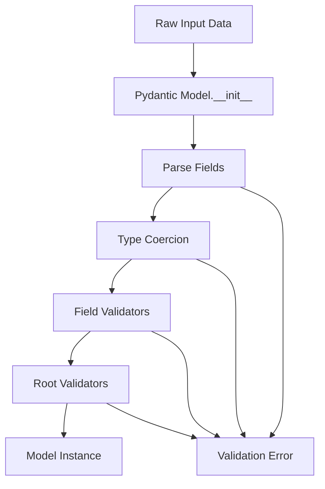

# How to Instrument Pydantic Validation with OpenTelemetry Spans

Author: [nawazdhandala](https://www.github.com/nawazdhandala)

Tags: OpenTelemetry, Pydantic, Python, Validation, Spans, Performance

Description: Learn how to instrument Pydantic model validation with OpenTelemetry spans to gain visibility into validation performance and error patterns.

Pydantic has become the de facto standard for data validation in Python applications, particularly in FastAPI services and data processing pipelines. While Pydantic is generally fast, complex validation rules or large datasets can introduce performance bottlenecks that are hard to diagnose without proper instrumentation.

## Why Instrument Validation?

Data validation happens at critical points in your application: API request handling, message processing, configuration loading, and data transformation pipelines. When validation slows down or fails, it impacts user experience and system throughput. Traditional logging provides error messages, but OpenTelemetry spans give you timing information, validation patterns, and the ability to correlate validation issues with broader system behavior.

Consider an API endpoint that receives complex nested JSON structures. Without instrumentation, you know the entire request took 500ms, but you can't tell if validation consumed 400ms of that time. Instrumenting Pydantic validation exposes these hidden costs and helps you identify which models or validators need optimization.

## Pydantic Validation Lifecycle

Understanding Pydantic's validation process is crucial for effective instrumentation. When you create a model instance, Pydantic goes through several phases: field parsing, type coercion, validator execution, and model finalization. Each phase can have different performance characteristics depending on your model's complexity.



## Basic Model Validation Instrumentation

The simplest approach to instrumenting Pydantic models is wrapping the validation call with a span. This gives you timing and success/failure information for each validation operation.

```python
from pydantic import BaseModel, validator, ValidationError
from opentelemetry import trace
from opentelemetry.sdk.trace import TracerProvider
from opentelemetry.sdk.trace.export import ConsoleSpanExporter, BatchSpanProcessor
from typing import Optional
from datetime import datetime

# Set up tracing
provider = TracerProvider()
provider.add_span_processor(BatchSpanProcessor(ConsoleSpanExporter()))
trace.set_tracer_provider(provider)
tracer = trace.get_tracer(__name__)

class User(BaseModel):
    """Simple user model with basic validation."""
    id: int
    username: str
    email: str
    age: Optional[int] = None
    created_at: datetime

    @validator('email')
    def validate_email(cls, v):
        if '@' not in v:
            raise ValueError('Invalid email address')
        return v

    @validator('age')
    def validate_age(cls, v):
        if v is not None and (v < 0 or v > 150):
            raise ValueError('Age must be between 0 and 150')
        return v

def validate_user_data(data: dict) -> Optional[User]:
    """
    Validates user data with OpenTelemetry instrumentation.
    Creates a span that tracks validation timing and outcomes.
    """
    with tracer.start_as_current_span("validate_user") as span:
        span.set_attribute("model.type", "User")
        span.set_attribute("validation.field_count", len(data))

        try:
            # Perform validation
            user = User(**data)

            # Record successful validation
            span.set_attribute("validation.success", True)
            span.set_attribute("user.id", user.id)
            span.set_attribute("user.username", user.username)

            return user

        except ValidationError as e:
            # Record validation failure with error details
            span.set_attribute("validation.success", False)
            span.set_attribute("validation.error_count", len(e.errors()))

            # Add detailed error information
            for i, error in enumerate(e.errors()):
                span.set_attribute(f"validation.error.{i}.field", ".".join(str(x) for x in error['loc']))
                span.set_attribute(f"validation.error.{i}.type", error['type'])
                span.set_attribute(f"validation.error.{i}.msg", error['msg'])

            # Record exception for error tracking
            span.record_exception(e)
            span.set_status(trace.Status(trace.StatusCode.ERROR, str(e)))

            return None

# Test with valid data
valid_data = {
    "id": 1,
    "username": "john_doe",
    "email": "john@example.com",
    "age": 30,
    "created_at": "2026-02-06T10:00:00Z"
}
user = validate_user_data(valid_data)

# Test with invalid data
invalid_data = {
    "id": 2,
    "username": "jane_doe",
    "email": "invalid-email",  # Missing @
    "age": 200,  # Invalid age
    "created_at": "2026-02-06T10:00:00Z"
}
invalid_user = validate_user_data(invalid_data)
```

## Instrumenting Custom Validators

Custom validators often contain complex business logic. Instrumenting them individually helps identify which validation rules are slow or failing frequently.

```python
from functools import wraps

def traced_validator(validator_name: str):
    """
    Decorator that wraps Pydantic validators with OpenTelemetry spans.
    Tracks execution time and captures validation failures.
    """
    def decorator(func):
        @wraps(func)
        def wrapper(cls, v, values=None, **kwargs):
            with tracer.start_as_current_span(f"validator.{validator_name}") as span:
                span.set_attribute("validator.name", validator_name)
                span.set_attribute("validator.value_type", type(v).__name__)

                try:
                    # Execute the validator
                    result = func(cls, v, values, **kwargs) if values is not None else func(cls, v, **kwargs)

                    span.set_attribute("validator.success", True)
                    return result

                except ValueError as e:
                    # Record validation failure
                    span.set_attribute("validator.success", False)
                    span.set_attribute("validator.error", str(e))
                    span.record_exception(e)
                    raise

        return wrapper
    return decorator

class Product(BaseModel):
    """Product model with instrumented custom validators."""
    id: int
    name: str
    price: float
    stock: int
    category: str

    @validator('price')
    @traced_validator('price_validation')
    def validate_price(cls, v):
        """Ensures price is positive and reasonable."""
        if v <= 0:
            raise ValueError('Price must be positive')
        if v > 1000000:
            raise ValueError('Price exceeds maximum allowed value')
        return round(v, 2)

    @validator('stock')
    @traced_validator('stock_validation')
    def validate_stock(cls, v):
        """Ensures stock is non-negative."""
        if v < 0:
            raise ValueError('Stock cannot be negative')
        return v

    @validator('category')
    @traced_validator('category_validation')
    def validate_category(cls, v):
        """Ensures category is from allowed list."""
        allowed_categories = ['electronics', 'clothing', 'food', 'books']
        if v.lower() not in allowed_categories:
            raise ValueError(f'Category must be one of: {allowed_categories}')
        return v.lower()

def validate_product(data: dict) -> Optional[Product]:
    """Validates product data with detailed validator instrumentation."""
    with tracer.start_as_current_span("validate_product") as span:
        span.set_attribute("model.type", "Product")

        try:
            product = Product(**data)
            span.set_attribute("validation.success", True)
            return product

        except ValidationError as e:
            span.set_attribute("validation.success", False)
            span.record_exception(e)
            return None

# Test product validation
product_data = {
    "id": 100,
    "name": "Laptop",
    "price": 999.99,
    "stock": 50,
    "category": "electronics"
}
product = validate_product(product_data)
```

## Instrumenting Root Validators

Root validators have access to all fields and often perform complex cross-field validation. Instrumenting them provides visibility into these complex validation scenarios.

```python
from pydantic import root_validator

class Order(BaseModel):
    """Order model with instrumented root validator."""
    order_id: int
    items: list[dict]
    subtotal: float
    tax: float
    shipping: float
    total: float
    discount_code: Optional[str] = None

    @root_validator
    def validate_totals(cls, values):
        """
        Validates that totals add up correctly.
        This is a complex validator that benefits from instrumentation.
        """
        with tracer.start_as_current_span("root_validator.validate_totals") as span:
            span.set_attribute("validator.type", "root")

            try:
                subtotal = values.get('subtotal', 0)
                tax = values.get('tax', 0)
                shipping = values.get('shipping', 0)
                total = values.get('total', 0)

                # Calculate expected total
                expected_total = subtotal + tax + shipping

                # Apply discount if present
                discount_code = values.get('discount_code')
                if discount_code:
                    span.set_attribute("discount.applied", True)
                    span.set_attribute("discount.code", discount_code)
                    # Simulate discount lookup (10% off)
                    expected_total *= 0.9

                # Validate total matches
                if abs(total - expected_total) > 0.01:  # Allow for rounding
                    span.set_attribute("validation.error", "total_mismatch")
                    span.set_attribute("expected_total", expected_total)
                    span.set_attribute("actual_total", total)
                    raise ValueError(f'Total mismatch: expected {expected_total:.2f}, got {total:.2f}')

                span.set_attribute("validation.success", True)
                return values

            except Exception as e:
                span.record_exception(e)
                raise

def validate_order(data: dict) -> Optional[Order]:
    """Validates order with root validator instrumentation."""
    with tracer.start_as_current_span("validate_order") as span:
        span.set_attribute("model.type", "Order")
        span.set_attribute("order.item_count", len(data.get('items', [])))

        try:
            order = Order(**data)
            span.set_attribute("validation.success", True)
            return order

        except ValidationError as e:
            span.set_attribute("validation.success", False)
            span.record_exception(e)
            return None

# Test order validation
order_data = {
    "order_id": 1001,
    "items": [{"id": 1, "qty": 2}, {"id": 2, "qty": 1}],
    "subtotal": 100.00,
    "tax": 8.00,
    "shipping": 10.00,
    "total": 106.20,  # With 10% discount: (100 + 8 + 10) * 0.9
    "discount_code": "SAVE10"
}
order = validate_order(order_data)
```

## Batch Validation Instrumentation

When validating large datasets, instrumenting batch operations helps identify performance issues and failure patterns across many records.

```python
from typing import List, Tuple

def validate_batch(data_list: List[dict], model_class: type) -> Tuple[List, List[dict]]:
    """
    Validates a batch of records with detailed performance tracking.
    Returns successful validations and failed records with errors.
    """
    with tracer.start_as_current_span("validate_batch") as span:
        span.set_attribute("batch.size", len(data_list))
        span.set_attribute("model.type", model_class.__name__)

        successful = []
        failed = []

        for i, data in enumerate(data_list):
            # Create a span for each individual validation
            with tracer.start_as_current_span(f"validate_item_{i}") as item_span:
                item_span.set_attribute("batch.index", i)

                try:
                    instance = model_class(**data)
                    successful.append(instance)
                    item_span.set_attribute("validation.success", True)

                except ValidationError as e:
                    failed.append({
                        "index": i,
                        "data": data,
                        "errors": e.errors()
                    })
                    item_span.set_attribute("validation.success", False)
                    item_span.set_attribute("error_count", len(e.errors()))
                    item_span.record_exception(e)

        # Record batch statistics
        span.set_attribute("batch.successful", len(successful))
        span.set_attribute("batch.failed", len(failed))
        span.set_attribute("batch.success_rate", len(successful) / len(data_list) if data_list else 0)

        return successful, failed

# Test batch validation
user_batch = [
    {"id": 1, "username": "user1", "email": "user1@example.com", "created_at": "2026-02-06T10:00:00Z"},
    {"id": 2, "username": "user2", "email": "invalid", "created_at": "2026-02-06T10:00:00Z"},
    {"id": 3, "username": "user3", "email": "user3@example.com", "created_at": "2026-02-06T10:00:00Z"},
    {"id": 4, "username": "user4", "email": "user4@example.com", "age": 200, "created_at": "2026-02-06T10:00:00Z"}
]

successful_users, failed_users = validate_batch(user_batch, User)
print(f"Validated: {len(successful_users)} successful, {len(failed_users)} failed")
```

## Performance Monitoring for Nested Models

Nested Pydantic models can create performance challenges. Instrumenting each level of the hierarchy helps identify where validation time is spent.

```python
class Address(BaseModel):
    """Address model with validation."""
    street: str
    city: str
    state: str
    zip_code: str

    @validator('zip_code')
    def validate_zip(cls, v):
        """Validates US zip code format."""
        with tracer.start_as_current_span("validator.zip_code") as span:
            span.set_attribute("validator.value", v)

            if not v.isdigit() or len(v) != 5:
                span.set_attribute("validation.error", "invalid_format")
                raise ValueError('Zip code must be 5 digits')

            span.set_attribute("validation.success", True)
            return v

class Customer(BaseModel):
    """Customer model with nested address."""
    customer_id: int
    name: str
    email: str
    billing_address: Address
    shipping_address: Optional[Address] = None

    @validator('billing_address', 'shipping_address', pre=False)
    def validate_address(cls, v, field):
        """Instruments address validation within customer validation."""
        if v is None:
            return v

        with tracer.start_as_current_span(f"validate_nested.{field.name}") as span:
            span.set_attribute("nested.model", "Address")
            span.set_attribute("nested.field", field.name)

            # Address is already validated by Pydantic at this point
            # This span just tracks that the nested validation occurred
            span.set_attribute("validation.success", True)

            return v

def validate_customer(data: dict) -> Optional[Customer]:
    """
    Validates customer with nested address models.
    Provides hierarchical span structure showing validation flow.
    """
    with tracer.start_as_current_span("validate_customer") as span:
        span.set_attribute("model.type", "Customer")
        span.set_attribute("nested.has_shipping", "shipping_address" in data)

        try:
            customer = Customer(**data)
            span.set_attribute("validation.success", True)
            return customer

        except ValidationError as e:
            span.set_attribute("validation.success", False)

            # Analyze where validation failed
            for error in e.errors():
                loc = ".".join(str(x) for x in error['loc'])
                if "address" in loc:
                    span.set_attribute("validation.nested_error", True)

            span.record_exception(e)
            return None

# Test nested validation
customer_data = {
    "customer_id": 5001,
    "name": "Jane Smith",
    "email": "jane@example.com",
    "billing_address": {
        "street": "123 Main St",
        "city": "Springfield",
        "state": "IL",
        "zip_code": "62701"
    },
    "shipping_address": {
        "street": "456 Oak Ave",
        "city": "Chicago",
        "state": "IL",
        "zip_code": "60601"
    }
}

customer = validate_customer(customer_data)
```

## Automatic Model Instrumentation

For applications with many Pydantic models, manually instrumenting each one becomes tedious. Here's an approach to automatically instrument all models.

```python
from typing import Type

def instrument_pydantic_model(model_class: Type[BaseModel]) -> Type[BaseModel]:
    """
    Wraps a Pydantic model class to automatically instrument validation.
    This can be applied as a decorator or used to wrap existing models.
    """
    original_init = model_class.__init__

    def instrumented_init(self, **data):
        with tracer.start_as_current_span(f"validate.{model_class.__name__}") as span:
            span.set_attribute("model.name", model_class.__name__)
            span.set_attribute("model.field_count", len(data))

            try:
                original_init(self, **data)
                span.set_attribute("validation.success", True)

            except ValidationError as e:
                span.set_attribute("validation.success", False)
                span.set_attribute("validation.error_count", len(e.errors()))

                for error in e.errors():
                    field = ".".join(str(x) for x in error['loc'])
                    span.add_event(
                        "validation_error",
                        attributes={
                            "field": field,
                            "error_type": error['type'],
                            "message": error['msg']
                        }
                    )

                span.record_exception(e)
                raise

    model_class.__init__ = instrumented_init
    return model_class

# Use as decorator
@instrument_pydantic_model
class InstrumentedProduct(BaseModel):
    """Product model with automatic instrumentation."""
    id: int
    name: str
    price: float

# Or apply to existing models
InstrumentedUser = instrument_pydantic_model(User)

# Test automatic instrumentation
product = InstrumentedProduct(id=1, name="Widget", price=9.99)
```

## Validation Error Analysis

Aggregating validation errors across requests helps identify common data quality issues and problematic validators.

```python
from collections import defaultdict

class ValidationMetrics:
    """
    Collects validation metrics for analysis.
    Tracks error frequencies and validation performance.
    """
    def __init__(self):
        self.error_counts = defaultdict(int)
        self.validation_counts = defaultdict(int)

    def record_validation(self, model_name: str, success: bool, errors: list = None):
        """Records validation attempt with outcome."""
        with tracer.start_as_current_span("record_validation_metrics") as span:
            span.set_attribute("model.name", model_name)
            span.set_attribute("validation.success", success)

            self.validation_counts[model_name] += 1

            if not success and errors:
                for error in errors:
                    field = ".".join(str(x) for x in error['loc'])
                    error_key = f"{model_name}.{field}.{error['type']}"
                    self.error_counts[error_key] += 1

                    span.add_event(
                        "validation_error_recorded",
                        attributes={
                            "error_key": error_key,
                            "count": self.error_counts[error_key]
                        }
                    )

    def get_top_errors(self, limit: int = 10) -> list:
        """Returns most common validation errors."""
        sorted_errors = sorted(
            self.error_counts.items(),
            key=lambda x: x[1],
            reverse=True
        )
        return sorted_errors[:limit]

# Global metrics instance
metrics = ValidationMetrics()

def validate_with_metrics(data: dict, model_class: Type[BaseModel]):
    """Validates data and records metrics."""
    model_name = model_class.__name__

    with tracer.start_as_current_span(f"validate_with_metrics.{model_name}") as span:
        try:
            instance = model_class(**data)
            metrics.record_validation(model_name, True)
            span.set_attribute("validation.success", True)
            return instance

        except ValidationError as e:
            metrics.record_validation(model_name, False, e.errors())
            span.set_attribute("validation.success", False)
            span.record_exception(e)
            return None

# Validate multiple records and collect metrics
test_users = [
    {"id": 1, "username": "user1", "email": "user1@example.com", "created_at": "2026-02-06T10:00:00Z"},
    {"id": 2, "username": "user2", "email": "invalid_email", "created_at": "2026-02-06T10:00:00Z"},
    {"id": 3, "username": "user3", "email": "user3@example.com", "age": -5, "created_at": "2026-02-06T10:00:00Z"}
]

for user_data in test_users:
    validate_with_metrics(user_data, User)

# Analyze top errors
top_errors = metrics.get_top_errors()
print("Top validation errors:", top_errors)
```

Instrumenting Pydantic validation with OpenTelemetry transforms opaque validation operations into observable, measurable processes. By tracking validation timing, error patterns, and performance across different model types, you gain the insights needed to optimize data validation and improve overall application performance. The patterns shown here scale from simple models to complex nested structures and batch processing scenarios, giving you complete visibility into your data validation layer.
