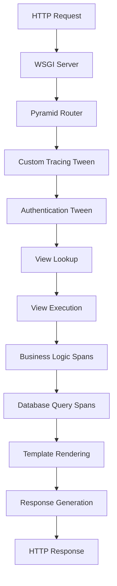

# How to Instrument Pyramid Web Applications with OpenTelemetry

Author: [nawazdhandala](https://www.github.com/nawazdhandala)

Tags: OpenTelemetry, Pyramid, Python, Web Framework, Tracing

Description: Complete guide to instrumenting Pyramid web applications with OpenTelemetry for distributed tracing, request monitoring, and full observability of your Python web services.

Pyramid is a mature, flexible web framework for Python that powers many production applications. When running Pyramid apps at scale, understanding request patterns, database query performance, and error propagation becomes essential. OpenTelemetry provides automatic instrumentation for Pyramid that captures HTTP requests, view execution, and template rendering with minimal setup.

## Why Instrument Pyramid Applications

Pyramid applications typically serve as API backends, content management systems, or full-stack web applications. These systems often:

- Handle complex request routing and view predicates
- Execute database queries through SQLAlchemy or other ORMs
- Render templates with Chameleon, Jinja2, or Mako
- Integrate with authentication and authorization systems
- Call external APIs and microservices

Without instrumentation, debugging performance problems requires extensive logging and guesswork. OpenTelemetry automatically traces the entire request lifecycle, from HTTP reception through view execution to response generation.

## Installation and Setup

```bash
# Install Pyramid and supporting packages
pip install pyramid waitress

# Install OpenTelemetry packages
pip install opentelemetry-api opentelemetry-sdk
pip install opentelemetry-instrumentation-pyramid
pip install opentelemetry-instrumentation-sqlalchemy
pip install opentelemetry-exporter-otlp
```

The `opentelemetry-instrumentation-pyramid` package provides automatic instrumentation that hooks into Pyramid's request processing pipeline.

## Basic Pyramid Application with Tracing

Here's a complete Pyramid application with OpenTelemetry instrumentation:

```python
from pyramid.config import Configurator
from pyramid.response import Response
from pyramid.view import view_config

from opentelemetry import trace
from opentelemetry.sdk.trace import TracerProvider
from opentelemetry.sdk.trace.export import BatchSpanProcessor
from opentelemetry.exporter.otlp.proto.grpc.trace_exporter import OTLPSpanExporter
from opentelemetry.sdk.resources import Resource, SERVICE_NAME
from opentelemetry.instrumentation.pyramid import PyramidInstrumentor

# Configure OpenTelemetry before creating the app
resource = Resource(attributes={
    SERVICE_NAME: "pyramid-web-service"
})

provider = TracerProvider(resource=resource)
otlp_exporter = OTLPSpanExporter(
    endpoint="http://localhost:4317",
    insecure=True
)
processor = BatchSpanProcessor(otlp_exporter)
provider.add_span_processor(processor)
trace.set_tracer_provider(provider)

# Define view functions
@view_config(route_name='home', renderer='json')
def home_view(request):
    return {"message": "Welcome to Pyramid", "version": "1.0.0"}

@view_config(route_name='user_detail', renderer='json')
def user_detail_view(request):
    user_id = request.matchdict['user_id']
    # Simulate user data retrieval
    user_data = {
        "id": user_id,
        "name": f"User {user_id}",
        "email": f"user{user_id}@example.com"
    }
    return user_data

@view_config(route_name='create_user', request_method='POST', renderer='json')
def create_user_view(request):
    # Parse JSON body
    data = request.json_body

    # Simulate user creation
    new_user = {
        "id": "new_123",
        "name": data.get("name"),
        "email": data.get("email"),
        "created": True
    }
    return new_user

def create_app():
    """Create and configure Pyramid application"""
    config = Configurator()

    # Add routes
    config.add_route('home', '/')
    config.add_route('user_detail', '/users/{user_id}')
    config.add_route('create_user', '/users')

    # Scan for view configurations
    config.scan()

    # Create WSGI application
    app = config.make_wsgi_app()

    # Instrument the Pyramid application
    PyramidInstrumentor().instrument_app(app)

    return app

if __name__ == '__main__':
    from waitress import serve
    app = create_app()
    print("Starting Pyramid server on http://0.0.0.0:6543")
    serve(app, host='0.0.0.0', port=6543)
```

Once instrumented, every HTTP request creates a span containing HTTP method, URL path, status code, and response time.

## Tracing View Execution with Custom Spans

Add custom spans to trace business logic within views:

```python
from opentelemetry import trace

tracer = trace.get_tracer(__name__)

@view_config(route_name='process_order', request_method='POST', renderer='json')
def process_order_view(request):
    """Process customer order with detailed tracing"""
    order_data = request.json_body

    # Create a custom span for order validation
    with tracer.start_as_current_span("validate_order") as span:
        span.set_attribute("order.id", order_data.get("order_id"))
        span.set_attribute("order.item_count", len(order_data.get("items", [])))
        span.set_attribute("order.total_amount", order_data.get("total", 0))

        # Validation logic
        if not order_data.get("customer_id"):
            span.set_attribute("validation.error", "missing_customer_id")
            span.set_status(trace.Status(trace.StatusCode.ERROR))
            request.response.status = 400
            return {"error": "Customer ID is required"}

        if not order_data.get("items"):
            span.set_attribute("validation.error", "no_items")
            span.set_status(trace.Status(trace.StatusCode.ERROR))
            request.response.status = 400
            return {"error": "Order must contain items"}

    # Create span for inventory check
    with tracer.start_as_current_span("check_inventory") as span:
        span.set_attribute("inventory.items_checked", len(order_data["items"]))

        # Simulate inventory check
        import time
        time.sleep(0.1)

        available = True
        span.set_attribute("inventory.available", available)

    # Create span for payment processing
    with tracer.start_as_current_span("process_payment") as span:
        span.set_attribute("payment.amount", order_data["total"])
        span.set_attribute("payment.method", order_data.get("payment_method", "card"))

        # Simulate payment processing
        time.sleep(0.2)

        span.set_attribute("payment.status", "approved")
        span.set_attribute("payment.transaction_id", "txn_12345")

    return {
        "status": "success",
        "order_id": order_data["order_id"],
        "message": "Order processed successfully"
    }
```

## Tracing Database Operations

Pyramid applications often use SQLAlchemy. Instrument database queries:

```python
from sqlalchemy import create_engine, Column, Integer, String
from sqlalchemy.ext.declarative import declarative_base
from sqlalchemy.orm import sessionmaker
from opentelemetry.instrumentation.sqlalchemy import SQLAlchemyInstrumentor

# Define database models
Base = declarative_base()

class Product(Base):
    __tablename__ = 'products'

    id = Column(Integer, primary_key=True)
    name = Column(String(100))
    category = Column(String(50))
    price = Column(Integer)

# Create engine and instrument it
engine = create_engine('sqlite:///products.db')
SQLAlchemyInstrumentor().instrument(engine=engine)

Session = sessionmaker(bind=engine)
Base.metadata.create_all(engine)

@view_config(route_name='list_products', renderer='json')
def list_products_view(request):
    """List products with database query tracing"""
    category = request.params.get('category')

    with tracer.start_as_current_span("fetch_products") as span:
        span.set_attribute("db.table", "products")

        if category:
            span.set_attribute("query.filter.category", category)

        # Database query will be automatically traced
        session = Session()
        try:
            if category:
                products = session.query(Product).filter_by(category=category).all()
            else:
                products = session.query(Product).all()

            span.set_attribute("query.result_count", len(products))

            # Convert to dictionaries
            result = [
                {
                    "id": p.id,
                    "name": p.name,
                    "category": p.category,
                    "price": p.price
                }
                for p in products
            ]

            return {"products": result, "count": len(result)}

        finally:
            session.close()

@view_config(route_name='create_product', request_method='POST', renderer='json')
def create_product_view(request):
    """Create new product with database tracing"""
    data = request.json_body

    with tracer.start_as_current_span("create_product") as span:
        span.set_attribute("product.name", data.get("name"))
        span.set_attribute("product.category", data.get("category"))

        session = Session()
        try:
            # Create new product
            product = Product(
                name=data["name"],
                category=data["category"],
                price=data["price"]
            )
            session.add(product)
            session.commit()

            span.set_attribute("product.id", product.id)

            return {
                "id": product.id,
                "name": product.name,
                "category": product.category,
                "price": product.price
            }

        except Exception as e:
            session.rollback()
            span.record_exception(e)
            span.set_status(trace.Status(trace.StatusCode.ERROR))
            request.response.status = 500
            return {"error": str(e)}

        finally:
            session.close()
```

SQLAlchemy instrumentation automatically creates child spans for each database query with SQL text, parameters, and execution time.

## Tracing Template Rendering

Pyramid supports multiple template engines. Trace template rendering:

```python
from pyramid.renderers import render_to_response

@view_config(route_name='product_page', renderer='templates/product.jinja2')
def product_page_view(request):
    """Render product page with template tracing"""
    product_id = request.matchdict['product_id']

    with tracer.start_as_current_span("fetch_product_details") as span:
        span.set_attribute("product.id", product_id)

        # Fetch product from database
        session = Session()
        try:
            product = session.query(Product).filter_by(id=product_id).first()

            if not product:
                span.set_attribute("product.found", False)
                span.set_status(trace.Status(trace.StatusCode.ERROR))
                request.response.status = 404
                return {"error": "Product not found"}

            span.set_attribute("product.found", True)
            span.set_attribute("product.name", product.name)

            # Template rendering happens automatically and can be traced
            return {
                "product": product,
                "page_title": f"{product.name} - Our Store"
            }

        finally:
            session.close()
```

## Implementing Request Tweaks for Tracing

Pyramid's tween system allows middleware-like functionality. Create a tween for custom tracing:

```python
def tracing_tween_factory(handler, registry):
    """Custom tween that adds request attributes to traces"""

    def tracing_tween(request):
        # Get the current span created by auto-instrumentation
        span = trace.get_current_span()

        # Add custom attributes to the span
        span.set_attribute("http.user_agent", request.user_agent or "unknown")
        span.set_attribute("http.remote_addr", request.client_addr or "unknown")

        # Add request-specific attributes
        if hasattr(request, 'authenticated_userid'):
            user_id = request.authenticated_userid
            if user_id:
                span.set_attribute("user.id", str(user_id))

        # Process request
        try:
            response = handler(request)

            # Add response attributes
            span.set_attribute("http.response.content_length",
                             response.content_length or 0)

            return response

        except Exception as e:
            # Record exception in span
            span.record_exception(e)
            span.set_status(trace.Status(trace.StatusCode.ERROR, str(e)))
            raise

    return tracing_tween

# Add tween to configuration
def create_app():
    config = Configurator()
    # Add custom tween over the main handler
    config.add_tween('myapp.tracing_tween_factory')
    # ... rest of configuration
```

## Tracing External API Calls

When Pyramid views call external services, propagate trace context:

```python
import requests
from opentelemetry.propagate import inject

@view_config(route_name='aggregate_data', renderer='json')
def aggregate_data_view(request):
    """Aggregate data from multiple external services"""

    with tracer.start_as_current_span("aggregate_external_data") as span:
        results = {}

        # Call first external service
        with tracer.start_as_current_span("call_weather_service") as weather_span:
            headers = {}
            inject(headers)  # Inject trace context

            response = requests.get(
                "http://weather-service/api/current",
                headers=headers,
                timeout=5
            )

            weather_span.set_attribute("external.service", "weather")
            weather_span.set_attribute("external.status_code", response.status_code)

            results["weather"] = response.json()

        # Call second external service
        with tracer.start_as_current_span("call_news_service") as news_span:
            headers = {}
            inject(headers)

            response = requests.get(
                "http://news-service/api/headlines",
                headers=headers,
                timeout=5
            )

            news_span.set_attribute("external.service", "news")
            news_span.set_attribute("external.status_code", response.status_code)

            results["news"] = response.json()

        span.set_attribute("aggregation.services_called", 2)
        span.set_attribute("aggregation.status", "completed")

        return results
```

## Error Handling and Exception Tracing

Pyramid's exception views can be traced for error monitoring:

```python
from pyramid.view import exception_view_config
from pyramid.httpexceptions import HTTPNotFound, HTTPInternalServerError

@exception_view_config(HTTPNotFound, renderer='json')
def not_found_view(exc, request):
    """Handle 404 errors with tracing"""
    span = trace.get_current_span()
    span.set_attribute("error.type", "not_found")
    span.set_attribute("error.path", request.path)
    span.set_status(trace.Status(trace.StatusCode.ERROR, "Resource not found"))

    request.response.status = 404
    return {"error": "Resource not found", "path": request.path}

@exception_view_config(Exception, renderer='json')
def error_view(exc, request):
    """Handle general exceptions with tracing"""
    span = trace.get_current_span()
    span.record_exception(exc)
    span.set_attribute("error.type", type(exc).__name__)
    span.set_status(trace.Status(trace.StatusCode.ERROR, str(exc)))

    # Log the error
    import logging
    logging.exception("Unhandled exception in view")

    request.response.status = 500
    return {"error": "Internal server error", "message": str(exc)}
```

## Request Flow Visualization

Here's how traces flow through a Pyramid application:



## Tracing Authentication and Authorization

Track authentication and authorization in traces:

```python
from pyramid.security import remember, forget, authenticated_userid
from pyramid.authentication import AuthTktAuthenticationPolicy
from pyramid.authorization import ACLAuthorizationPolicy

@view_config(route_name='login', request_method='POST', renderer='json')
def login_view(request):
    """Login endpoint with authentication tracing"""
    credentials = request.json_body

    with tracer.start_as_current_span("authenticate_user") as span:
        username = credentials.get("username")
        password = credentials.get("password")

        span.set_attribute("auth.username", username)
        span.set_attribute("auth.method", "password")

        # Authenticate user (simplified example)
        if username == "admin" and password == "secret":
            span.set_attribute("auth.result", "success")

            # Create authentication token
            headers = remember(request, username)

            return {
                "status": "success",
                "username": username,
                "token": headers[0][1]  # Simplified
            }
        else:
            span.set_attribute("auth.result", "failure")
            span.set_status(trace.Status(trace.StatusCode.ERROR, "Invalid credentials"))

            request.response.status = 401
            return {"error": "Invalid credentials"}

@view_config(route_name='protected_resource', renderer='json', permission='view')
def protected_view(request):
    """Protected resource with authorization tracing"""
    span = trace.get_current_span()

    user_id = authenticated_userid(request)
    span.set_attribute("user.authenticated", True)
    span.set_attribute("user.id", user_id)

    return {
        "message": "Protected content",
        "user": user_id
    }
```

## Performance Monitoring with Metrics

Combine traces with metrics for comprehensive monitoring:

```python
from opentelemetry import metrics
from opentelemetry.sdk.metrics import MeterProvider
from opentelemetry.sdk.metrics.export import PeriodicExportingMetricReader

# Configure metrics
metric_reader = PeriodicExportingMetricReader(otlp_exporter)
meter_provider = MeterProvider(metric_readers=[metric_reader])
metrics.set_meter_provider(meter_provider)

meter = metrics.get_meter(__name__)

# Create metrics
request_counter = meter.create_counter(
    name="pyramid.requests.total",
    description="Total number of requests",
    unit="requests"
)

request_duration = meter.create_histogram(
    name="pyramid.request.duration",
    description="Request duration",
    unit="ms"
)

def metrics_tween_factory(handler, registry):
    """Tween that records metrics"""

    def metrics_tween(request):
        import time
        start_time = time.time()

        try:
            response = handler(request)

            # Record metrics
            request_counter.add(
                1,
                {
                    "method": request.method,
                    "route": request.matched_route.name if request.matched_route else "unknown",
                    "status": response.status_code
                }
            )

            duration = (time.time() - start_time) * 1000
            request_duration.record(
                duration,
                {
                    "method": request.method,
                    "route": request.matched_route.name if request.matched_route else "unknown"
                }
            )

            return response

        except Exception as e:
            request_counter.add(
                1,
                {
                    "method": request.method,
                    "route": "error",
                    "status": 500
                }
            )
            raise

    return metrics_tween
```

## Production Configuration

Configure Pyramid and OpenTelemetry for production deployment:

```python
import os

def create_production_app():
    """Create production-ready Pyramid app with tracing"""

    # Configure OpenTelemetry with environment variables
    resource = Resource(attributes={
        SERVICE_NAME: os.getenv("SERVICE_NAME", "pyramid-app"),
        "service.version": os.getenv("VERSION", "1.0.0"),
        "deployment.environment": os.getenv("ENVIRONMENT", "production"),
        "host.name": os.getenv("HOSTNAME", "unknown"),
    })

    provider = TracerProvider(resource=resource)

    # Use OTLP endpoint from environment
    otlp_endpoint = os.getenv("OTEL_EXPORTER_OTLP_ENDPOINT", "http://localhost:4317")
    otlp_exporter = OTLPSpanExporter(endpoint=otlp_endpoint, insecure=False)

    processor = BatchSpanProcessor(otlp_exporter)
    provider.add_span_processor(processor)
    trace.set_tracer_provider(provider)

    # Create Pyramid app
    config = Configurator(
        settings={
            'sqlalchemy.url': os.getenv("DATABASE_URL"),
            'pyramid.reload_templates': False,
            'pyramid.debug_authorization': False,
            'pyramid.debug_notfound': False,
        }
    )

    # Add tweens
    config.add_tween('myapp.tracing_tween_factory')
    config.add_tween('myapp.metrics_tween_factory')

    # Configure routes
    config.add_route('home', '/')
    # ... add other routes

    config.scan()

    app = config.make_wsgi_app()
    PyramidInstrumentor().instrument_app(app)

    return app
```

OpenTelemetry's Pyramid instrumentation provides complete visibility into your Python web application. Automatic tracing captures HTTP requests while custom spans trace business logic, database queries, and external service calls. Combined with tweens for request enrichment and metrics for performance monitoring, you have everything needed to run Pyramid applications confidently in production.
