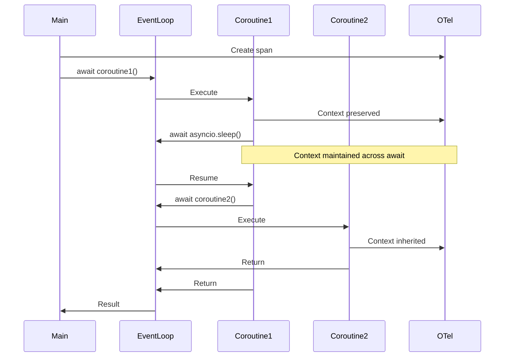
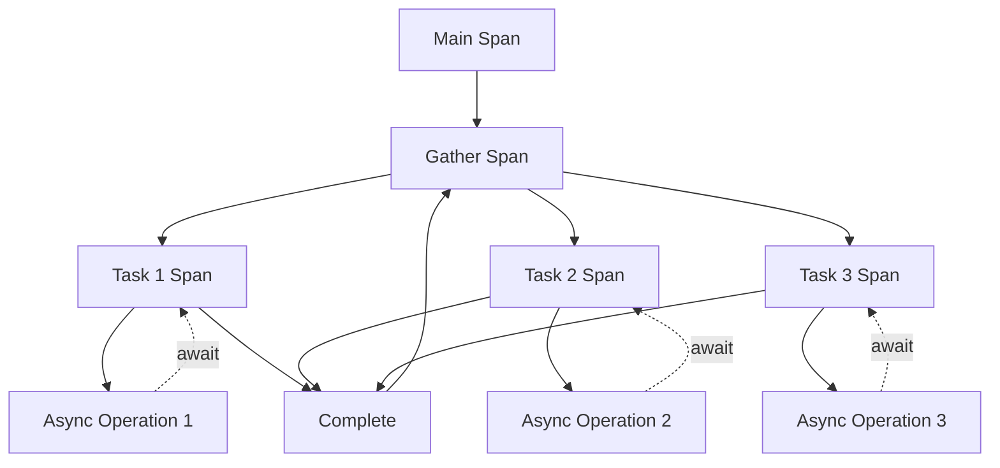

# How to Instrument Python Asyncio Coroutines with OpenTelemetry

Author: [nawazdhandala](https://www.github.com/nawazdhandala)

Tags: OpenTelemetry, Python, asyncio, Coroutines, Async, Context Propagation

Description: Master the techniques for instrumenting Python asyncio coroutines with OpenTelemetry to maintain trace context across async operations and concurrent tasks.

Python's asyncio provides powerful concurrency through coroutines and event loops, but tracing async code presents unique challenges. Context must propagate correctly across await boundaries, through task spawning, and within concurrent operations. Without proper instrumentation, you lose visibility into which operations are slow, how concurrent tasks relate, and where errors occur in your async code.

The core challenge is that asyncio creates many execution contexts as coroutines yield control. OpenTelemetry's context propagation must work seamlessly with asyncio's task-local state to maintain trace relationships across all async operations.

## Understanding Asyncio Context Propagation

Asyncio uses task-local context that automatically propagates across await boundaries. OpenTelemetry leverages this mechanism, but you need to understand when context is preserved and when it's lost.



## Setting Up OpenTelemetry for Asyncio

Install the required packages with async support.

```bash
pip install opentelemetry-api \
    opentelemetry-sdk \
    opentelemetry-exporter-otlp \
    aiohttp \
    asyncio
```

Initialize OpenTelemetry with proper configuration for async applications.

```python
import asyncio
from opentelemetry import trace, context
from opentelemetry.sdk.trace import TracerProvider
from opentelemetry.sdk.trace.export import BatchSpanProcessor
from opentelemetry.exporter.otlp.proto.grpc.trace_exporter import OTLPSpanExporter
from opentelemetry.trace import SpanKind, Status, StatusCode
from typing import Any, List, Coroutine
import time

# Configure tracer provider
provider = TracerProvider()
processor = BatchSpanProcessor(OTLPSpanExporter(
    endpoint="http://localhost:4317",
    insecure=True
))
provider.add_span_processor(processor)
trace.set_tracer_provider(provider)

# Get tracer
tracer = trace.get_tracer(__name__)
```

## Instrumenting Basic Coroutines

Start with simple coroutine instrumentation to understand context flow.

```python
async def fetch_user_data(user_id: str) -> dict:
    """
    Fetch user data asynchronously.
    Creates a span that tracks the async operation.
    """
    with tracer.start_as_current_span("fetch_user_data") as span:
        span.set_attribute("user.id", user_id)

        # Simulate async database query
        await asyncio.sleep(0.5)

        span.set_attribute("user.found", True)
        return {"user_id": user_id, "name": "John Doe"}


async def fetch_user_orders(user_id: str) -> List[dict]:
    """Fetch user orders asynchronously."""
    with tracer.start_as_current_span("fetch_user_orders") as span:
        span.set_attribute("user.id", user_id)

        # Simulate async database query
        await asyncio.sleep(0.3)

        orders = [{"order_id": f"order_{i}"} for i in range(3)]
        span.set_attribute("orders.count", len(orders))
        return orders


async def get_user_profile(user_id: str) -> dict:
    """
    Get complete user profile by fetching user and orders.
    Demonstrates context propagation across awaited coroutines.
    """
    with tracer.start_as_current_span("get_user_profile") as span:
        span.set_attribute("user.id", user_id)

        # Context automatically propagates through await
        user_data = await fetch_user_data(user_id)

        # Context still available for next operation
        orders = await fetch_user_orders(user_id)

        profile = {**user_data, "orders": orders}
        span.set_attribute("profile.complete", True)

        return profile


# Run the coroutine
async def main():
    """Main entry point."""
    with tracer.start_as_current_span("main") as span:
        profile = await get_user_profile("user_123")
        print(f"Profile: {profile}")


if __name__ == "__main__":
    asyncio.run(main())
```

## Handling Concurrent Tasks with asyncio.gather

When running multiple coroutines concurrently, each should maintain its relationship to the parent span.

```python
async def fetch_data_source(source_name: str, delay: float) -> dict:
    """
    Fetch data from a specific source.
    Simulates concurrent data fetching from multiple sources.
    """
    with tracer.start_as_current_span(f"fetch_{source_name}") as span:
        span.set_attribute("source.name", source_name)
        span.set_attribute("source.delay", delay)

        # Simulate async fetch
        await asyncio.sleep(delay)

        span.set_attribute("source.records", 100)
        return {"source": source_name, "records": 100}


async def aggregate_data_parallel():
    """
    Fetch data from multiple sources concurrently.
    All concurrent operations are traced as children of this span.
    """
    with tracer.start_as_current_span("aggregate_data_parallel") as span:
        span.set_attribute("sources.count", 3)

        # Launch all fetches concurrently
        # Context automatically propagates to all tasks
        results = await asyncio.gather(
            fetch_data_source("database", 0.5),
            fetch_data_source("api", 0.8),
            fetch_data_source("cache", 0.2)
        )

        span.set_attribute("sources.fetched", len(results))
        span.add_event("all_sources_fetched")

        return results
```

## Instrumenting asyncio.create_task

When using create_task to spawn background tasks, you need to ensure context propagates correctly.

```python
async def background_operation(operation_id: str, duration: float):
    """
    A background operation that runs independently.
    Context must be explicitly preserved when using create_task.
    """
    with tracer.start_as_current_span("background_operation") as span:
        span.set_attribute("operation.id", operation_id)
        span.set_attribute("operation.duration", duration)

        await asyncio.sleep(duration)

        span.add_event("background_operation_completed")
        return f"Operation {operation_id} completed"


async def spawn_background_tasks():
    """
    Spawn multiple background tasks.
    Demonstrates proper context propagation with create_task.
    """
    with tracer.start_as_current_span("spawn_background_tasks") as span:
        span.set_attribute("tasks.count", 3)

        # Create background tasks
        # Context is automatically captured at task creation time
        tasks = [
            asyncio.create_task(background_operation(f"bg_{i}", 0.5))
            for i in range(3)
        ]

        span.add_event("tasks_created", {"count": len(tasks)})

        # Wait for all tasks to complete
        results = await asyncio.gather(*tasks)

        span.set_attribute("tasks.completed", len(results))
        return results
```

## Context Propagation Across Task Boundaries

Sometimes you need explicit control over context propagation, especially when tasks are created in different contexts.

```python
async def task_with_explicit_context(operation_id: str, ctx: context.Context):
    """
    Task that explicitly receives and uses a context.
    Useful when spawning tasks from different execution contexts.
    """
    # Attach the provided context
    token = context.attach(ctx)

    try:
        with tracer.start_as_current_span(
            "explicit_context_task",
            context=ctx
        ) as span:
            span.set_attribute("operation.id", operation_id)

            await asyncio.sleep(0.3)

            span.add_event("task_completed")
            return f"Completed {operation_id}"

    finally:
        # Always detach context
        context.detach(token)


async def spawn_with_explicit_context():
    """
    Spawn tasks with explicit context passing.
    Demonstrates manual context management for advanced scenarios.
    """
    with tracer.start_as_current_span("spawn_with_context") as span:
        # Capture current context
        current_ctx = context.get_current()

        span.set_attribute("context.captured", True)

        # Create tasks with explicit context
        tasks = [
            asyncio.create_task(
                task_with_explicit_context(f"task_{i}", current_ctx)
            )
            for i in range(3)
        ]

        results = await asyncio.gather(*tasks)

        return results
```

## Instrumenting Async Generators

Async generators present a unique challenge because they yield multiple times, potentially across long time periods.

```python
async def fetch_records_paginated(query: str, page_size: int = 10):
    """
    Async generator that yields records in pages.
    Each yield happens within the same span context.
    """
    with tracer.start_as_current_span("fetch_records_paginated") as span:
        span.set_attribute("query", query)
        span.set_attribute("page.size", page_size)

        total_records = 0

        # Simulate paginated fetching
        for page in range(5):
            with tracer.start_as_current_span(f"fetch_page_{page}") as page_span:
                page_span.set_attribute("page.number", page)

                # Simulate async fetch
                await asyncio.sleep(0.2)

                # Yield records
                records = [{"id": i, "data": f"record_{i}"}
                          for i in range(page * page_size, (page + 1) * page_size)]

                page_span.set_attribute("page.records", len(records))
                total_records += len(records)

                for record in records:
                    yield record

        span.set_attribute("total.records", total_records)


async def consume_async_generator():
    """
    Consume an async generator with proper instrumentation.
    Context is maintained throughout the iteration.
    """
    with tracer.start_as_current_span("consume_generator") as span:
        records_processed = 0

        async for record in fetch_records_paginated("SELECT * FROM users"):
            # Context is maintained across yields
            with tracer.start_as_current_span("process_record") as record_span:
                record_span.set_attribute("record.id", record["id"])

                # Process the record
                await asyncio.sleep(0.05)

                records_processed += 1

        span.set_attribute("records.processed", records_processed)
        return records_processed
```

## Handling Async Context Managers

Async context managers often wrap resources that need cleanup, and their setup and teardown should be traced.

```python
class AsyncDatabaseConnection:
    """
    Async context manager for database connections.
    Demonstrates instrumentation of async enter and exit.
    """

    def __init__(self, connection_string: str):
        self.connection_string = connection_string
        self.connection = None

    async def __aenter__(self):
        """Async context manager entry."""
        with tracer.start_as_current_span("db_connection_open") as span:
            span.set_attribute("db.connection_string", self.connection_string)

            # Simulate async connection
            await asyncio.sleep(0.1)

            self.connection = {"connected": True, "connection_id": "conn_123"}
            span.set_attribute("db.connection_id", self.connection["connection_id"])
            span.add_event("connection_established")

            return self

    async def __aexit__(self, exc_type, exc_val, exc_tb):
        """Async context manager exit."""
        with tracer.start_as_current_span("db_connection_close") as span:
            if self.connection:
                span.set_attribute("db.connection_id", self.connection["connection_id"])

            if exc_type is not None:
                span.set_attribute("error.occurred", True)
                span.set_attribute("error.type", exc_type.__name__)

            # Simulate async cleanup
            await asyncio.sleep(0.05)

            self.connection = None
            span.add_event("connection_closed")

    async def query(self, sql: str) -> List[dict]:
        """Execute a query on this connection."""
        with tracer.start_as_current_span("db_query") as span:
            span.set_attribute("db.statement", sql)

            if not self.connection:
                span.set_attribute("error", "not_connected")
                raise RuntimeError("Not connected to database")

            # Simulate query execution
            await asyncio.sleep(0.3)

            results = [{"id": i} for i in range(5)]
            span.set_attribute("db.rows_returned", len(results))

            return results


async def use_async_context_manager():
    """
    Use async context manager with instrumentation.
    All operations within the context are properly traced.
    """
    with tracer.start_as_current_span("database_operations") as span:
        async with AsyncDatabaseConnection("postgresql://localhost/mydb") as db:
            span.add_event("connection_acquired")

            # Execute queries
            results1 = await db.query("SELECT * FROM users")
            results2 = await db.query("SELECT * FROM orders")

            span.set_attribute("queries.executed", 2)
            span.set_attribute("total.rows", len(results1) + len(results2))

        span.add_event("connection_released")
        return len(results1) + len(results2)
```

## Instrumenting Async HTTP Requests

Async HTTP clients are common in asyncio applications and should be properly instrumented.

```python
import aiohttp
from opentelemetry.semconv.trace import SpanAttributes

async def fetch_api_async(url: str) -> dict:
    """
    Fetch data from an API using aiohttp.
    Demonstrates HTTP client instrumentation.
    """
    with tracer.start_as_current_span(
        "http_request",
        kind=SpanKind.CLIENT
    ) as span:
        span.set_attribute(SpanAttributes.HTTP_METHOD, "GET")
        span.set_attribute(SpanAttributes.HTTP_URL, url)

        try:
            async with aiohttp.ClientSession() as session:
                async with session.get(url) as response:
                    span.set_attribute(SpanAttributes.HTTP_STATUS_CODE, response.status)

                    if response.status >= 400:
                        span.set_status(Status(StatusCode.ERROR, f"HTTP {response.status}"))
                    else:
                        span.set_status(Status(StatusCode.OK))

                    data = await response.json()

                    span.set_attribute("http.response.size", len(str(data)))

                    return data

        except aiohttp.ClientError as e:
            span.record_exception(e)
            span.set_status(Status(StatusCode.ERROR, str(e)))
            raise
        except asyncio.TimeoutError as e:
            span.set_attribute("error.timeout", True)
            span.record_exception(e)
            span.set_status(Status(StatusCode.ERROR, "Request timeout"))
            raise


async def fetch_multiple_apis_concurrently():
    """
    Fetch from multiple APIs concurrently.
    Each request is traced independently but linked to parent.
    """
    with tracer.start_as_current_span("fetch_multiple_apis") as span:
        urls = [
            "https://api.example.com/users",
            "https://api.example.com/products",
            "https://api.example.com/orders"
        ]

        span.set_attribute("apis.count", len(urls))

        # Fetch all URLs concurrently
        tasks = [fetch_api_async(url) for url in urls]

        try:
            results = await asyncio.gather(*tasks, return_exceptions=True)

            # Count successful requests
            successful = sum(1 for r in results if not isinstance(r, Exception))
            span.set_attribute("apis.successful", successful)
            span.set_attribute("apis.failed", len(results) - successful)

            return results

        except Exception as e:
            span.record_exception(e)
            span.set_status(Status(StatusCode.ERROR, str(e)))
            raise
```

## Error Handling in Async Code

Proper error handling is critical in async code, and exceptions should be recorded in spans.

```python
async def risky_async_operation(operation_id: str):
    """
    Operation that might fail.
    Demonstrates error handling with proper span recording.
    """
    with tracer.start_as_current_span("risky_operation") as span:
        span.set_attribute("operation.id", operation_id)

        try:
            # Simulate operation that might fail
            await asyncio.sleep(0.2)

            if operation_id == "fail":
                raise ValueError("Operation failed")

            span.set_status(Status(StatusCode.OK))
            return f"Success: {operation_id}"

        except ValueError as e:
            # Record exception in span
            span.record_exception(e)
            span.set_status(Status(StatusCode.ERROR, str(e)))

            # Re-raise or handle
            raise


async def handle_multiple_failures():
    """
    Handle multiple concurrent operations with some failures.
    Demonstrates gathering with error handling.
    """
    with tracer.start_as_current_span("handle_failures") as span:
        operations = ["op1", "fail", "op3", "fail2"]

        span.set_attribute("operations.count", len(operations))

        # Use return_exceptions to continue despite failures
        results = await asyncio.gather(
            *[risky_async_operation(op) for op in operations],
            return_exceptions=True
        )

        # Count successes and failures
        successes = sum(1 for r in results if not isinstance(r, Exception))
        failures = len(results) - successes

        span.set_attribute("operations.successful", successes)
        span.set_attribute("operations.failed", failures)

        # Record failure events
        for i, result in enumerate(results):
            if isinstance(result, Exception):
                span.add_event(f"operation_{i}_failed", {
                    "operation.id": operations[i],
                    "error.type": type(result).__name__,
                    "error.message": str(result)
                })

        return results
```

## Creating Traced Async Decorators

Build reusable decorators for automatic coroutine instrumentation.

```python
from functools import wraps
from typing import Callable

def traced_async(span_name: str = None):
    """
    Decorator that automatically traces async functions.

    Usage:
        @traced_async("my_operation")
        async def my_function(arg1, arg2):
            return await some_async_work()
    """
    def decorator(func: Callable) -> Callable:
        @wraps(func)
        async def wrapper(*args, **kwargs):
            # Use provided span name or function name
            name = span_name or func.__name__

            with tracer.start_as_current_span(name) as span:
                span.set_attribute("function.name", func.__name__)
                span.set_attribute("function.args_count", len(args))
                span.set_attribute("function.kwargs_count", len(kwargs))

                try:
                    result = await func(*args, **kwargs)
                    span.set_status(Status(StatusCode.OK))
                    return result

                except Exception as e:
                    span.record_exception(e)
                    span.set_status(Status(StatusCode.ERROR, str(e)))
                    raise

        return wrapper
    return decorator


# Use the decorator
@traced_async("fetch_user_profile")
async def get_profile(user_id: str):
    """Automatically traced function."""
    await asyncio.sleep(0.3)
    return {"user_id": user_id, "name": "Jane Doe"}


@traced_async("process_batch")
async def process_items_batch(items: List[str]):
    """Process items in batch with automatic tracing."""
    results = []
    for item in items:
        await asyncio.sleep(0.1)
        results.append(f"processed_{item}")
    return results
```

## Monitoring Asyncio Event Loop

Track event loop metrics to understand async performance.

```python
async def monitor_event_loop():
    """
    Monitor event loop performance.
    Creates spans with event loop metrics.
    """
    with tracer.start_as_current_span("event_loop_metrics") as span:
        loop = asyncio.get_event_loop()

        # Get event loop metrics (Python 3.8+)
        span.set_attribute("loop.is_running", loop.is_running())

        # Count pending tasks
        all_tasks = asyncio.all_tasks(loop)
        span.set_attribute("loop.pending_tasks", len(all_tasks))

        # Record task states
        running_tasks = sum(1 for t in all_tasks if not t.done())
        span.set_attribute("loop.running_tasks", running_tasks)
        span.set_attribute("loop.completed_tasks", len(all_tasks) - running_tasks)

        return {"pending": len(all_tasks), "running": running_tasks}
```

## Visualizing Async Traces

Your instrumented asyncio code creates detailed traces showing concurrent execution.



## Best Practices

Trust asyncio's automatic context propagation for most cases. The combination of asyncio task-local storage and OpenTelemetry's context management works seamlessly with await.

Create spans within coroutines, not around them. The span should be created inside the async function so it executes in the correct async context.

Use asyncio.gather for concurrent operations. This maintains proper parent-child span relationships for all concurrent tasks.

Handle exceptions within spans. Always record exceptions before they leave the span context so they're properly associated with the operation.

Be cautious with background tasks. When using create_task, ensure the context is captured at creation time, not execution time.

Monitor event loop health. Track pending tasks and execution time to identify async bottlenecks.

## Conclusion

Instrumenting Python asyncio coroutines with OpenTelemetry provides comprehensive visibility into async operations and concurrent execution. By leveraging asyncio's built-in context propagation and creating spans at appropriate boundaries, you maintain trace relationships across all async operations. The combination of proper instrumentation and asyncio's concurrent capabilities enables detailed performance analysis and debugging of complex async workflows.
