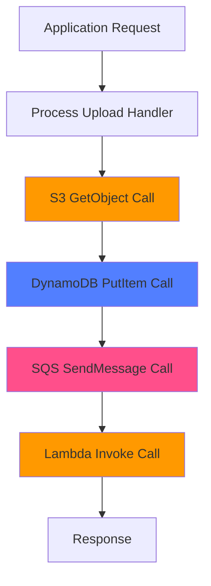

# How to Instrument Python boto3 AWS SDK Calls with OpenTelemetry

Author: [nawazdhandala](https://www.github.com/nawazdhandala)

Tags: OpenTelemetry, Python, boto3, AWS, SDK, Tracing, Cloud

Description: Complete guide to instrumenting boto3 AWS SDK calls with OpenTelemetry to trace S3, DynamoDB, Lambda, and other AWS service interactions in Python applications.

Applications running on AWS interact with dozens of services through boto3, the official AWS SDK for Python. These interactions can become a major source of latency and errors in distributed systems. OpenTelemetry instrumentation for boto3 automatically traces every AWS API call, capturing service names, operations, regions, and performance metrics without code changes.

## Why Instrument boto3 Calls

Modern cloud applications make hundreds or thousands of AWS API calls per minute. Understanding these interactions is critical for:

- Identifying slow S3 uploads or DynamoDB queries
- Tracking Lambda invocation patterns and cold starts
- Debugging AWS service throttling and rate limiting
- Understanding cross-region latency impacts
- Monitoring AWS service costs through usage patterns

Without instrumentation, AWS API calls are black boxes. OpenTelemetry makes them visible as spans in your distributed traces, showing exactly how your application interacts with AWS infrastructure.

## Installation and Setup

```bash
# Install boto3 and OpenTelemetry packages
pip install boto3
pip install opentelemetry-api opentelemetry-sdk
pip install opentelemetry-instrumentation-botocore
pip install opentelemetry-exporter-otlp
```

The `opentelemetry-instrumentation-botocore` package instruments the underlying botocore library that powers boto3. This single instrumentation covers all AWS services.

## Basic boto3 Instrumentation

Here's how to enable automatic tracing for all boto3 calls:

```python
import boto3
from opentelemetry import trace
from opentelemetry.sdk.trace import TracerProvider
from opentelemetry.sdk.trace.export import BatchSpanProcessor
from opentelemetry.exporter.otlp.proto.grpc.trace_exporter import OTLPSpanExporter
from opentelemetry.sdk.resources import Resource, SERVICE_NAME
from opentelemetry.instrumentation.botocore import BotocoreInstrumentor

# Configure OpenTelemetry
resource = Resource(attributes={
    SERVICE_NAME: "aws-integration-service",
    "cloud.provider": "aws",
})

provider = TracerProvider(resource=resource)
otlp_exporter = OTLPSpanExporter(
    endpoint="http://localhost:4317",
    insecure=True
)
processor = BatchSpanProcessor(otlp_exporter)
provider.add_span_processor(processor)
trace.set_tracer_provider(provider)

# Instrument boto3/botocore - this enables tracing for all AWS calls
BotocoreInstrumentor().instrument()

# Now all boto3 calls will be automatically traced
s3_client = boto3.client('s3', region_name='us-east-1')

# This S3 call will create a span with service, operation, and timing details
response = s3_client.list_buckets()
print(f"Found {len(response['Buckets'])} S3 buckets")
```

Once instrumented, every boto3 API call automatically creates a span containing:
- AWS service name (S3, DynamoDB, Lambda, etc.)
- API operation (GetObject, PutItem, Invoke)
- Request parameters (sanitized for security)
- Response metadata and status codes
- Latency and timing information

## Tracing S3 Operations

S3 is one of the most commonly used AWS services. Here's comprehensive S3 tracing:

```python
from opentelemetry import trace
import json

tracer = trace.get_tracer(__name__)
s3_client = boto3.client('s3', region_name='us-west-2')

def upload_user_data(user_id, data):
    """Upload user data to S3 with detailed tracing"""

    # Create a parent span for the overall operation
    with tracer.start_as_current_span("upload_user_data") as span:
        span.set_attribute("user.id", user_id)
        span.set_attribute("data.size_bytes", len(json.dumps(data)))

        bucket_name = "user-data-bucket"
        key = f"users/{user_id}/profile.json"

        # The put_object call will automatically create a child span
        # showing S3 service, operation, bucket, key, and latency
        try:
            response = s3_client.put_object(
                Bucket=bucket_name,
                Key=key,
                Body=json.dumps(data),
                ContentType='application/json',
                ServerSideEncryption='AES256'
            )

            # Add response details to the parent span
            span.set_attribute("s3.etag", response['ETag'])
            span.set_attribute("s3.version_id", response.get('VersionId', 'none'))

            return {"success": True, "key": key}

        except Exception as e:
            span.record_exception(e)
            span.set_status(trace.Status(trace.StatusCode.ERROR))
            raise

def download_and_process_file(bucket, key):
    """Download S3 object and process contents"""

    with tracer.start_as_current_span("download_and_process") as span:
        span.set_attribute("s3.bucket", bucket)
        span.set_attribute("s3.key", key)

        # Get object - automatically traced
        response = s3_client.get_object(Bucket=bucket, Key=key)

        # Read and process
        content = response['Body'].read()
        span.set_attribute("s3.content_length", len(content))
        span.set_attribute("s3.content_type", response['ContentType'])

        # Process the content
        with tracer.start_as_current_span("process_content"):
            processed_data = json.loads(content)
            # Processing logic here
            return processed_data
```

The boto3 instrumentation captures S3-specific details like bucket names, object keys, and storage class, making it easy to identify slow or failing S3 operations.

## Tracing DynamoDB Operations

DynamoDB queries and scans can be performance bottlenecks. OpenTelemetry makes them visible:

```python
dynamodb = boto3.resource('dynamodb', region_name='us-east-1')
table = dynamodb.Table('Users')

def get_user_by_id(user_id):
    """Fetch user from DynamoDB with tracing"""

    with tracer.start_as_current_span("get_user") as span:
        span.set_attribute("dynamodb.table", "Users")
        span.set_attribute("user.id", user_id)

        # GetItem operation - automatically traced with table name and key
        response = table.get_item(Key={'user_id': user_id})

        if 'Item' in response:
            span.set_attribute("user.found", True)
            return response['Item']
        else:
            span.set_attribute("user.found", False)
            return None

def query_users_by_status(status, limit=10):
    """Query users by status with pagination"""

    with tracer.start_as_current_span("query_users_by_status") as span:
        span.set_attribute("dynamodb.table", "Users")
        span.set_attribute("query.status", status)
        span.set_attribute("query.limit", limit)

        # Query operation - traced with index name, filter conditions, and consumed capacity
        response = table.query(
            IndexName='StatusIndex',
            KeyConditionExpression='status = :status',
            ExpressionAttributeValues={':status': status},
            Limit=limit,
            ReturnConsumedCapacity='TOTAL'
        )

        # Capture DynamoDB-specific metrics
        span.set_attribute("dynamodb.items_returned", len(response['Items']))
        span.set_attribute("dynamodb.consumed_capacity",
                          response['ConsumedCapacity']['CapacityUnits'])

        return response['Items']

def batch_write_items(items):
    """Batch write multiple items to DynamoDB"""

    with tracer.start_as_current_span("batch_write_users") as span:
        span.set_attribute("dynamodb.batch_size", len(items))

        # Batch write - traced with item count and write metrics
        with table.batch_writer() as batch:
            for item in items:
                batch.put_item(Item=item)

        span.set_attribute("batch_write.status", "completed")
```

Each DynamoDB operation creates a span showing table names, key conditions, consumed capacity, and returned item counts.

## Tracing Lambda Invocations

When your application invokes Lambda functions, trace the invocations and their outcomes:

```python
lambda_client = boto3.client('lambda', region_name='us-east-1')

def invoke_processing_function(payload):
    """Invoke Lambda function and trace the call"""

    with tracer.start_as_current_span("invoke_lambda_processor") as span:
        function_name = "data-processing-function"
        span.set_attribute("lambda.function_name", function_name)
        span.set_attribute("lambda.invocation_type", "RequestResponse")

        # Lambda invoke - automatically traced with function name and invocation type
        response = lambda_client.invoke(
            FunctionName=function_name,
            InvocationType='RequestResponse',
            Payload=json.dumps(payload)
        )

        # Capture Lambda execution details
        span.set_attribute("lambda.status_code", response['StatusCode'])
        span.set_attribute("lambda.executed_version", response.get('ExecutedVersion', '$LATEST'))

        if 'FunctionError' in response:
            span.set_attribute("lambda.error", response['FunctionError'])
            span.set_status(trace.Status(trace.StatusCode.ERROR))

        # Read and parse response
        response_payload = json.loads(response['Payload'].read())
        return response_payload

async def invoke_async_lambda(payload):
    """Invoke Lambda asynchronously for fire-and-forget operations"""

    with tracer.start_as_current_span("invoke_lambda_async") as span:
        function_name = "async-notification-handler"
        span.set_attribute("lambda.function_name", function_name)
        span.set_attribute("lambda.invocation_type", "Event")

        # Async invocation - traced but doesn't wait for execution
        response = lambda_client.invoke(
            FunctionName=function_name,
            InvocationType='Event',
            Payload=json.dumps(payload)
        )

        span.set_attribute("lambda.request_id", response['ResponseMetadata']['RequestId'])
        return response['StatusCode'] == 202
```

## Tracing SQS Message Operations

Queue operations are critical for async processing. Trace SQS sends and receives:

```python
sqs_client = boto3.client('sqs', region_name='us-east-1')
queue_url = 'https://sqs.us-east-1.amazonaws.com/123456789/my-queue'

def send_message_to_queue(message_body, attributes=None):
    """Send message to SQS with tracing"""

    with tracer.start_as_current_span("sqs_send_message") as span:
        span.set_attribute("sqs.queue_url", queue_url)
        span.set_attribute("message.size", len(message_body))

        # SendMessage - traced with queue URL and message attributes
        response = sqs_client.send_message(
            QueueUrl=queue_url,
            MessageBody=message_body,
            MessageAttributes=attributes or {}
        )

        span.set_attribute("sqs.message_id", response['MessageId'])
        return response['MessageId']

def receive_and_process_messages(max_messages=10):
    """Receive messages from SQS and process them"""

    with tracer.start_as_current_span("sqs_receive_messages") as span:
        span.set_attribute("sqs.queue_url", queue_url)
        span.set_attribute("sqs.max_messages", max_messages)

        # ReceiveMessage - traced with visibility timeout and wait time
        response = sqs_client.receive_message(
            QueueUrl=queue_url,
            MaxNumberOfMessages=max_messages,
            WaitTimeSeconds=5,
            MessageAttributeNames=['All']
        )

        messages = response.get('Messages', [])
        span.set_attribute("sqs.messages_received", len(messages))

        processed_count = 0
        for message in messages:
            # Create a span for each message processing
            with tracer.start_as_current_span("process_sqs_message") as msg_span:
                msg_span.set_attribute("sqs.message_id", message['MessageId'])

                # Process message
                # ... processing logic ...

                # Delete message - also traced
                sqs_client.delete_message(
                    QueueUrl=queue_url,
                    ReceiptHandle=message['ReceiptHandle']
                )
                processed_count += 1

        span.set_attribute("sqs.messages_processed", processed_count)
```

## Tracing Multiple AWS Services

Real applications use multiple AWS services together. Tracing shows the complete flow:

```python
def process_uploaded_file(event):
    """Process file upload event that touches multiple AWS services"""

    with tracer.start_as_current_span("process_file_upload") as span:
        # Extract S3 event details
        bucket = event['Records'][0]['s3']['bucket']['name']
        key = event['Records'][0]['s3']['object']['key']

        span.set_attribute("s3.bucket", bucket)
        span.set_attribute("s3.key", key)

        # Step 1: Download file from S3 (traced)
        s3_client = boto3.client('s3')
        file_obj = s3_client.get_object(Bucket=bucket, Key=key)
        content = file_obj['Body'].read()

        # Step 2: Store metadata in DynamoDB (traced)
        dynamodb = boto3.resource('dynamodb')
        table = dynamodb.Table('FileMetadata')
        table.put_item(Item={
            'file_id': key,
            'bucket': bucket,
            'size': len(content),
            'processed_at': str(trace.get_current_span().context.trace_id)
        })

        # Step 3: Send processing message to SQS (traced)
        sqs_client = boto3.client('sqs')
        queue_url = 'https://sqs.us-east-1.amazonaws.com/123456789/processing-queue'
        sqs_client.send_message(
            QueueUrl=queue_url,
            MessageBody=json.dumps({'file_id': key, 'action': 'process'})
        )

        # Step 4: Invoke Lambda for additional processing (traced)
        lambda_client = boto3.client('lambda')
        lambda_client.invoke(
            FunctionName='file-processor',
            InvocationType='Event',
            Payload=json.dumps({'bucket': bucket, 'key': key})
        )

        span.set_attribute("workflow.steps_completed", 4)
        return {"status": "success"}
```

## AWS Service Call Flow Visualization

Here's how boto3 traces connect AWS service calls:



## Handling AWS Service Errors

AWS services return various error types. Trace them properly:

```python
from botocore.exceptions import ClientError

def robust_s3_operation(bucket, key):
    """Handle AWS errors with proper span status"""

    with tracer.start_as_current_span("robust_s3_op") as span:
        span.set_attribute("s3.bucket", bucket)
        span.set_attribute("s3.key", key)

        try:
            s3_client = boto3.client('s3')
            response = s3_client.get_object(Bucket=bucket, Key=key)
            return response['Body'].read()

        except ClientError as e:
            error_code = e.response['Error']['Code']
            span.set_attribute("aws.error_code", error_code)
            span.record_exception(e)

            if error_code == 'NoSuchKey':
                span.set_status(trace.Status(trace.StatusCode.ERROR, "Object not found"))
            elif error_code == 'AccessDenied':
                span.set_status(trace.Status(trace.StatusCode.ERROR, "Access denied"))
            else:
                span.set_status(trace.Status(trace.StatusCode.ERROR, f"AWS error: {error_code}"))

            raise
```

## Filtering Sensitive Data

AWS API calls may contain sensitive information. Configure attribute filtering:

```python
from opentelemetry.instrumentation.botocore import BotocoreInstrumentor

# Instrument with request/response hook to filter sensitive data
def request_hook(span, service_name, operation_name, api_params):
    """Called before AWS API call - filter sensitive params"""
    # Remove sensitive data from span attributes
    if 'Password' in api_params:
        api_params['Password'] = '***REDACTED***'
    if 'SecretString' in api_params:
        api_params['SecretString'] = '***REDACTED***'

def response_hook(span, service_name, operation_name, result):
    """Called after AWS API call - add custom attributes"""
    span.set_attribute("aws.service", service_name)
    span.set_attribute("aws.operation", operation_name)

# Apply hooks during instrumentation
BotocoreInstrumentor().instrument(
    request_hook=request_hook,
    response_hook=response_hook
)
```

## Performance Impact and Optimization

boto3 instrumentation adds minimal overhead:

- Span creation: ~10-30 microseconds per AWS call
- Attribute capture: ~5-10 microseconds per attribute
- No impact on AWS API latency

For high-volume applications with thousands of AWS calls per second, use sampling:

```python
from opentelemetry.sdk.trace.sampling import ParentBasedTraceIdRatio

# Sample 20% of traces but always sample if parent is sampled
sampler = ParentBasedTraceIdRatio(0.2)
provider = TracerProvider(resource=resource, sampler=sampler)
```

## Production Configuration Best Practices

Configure boto3 instrumentation for production environments:

```python
import os

# Use environment variables for configuration
resource = Resource(attributes={
    SERVICE_NAME: os.getenv("SERVICE_NAME", "aws-integration"),
    "deployment.environment": os.getenv("ENVIRONMENT", "production"),
    "cloud.provider": "aws",
    "cloud.region": os.getenv("AWS_REGION", "us-east-1"),
})

# Configure OTLP endpoint from environment
otlp_endpoint = os.getenv("OTEL_EXPORTER_OTLP_ENDPOINT", "http://localhost:4317")
otlp_exporter = OTLPSpanExporter(endpoint=otlp_endpoint, insecure=True)

# Enable instrumentation once at application startup
BotocoreInstrumentor().instrument()
```

OpenTelemetry's boto3 instrumentation provides complete visibility into AWS service interactions. Every S3 upload, DynamoDB query, Lambda invocation, and SQS message operation becomes a traceable span with detailed metrics. This visibility is essential for debugging cloud applications, optimizing AWS costs, and understanding distributed system behavior across AWS infrastructure.
