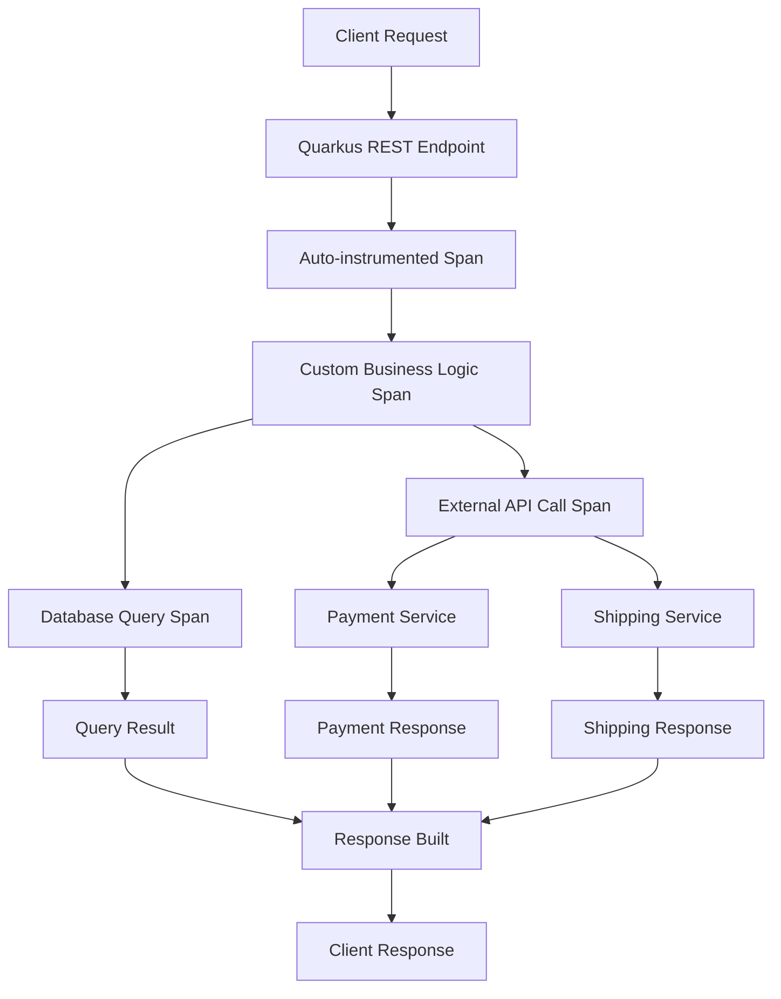

# How to Instrument Quarkus REST Endpoints with OpenTelemetry

Author: [nawazdhandala](https://www.github.com/nawazdhandala)

Tags: OpenTelemetry, Quarkus, REST, Java, Instrumentation, JAX-RS

Description: Complete guide to instrumenting Quarkus REST endpoints with OpenTelemetry for distributed tracing and observability in modern Java applications.

Quarkus has rapidly become a preferred framework for building cloud-native Java applications, offering fast startup times and low memory footprint. When building distributed systems with Quarkus, observability becomes critical. OpenTelemetry provides a vendor-neutral way to collect telemetry data from your REST endpoints, enabling you to track requests across your entire system.

This guide walks through instrumenting Quarkus REST endpoints with OpenTelemetry, from basic setup to advanced custom instrumentation patterns.

## Understanding Quarkus and OpenTelemetry Integration

Quarkus provides first-class support for OpenTelemetry through the `quarkus-opentelemetry` extension. This extension automatically instruments JAX-RS endpoints, JDBC calls, and other framework components without requiring code changes. The integration leverages Quarkus's build-time optimization to minimize runtime overhead.

The instrumentation works by intercepting HTTP requests at the JAX-RS layer and creating spans that represent the execution of each endpoint. These spans capture essential information like HTTP method, path, status code, and timing data.

## Setting Up OpenTelemetry in Quarkus

First, add the OpenTelemetry extension to your Quarkus project. The extension includes auto-instrumentation capabilities and OTLP exporter support.

```xml
<!-- Add to pom.xml -->
<dependency>
    <groupId>io.quarkus</groupId>
    <artifactId>quarkus-opentelemetry</artifactId>
</dependency>
```

Configure the OpenTelemetry exporter in your `application.properties` file. This tells Quarkus where to send trace data.

```properties
# Enable OpenTelemetry
quarkus.otel.enabled=true

# Configure the OTLP exporter endpoint
quarkus.otel.exporter.otlp.endpoint=http://localhost:4317

# Set the service name for your application
quarkus.otel.service.name=quarkus-rest-service

# Configure trace sampling (1.0 = 100% of requests)
quarkus.otel.traces.sampler=always_on
```

## Creating an Instrumented REST Endpoint

Here's a basic REST endpoint that will be automatically instrumented by the Quarkus OpenTelemetry extension.

```java
package com.example.api;

import jakarta.ws.rs.GET;
import jakarta.ws.rs.POST;
import jakarta.ws.rs.Path;
import jakarta.ws.rs.PathParam;
import jakarta.ws.rs.Produces;
import jakarta.ws.rs.Consumes;
import jakarta.ws.rs.core.MediaType;
import jakarta.ws.rs.core.Response;

@Path("/api/users")
public class UserResource {

    // Simple GET endpoint - automatically creates a span
    @GET
    @Produces(MediaType.APPLICATION_JSON)
    public Response listUsers() {
        // Your business logic here
        return Response.ok(userService.getAllUsers()).build();
    }

    // GET with path parameter - span includes the parameter
    @GET
    @Path("/{id}")
    @Produces(MediaType.APPLICATION_JSON)
    public Response getUser(@PathParam("id") Long id) {
        User user = userService.findById(id);
        if (user == null) {
            return Response.status(404).build();
        }
        return Response.ok(user).build();
    }

    // POST endpoint - captures request and response details
    @POST
    @Consumes(MediaType.APPLICATION_JSON)
    @Produces(MediaType.APPLICATION_JSON)
    public Response createUser(User user) {
        User created = userService.create(user);
        return Response.status(201).entity(created).build();
    }
}
```

With just the extension added and configuration in place, these endpoints are automatically instrumented. Each request generates a span with attributes like `http.method`, `http.route`, `http.status_code`, and timing information.

## Adding Custom Spans and Attributes

While automatic instrumentation covers the basics, you often need to add custom spans to track specific operations within your endpoints.

```java
package com.example.api;

import io.opentelemetry.api.trace.Span;
import io.opentelemetry.api.trace.Tracer;
import io.opentelemetry.context.Scope;
import jakarta.inject.Inject;
import jakarta.ws.rs.GET;
import jakarta.ws.rs.Path;
import jakarta.ws.rs.PathParam;

@Path("/api/orders")
public class OrderResource {

    @Inject
    Tracer tracer;

    @Inject
    OrderService orderService;

    @GET
    @Path("/{id}")
    public Order getOrder(@PathParam("id") Long orderId) {
        // Get the current span to add attributes
        Span currentSpan = Span.current();
        currentSpan.setAttribute("order.id", orderId);

        // Create a custom span for the business logic
        Span span = tracer.spanBuilder("process-order-request")
            .startSpan();

        try (Scope scope = span.makeCurrent()) {
            // Add custom attributes to track business metrics
            Order order = orderService.findById(orderId);
            span.setAttribute("order.total", order.getTotal());
            span.setAttribute("order.item_count", order.getItems().size());
            span.setAttribute("order.status", order.getStatus());

            return order;
        } finally {
            span.end();
        }
    }
}
```

## Instrumenting Async REST Endpoints

Quarkus supports reactive programming with Mutiny. OpenTelemetry correctly propagates context through reactive chains.

```java
package com.example.api;

import io.opentelemetry.api.trace.Span;
import io.opentelemetry.api.trace.Tracer;
import io.smallrye.mutiny.Uni;
import jakarta.inject.Inject;
import jakarta.ws.rs.GET;
import jakarta.ws.rs.Path;
import jakarta.ws.rs.PathParam;

@Path("/api/products")
public class ProductResource {

    @Inject
    Tracer tracer;

    @Inject
    ProductService productService;

    // Reactive endpoint that returns Uni
    @GET
    @Path("/{id}")
    public Uni<Product> getProduct(@PathParam("id") Long id) {
        // Add attribute to current span
        Span.current().setAttribute("product.id", id);

        // The span context propagates through the Uni chain
        return productService.findByIdAsync(id)
            .invoke(product -> {
                // This executes when the product is retrieved
                // The span is still active here
                Span.current().setAttribute("product.category", product.getCategory());
                Span.current().setAttribute("product.in_stock", product.isInStock());
            });
    }

    // Multiple async operations with custom spans
    @GET
    @Path("/{id}/details")
    public Uni<ProductDetails> getProductDetails(@PathParam("id") Long id) {
        Span span = tracer.spanBuilder("fetch-product-details").startSpan();

        return productService.findByIdAsync(id)
            .chain(product -> {
                // Chain additional async operations
                span.setAttribute("product.name", product.getName());
                return reviewService.getReviewsAsync(product.getId())
                    .map(reviews -> new ProductDetails(product, reviews));
            })
            .eventually(() -> {
                // Ensure span is ended regardless of success or failure
                span.end();
            });
    }
}
```

## Handling Errors and Exceptions

Proper error handling ensures that exceptions are recorded in traces, making debugging easier.

```java
package com.example.api;

import io.opentelemetry.api.trace.Span;
import io.opentelemetry.api.trace.StatusCode;
import jakarta.ws.rs.GET;
import jakarta.ws.rs.Path;
import jakarta.ws.rs.PathParam;
import jakarta.ws.rs.WebApplicationException;
import jakarta.ws.rs.core.Response;

@Path("/api/inventory")
public class InventoryResource {

    @GET
    @Path("/{sku}")
    public InventoryItem getInventory(@PathParam("sku") String sku) {
        Span span = Span.current();
        span.setAttribute("inventory.sku", sku);

        try {
            InventoryItem item = inventoryService.findBySku(sku);

            if (item == null) {
                // Record the error condition in the span
                span.setStatus(StatusCode.ERROR, "Item not found");
                span.setAttribute("error.type", "NOT_FOUND");
                throw new WebApplicationException(Response.status(404).build());
            }

            if (item.getQuantity() <= 0) {
                // Add warning attribute without failing the span
                span.addEvent("low_stock_warning");
                span.setAttribute("inventory.quantity", 0);
            }

            return item;

        } catch (Exception e) {
            // Record exception details in the span
            span.setStatus(StatusCode.ERROR, "Failed to retrieve inventory");
            span.recordException(e);
            throw e;
        }
    }
}
```

## Distributed Tracing Across Services

When your REST endpoint calls other services, OpenTelemetry automatically propagates trace context through HTTP headers.

```java
package com.example.api;

import io.opentelemetry.api.trace.Span;
import io.opentelemetry.api.trace.Tracer;
import jakarta.inject.Inject;
import jakarta.ws.rs.GET;
import jakarta.ws.rs.Path;
import jakarta.ws.rs.PathParam;
import org.eclipse.microprofile.rest.client.inject.RestClient;

@Path("/api/checkout")
public class CheckoutResource {

    @Inject
    Tracer tracer;

    @Inject
    @RestClient
    PaymentServiceClient paymentClient;

    @Inject
    @RestClient
    ShippingServiceClient shippingClient;

    @GET
    @Path("/{orderId}")
    public CheckoutSummary processCheckout(@PathParam("orderId") Long orderId) {
        Span span = Span.current();
        span.setAttribute("checkout.order_id", orderId);

        // Call to payment service - context propagates automatically
        Span paymentSpan = tracer.spanBuilder("process-payment").startSpan();
        PaymentResult payment;
        try (var scope = paymentSpan.makeCurrent()) {
            payment = paymentClient.processPayment(orderId);
            paymentSpan.setAttribute("payment.amount", payment.getAmount());
            paymentSpan.setAttribute("payment.status", payment.getStatus());
        } finally {
            paymentSpan.end();
        }

        // Call to shipping service - creates child span
        Span shippingSpan = tracer.spanBuilder("calculate-shipping").startSpan();
        ShippingQuote shipping;
        try (var scope = shippingSpan.makeCurrent()) {
            shipping = shippingClient.getShippingQuote(orderId);
            shippingSpan.setAttribute("shipping.method", shipping.getMethod());
            shippingSpan.setAttribute("shipping.cost", shipping.getCost());
        } finally {
            shippingSpan.end();
        }

        return new CheckoutSummary(payment, shipping);
    }
}
```

## Visualizing the Trace Flow

Here's how traces flow through a typical Quarkus REST application with multiple service calls:



## Advanced Configuration Options

Fine-tune OpenTelemetry behavior for production environments with these configuration options.

```properties
# Sampling configuration for high-traffic applications
quarkus.otel.traces.sampler=traceidratio
quarkus.otel.traces.sampler.arg=0.1

# Batch span processor for better performance
quarkus.otel.bsp.schedule.delay=5000
quarkus.otel.bsp.max.queue.size=2048
quarkus.otel.bsp.max.export.batch.size=512

# Resource attributes to identify your service
quarkus.otel.resource.attributes=deployment.environment=production,service.version=1.0.0

# Propagation formats for context propagation
quarkus.otel.propagators=tracecontext,baggage,b3

# Enable/disable specific instrumentations
quarkus.otel.instrument.rest-client=true
quarkus.otel.instrument.resteasy=true
```

## Testing Instrumented Endpoints

Write tests to verify that your instrumentation works correctly.

```java
package com.example.api;

import io.opentelemetry.sdk.testing.junit5.OpenTelemetryExtension;
import io.opentelemetry.sdk.trace.data.SpanData;
import io.quarkus.test.junit.QuarkusTest;
import io.restassured.RestAssured;
import org.junit.jupiter.api.Test;
import org.junit.jupiter.api.extension.RegisterExtension;

import java.util.List;

import static io.restassured.RestAssured.given;
import static org.hamcrest.Matchers.is;

@QuarkusTest
public class UserResourceTest {

    @RegisterExtension
    static final OpenTelemetryExtension otelTesting = OpenTelemetryExtension.create();

    @Test
    public void testGetUserCreatesSpan() {
        // Make request to endpoint
        given()
            .when().get("/api/users/123")
            .then()
            .statusCode(200);

        // Verify span was created with correct attributes
        List<SpanData> spans = otelTesting.getSpans();
        assert spans.size() > 0;

        SpanData span = spans.get(0);
        assert span.getName().equals("GET /api/users/{id}");
        assert span.getAttributes().get("http.method").equals("GET");
    }
}
```

Instrumenting Quarkus REST endpoints with OpenTelemetry gives you deep visibility into your application's behavior. The combination of automatic instrumentation and custom spans provides the right balance between ease of use and flexibility. Start with the auto-instrumentation to get immediate value, then add custom spans and attributes as you identify areas that need more detailed tracking.
