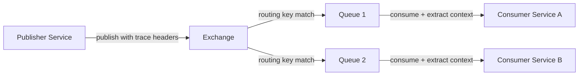

# How to Instrument RabbitMQ with OpenTelemetry for Complete Message Flow Visibility

Author: [nawazdhandala](https://www.github.com/nawazdhandala)

Tags: OpenTelemetry, RabbitMQ, Distributed Tracing, Messaging, Observability, Python, Java

Description: Learn how to instrument RabbitMQ publishers and consumers with OpenTelemetry to trace messages across exchanges, queues, and services for full observability.

---

RabbitMQ handles message routing with a level of flexibility that most message brokers cannot match. Exchanges, bindings, queues, dead letter queues, and routing keys create powerful routing topologies. But that flexibility also makes it harder to follow a message from the moment it is published to the moment it is acknowledged by a consumer.

OpenTelemetry gives you the tooling to trace messages through RabbitMQ, regardless of how complex your routing setup is. By injecting trace context into message headers on the publish side and extracting it on the consume side, you get a continuous trace that connects the publisher, the broker, and every downstream consumer.

## How RabbitMQ Tracing Works with OpenTelemetry

RabbitMQ uses the AMQP protocol, which supports custom headers on messages. OpenTelemetry takes advantage of this by storing trace propagation headers (like `traceparent` and `tracestate`) in the AMQP message properties. When a consumer picks up the message, it reads those headers and continues the trace.



The key difference from HTTP tracing is that RabbitMQ supports fanout patterns. A single published message can be routed to multiple queues and consumed by multiple services. Each consumer creates its own child span linked to the same parent, giving you a fan-out view in your trace visualization.

## Python Instrumentation with Pika

The most popular Python client for RabbitMQ is Pika. OpenTelemetry provides an instrumentation package that wraps Pika's publish and consume methods automatically.

Start by installing the necessary packages:

```bash
# Install OpenTelemetry core and the Pika instrumentation
pip install opentelemetry-api \
    opentelemetry-sdk \
    opentelemetry-exporter-otlp \
    opentelemetry-instrumentation-pika \
    pika
```

Set up the tracer and instrument Pika:

```python
from opentelemetry import trace
from opentelemetry.sdk.trace import TracerProvider
from opentelemetry.sdk.trace.export import BatchSpanProcessor
from opentelemetry.exporter.otlp.proto.grpc.trace_exporter import OTLPSpanExporter
from opentelemetry.instrumentation.pika import PikaInstrumentor

# Initialize the tracer provider
provider = TracerProvider()
provider.add_span_processor(
    BatchSpanProcessor(OTLPSpanExporter(endpoint="http://localhost:4317"))
)
trace.set_tracer_provider(provider)

# Instrument Pika globally
# This patches publish and consume methods to handle trace context
PikaInstrumentor().instrument()
```

Once instrumented, publishing a message will automatically create a PRODUCER span and inject trace context into the AMQP headers:

```python
import pika
import json

# Establish connection to RabbitMQ
connection = pika.BlockingConnection(
    pika.ConnectionParameters(host="localhost")
)
channel = connection.channel()

# Declare exchange and queue
channel.exchange_declare(exchange="order-exchange", exchange_type="topic")
channel.queue_declare(queue="order-processing")
channel.queue_bind(
    queue="order-processing",
    exchange="order-exchange",
    routing_key="orders.created"
)

# Publish a message
# The instrumentation automatically creates a span and injects trace headers
order_data = json.dumps({"order_id": "ORD-1234", "total": 59.99})
channel.basic_publish(
    exchange="order-exchange",
    routing_key="orders.created",
    body=order_data,
    properties=pika.BasicProperties(
        content_type="application/json",
        delivery_mode=2  # persistent message
    )
)

print("Order event published with trace context")
connection.close()
```

The consumer side works the same way. The instrumentation extracts trace context from incoming messages and creates a CONSUMER span:

```python
import pika
import json

# Connection and channel setup
connection = pika.BlockingConnection(
    pika.ConnectionParameters(host="localhost")
)
channel = connection.channel()
channel.queue_declare(queue="order-processing")

def process_order(ch, method, properties, body):
    """
    Callback for consuming messages.
    The PikaInstrumentor wraps this callback to:
    1. Extract trace context from message headers
    2. Create a CONSUMER span as a child of the producer span
    3. Set the span as the current context during processing
    """
    order = json.loads(body)
    print(f"Processing order: {order['order_id']}")

    # Any spans you create here will be children of the consumer span
    tracer = trace.get_tracer(__name__)
    with tracer.start_as_current_span("validate-order") as span:
        span.set_attribute("order.id", order["order_id"])
        span.set_attribute("order.total", order["total"])
        validate_order(order)

    # Acknowledge the message
    ch.basic_ack(delivery_tag=method.delivery_tag)

# Start consuming
channel.basic_consume(
    queue="order-processing",
    on_message_callback=process_order
)
channel.start_consuming()
```

Notice that inside the callback, you can create additional spans using the standard OpenTelemetry API. These spans will automatically become children of the consumer span, which in turn is a child of the producer span. This gives you a trace tree that shows the full journey.

## Java Instrumentation with Spring AMQP

For Java applications using Spring Boot with Spring AMQP, the OpenTelemetry Java agent provides automatic instrumentation. You just need to attach the agent when starting your application:

```bash
# Download the OpenTelemetry Java agent
curl -L -o opentelemetry-javaagent.jar \
    https://github.com/open-telemetry/opentelemetry-java-instrumentation/releases/latest/download/opentelemetry-javaagent.jar

# Run your Spring Boot app with the agent attached
java -javaagent:opentelemetry-javaagent.jar \
    -Dotel.service.name=order-service \
    -Dotel.exporter.otlp.endpoint=http://localhost:4317 \
    -jar order-service.jar
```

The agent automatically instruments Spring AMQP's `RabbitTemplate` for publishing and `@RabbitListener` for consuming. No code changes required.

If you prefer manual instrumentation, you can use the OpenTelemetry API directly with RabbitMQ's Java client:

```java
import com.rabbitmq.client.*;
import io.opentelemetry.api.OpenTelemetry;
import io.opentelemetry.api.trace.*;
import io.opentelemetry.context.Context;
import io.opentelemetry.context.Scope;
import io.opentelemetry.context.propagation.TextMapSetter;

// Custom setter to inject trace context into AMQP headers
TextMapSetter<AMQP.BasicProperties.Builder> headerSetter =
    (carrier, key, value) -> {
        // Store trace headers in AMQP message properties
        Map<String, Object> headers = new HashMap<>(
            carrier.build().getHeaders() != null
                ? carrier.build().getHeaders()
                : Collections.emptyMap()
        );
        headers.put(key, value);
        carrier.headers(headers);
    };

// Publishing with manual trace context injection
Tracer tracer = openTelemetry.getTracer("rabbitmq-publisher");
Span producerSpan = tracer.spanBuilder("order-exchange publish")
    .setSpanKind(SpanKind.PRODUCER)
    .setAttribute("messaging.system", "rabbitmq")
    .setAttribute("messaging.destination.name", "order-exchange")
    .setAttribute("messaging.rabbitmq.destination.routing_key", "orders.created")
    .startSpan();

try (Scope scope = producerSpan.makeCurrent()) {
    AMQP.BasicProperties.Builder propsBuilder = new AMQP.BasicProperties.Builder()
        .contentType("application/json")
        .deliveryMode(2);

    // Inject trace context into message headers
    openTelemetry.getPropagators().getTextMapPropagator()
        .inject(Context.current(), propsBuilder, headerSetter);

    channel.basicPublish(
        "order-exchange",
        "orders.created",
        propsBuilder.build(),
        orderJson.getBytes()
    );
} finally {
    producerSpan.end();
}
```

The manual approach gives you full control over span attributes and error handling. You can set custom attributes, record exceptions, and control exactly when spans start and end.

## Tracing Through Dead Letter Queues

Dead letter queues (DLQs) are a critical part of RabbitMQ architectures. When a message is rejected or expires, RabbitMQ routes it to a DLQ. Tracing through DLQs requires extra attention because the message gets re-published internally by RabbitMQ.

The trace context in the message headers survives the dead-lettering process because RabbitMQ preserves the original message headers. This means your DLQ consumer will still see the original trace context and can create a span linked to the original producer.

```python
# DLQ consumer that preserves trace lineage
def handle_dead_letter(ch, method, properties, body):
    """
    Messages arriving here carry the original trace context.
    The instrumentation extracts it, creating a span linked
    to the original producer span.
    """
    tracer = trace.get_tracer(__name__)
    with tracer.start_as_current_span("process-dead-letter") as span:
        # Add DLQ-specific attributes for debugging
        span.set_attribute("messaging.rabbitmq.queue", "order-processing-dlq")
        span.set_attribute("dead_letter.reason", "rejected")

        # Extract original death information from headers
        if properties.headers and "x-death" in properties.headers:
            death_info = properties.headers["x-death"][0]
            span.set_attribute("dead_letter.original_queue", death_info.get("queue", ""))
            span.set_attribute("dead_letter.count", death_info.get("count", 0))

        # Process or log the failed message
        log_failed_message(body)

    ch.basic_ack(delivery_tag=method.delivery_tag)

# Set up the DLQ consumer
channel.basic_consume(
    queue="order-processing-dlq",
    on_message_callback=handle_dead_letter
)
```

This way, when you look at a trace in your observability backend, you can see the full path: the original publish, the failed consumption attempt, the dead-lettering, and the DLQ processing. That complete picture is invaluable when debugging message processing failures.

## Collector Configuration

Route your RabbitMQ traces through an OpenTelemetry Collector for processing and export:

```yaml
# Collector config for RabbitMQ trace ingestion
receivers:
  otlp:
    protocols:
      grpc:
        endpoint: 0.0.0.0:4317

processors:
  batch:
    # Batch spans for efficient export
    timeout: 5s
    send_batch_size: 512
  attributes:
    actions:
      # Add environment context to all spans
      - key: deployment.environment
        value: production
        action: upsert

exporters:
  otlp:
    endpoint: https://oneuptime.example.com:4317

service:
  pipelines:
    traces:
      receivers: [otlp]
      processors: [batch, attributes]
      exporters: [otlp]
```

## Semantic Conventions for RabbitMQ

OpenTelemetry defines specific semantic attributes for messaging systems. When instrumenting RabbitMQ, make sure your spans include these attributes for consistency:

- `messaging.system`: Set to `rabbitmq`
- `messaging.destination.name`: The exchange name
- `messaging.rabbitmq.destination.routing_key`: The routing key used
- `messaging.operation`: Either `publish` or `receive`
- `messaging.message.payload_size_bytes`: Size of the message body

These attributes make it possible to filter and search traces by exchange, routing key, or operation type. They also enable automated dashboards and alerts based on messaging patterns.

RabbitMQ tracing with OpenTelemetry transforms a complex message routing system into something you can actually observe and debug. Whether you are dealing with simple point-to-point queues or elaborate topic exchange topologies, trace context propagation through AMQP headers gives you the visibility you need to understand how messages flow through your system.
