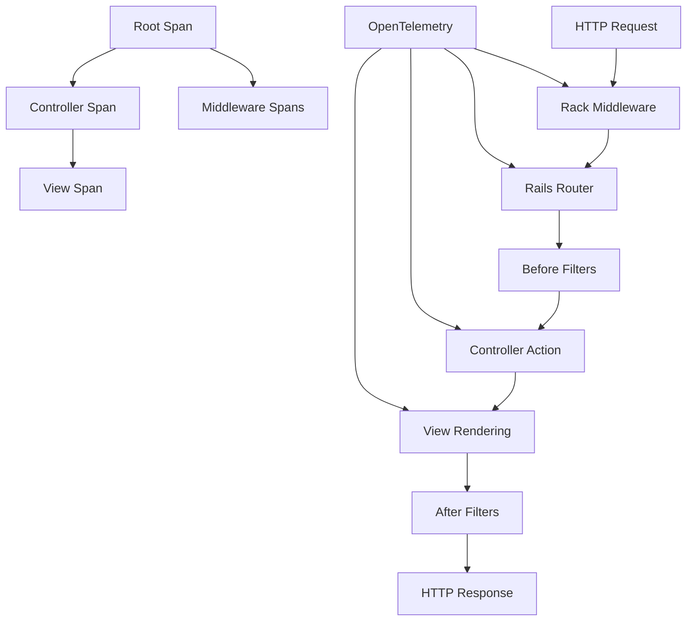

# How to Instrument Rails ActionController Requests with OpenTelemetry

Author: [nawazdhandala](https://www.github.com/nawazdhandala)

Tags: OpenTelemetry, Ruby, Rails, ActionController, HTTP, Tracing

Description: Complete guide to instrumenting Rails ActionController with OpenTelemetry for comprehensive HTTP request tracing, including custom spans, route recognition, and middleware tracking.

ActionController handles every HTTP request in your Rails application. OpenTelemetry instrumentation captures the complete request lifecycle, from routing through middleware to controller actions and view rendering, giving you detailed insights into request processing performance.

## How ActionController Instrumentation Works

OpenTelemetry hooks into Rails' request processing pipeline to create spans at key points:



Each stage creates child spans under a root HTTP request span, revealing exactly where time is spent during request processing.

## Installing ActionController Instrumentation

Add the OpenTelemetry Rails instrumentation gem, which includes ActionController support:

```ruby
# Gemfile
gem 'opentelemetry-sdk'
gem 'opentelemetry-exporter-otlp'
gem 'opentelemetry-instrumentation-rails'
gem 'opentelemetry-instrumentation-action_pack'
```

Install the dependencies:

```bash
bundle install
```

The `opentelemetry-instrumentation-rails` gem provides comprehensive Rails instrumentation, including ActionController, ActionView, and ActiveSupport.

## Basic Configuration

Configure Rails instrumentation in your initializer with default settings:

```ruby
# config/initializers/opentelemetry.rb

require 'opentelemetry/sdk'
require 'opentelemetry/exporter/otlp'
require 'opentelemetry/instrumentation/rails'

OpenTelemetry::SDK.configure do |c|
  c.service_name = 'rails-app'

  # Enable Rails instrumentation (includes ActionController)
  c.use 'OpenTelemetry::Instrumentation::Rails'
end
```

This configuration automatically creates spans for every controller action, capturing HTTP method, path, status code, and execution time.

## Enabling Route Recognition

Route recognition adds the matched route pattern to spans, making it easier to group requests by endpoint rather than specific URLs:

```ruby
# config/initializers/opentelemetry.rb

require 'opentelemetry/sdk'
require 'opentelemetry/exporter/otlp'
require 'opentelemetry/instrumentation/rails'

OpenTelemetry::SDK.configure do |c|
  c.service_name = 'rails-app'

  c.use 'OpenTelemetry::Instrumentation::Rails', {
    # Enable route pattern recognition
    enable_recognize_route: true
  }
end
```

With route recognition enabled, requests to `/users/123` and `/users/456` both get tagged with the route pattern `/users/:id`, allowing you to analyze performance across all requests to that endpoint.

## Comprehensive Controller Configuration

Configure detailed controller instrumentation with custom options:

```ruby
# config/initializers/opentelemetry.rb

require 'opentelemetry/sdk'
require 'opentelemetry/exporter/otlp'
require 'opentelemetry/instrumentation/rails'
require 'opentelemetry/instrumentation/action_pack'

OpenTelemetry::SDK.configure do |c|
  c.service_name = 'rails-app'

  c.use 'OpenTelemetry::Instrumentation::Rails', {
    # Enable route pattern in span names
    enable_recognize_route: true,

    # Include middleware execution in traces
    enable_middleware: true,

    # Exclude specific paths from tracing (health checks, assets)
    excluded_paths: ['/health', '/assets/*']
  }

  # Additional ActionPack instrumentation for view rendering
  c.use 'OpenTelemetry::Instrumentation::ActionPack'

  c.resource = OpenTelemetry::SDK::Resources::Resource.create({
    'service.name' => 'rails-app',
    'http.scheme' => 'https'
  })
end
```

This configuration captures controller actions, middleware execution, and view rendering while excluding noise from health checks and static asset requests.

## Understanding HTTP Span Attributes

ActionController instrumentation adds rich HTTP attributes to every request span:

```ruby
# Example span attributes for a controller request:
{
  'http.method' => 'GET',
  'http.route' => '/users/:id',
  'http.target' => '/users/123',
  'http.url' => 'https://example.com/users/123',
  'http.scheme' => 'https',
  'http.host' => 'example.com',
  'http.status_code' => 200,
  'http.user_agent' => 'Mozilla/5.0...',

  # Rails-specific attributes
  'rails.controller' => 'UsersController',
  'rails.action' => 'show',
  'rails.format' => 'html',

  # Request identification
  'http.request_id' => '550e8400-e29b-41d4-a716-446655440000'
}
```

These attributes enable powerful filtering in your observability platform. Search for slow requests to specific controllers, analyze error rates by action, or correlate frontend performance with backend request processing.

## Adding Custom Attributes to Controller Spans

Enrich controller spans with business context by adding custom attributes:

```ruby
# app/controllers/application_controller.rb
class ApplicationController < ActionController::Base
  before_action :add_otel_attributes

  private

  def add_otel_attributes
    # Get the current span
    span = OpenTelemetry::Trace.current_span
    return unless span.recording?

    # Add user information if authenticated
    if current_user
      span.set_attribute('user.id', current_user.id)
      span.set_attribute('user.role', current_user.role)
      span.set_attribute('user.plan', current_user.subscription_plan)
    end

    # Add request metadata
    span.set_attribute('request.ip', request.remote_ip)
    span.set_attribute('request.format', request.format.to_s)

    # Add tenant/organization context if multi-tenant
    if current_organization
      span.set_attribute('organization.id', current_organization.id)
      span.set_attribute('organization.name', current_organization.name)
    end
  end
end
```

Now every controller span includes user and organization context, making it easy to filter traces by customer, identify performance issues affecting specific user segments, or track usage by subscription tier.

## Creating Custom Spans in Controller Actions

Add custom spans to measure specific operations within controller actions:

```ruby
# app/controllers/reports_controller.rb
class ReportsController < ApplicationController
  def generate
    tracer = OpenTelemetry.tracer_provider.tracer('app')

    # Create a custom span for report generation
    tracer.in_span('report.generate', attributes: {
      'report.type' => params[:type],
      'report.format' => params[:format]
    }) do |span|
      # Fetch data (creates child database spans)
      data = fetch_report_data
      span.set_attribute('report.rows', data.size)

      # Process data (custom span)
      tracer.in_span('report.process') do
        @report = process_report_data(data)
      end

      # Render report (custom span)
      tracer.in_span('report.render', attributes: {
        'report.renderer' => 'pdf'
      }) do
        render_pdf(@report)
      end

      span.set_attribute('report.size_bytes', @report.size)
    end
  end

  private

  def fetch_report_data
    # Database queries automatically create spans
    Report.where(created_at: date_range).includes(:items)
  end

  def process_report_data(data)
    # Complex processing logic
    data.group_by(&:category).transform_values { |items| items.sum(&:amount) }
  end

  def render_pdf(report)
    # PDF generation logic
    ReportPdf.new(report).render
  end
end
```

The trace shows a clear hierarchy: the controller action span contains the report generation span, which contains spans for data fetching, processing, and rendering. This granularity reveals which stage takes the most time.

## Tracing Before and After Filters

Rails filters run before and after controller actions. Track their performance with custom instrumentation:

```ruby
# app/controllers/application_controller.rb
class ApplicationController < ActionController::Base
  around_action :trace_around_action

  private

  def trace_around_action
    tracer = OpenTelemetry.tracer_provider.tracer('app')

    # Create a span for the entire action including filters
    tracer.in_span("#{controller_name}##{action_name}") do |span|
      span.set_attribute('controller.name', controller_name)
      span.set_attribute('action.name', action_name)

      yield
    end
  end
end

# app/controllers/users_controller.rb
class UsersController < ApplicationController
  before_action :authenticate_user!, :load_user
  after_action :log_access

  def show
    # Main action logic
    @posts = @user.posts.recent
  end

  private

  def authenticate_user!
    tracer = OpenTelemetry.tracer_provider.tracer('app')

    tracer.in_span('authentication.verify') do |span|
      # Authentication logic
      token = request.headers['Authorization']
      @current_user = User.find_by_auth_token(token)

      span.set_attribute('auth.success', @current_user.present?)

      unless @current_user
        span.add_event('authentication.failed')
        head :unauthorized
      end
    end
  end

  def load_user
    tracer = OpenTelemetry.tracer_provider.tracer('app')

    tracer.in_span('user.load') do |span|
      @user = User.find(params[:id])
      span.set_attribute('user.id', @user.id)
    end
  end

  def log_access
    tracer = OpenTelemetry.tracer_provider.tracer('app')

    tracer.in_span('access.log') do
      AccessLog.create!(
        user_id: @current_user.id,
        resource_id: @user.id,
        action: action_name
      )
    end
  end
end
```

The trace shows before filters, the action itself, and after filters as distinct spans, revealing if authentication or logging takes significant time.

## Tracking API Version Information

For versioned APIs, include version information in traces:

```ruby
# app/controllers/api/base_controller.rb
module Api
  class BaseController < ApplicationController
    before_action :set_api_version_attribute

    private

    def set_api_version_attribute
      span = OpenTelemetry::Trace.current_span
      return unless span.recording?

      # Extract API version from route or header
      api_version = request.headers['API-Version'] || 'v1'

      span.set_attribute('api.version', api_version)
      span.set_attribute('api.endpoint', "#{api_version}/#{controller_name}/#{action_name}")
    end
  end
end

# app/controllers/api/v1/users_controller.rb
module Api
  module V1
    class UsersController < Api::BaseController
      def index
        @users = User.all
        render json: @users
      end
    end
  end
end
```

Traces include the API version, making it easy to compare performance across different API versions or track adoption of new endpoints.

## Instrumenting Error Handling

Capture errors and exceptions with detailed context:

```ruby
# app/controllers/application_controller.rb
class ApplicationController < ActionController::Base
  rescue_from StandardError, with: :handle_error

  private

  def handle_error(exception)
    span = OpenTelemetry::Trace.current_span

    if span.recording?
      # Record exception in span
      span.record_exception(exception)
      span.status = OpenTelemetry::Trace::Status.error(exception.message)

      # Add error details as attributes
      span.set_attribute('error.type', exception.class.name)
      span.set_attribute('error.message', exception.message)

      # Add user context to error
      if current_user
        span.set_attribute('error.user_id', current_user.id)
      end
    end

    # Render error response
    render json: { error: exception.message }, status: :internal_server_error
  end
end
```

When exceptions occur, the span captures the error type, message, and context, making it easy to correlate errors with specific users, requests, or system states.

## Measuring Response Size

Track response payload size to identify large responses that might affect performance:

```ruby
# app/controllers/application_controller.rb
class ApplicationController < ActionController::Base
  after_action :record_response_size

  private

  def record_response_size
    span = OpenTelemetry::Trace.current_span
    return unless span.recording?

    # Record response size if available
    if response.body.present?
      size = response.body.bytesize
      span.set_attribute('http.response.body.size', size)

      # Add warning event for large responses
      if size > 1_000_000 # 1 MB
        span.add_event('large_response', attributes: {
          'response.size_mb' => size / 1_000_000.0
        })
      end
    end

    span.set_attribute('http.status_code', response.status)
  end
end
```

This tracks response size for every request, helping identify endpoints that return excessive data.

## Testing Controller Instrumentation

Verify controller instrumentation in your test suite:

```ruby
# spec/requests/users_spec.rb
require 'rails_helper'

RSpec.describe 'Users API', type: :request do
  let(:exporter) { OpenTelemetry::SDK::Trace::Export::InMemorySpanExporter.new }
  let(:span_processor) { OpenTelemetry::SDK::Trace::Export::SimpleSpanProcessor.new(exporter) }

  before do
    OpenTelemetry.tracer_provider.add_span_processor(span_processor)
  end

  after do
    exporter.reset
  end

  it 'creates spans for controller actions' do
    get '/users'

    spans = exporter.finished_spans
    controller_span = spans.find { |s| s.attributes['rails.controller'] == 'UsersController' }

    expect(controller_span).not_to be_nil
    expect(controller_span.attributes['rails.action']).to eq('index')
    expect(controller_span.attributes['http.method']).to eq('GET')
    expect(controller_span.attributes['http.status_code']).to eq(200)
  end

  it 'includes route pattern in spans' do
    user = User.create!(name: 'Test User')
    get "/users/#{user.id}"

    spans = exporter.finished_spans
    controller_span = spans.find { |s| s.attributes['rails.action'] == 'show' }

    expect(controller_span.attributes['http.route']).to eq('/users/:id')
  end

  it 'captures errors in spans' do
    allow_any_instance_of(UsersController).to receive(:index).and_raise(StandardError.new('Test error'))

    expect { get '/users' }.to raise_error(StandardError)

    spans = exporter.finished_spans
    error_span = spans.find { |s| s.status.code == OpenTelemetry::Trace::Status::ERROR }

    expect(error_span).not_to be_nil
    expect(error_span.events.first.name).to eq('exception')
  end
end
```

These tests confirm that controller actions generate the expected spans with correct attributes and error handling.

ActionController instrumentation provides comprehensive visibility into HTTP request processing in Rails applications. With automatic span creation, rich HTTP attributes, custom spans for business operations, and error tracking, you gain the insights needed to optimize controller performance, debug issues, and ensure your API meets performance requirements.

