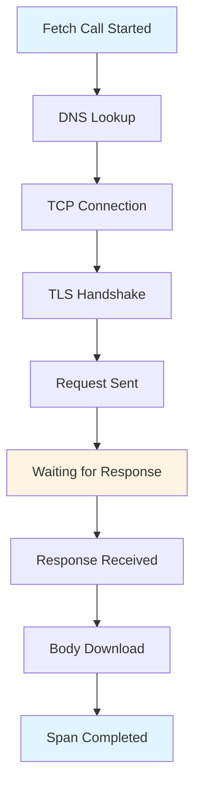

# How to Instrument React Fetch and XHR Calls with OpenTelemetry

Author: [nawazdhandala](https://www.github.com/nawazdhandala)

Tags: OpenTelemetry, React, Fetch, XHR, Browser Instrumentation, Frontend

Description: Complete guide to instrumenting Fetch API and XMLHttpRequest calls in React applications using OpenTelemetry for comprehensive network monitoring.

Network requests form the backbone of modern React applications, but tracking their performance and reliability can be challenging. OpenTelemetry provides specialized instrumentation for both Fetch API and XMLHttpRequest (XHR), automatically capturing timing, headers, and errors. This guide demonstrates how to instrument these network calls effectively in your React application.

## Why Instrument Network Calls

Network requests are often the slowest part of a web application and the most common source of errors. Instrumenting these calls reveals response times, failure rates, and which endpoints cause user-facing issues. OpenTelemetry's network instrumentation captures detailed timing information, including DNS lookup, connection establishment, and time to first byte.

## Setting Up Fetch Instrumentation

The Fetch API instrumentation package automatically wraps fetch calls, creating spans for each request without requiring code changes.

```bash
npm install @opentelemetry/api \
  @opentelemetry/sdk-trace-web \
  @opentelemetry/instrumentation-fetch \
  @opentelemetry/exporter-trace-otlp-http \
  @opentelemetry/resources \
  @opentelemetry/semantic-conventions
```

Configure the instrumentation with specific options to control which requests are traced and how headers are propagated.

```javascript
// src/instrumentation/fetchInstrumentation.js

import { registerInstrumentations } from '@opentelemetry/instrumentation';
import { FetchInstrumentation } from '@opentelemetry/instrumentation-fetch';
import { WebTracerProvider } from '@opentelemetry/sdk-trace-web';
import { Resource } from '@opentelemetry/resources';
import { SemanticResourceAttributes } from '@opentelemetry/semantic-conventions';
import { OTLPTraceExporter } from '@opentelemetry/exporter-trace-otlp-http';
import { BatchSpanProcessor } from '@opentelemetry/sdk-trace-web';

// Create resource with service information
const resource = new Resource({
  [SemanticResourceAttributes.SERVICE_NAME]: 'react-app',
  [SemanticResourceAttributes.SERVICE_VERSION]: '1.0.0',
});

// Initialize the tracer provider
const provider = new WebTracerProvider({ resource });

// Configure the exporter for your observability backend
const exporter = new OTLPTraceExporter({
  url: 'https://your-collector.com/v1/traces',
});

provider.addSpanProcessor(new BatchSpanProcessor(exporter));
provider.register();

// Configure Fetch instrumentation with detailed options
registerInstrumentations({
  instrumentations: [
    new FetchInstrumentation({
      // Propagate trace context to these origins
      // This connects frontend and backend traces
      propagateTraceHeaderCorsUrls: [
        'https://api.yourapp.com',
        /https:\/\/.*\.yourapp\.com/,
        'http://localhost:3001',
      ],

      // Clear timing resources after creating spans
      // This prevents memory leaks from PerformanceResourceTiming entries
      clearTimingResources: true,

      // Filter which requests to instrument
      // Return false to skip instrumentation for a request
      ignoreUrls: [
        /\/health-check$/,
        /\/metrics$/,
      ],

      // Add custom attributes to spans
      applyCustomAttributesOnSpan: (span, request, response) => {
        // Add request attributes
        if (request.method) {
          span.setAttribute('http.method', request.method);
        }

        // Add response attributes
        if (response) {
          span.setAttribute('http.response.size',
            response.headers.get('content-length') || 0);
          span.setAttribute('http.response.content_type',
            response.headers.get('content-type') || 'unknown');
        }

        // Parse and add custom headers
        const requestId = response?.headers.get('x-request-id');
        if (requestId) {
          span.setAttribute('app.request_id', requestId);
        }
      },
    }),
  ],
});

export default provider;
```

## Understanding Fetch Span Data

The Fetch instrumentation automatically captures comprehensive data about each request.



Each span includes timing information for these phases, making it easy to identify where requests spend time.

## Creating a Traced Fetch Wrapper

While automatic instrumentation handles most scenarios, a custom wrapper provides additional control and consistency.

```javascript
// src/api/tracedFetch.js

import { trace, context, SpanStatusCode } from '@opentelemetry/api';

const tracer = trace.getTracer('react-app-fetch');

/**
 * Enhanced fetch wrapper with custom tracing attributes
 * Adds application-specific context to network spans
 */
export async function tracedFetch(url, options = {}) {
  // Create a parent span for the entire fetch operation
  const span = tracer.startSpan('custom.fetch', {
    attributes: {
      'http.url': url,
      'http.method': options.method || 'GET',
      'fetch.type': 'application-request',
    },
  });

  // Execute the fetch within the span's context
  return context.with(trace.setSpan(context.active(), span), async () => {
    try {
      const startTime = performance.now();

      // Perform the actual fetch call
      const response = await fetch(url, options);

      const duration = performance.now() - startTime;

      // Add response attributes
      span.setAttributes({
        'http.status_code': response.status,
        'http.status_text': response.statusText,
        'http.response_time_ms': duration,
        'http.ok': response.ok,
      });

      // Check for error status codes
      if (!response.ok) {
        span.setStatus({
          code: SpanStatusCode.ERROR,
          message: `HTTP ${response.status}: ${response.statusText}`,
        });
      } else {
        span.setStatus({ code: SpanStatusCode.OK });
      }

      return response;
    } catch (error) {
      // Record exceptions in the span
      span.recordException(error);
      span.setStatus({
        code: SpanStatusCode.ERROR,
        message: error.message,
      });
      throw error;
    } finally {
      span.end();
    }
  });
}

/**
 * Convenience wrapper for JSON requests
 */
export async function fetchJSON(url, options = {}) {
  const response = await tracedFetch(url, {
    ...options,
    headers: {
      'Content-Type': 'application/json',
      ...options.headers,
    },
  });

  if (!response.ok) {
    throw new Error(`HTTP ${response.status}: ${response.statusText}`);
  }

  return response.json();
}
```

Use the traced fetch wrapper in your React components:

```javascript
// src/components/UserList.jsx

import { useState, useEffect } from 'react';
import { fetchJSON } from '../api/tracedFetch';

function UserList() {
  const [users, setUsers] = useState([]);
  const [loading, setLoading] = useState(true);
  const [error, setError] = useState(null);

  useEffect(() => {
    // The fetch call is automatically instrumented
    fetchJSON('https://api.yourapp.com/users')
      .then(data => {
        setUsers(data);
        setLoading(false);
      })
      .catch(err => {
        setError(err.message);
        setLoading(false);
      });
  }, []);

  if (loading) return <div>Loading...</div>;
  if (error) return <div>Error: {error}</div>;

  return (
    <ul>
      {users.map(user => (
        <li key={user.id}>{user.name}</li>
      ))}
    </ul>
  );
}

export default UserList;
```

## Instrumenting XMLHttpRequest (XHR)

Many React applications and third-party libraries still use XMLHttpRequest instead of Fetch. OpenTelemetry provides dedicated instrumentation for XHR.

```bash
npm install @opentelemetry/instrumentation-xml-http-request
```

Configure XHR instrumentation similarly to Fetch instrumentation:

```javascript
// src/instrumentation/xhrInstrumentation.js

import { registerInstrumentations } from '@opentelemetry/instrumentation';
import { XMLHttpRequestInstrumentation } from '@opentelemetry/instrumentation-xml-http-request';

registerInstrumentations({
  instrumentations: [
    new XMLHttpRequestInstrumentation({
      // Propagate trace headers to backend services
      propagateTraceHeaderCorsUrls: [
        'https://api.yourapp.com',
        /https:\/\/.*\.yourapp\.com/,
      ],

      // Ignore specific URLs
      ignoreUrls: [/\/analytics/],

      // Add custom attributes to XHR spans
      applyCustomAttributesOnSpan: (span, xhr) => {
        // Add custom headers from response
        const correlationId = xhr.getResponseHeader('x-correlation-id');
        if (correlationId) {
          span.setAttribute('app.correlation_id', correlationId);
        }

        // Add request body size if available
        if (xhr.requestBody) {
          span.setAttribute('http.request.size',
            JSON.stringify(xhr.requestBody).length);
        }
      },
    }),
  ],
});
```

## Combining Fetch and XHR Instrumentation

Most applications use both Fetch and XHR, either directly or through libraries. Configure both instrumentations together for complete coverage.

```javascript
// src/instrumentation/networkInstrumentation.js

import { registerInstrumentations } from '@opentelemetry/instrumentation';
import { FetchInstrumentation } from '@opentelemetry/instrumentation-fetch';
import { XMLHttpRequestInstrumentation } from '@opentelemetry/instrumentation-xml-http-request';
import { WebTracerProvider } from '@opentelemetry/sdk-trace-web';
import { BatchSpanProcessor } from '@opentelemetry/sdk-trace-web';
import { OTLPTraceExporter } from '@opentelemetry/exporter-trace-otlp-http';
import { Resource } from '@opentelemetry/resources';
import { SemanticResourceAttributes } from '@opentelemetry/semantic-conventions';

const resource = new Resource({
  [SemanticResourceAttributes.SERVICE_NAME]: 'react-app',
});

const provider = new WebTracerProvider({ resource });
const exporter = new OTLPTraceExporter({
  url: 'https://your-collector.com/v1/traces',
});

provider.addSpanProcessor(new BatchSpanProcessor(exporter));
provider.register();

// Shared configuration for both instrumentations
const commonConfig = {
  propagateTraceHeaderCorsUrls: [
    'https://api.yourapp.com',
    /https:\/\/.*\.yourapp\.com/,
  ],
  ignoreUrls: [/\/health/, /\/metrics/],
};

registerInstrumentations({
  instrumentations: [
    new FetchInstrumentation({
      ...commonConfig,
      clearTimingResources: true,
    }),
    new XMLHttpRequestInstrumentation({
      ...commonConfig,
    }),
  ],
});

export default provider;
```

## Handling Third-Party Library Requests

Third-party libraries like Axios use XHR under the hood, so XHR instrumentation automatically captures these requests.

```javascript
// src/api/axiosClient.js

import axios from 'axios';

// Axios requests are automatically instrumented via XHR instrumentation
const apiClient = axios.create({
  baseURL: 'https://api.yourapp.com',
  timeout: 10000,
});

// Add interceptors for additional context
apiClient.interceptors.request.use(config => {
  // Request interceptor runs before instrumentation captures the request
  config.metadata = { startTime: performance.now() };
  return config;
});

apiClient.interceptors.response.use(
  response => {
    // Response interceptor runs after instrumentation
    const duration = performance.now() - response.config.metadata.startTime;
    console.log(`Request to ${response.config.url} took ${duration}ms`);
    return response;
  },
  error => {
    // Error interceptor captures failed requests
    return Promise.reject(error);
  }
);

export default apiClient;
```

## Advanced Request Filtering

Filter requests to avoid instrumenting certain calls, reducing noise and focusing on important operations.

```javascript
// src/instrumentation/advancedFiltering.js

function shouldInstrumentRequest(url) {
  // Skip instrumentation for analytics
  if (url.includes('/analytics')) return false;

  // Skip instrumentation for polling endpoints
  if (url.includes('/poll') || url.includes('/heartbeat')) return false;

  // Skip instrumentation for images and static assets
  if (url.match(/\.(jpg|jpeg|png|gif|svg|css|js)$/)) return false;

  // Instrument everything else
  return true;
}

const fetchInstrumentation = new FetchInstrumentation({
  ignoreUrls: [(url) => !shouldInstrumentRequest(url)],
});
```

## Monitoring Request Patterns

Track request patterns to identify performance issues and optimize API usage.

```javascript
// src/hooks/useTracedAPI.js

import { trace } from '@opentelemetry/api';
import { useState, useCallback } from 'react';
import { fetchJSON } from '../api/tracedFetch';

const tracer = trace.getTracer('react-app');

export function useTracedAPI(endpoint, options = {}) {
  const [data, setData] = useState(null);
  const [loading, setLoading] = useState(false);
  const [error, setError] = useState(null);

  const execute = useCallback(async (params = {}) => {
    // Create a parent span for the entire operation
    const span = tracer.startSpan(`api.${endpoint}`, {
      attributes: {
        'api.endpoint': endpoint,
        'api.params': JSON.stringify(params),
      },
    });

    setLoading(true);
    setError(null);

    try {
      const url = new URL(endpoint, 'https://api.yourapp.com');
      Object.entries(params).forEach(([key, value]) => {
        url.searchParams.append(key, value);
      });

      const result = await fetchJSON(url.toString(), options);

      span.setAttribute('api.result.count',
        Array.isArray(result) ? result.length : 1);

      setData(result);
      return result;
    } catch (err) {
      span.recordException(err);
      setError(err.message);
      throw err;
    } finally {
      setLoading(false);
      span.end();
    }
  }, [endpoint, options]);

  return { data, loading, error, execute };
}
```

Use the custom hook in your components:

```javascript
// src/components/ProductList.jsx

import { useEffect } from 'react';
import { useTracedAPI } from '../hooks/useTracedAPI';

function ProductList({ category }) {
  const { data: products, loading, error, execute } = useTracedAPI('/products');

  useEffect(() => {
    execute({ category, limit: 20 });
  }, [category, execute]);

  if (loading) return <div>Loading products...</div>;
  if (error) return <div>Error: {error}</div>;

  return (
    <div>
      {products?.map(product => (
        <div key={product.id}>{product.name}</div>
      ))}
    </div>
  );
}

export default ProductList;
```

## Debugging Network Instrumentation

Enable detailed logging to troubleshoot instrumentation issues and verify trace propagation.

```javascript
// src/instrumentation/debug.js

import { diag, DiagConsoleLogger, DiagLogLevel } from '@opentelemetry/api';

if (process.env.NODE_ENV === 'development') {
  // Enable debug logging for OpenTelemetry
  diag.setLogger(new DiagConsoleLogger(), DiagLogLevel.DEBUG);
}

// Add a custom logger to monitor all network requests
if (window.fetch) {
  const originalFetch = window.fetch;
  window.fetch = async (...args) => {
    console.log('Fetch called:', args[0]);
    const response = await originalFetch(...args);
    console.log('Fetch completed:', response.status);
    return response;
  };
}
```

## Performance Impact and Optimization

Network instrumentation adds minimal overhead, typically less than 1ms per request. The BatchSpanProcessor batches spans before sending them, reducing network overhead. Configure batch size and timing to balance between real-time visibility and resource usage.

```javascript
import { BatchSpanProcessor } from '@opentelemetry/sdk-trace-web';

const batchProcessor = new BatchSpanProcessor(exporter, {
  maxQueueSize: 2048,
  maxExportBatchSize: 512,
  scheduledDelayMillis: 5000,
  exportTimeoutMillis: 30000,
});

provider.addSpanProcessor(batchProcessor);
```

Instrumenting Fetch and XHR calls in React applications provides deep visibility into network behavior, helping you optimize performance and quickly diagnose issues. With automatic instrumentation and strategic customization, you can build a comprehensive view of how your application interacts with backend services.

