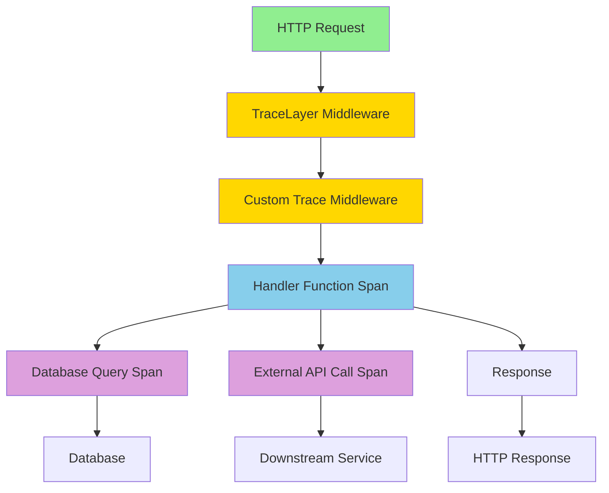

# How to Instrument Rust Axum Applications with OpenTelemetry

Author: [nawazdhandala](https://www.github.com/nawazdhandala)

Tags: OpenTelemetry, Rust, Axum, Web Framework, Tracing, Tokio

Description: Learn how to add comprehensive OpenTelemetry instrumentation to Axum web applications with middleware, extractors, and distributed tracing examples.

Axum is a modern, ergonomic web framework built on top of Tower and Hyper. Its tight integration with the Tokio ecosystem makes it an excellent choice for high-performance web services. Adding OpenTelemetry instrumentation to Axum applications gives you deep visibility into request processing, handler execution, and downstream service calls.

## Why Axum with OpenTelemetry

Axum's middleware system is built on Tower's layers, which compose elegantly with OpenTelemetry's tracing model. The framework's use of extractors and type-safe routing makes it straightforward to propagate trace context and add custom attributes to spans.

Unlike some web frameworks where instrumentation feels bolted on, Axum's design naturally accommodates observability concerns. The result is instrumentation that feels native to the framework.

## Core Dependencies

Set up your `Cargo.toml` with these dependencies:

```toml
[dependencies]
axum = "0.7"
tokio = { version = "1.35", features = ["full"] }
tower = "0.4"
tower-http = { version = "0.5", features = ["trace", "request-id"] }

tracing = "0.1"
tracing-subscriber = { version = "0.3", features = ["env-filter", "json"] }
tracing-opentelemetry = "0.23"

opentelemetry = { version = "0.22", features = ["trace"] }
opentelemetry_sdk = { version = "0.22", features = ["rt-tokio", "trace"] }
opentelemetry-otlp = { version = "0.15", features = ["tokio"] }

serde = { version = "1.0", features = ["derive"] }
serde_json = "1.0"
```

These dependencies provide everything needed for a production-ready instrumented Axum application.

## Basic Setup with Tracing Middleware

Start with a minimal instrumented Axum server:

```rust
use axum::{
    routing::{get, post},
    Router, Json, response::IntoResponse,
};
use tower_http::trace::TraceLayer;
use tracing_subscriber::layer::SubscriberExt;
use tracing_subscriber::util::SubscriberInitExt;

fn init_telemetry() -> Result<(), Box<dyn std::error::Error>> {
    let tracer = opentelemetry_otlp::new_pipeline()
        .tracing()
        .with_exporter(opentelemetry_otlp::new_exporter().tonic())
        .with_trace_config(
            opentelemetry_sdk::trace::config()
                .with_resource(opentelemetry_sdk::Resource::new(vec![
                    opentelemetry::KeyValue::new("service.name", "axum-service"),
                ]))
        )
        .install_batch(opentelemetry_sdk::runtime::Tokio)?;

    tracing_subscriber::registry()
        .with(tracing_subscriber::EnvFilter::from_default_env())
        .with(tracing_opentelemetry::layer().with_tracer(tracer))
        .with(tracing_subscriber::fmt::layer())
        .init();

    Ok(())
}

#[tokio::main]
async fn main() -> Result<(), Box<dyn std::error::Error>> {
    init_telemetry()?;

    let app = Router::new()
        .route("/", get(root_handler))
        .route("/users", get(get_users).post(create_user))
        .layer(TraceLayer::new_for_http());

    let listener = tokio::net::TcpListener::bind("0.0.0.0:3000").await?;

    tracing::info!("Server listening on {}", listener.local_addr()?);

    axum::serve(listener, app).await?;

    opentelemetry::global::shutdown_tracer_provider();

    Ok(())
}

async fn root_handler() -> &'static str {
    "Hello, instrumented world!"
}

async fn get_users() -> Json<Vec<String>> {
    Json(vec!["Alice".to_string(), "Bob".to_string()])
}

async fn create_user(Json(payload): Json<CreateUserRequest>) -> impl IntoResponse {
    tracing::info!(username = %payload.username, "Creating new user");
    Json(User {
        id: 1,
        username: payload.username,
    })
}

#[derive(serde::Deserialize)]
struct CreateUserRequest {
    username: String,
}

#[derive(serde::Serialize)]
struct User {
    id: u64,
    username: String,
}
```

The `TraceLayer` automatically creates spans for each HTTP request, capturing method, path, and status code.

## Custom Tracing Middleware

For more control, create custom middleware that adds detailed attributes:

```rust
use axum::{
    body::Body,
    extract::Request,
    middleware::{self, Next},
    response::Response,
};
use opentelemetry::trace::{SpanKind, TraceContextExt};
use opentelemetry::{global, KeyValue};
use tracing::Span;

async fn trace_middleware(req: Request, next: Next) -> Response {
    let method = req.method().clone();
    let uri = req.uri().clone();
    let version = req.version();

    // Create a span for this request
    let span = tracing::info_span!(
        "http_request",
        http.method = %method,
        http.target = %uri.path(),
        http.version = ?version,
        http.status_code = tracing::field::Empty,
        otel.kind = ?SpanKind::Server,
    );

    let _guard = span.enter();

    // Get the OpenTelemetry context
    let cx = tracing_opentelemetry::OpenTelemetrySpanExt::context(&span);
    let otel_span = cx.span();

    // Add semantic conventions attributes
    otel_span.set_attribute(KeyValue::new("http.method", method.to_string()));
    otel_span.set_attribute(KeyValue::new("http.target", uri.path().to_string()));
    otel_span.set_attribute(KeyValue::new("http.scheme", uri.scheme_str().unwrap_or("http").to_string()));

    if let Some(host) = uri.host() {
        otel_span.set_attribute(KeyValue::new("http.host", host.to_string()));
    }

    // Process the request
    let response = next.run(req).await;

    // Record response status
    let status = response.status();
    span.record("http.status_code", status.as_u16());
    otel_span.set_attribute(KeyValue::new("http.status_code", status.as_u16() as i64));

    // Set span status based on HTTP status
    if status.is_server_error() {
        otel_span.set_status(opentelemetry::trace::Status::Error {
            description: format!("HTTP {}", status).into(),
        });
    }

    response
}

fn create_app() -> Router {
    Router::new()
        .route("/", get(root_handler))
        .route("/users/:id", get(get_user_by_id))
        .layer(middleware::from_fn(trace_middleware))
}
```

This middleware gives you fine-grained control over what gets recorded in each span.

## Using Extractors for Context Propagation

Create custom extractors to access trace context in handlers:

```rust
use axum::{
    async_trait,
    extract::FromRequestParts,
    http::{request::Parts, StatusCode},
};
use opentelemetry::{global, propagation::Extractor};

pub struct TraceContext(opentelemetry::Context);

struct HeaderExtractor<'a>(&'a axum::http::HeaderMap);

impl<'a> Extractor for HeaderExtractor<'a> {
    fn get(&self, key: &str) -> Option<&str> {
        self.0.get(key).and_then(|v| v.to_str().ok())
    }

    fn keys(&self) -> Vec<&str> {
        self.0.keys().map(|k| k.as_str()).collect()
    }
}

#[async_trait]
impl<Svc> FromRequestParts<Svc> for TraceContext
where
    Svc: Send + Sync,
{
    type Rejection = (StatusCode, &'static str);

    async fn from_request_parts(parts: &mut Parts, _state: &Svc) -> Result<Self, Self::Rejection> {
        let extractor = HeaderExtractor(&parts.headers);
        let context = global::get_text_map_propagator(|propagator| {
            propagator.extract(&extractor)
        });

        Ok(TraceContext(context))
    }
}

// Use the extractor in handlers
async fn handler_with_context(
    trace_ctx: TraceContext,
    Json(payload): Json<RequestPayload>,
) -> impl IntoResponse {
    // Create a span with the extracted parent context
    let tracer = global::tracer("axum-service");
    let span = tracer
        .span_builder("process_request")
        .with_kind(SpanKind::Internal)
        .start_with_context(&tracer, &trace_ctx.0);

    let cx = trace_ctx.0.with_span(span);
    let _guard = cx.attach();

    // Processing logic here
    tracing::info!("Processing request with trace context");

    Json(serde_json::json!({ "status": "ok" }))
}

#[derive(serde::Deserialize)]
struct RequestPayload {
    data: String,
}
```

This pattern ensures distributed traces connect properly when requests arrive from other instrumented services.

## Instrumenting Handler Functions

Use the `#[instrument]` macro to automatically trace handlers:

```rust
use tracing::instrument;

#[instrument(name = "get_user", skip(db_pool))]
async fn get_user_by_id(
    axum::extract::Path(user_id): axum::extract::Path<u64>,
    axum::extract::State(db_pool): axum::extract::State<DbPool>,
) -> Result<Json<User>, StatusCode> {
    tracing::info!(user_id, "Fetching user from database");

    let user = fetch_user_from_db(&db_pool, user_id)
        .await
        .map_err(|_| StatusCode::INTERNAL_SERVER_ERROR)?;

    match user {
        Some(u) => Ok(Json(u)),
        None => Err(StatusCode::NOT_FOUND),
    }
}

#[instrument(name = "db.query.user")]
async fn fetch_user_from_db(pool: &DbPool, user_id: u64) -> Result<Option<User>, DbError> {
    // Database query logic
    tracing::debug!("Executing database query");

    // Simulate database call
    tokio::time::sleep(std::time::Duration::from_millis(10)).await;

    Ok(Some(User {
        id: user_id,
        username: format!("user{}", user_id),
    }))
}

type DbPool = ();
type DbError = std::io::Error;
```

The `#[instrument]` macro creates child spans that show up in your traces, making it easy to see where time is spent.

## Adding Request IDs

Correlate logs and traces with request IDs:

```rust
use tower_http::{
    request_id::{MakeRequestId, RequestId, PropagateRequestIdLayer, SetRequestIdLayer},
    trace::TraceLayer,
};
use uuid::Uuid;

#[derive(Clone, Default)]
struct MakeRequestUuid;

impl MakeRequestId for MakeRequestUuid {
    fn make_request_id<Bd>(&mut self, _request: &axum::http::Request<Bd>) -> Option<RequestId> {
        let request_id = Uuid::new_v4().to_string().parse().unwrap();
        Some(RequestId::new(request_id))
    }
}

fn create_app_with_request_ids() -> Router {
    Router::new()
        .route("/", get(root_handler))
        .layer(SetRequestIdLayer::x_request_id(MakeRequestUuid))
        .layer(PropagateRequestIdLayer::x_request_id())
        .layer(
            TraceLayer::new_for_http()
                .make_span_with(|request: &axum::http::Request<_>| {
                    let request_id = request
                        .headers()
                        .get("x-request-id")
                        .and_then(|v| v.to_str().ok())
                        .unwrap_or("unknown");

                    tracing::info_span!(
                        "http_request",
                        method = %request.method(),
                        uri = %request.uri(),
                        request_id = %request_id,
                    )
                })
        )
}
```

Request IDs make it easy to find all logs and spans related to a specific request.

## Propagating Context to Background Tasks

When spawning background tasks, preserve the trace context:

```rust
use tracing::Instrument;

async fn handler_with_background_job(
    Json(payload): Json<JobPayload>,
) -> impl IntoResponse {
    let job_id = Uuid::new_v4();

    // Capture the current span
    let span = tracing::info_span!("background_job", job.id = %job_id);

    // Spawn a task that inherits the span
    tokio::spawn(
        async move {
            tracing::info!("Starting background job");

            process_job(payload).await;

            tracing::info!("Background job completed");
        }
        .instrument(span)
    );

    Json(serde_json::json!({
        "job_id": job_id,
        "status": "queued"
    }))
}

#[derive(serde::Deserialize)]
struct JobPayload {
    data: String,
}

async fn process_job(payload: JobPayload) {
    tokio::time::sleep(std::time::Duration::from_secs(5)).await;
    tracing::info!("Job processing complete");
}
```

Without explicit instrumentation, background tasks would create disconnected spans that don't show up in your request traces.

## Calling External Services

Inject trace context into outgoing HTTP requests:

```rust
use reqwest;
use opentelemetry::propagation::Injector;

struct ReqwestHeaderInjector<'a>(&'a mut reqwest::header::HeaderMap);

impl<'a> Injector for ReqwestHeaderInjector<'a> {
    fn set(&mut self, key: &str, value: String) {
        if let Ok(name) = reqwest::header::HeaderName::from_bytes(key.as_bytes()) {
            if let Ok(val) = reqwest::header::HeaderValue::from_str(&value) {
                self.0.insert(name, val);
            }
        }
    }
}

#[instrument]
async fn call_downstream_service(url: String) -> Result<String, reqwest::Error> {
    let client = reqwest::Client::new();
    let mut headers = reqwest::header::HeaderMap::new();

    // Inject the current span context
    let cx = tracing_opentelemetry::OpenTelemetrySpanExt::context(
        &tracing::Span::current()
    );

    global::get_text_map_propagator(|propagator| {
        propagator.inject_context(&cx, &mut ReqwestHeaderInjector(&mut headers));
    });

    tracing::info!("Calling downstream service at {}", url);

    let response = client
        .get(&url)
        .headers(headers)
        .send()
        .await?;

    let status = response.status();
    tracing::info!(status_code = status.as_u16(), "Received response");

    response.text().await
}

async fn handler_calling_external(
    axum::extract::Path(id): axum::extract::Path<String>,
) -> Result<String, StatusCode> {
    let url = format!("https://api.example.com/data/{}", id);

    call_downstream_service(url)
        .await
        .map_err(|e| {
            tracing::error!("Failed to call downstream: {}", e);
            StatusCode::BAD_GATEWAY
        })
}
```

This ensures your traces span multiple services, showing the complete request flow.

## State and Shared Resources

Share telemetry configuration through Axum's state:

```rust
use std::sync::Arc;

#[derive(Clone)]
struct AppState {
    db_pool: DbPool,
    tracer: Arc<opentelemetry::global::BoxedTracer>,
}

async fn handler_with_state(
    axum::extract::State(state): axum::extract::State<AppState>,
    Json(req): Json<QueryRequest>,
) -> Result<Json<QueryResponse>, StatusCode> {
    let span = state.tracer
        .span_builder("execute_query")
        .with_kind(SpanKind::Internal)
        .start(&*state.tracer);

    let cx = opentelemetry::Context::current().with_span(span);
    let _guard = cx.attach();

    // Use state.db_pool for database queries

    Ok(Json(QueryResponse { result: "data".to_string() }))
}

#[derive(serde::Deserialize)]
struct QueryRequest {
    query: String,
}

#[derive(serde::Serialize)]
struct QueryResponse {
    result: String,
}

fn create_stateful_app() -> Router {
    let tracer = Arc::new(opentelemetry::global::tracer("axum-service"));

    let state = AppState {
        db_pool: (),
        tracer,
    };

    Router::new()
        .route("/query", post(handler_with_state))
        .with_state(state)
}
```

Sharing the tracer through state avoids repeated global lookups and makes testing easier.

## Error Handling with Tracing

Record errors as span events:

```rust
use axum::response::{Response, IntoResponse};

#[derive(Debug)]
struct AppError {
    message: String,
    code: ErrorCode,
}

#[derive(Debug)]
enum ErrorCode {
    NotFound,
    Unauthorized,
    InternalError,
}

impl IntoResponse for AppError {
    fn into_response(self) -> Response {
        let status_code = match self.code {
            ErrorCode::NotFound => StatusCode::NOT_FOUND,
            ErrorCode::Unauthorized => StatusCode::UNAUTHORIZED,
            ErrorCode::InternalError => StatusCode::INTERNAL_SERVER_ERROR,
        };

        // Record error in current span
        tracing::error!(
            error.message = %self.message,
            error.code = ?self.code,
            "Request failed"
        );

        // Set OpenTelemetry span status
        let span = tracing::Span::current();
        let cx = tracing_opentelemetry::OpenTelemetrySpanExt::context(&span);
        cx.span().set_status(opentelemetry::trace::Status::Error {
            description: self.message.clone().into(),
        });

        (status_code, self.message).into_response()
    }
}

#[instrument]
async fn fallible_handler() -> Result<Json<Data>, AppError> {
    perform_operation()
        .await
        .map(|data| Json(data))
        .map_err(|e| AppError {
            message: format!("Operation failed: {}", e),
            code: ErrorCode::InternalError,
        })
}

#[derive(serde::Serialize)]
struct Data {
    value: String,
}

async fn perform_operation() -> Result<Data, std::io::Error> {
    Ok(Data { value: "success".to_string() })
}
```

Recording errors as span events makes it easy to filter traces by error conditions.

## Visualizing Request Flow

Here's how a typical instrumented request flows through Axum:



Each layer adds spans that provide visibility into different aspects of request processing.

## Production Configuration

For production deployments, use environment-based configuration:

```rust
fn init_production_telemetry() -> Result<(), Box<dyn std::error::Error>> {
    let endpoint = std::env::var("OTEL_EXPORTER_OTLP_ENDPOINT")
        .unwrap_or_else(|_| "http://localhost:4317".to_string());

    let service_name = std::env::var("SERVICE_NAME")
        .unwrap_or_else(|_| "axum-service".to_string());

    let tracer = opentelemetry_otlp::new_pipeline()
        .tracing()
        .with_exporter(
            opentelemetry_otlp::new_exporter()
                .tonic()
                .with_endpoint(endpoint)
        )
        .with_trace_config(
            opentelemetry_sdk::trace::config()
                .with_sampler(opentelemetry_sdk::trace::Sampler::ParentBased(
                    Box::new(opentelemetry_sdk::trace::Sampler::TraceIdRatioBased(0.1))
                ))
                .with_resource(opentelemetry_sdk::Resource::new(vec![
                    opentelemetry::KeyValue::new("service.name", service_name),
                    opentelemetry::KeyValue::new("deployment.environment",
                        std::env::var("ENVIRONMENT").unwrap_or_else(|_| "production".to_string())
                    ),
                ]))
        )
        .install_batch(opentelemetry_sdk::runtime::Tokio)?;

    tracing_subscriber::registry()
        .with(tracing_subscriber::EnvFilter::from_default_env())
        .with(tracing_opentelemetry::layer().with_tracer(tracer))
        .with(tracing_subscriber::fmt::layer().json())
        .init();

    Ok(())
}
```

This configuration adapts to different environments without code changes, making it easy to deploy the same binary across dev, staging, and production.

Axum's design makes instrumentation straightforward and composable. By combining Tower's middleware system with OpenTelemetry's standardized telemetry, you get powerful observability with minimal boilerplate.
