# How to Instrument Rust Tonic gRPC Services with OpenTelemetry

Author: [nawazdhandala](https://www.github.com/nawazdhandala)

Tags: OpenTelemetry, Rust, Tonic, gRPC, Tracing, Microservices

Description: Learn how to add distributed tracing to Rust gRPC services built with Tonic using OpenTelemetry for complete observability across microservices.

Building distributed systems with gRPC in Rust offers excellent performance and type safety, but understanding request flow across services requires proper instrumentation. OpenTelemetry provides standardized observability for Tonic-based gRPC services, enabling you to track requests as they traverse multiple microservices.

This guide shows you how to instrument Tonic gRPC servers and clients with OpenTelemetry, capturing detailed traces that include method names, status codes, and propagated context across service boundaries.

## Why Instrument gRPC Services

gRPC services in microservice architectures handle numerous concurrent requests across network boundaries. Without proper tracing, debugging latency issues or failures becomes nearly impossible. OpenTelemetry solves this by:

- Tracking request flow across multiple services
- Capturing gRPC metadata and status codes
- Measuring network latency and service response times
- Correlating logs with distributed traces
- Identifying bottlenecks in service-to-service communication

## Architecture Overview

Here's how OpenTelemetry integrates with Tonic services:

```mermaid
graph LR
    A[gRPC Client] -->|Instrumented Request| B[Tonic Interceptor]
    B -->|Inject Context| C[gRPC Transport]
    C -->|Network Call| D[Server Interceptor]
    D -->|Extract Context| E[Service Handler]
    E -->|Create Spans| F[OpenTelemetry Exporter]
    F -->|Send Traces| G[Backend Collector]
```



## Dependencies Setup

Add the necessary crates to your `Cargo.toml`:

```toml
[dependencies]
# Core Tonic dependencies for gRPC
tonic = "0.11"
prost = "0.12"
tokio = { version = "1.35", features = ["full"] }

# OpenTelemetry core libraries
opentelemetry = "0.22"
opentelemetry_sdk = "0.22"
opentelemetry-otlp = "0.15"

# Tracing integration with OpenTelemetry
tracing = "0.1"
tracing-subscriber = { version = "0.3", features = ["env-filter"] }
tracing-opentelemetry = "0.23"

# gRPC interceptor for automatic instrumentation
tonic-tracing-opentelemetry = "0.18"

[build-dependencies]
tonic-build = "0.11"
```

## Proto Definition

Define your gRPC service in `proto/greeter.proto`:

```protobuf
syntax = "proto3";

package greeter;

service Greeter {
    rpc SayHello (HelloRequest) returns (HelloReply);
    rpc SayHelloStream (HelloRequest) returns (stream HelloReply);
}

message HelloRequest {
    string name = 1;
}

message HelloReply {
    string message = 1;
    int32 request_count = 2;
}
```

Configure the build script in `build.rs`:

```rust
fn main() -> Result<(), Box<dyn std::error::Error>> {
    tonic_build::compile_protos("proto/greeter.proto")?;
    Ok(())
}
```

## Initialize OpenTelemetry Tracer

Create a function to set up the OpenTelemetry pipeline with OTLP exporter:

```rust
use opentelemetry::{global, trace::TracerProvider as _, KeyValue};
use opentelemetry_otlp::WithExportConfig;
use opentelemetry_sdk::{runtime, trace::TracerProvider, Resource};
use tracing_subscriber::{layer::SubscriberExt, util::SubscriberInitExt, EnvFilter};

fn init_tracer() -> Result<TracerProvider, Box<dyn std::error::Error>> {
    // Configure the OTLP exporter to send traces to a collector
    let exporter = opentelemetry_otlp::new_exporter()
        .tonic()
        .with_endpoint("http://localhost:4317");

    // Build the tracer provider with service metadata
    let provider = opentelemetry_otlp::new_pipeline()
        .tracing()
        .with_exporter(exporter)
        .with_trace_config(
            opentelemetry_sdk::trace::Config::default()
                .with_resource(Resource::new(vec![
                    KeyValue::new("service.name", "rust-grpc-service"),
                    KeyValue::new("service.version", "1.0.0"),
                ]))
        )
        .install_batch(runtime::Tokio)?;

    // Set up the tracing subscriber with OpenTelemetry layer
    let telemetry_layer = tracing_opentelemetry::layer()
        .with_tracer(provider.tracer("rust-grpc-service"));

    tracing_subscriber::registry()
        .with(EnvFilter::from_default_env())
        .with(telemetry_layer)
        .with(tracing_subscriber::fmt::layer())
        .init();

    Ok(provider)
}
```

## Implement Instrumented gRPC Server

Create a Tonic server with OpenTelemetry interceptors:

```rust
use tonic::{transport::Server, Request, Response, Status};
use tracing::{info, instrument};

// Include the generated protobuf code
pub mod greeter {
    tonic::include_proto!("greeter");
}

use greeter::{
    greeter_server::{Greeter, GreeterServer},
    HelloReply, HelloRequest,
};

#[derive(Default)]
pub struct MyGreeter {
    request_count: std::sync::atomic::AtomicI32,
}

// The instrument macro automatically creates spans for this method
#[tonic::async_trait]
impl Greeter for MyGreeter {
    #[instrument(skip(self, request))]
    async fn say_hello(
        &self,
        request: Request<HelloRequest>,
    ) -> Result<Response<HelloReply>, Status> {
        let name = request.into_inner().name;

        // Log events within the span context
        info!(user_name = %name, "Processing greeting request");

        // Simulate some processing work
        tokio::time::sleep(tokio::time::Duration::from_millis(50)).await;

        let count = self.request_count.fetch_add(1, std::sync::atomic::Ordering::SeqCst);

        let reply = HelloReply {
            message: format!("Hello, {}!", name),
            request_count: count + 1,
        };

        Ok(Response::new(reply))
    }

    #[instrument(skip(self, request))]
    async fn say_hello_stream(
        &self,
        request: Request<HelloRequest>,
    ) -> Result<Response<Self::SayHelloStreamStream>, Status> {
        let name = request.into_inner().name;
        info!(user_name = %name, "Processing streaming greeting request");

        // Create a stream that sends multiple responses
        let (tx, rx) = tokio::sync::mpsc::channel(10);

        tokio::spawn(async move {
            for i in 0..5 {
                let reply = HelloReply {
                    message: format!("Hello #{}, {}!", i + 1, name),
                    request_count: i + 1,
                };
                if tx.send(Ok(reply)).await.is_err() {
                    break;
                }
                tokio::time::sleep(tokio::time::Duration::from_millis(100)).await;
            }
        });

        Ok(Response::new(
            tokio_stream::wrappers::ReceiverStream::new(rx)
        ))
    }
}

#[tokio::main]
async fn main() -> Result<(), Box<dyn std::error::Error>> {
    // Initialize OpenTelemetry tracer
    let provider = init_tracer()?;

    let addr = "0.0.0.0:50051".parse()?;
    let greeter = MyGreeter::default();

    info!("Starting gRPC server on {}", addr);

    // Create server with OpenTelemetry interceptor for automatic tracing
    Server::builder()
        .layer(tonic_tracing_opentelemetry::layer())
        .add_service(GreeterServer::new(greeter))
        .serve(addr)
        .await?;

    // Ensure all spans are exported before shutdown
    global::shutdown_tracer_provider();
    let _ = provider.shutdown();

    Ok(())
}
```

## Implement Instrumented gRPC Client

Create a client that propagates trace context across service boundaries:

```rust
use tonic::transport::Channel;
use tracing::{info, instrument};

pub mod greeter {
    tonic::include_proto!("greeter");
}

use greeter::{greeter_client::GreeterClient, HelloRequest};

#[instrument]
async fn make_grpc_call(name: String) -> Result<(), Box<dyn std::error::Error>> {
    // Connect to the gRPC server with OpenTelemetry interceptor
    let channel = Channel::from_static("http://localhost:50051")
        .connect()
        .await?;

    // Create client with tracing interceptor to propagate context
    let mut client = GreeterClient::with_interceptor(
        channel,
        tonic_tracing_opentelemetry::tracing_interceptor(),
    );

    info!("Sending unary gRPC request");

    // Make a unary call - trace context is automatically propagated
    let request = tonic::Request::new(HelloRequest {
        name: name.clone(),
    });

    let response = client.say_hello(request).await?;
    info!(
        message = %response.get_ref().message,
        count = response.get_ref().request_count,
        "Received response"
    );

    // Make a streaming call
    info!("Sending streaming gRPC request");
    let request = tonic::Request::new(HelloRequest { name });

    let mut stream = client.say_hello_stream(request).await?.into_inner();

    while let Some(reply) = stream.message().await? {
        info!(
            message = %reply.message,
            count = reply.request_count,
            "Received stream message"
        );
    }

    Ok(())
}

#[tokio::main]
async fn main() -> Result<(), Box<dyn std::error::Error>> {
    // Initialize OpenTelemetry for the client
    let provider = init_tracer()?;

    // Make multiple calls to demonstrate tracing
    for i in 0..3 {
        make_grpc_call(format!("User{}", i)).await?;
        tokio::time::sleep(tokio::time::Duration::from_secs(1)).await;
    }

    // Shutdown gracefully
    opentelemetry::global::shutdown_tracer_provider();
    let _ = provider.shutdown();

    Ok(())
}
```

## Custom Interceptors for Additional Context

Add custom metadata to traces using Tonic interceptors:

```rust
use tonic::{Request, Status};
use tracing::Span;

// Custom interceptor that adds request metadata to the current span
fn metadata_interceptor(mut req: Request<()>) -> Result<Request<()>, Status> {
    // Get the current tracing span
    let span = Span::current();

    // Extract and record metadata from the request
    if let Some(user_agent) = req.metadata().get("user-agent") {
        span.record("user_agent", user_agent.to_str().unwrap_or("unknown"));
    }

    if let Some(request_id) = req.metadata().get("x-request-id") {
        span.record("request_id", request_id.to_str().unwrap_or(""));
    }

    // Add custom metadata to outgoing request
    req.metadata_mut()
        .insert("x-trace-enabled", "true".parse().unwrap());

    Ok(req)
}

// Use the custom interceptor in addition to the tracing interceptor
async fn create_instrumented_client() -> Result<GreeterClient<Channel>, Box<dyn std::error::Error>> {
    let channel = Channel::from_static("http://localhost:50051")
        .connect()
        .await?;

    // Chain interceptors: first tracing, then custom metadata
    let client = GreeterClient::with_interceptor(channel, move |mut req: Request<()>| {
        // Apply OpenTelemetry tracing
        req = tonic_tracing_opentelemetry::tracing_interceptor()(req)?;
        // Apply custom metadata
        metadata_interceptor(req)
    });

    Ok(client)
}
```

## Error Handling and Status Codes

Capture gRPC status codes and errors in traces:

```rust
use tonic::{Code, Status};
use tracing::{error, warn};

#[instrument(skip(self, request))]
async fn validated_hello(
    &self,
    request: Request<HelloRequest>,
) -> Result<Response<HelloReply>, Status> {
    let name = request.into_inner().name;

    // Validate input and record errors in traces
    if name.is_empty() {
        warn!("Empty name provided");
        return Err(Status::invalid_argument("Name cannot be empty"));
    }

    if name.len() > 100 {
        warn!(name_length = name.len(), "Name too long");
        return Err(Status::invalid_argument("Name exceeds maximum length"));
    }

    // Simulate a potential internal error
    if name.to_lowercase().contains("error") {
        error!("Simulated internal error");
        return Err(Status::internal("Internal processing error"));
    }

    let reply = HelloReply {
        message: format!("Hello, {}!", name),
        request_count: 1,
    };

    Ok(Response::new(reply))
}
```

## Testing Instrumented Services

Create tests that verify tracing behavior:

```rust
#[cfg(test)]
mod tests {
    use super::*;
    use opentelemetry::trace::TraceContextExt;
    use tracing::Span;

    #[tokio::test]
    async fn test_grpc_with_tracing() {
        let provider = init_tracer().unwrap();

        let greeter = MyGreeter::default();
        let request = Request::new(HelloRequest {
            name: "Test User".to_string(),
        });

        // Execute within a traced context
        let response = greeter.say_hello(request).await.unwrap();

        assert!(response.get_ref().message.contains("Test User"));
        assert_eq!(response.get_ref().request_count, 1);

        // Verify span was created
        let span = Span::current();
        let context = span.context();
        assert!(context.span().span_context().is_valid());

        provider.shutdown().unwrap();
    }
}
```

## Production Deployment Considerations

When deploying instrumented gRPC services, consider:

**Sampling Strategy**: Configure appropriate sampling rates for high-throughput services to balance observability with performance overhead.

**Resource Attributes**: Always include service name, version, and deployment environment in resource attributes for better trace filtering.

**Batch Export**: Use batch span processors rather than simple processors to minimize performance impact from trace export.

**Error Handling**: Ensure OpenTelemetry initialization failures don't prevent service startup. Degrade gracefully if the collector is unavailable.

**Connection Pooling**: Reuse gRPC channels and clients to avoid creating new connections for each request, which improves both performance and trace correlation.

Instrumenting Tonic gRPC services with OpenTelemetry provides complete visibility into microservice communication. The automatic context propagation ensures traces follow requests across service boundaries, while custom instrumentation captures business-specific metrics. This combination enables rapid debugging and performance optimization in distributed Rust systems.
