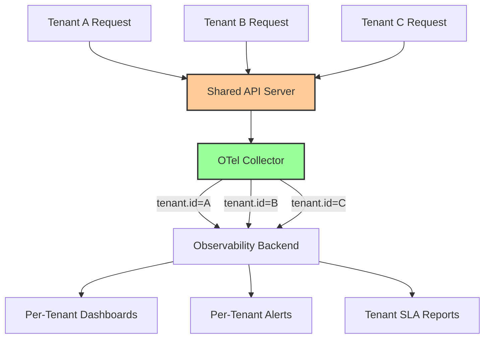
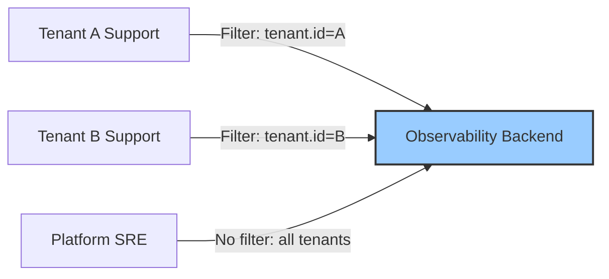

# How to Instrument a SaaS Multi-Tenant Application with OpenTelemetry

Author: [nawazdhandala](https://www.github.com/nawazdhandala)

Tags: OpenTelemetry, SaaS, Multi-Tenant, Instrumentation, Observability, Tenant Isolation

Description: Learn how to instrument a multi-tenant SaaS application with OpenTelemetry to get per-tenant observability while maintaining data isolation.

---

Multi-tenant SaaS applications serve dozens, hundreds, or thousands of customers from a shared infrastructure. When a tenant reports slowness, you need to quickly determine whether the issue affects just that tenant, a subset of tenants on the same database shard, or the entire platform. Without tenant-aware observability, you are left guessing.

OpenTelemetry gives you the tools to tag every trace, metric, and log with tenant context, enabling per-tenant debugging, capacity planning, and SLA monitoring. This guide covers how to set up tenant-aware instrumentation from the middleware layer through the collector pipeline and into your observability backend.

## The Multi-Tenant Observability Challenge

In a single-tenant deployment, all telemetry belongs to one customer, so there is no ambiguity. In a multi-tenant system, a single API server handles requests from many tenants simultaneously. A slow database query might affect one tenant's data partition while others run fine. A memory spike might be caused by one tenant's unusual workload pattern.

The goal is to attach a `tenant.id` attribute to every piece of telemetry so you can filter, group, and alert on a per-tenant basis:



## Extracting Tenant Context in Middleware

The most reliable place to extract the tenant ID is in your API middleware, before any business logic runs. This ensures that every span created during request processing automatically inherits the tenant context:

```python
# tenant_middleware.py
# Extract tenant ID and inject it into OpenTelemetry context

from opentelemetry import trace, context, baggage
from opentelemetry.trace import Span
from starlette.middleware.base import BaseHTTPMiddleware
from starlette.requests import Request

class TenantContextMiddleware(BaseHTTPMiddleware):
    """Middleware that extracts tenant ID and attaches it to all telemetry.

    Supports multiple tenant identification strategies:
    - JWT token claims
    - API key lookup
    - Subdomain extraction
    - Request header
    """

    async def dispatch(self, request: Request, call_next):
        # Extract tenant ID from the request
        tenant_id = self._extract_tenant_id(request)

        if tenant_id is None:
            # No tenant context means something is wrong with auth
            return JSONResponse(status_code=401, content={"error": "Tenant not identified"})

        # Get the current span (created by the OTLP HTTP instrumentation)
        span = trace.get_current_span()

        # Set tenant attributes on the current span
        span.set_attribute("tenant.id", tenant_id)
        span.set_attribute("tenant.plan", get_tenant_plan(tenant_id))
        span.set_attribute("tenant.region", get_tenant_region(tenant_id))

        # Also set tenant ID in baggage so it propagates to downstream services
        ctx = baggage.set_baggage("tenant.id", tenant_id)
        token = context.attach(ctx)

        try:
            response = await call_next(request)
            span.set_attribute("http.response.status_code", response.status_code)
            return response
        finally:
            context.detach(token)

    def _extract_tenant_id(self, request: Request) -> str:
        """Try multiple strategies to identify the tenant."""

        # Strategy 1: Check the X-Tenant-ID header (for service-to-service calls)
        tenant_header = request.headers.get("X-Tenant-ID")
        if tenant_header:
            return tenant_header

        # Strategy 2: Extract from JWT token
        auth_header = request.headers.get("Authorization", "")
        if auth_header.startswith("Bearer "):
            token = auth_header[7:]
            claims = decode_jwt(token)
            if claims and "tenant_id" in claims:
                return claims["tenant_id"]

        # Strategy 3: Extract from subdomain
        host = request.headers.get("Host", "")
        if host and "." in host:
            subdomain = host.split(".")[0]
            tenant = lookup_tenant_by_subdomain(subdomain)
            if tenant:
                return tenant.id

        return None
```

The baggage mechanism is important. Setting `tenant.id` in OpenTelemetry baggage means that when your API server makes HTTP calls to downstream services, the tenant ID automatically propagates through the W3C Baggage header. Downstream services can read it and apply the same tenant tagging to their own telemetry.

## Propagating Tenant Context to Downstream Services

When your API server calls other internal services, the tenant context needs to follow. Here is how a downstream service reads the baggage:

```python
# downstream_service.py
# Read tenant context from propagated baggage

from opentelemetry import trace, baggage

tracer = trace.get_tracer("billing-service", "1.0.0")

def handle_request(request):
    """Process a request and inherit tenant context from baggage."""

    # The tenant ID was propagated automatically via W3C Baggage headers
    tenant_id = baggage.get_baggage("tenant.id")

    span = trace.get_current_span()
    if tenant_id:
        span.set_attribute("tenant.id", tenant_id)

    with tracer.start_as_current_span("calculate_usage") as child_span:
        child_span.set_attribute("tenant.id", tenant_id)
        # Business logic here
        usage = compute_tenant_usage(tenant_id)
        child_span.set_attribute("billing.usage_units", usage.units)
        return usage
```

For message-based communication (Kafka, RabbitMQ), you need to explicitly inject and extract the baggage alongside the trace context:

```python
# tenant_messaging.py
# Propagate tenant context through message queues

from opentelemetry import context, baggage
from opentelemetry.propagate import inject, extract

def publish_tenant_event(topic: str, event: dict, tenant_id: str):
    """Publish a message with tenant context in headers."""

    # Ensure tenant ID is in baggage before injection
    ctx = baggage.set_baggage("tenant.id", tenant_id)
    token = context.attach(ctx)

    try:
        headers = {}
        # This injects both trace context and baggage headers
        inject(headers)

        kafka_producer.send(topic, value=event, headers=headers)
    finally:
        context.detach(token)


def consume_tenant_event(message):
    """Consume a message and restore tenant context."""

    # Extract trace context and baggage from message headers
    ctx = extract(message.headers)
    token = context.attach(ctx)

    try:
        tenant_id = baggage.get_baggage("tenant.id")
        # Process the message with tenant context available
        process_event(message.value, tenant_id)
    finally:
        context.detach(token)
```

## Per-Tenant Metrics

Metrics with tenant dimensions let you track resource usage, performance, and errors for each tenant individually. This is essential for SLA monitoring and capacity planning:

```python
# tenant_metrics.py
# Per-tenant metrics for SLA monitoring and capacity planning

from opentelemetry import metrics

meter = metrics.get_meter("saas-platform", "2.0.0")

# Request latency by tenant and endpoint
request_latency = meter.create_histogram(
    name="http.server.request.duration",
    description="Request duration by tenant",
    unit="ms",
)

# Active requests per tenant (for concurrency limiting)
active_requests = meter.create_up_down_counter(
    name="http.server.active_requests",
    description="Number of in-flight requests per tenant",
)

# Tenant resource consumption
db_queries = meter.create_counter(
    name="tenant.db.queries",
    description="Database queries executed per tenant",
)

storage_bytes = meter.create_histogram(
    name="tenant.storage.operation_bytes",
    description="Bytes read or written per storage operation by tenant",
    unit="By",
)

def record_request_metrics(tenant_id: str, tenant_plan: str, endpoint: str,
                           method: str, status_code: int, duration_ms: float):
    """Record per-tenant request metrics."""
    labels = {
        "tenant.id": tenant_id,
        "tenant.plan": tenant_plan,
        "http.route": endpoint,
        "http.method": method,
        "http.status_code": status_code,
    }
    request_latency.record(duration_ms, labels)
```

Be careful with metric cardinality here. If you have 10,000 tenants and 50 API endpoints, the combination creates 500,000 unique time series just for request latency. This can overwhelm your metrics backend. Consider these strategies to manage cardinality:

```yaml
# otel-collector-tenant.yaml
# Collector configuration with tenant metric cardinality control

processors:
  # Aggregate small tenants into a single "other" bucket
  # to control metric cardinality
  transform/tenant_bucketing:
    metric_statements:
      - context: datapoint
        statements:
          # For tenants not in the top-tier plans, aggregate their metrics
          # This reduces cardinality while keeping detailed data for paying customers
          - set(attributes["tenant.id"], "aggregated_free_tier")
            where attributes["tenant.plan"] == "free"
```

This approach keeps per-tenant granularity for paying customers (where SLA monitoring matters most) while aggregating free-tier tenants to control cardinality.

## Tenant-Aware Sampling

Not all tenants need the same level of trace detail. Enterprise customers with strict SLA requirements might need 100% trace sampling, while free-tier tenants can be sampled more aggressively:

```yaml
# otel-collector-sampling.yaml
# Tenant-aware tail-based sampling configuration

processors:
  tail_sampling:
    decision_wait: 10s
    policies:
      # Always keep traces with errors regardless of tenant
      - name: all-errors
        type: status_code
        status_code:
          status_codes:
            - ERROR

      # Keep 100% of traces for enterprise tenants
      - name: enterprise-tenants
        type: and
        and:
          and_sub_policy:
            - name: is-enterprise
              type: string_attribute
              string_attribute:
                key: tenant.plan
                values:
                  - enterprise
                  - business
            - name: keep-all
              type: always_sample

      # Keep 20% of traces for standard tenants
      - name: standard-tenants
        type: and
        and:
          and_sub_policy:
            - name: is-standard
              type: string_attribute
              string_attribute:
                key: tenant.plan
                values:
                  - standard
            - name: sample-20
              type: probabilistic
              probabilistic:
                sampling_percentage: 20

      # Keep 5% of traces for free-tier tenants
      - name: free-tenants
        type: and
        and:
          and_sub_policy:
            - name: is-free
              type: string_attribute
              string_attribute:
                key: tenant.plan
                values:
                  - free
            - name: sample-5
              type: probabilistic
              probabilistic:
                sampling_percentage: 5
```

This sampling strategy keeps your observability costs proportional to tenant value. Enterprise customers generating significant revenue get full visibility, while free-tier users get enough sampling to detect systemic issues without creating a disproportionate cost burden.

## Detecting Noisy Neighbors

In a shared infrastructure, one tenant's workload can degrade performance for others. Use per-tenant metrics to detect noisy neighbors before they trigger outages:

```python
# noisy_neighbor_detector.py
# Detect tenants consuming disproportionate resources

from opentelemetry import trace, metrics

tracer = trace.get_tracer("resource-monitor", "1.0.0")
meter = metrics.get_meter("resource-monitor", "1.0.0")

# Metric for tenants exceeding their resource quotas
quota_exceeded = meter.create_counter(
    name="tenant.quota.exceeded",
    description="Count of quota exceeded events by tenant and resource type",
)

def check_tenant_resource_usage():
    """Periodically check tenant resource usage against quotas.

    Run this on a schedule (every 60 seconds) to catch
    noisy neighbors before they affect other tenants.
    """
    with tracer.start_as_current_span("check_resource_usage") as span:
        tenants = get_all_active_tenants()
        noisy_tenants = []

        for tenant in tenants:
            usage = get_current_usage(tenant.id)
            quota = get_tenant_quota(tenant.id, tenant.plan)

            # Check CPU usage
            if usage.cpu_percent > quota.cpu_limit_percent:
                noisy_tenants.append(tenant.id)
                quota_exceeded.add(1, {
                    "tenant.id": tenant.id,
                    "resource_type": "cpu",
                    "usage_percent": usage.cpu_percent,
                })

            # Check query rate
            if usage.queries_per_second > quota.qps_limit:
                noisy_tenants.append(tenant.id)
                quota_exceeded.add(1, {
                    "tenant.id": tenant.id,
                    "resource_type": "query_rate",
                    "current_qps": usage.queries_per_second,
                })

            # Check memory consumption
            if usage.memory_mb > quota.memory_limit_mb:
                noisy_tenants.append(tenant.id)
                quota_exceeded.add(1, {
                    "tenant.id": tenant.id,
                    "resource_type": "memory",
                    "usage_mb": usage.memory_mb,
                })

        span.set_attribute("noisy_tenants.count", len(set(noisy_tenants)))
        span.set_attribute("total_tenants.checked", len(tenants))
```

## Tenant Data Isolation in Observability

Multi-tenant observability raises a data isolation concern: can one tenant's support engineer accidentally see another tenant's telemetry? Configure your observability backend to enforce tenant isolation:



If your observability backend supports role-based access control, create tenant-scoped roles. If it does not, use the collector to route tenant telemetry to separate backends:

```yaml
# otel-collector-routing.yaml
# Route tenant telemetry to isolated backends

connectors:
  routing:
    table:
      # Enterprise tenants get dedicated observability
      - statement: route()
        condition: attributes["tenant.plan"] == "enterprise"
        pipelines: [traces/enterprise]

      # All other tenants share a backend
      - statement: route()
        condition: attributes["tenant.plan"] != "enterprise"
        pipelines: [traces/shared]

exporters:
  otlp/enterprise:
    endpoint: enterprise-backend.internal:4317

  otlp/shared:
    endpoint: shared-backend.internal:4317

service:
  pipelines:
    traces:
      receivers: [otlp]
      processors: [batch]
      exporters: [routing]

    traces/enterprise:
      receivers: [routing]
      processors: [batch]
      exporters: [otlp/enterprise]

    traces/shared:
      receivers: [routing]
      processors: [batch]
      exporters: [otlp/shared]
```

This routing-based approach guarantees that enterprise tenant data never mixes with shared tenant data at the storage level, satisfying data isolation requirements that some enterprise customers include in their contracts.

## Building Per-Tenant SLA Dashboards

With tenant-tagged telemetry flowing into your backend, build SLA dashboards that show each tenant's experience:

```yaml
# Example Grafana dashboard query for per-tenant SLA
# Track availability as percentage of successful requests

# Availability SLI
sum(rate(http_server_request_duration_count{
  tenant_id="$tenant",
  http_status_code!~"5.."
}[5m]))
/
sum(rate(http_server_request_duration_count{
  tenant_id="$tenant"
}[5m]))

# Latency SLI (p99 under 500ms)
histogram_quantile(0.99,
  sum(rate(http_server_request_duration_bucket{
    tenant_id="$tenant"
  }[5m])) by (le)
)
```

These queries let you generate per-tenant SLA reports showing exactly how much uptime and performance each tenant received over any time window. When a tenant claims they experienced an outage, you can pull up their specific telemetry rather than looking at aggregate platform metrics.

## Conclusion

Instrumenting a multi-tenant SaaS application with OpenTelemetry requires attaching tenant context at the earliest possible point (the API middleware), propagating it through both synchronous and asynchronous communication paths, and using it to drive per-tenant metrics, sampling, and data routing. The investment pays off in faster incident resolution (you can immediately scope a problem to specific tenants), better capacity planning (you see which tenants drive resource consumption), and stronger customer relationships (you can proactively notify tenants of issues and back up SLA claims with data).

The patterns described here scale from a handful of tenants to thousands. Start with basic tenant tagging in middleware, then progressively add tenant-aware sampling, noisy neighbor detection, and per-tenant routing as your platform grows.
