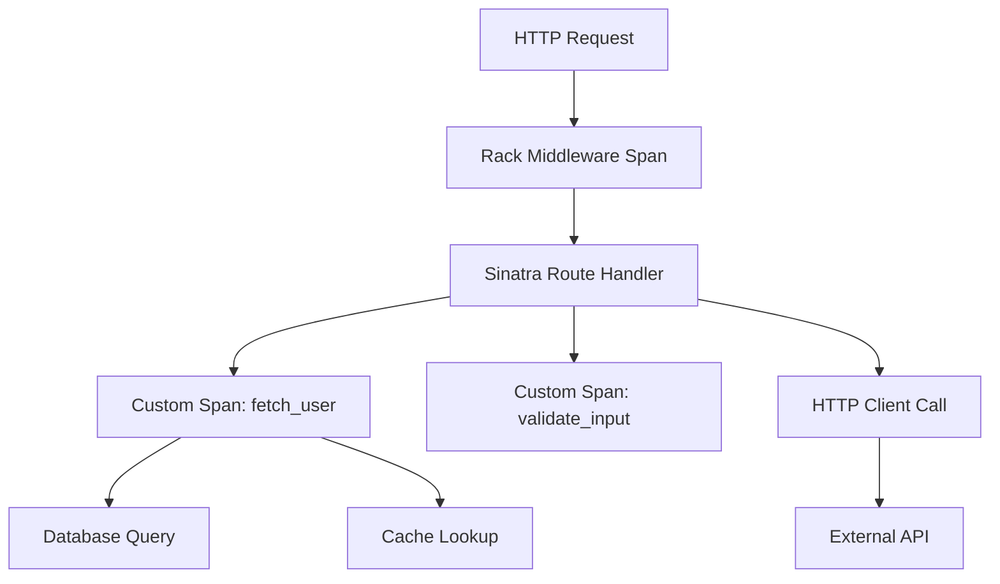

# How to Instrument a Sinatra Application with OpenTelemetry

Author: [nawazdhandala](https://www.github.com/nawazdhandala)

Tags: OpenTelemetry, Ruby, Sinatra, Web Framework, Tracing

Description: Step-by-step guide to adding OpenTelemetry instrumentation to Sinatra applications for complete observability of your lightweight web services.

Sinatra powers countless APIs and microservices because of its simplicity. You define routes, handle requests, and ship features fast. But when something goes wrong in production, that simplicity becomes a problem. Without proper instrumentation, you're flying blind.

OpenTelemetry brings observability to Sinatra without sacrificing its lightweight nature. You get automatic tracing for HTTP requests, manual instrumentation for business logic, and integration with your existing observability stack. The overhead is minimal, and the insights are invaluable.

## Why Sinatra Needs Instrumentation

Sinatra apps often serve as API gateways, webhook receivers, or internal services. They handle thousands of requests per second with minimal resources. When performance degrades or errors spike, you need to know immediately.

Logs tell you what happened, but not why it was slow. Metrics show aggregate patterns, but not which specific requests failed. Traces connect the dots. They show you the complete path of a request through your code, including timing for every operation.

## Core OpenTelemetry Components for Sinatra

Unlike Rails, Sinatra doesn't have a dedicated instrumentation gem. You'll use the Rack instrumentation since Sinatra is built on Rack. This actually gives you more control over what gets instrumented and how.

Add these gems to your Gemfile:

```ruby
# Gemfile

source 'https://rubygems.org'

gem 'sinatra'

# OpenTelemetry core SDK
gem 'opentelemetry-sdk'

# OTLP exporter for sending traces
gem 'opentelemetry-exporter-otlp'

# Rack instrumentation (works with Sinatra)
gem 'opentelemetry-instrumentation-rack'

# HTTP client instrumentation for outbound requests
gem 'opentelemetry-instrumentation-net-http'

# Additional instrumentation based on your dependencies
gem 'opentelemetry-instrumentation-redis'
gem 'opentelemetry-instrumentation-pg' # if using PostgreSQL
```

Run `bundle install` to get everything installed.

## Basic Sinatra App Structure

Here's a typical Sinatra application before instrumentation:

```ruby
# app.rb

require 'sinatra'
require 'json'

# Simple in-memory data store for demo purposes
USERS = {}

get '/health' do
  content_type :json
  { status: 'healthy', timestamp: Time.now.to_i }.to_json
end

get '/users/:id' do
  user_id = params[:id]

  user = USERS[user_id]

  if user
    content_type :json
    user.to_json
  else
    status 404
    { error: 'User not found' }.to_json
  end
end

post '/users' do
  data = JSON.parse(request.body.read)

  user_id = SecureRandom.uuid
  user = {
    id: user_id,
    name: data['name'],
    email: data['email'],
    created_at: Time.now.to_i
  }

  USERS[user_id] = user

  status 201
  content_type :json
  user.to_json
end
```

This works fine but gives you no visibility into request patterns, timing, or errors.

## Configuring OpenTelemetry

Create a configuration file that sets up the OpenTelemetry SDK:

```ruby
# config/opentelemetry.rb

require 'opentelemetry/sdk'
require 'opentelemetry/exporter/otlp'
require 'opentelemetry/instrumentation/rack'
require 'opentelemetry/instrumentation/net_http'

# Configure the SDK before your application starts
OpenTelemetry::SDK.configure do |c|
  # Service name identifies this app in your tracing backend
  c.service_name = ENV.fetch('OTEL_SERVICE_NAME', 'sinatra-api')

  # Add resource attributes for better filtering and grouping
  c.resource = OpenTelemetry::SDK::Resources::Resource.create(
    'service.version' => ENV.fetch('APP_VERSION', 'dev'),
    'deployment.environment' => ENV.fetch('RACK_ENV', 'development'),
    'service.namespace' => ENV.fetch('SERVICE_NAMESPACE', 'default')
  )

  # Configure the exporter to send traces via OTLP
  exporter = OpenTelemetry::Exporter::OTLP::Exporter.new(
    endpoint: ENV.fetch('OTEL_EXPORTER_OTLP_ENDPOINT', 'http://localhost:4318/v1/traces'),
    headers: build_exporter_headers,
    timeout: 10
  )

  # Use batch processor to efficiently export spans
  c.add_span_processor(
    OpenTelemetry::SDK::Trace::Export::BatchSpanProcessor.new(exporter)
  )
end

def build_exporter_headers
  headers = {}

  # Add authentication if your backend requires it
  if ENV['OTEL_EXPORTER_AUTH_TOKEN']
    headers['Authorization'] = "Bearer #{ENV['OTEL_EXPORTER_AUTH_TOKEN']}"
  end

  headers
end
```

## Integrating with Your Sinatra App

Now modify your Sinatra application to use OpenTelemetry instrumentation:

```ruby
# app.rb

require 'sinatra'
require 'json'
require_relative 'config/opentelemetry'

# Enable Rack instrumentation for automatic HTTP tracing
use OpenTelemetry::Instrumentation::Rack::Middlewares::TracerMiddleware

USERS = {}

# Health check endpoint
get '/health' do
  content_type :json
  { status: 'healthy', timestamp: Time.now.to_i }.to_json
end

# Get user by ID
get '/users/:id' do
  user_id = params[:id]

  # Get the current tracer for manual instrumentation
  tracer = OpenTelemetry.tracer_provider.tracer('sinatra-api', '1.0')

  tracer.in_span('fetch_user') do |span|
    # Add user ID as span attribute for filtering
    span.set_attribute('user.id', user_id)

    user = USERS[user_id]

    if user
      span.set_attribute('user.found', true)
      content_type :json
      user.to_json
    else
      span.set_attribute('user.found', false)
      span.add_event('User not found', attributes: { 'user.id' => user_id })

      status 404
      { error: 'User not found' }.to_json
    end
  end
end

# Create new user
post '/users' do
  tracer = OpenTelemetry.tracer_provider.tracer('sinatra-api', '1.0')

  tracer.in_span('create_user') do |span|
    data = JSON.parse(request.body.read)

    # Validate input
    unless data['name'] && data['email']
      span.set_attribute('validation.failed', true)
      span.add_event('Missing required fields')

      status 400
      return { error: 'Name and email are required' }.to_json
    end

    user_id = SecureRandom.uuid
    user = {
      id: user_id,
      name: data['name'],
      email: data['email'],
      created_at: Time.now.to_i
    }

    # Record user details in span
    span.set_attribute('user.id', user_id)
    span.set_attribute('user.email', data['email'])

    USERS[user_id] = user

    span.add_event('User created successfully')

    status 201
    content_type :json
    user.to_json
  end
end
```

The Rack middleware automatically creates spans for every HTTP request. Your manual spans add detail about specific operations within each request.

## Request Lifecycle and Span Structure

When a request hits your Sinatra app, OpenTelemetry creates a hierarchy of spans:



Each span captures timing, attributes, and any errors that occur. The root span (created by Rack middleware) represents the entire HTTP request/response cycle.

## Adding Detailed Instrumentation

For real applications, you want rich context in your traces:

```ruby
# lib/user_service.rb

class UserService
  def initialize
    @tracer = OpenTelemetry.tracer_provider.tracer('user-service', '1.0')
  end

  def find_with_posts(user_id)
    @tracer.in_span('find_user_with_posts', attributes: { 'user.id' => user_id }) do |span|
      # Fetch user data
      user = fetch_user(user_id)

      unless user
        span.set_attribute('user.found', false)
        return nil
      end

      span.set_attribute('user.found', true)

      # Fetch associated posts
      posts = fetch_user_posts(user_id)
      span.set_attribute('posts.count', posts.length)

      user.merge(posts: posts)
    end
  end

  private

  def fetch_user(user_id)
    @tracer.in_span('database.query.users') do |span|
      span.set_attribute('db.operation', 'SELECT')
      span.set_attribute('db.table', 'users')

      # Simulate database query
      sleep(0.01)
      USERS[user_id]
    end
  end

  def fetch_user_posts(user_id)
    @tracer.in_span('database.query.posts') do |span|
      span.set_attribute('db.operation', 'SELECT')
      span.set_attribute('db.table', 'posts')
      span.set_attribute('user.id', user_id)

      # Simulate query
      sleep(0.02)
      []
    end
  end
end
```

Use this service in your Sinatra routes:

```ruby
# app.rb

require_relative 'lib/user_service'

# Initialize service once
user_service = UserService.new

get '/users/:id/complete' do
  user_id = params[:id]

  user_data = user_service.find_with_posts(user_id)

  if user_data
    content_type :json
    user_data.to_json
  else
    status 404
    { error: 'User not found' }.to_json
  end
end
```

## Tracing External API Calls

When your Sinatra app calls external services, you want those calls traced too:

```ruby
# lib/notification_service.rb

require 'net/http'
require 'uri'

class NotificationService
  def initialize
    @tracer = OpenTelemetry.tracer_provider.tracer('notification-service', '1.0')
  end

  def send_welcome_email(user)
    @tracer.in_span('send_welcome_email') do |span|
      span.set_attribute('user.id', user[:id])
      span.set_attribute('user.email', user[:email])

      uri = URI(ENV.fetch('EMAIL_SERVICE_URL', 'http://localhost:3000/emails'))

      # Net::HTTP instrumentation automatically propagates trace context
      response = Net::HTTP.post(
        uri,
        {
          to: user[:email],
          template: 'welcome',
          user_id: user[:id]
        }.to_json,
        'Content-Type' => 'application/json'
      )

      span.set_attribute('http.status_code', response.code.to_i)

      if response.is_a?(Net::HTTPSuccess)
        span.add_event('Email sent successfully')
        true
      else
        span.set_attribute('error', true)
        span.add_event('Email send failed', attributes: {
          'http.status' => response.code,
          'response.body' => response.body
        })
        false
      end
    end
  end
end
```

The Net::HTTP instrumentation creates child spans for each HTTP request and automatically includes trace context headers so the downstream service can continue the trace.

## Error Handling and Recording

Proper error handling ensures failures are captured in traces:

```ruby
# app.rb

require 'sinatra'
require_relative 'config/opentelemetry'
require_relative 'lib/user_service'

use OpenTelemetry::Instrumentation::Rack::Middlewares::TracerMiddleware

# Global error handler
error do
  err = env['sinatra.error']

  # Get the current span and record the error
  span = OpenTelemetry::Trace.current_span
  if span && span.recording?
    span.record_exception(err)
    span.set_attribute('error', true)
  end

  status 500
  content_type :json
  { error: 'Internal server error', message: err.message }.to_json
end

# Specific error handling within a route
post '/users/:id/verify' do
  user_id = params[:id]
  tracer = OpenTelemetry.tracer_provider.tracer('sinatra-api', '1.0')

  tracer.in_span('verify_user') do |span|
    span.set_attribute('user.id', user_id)

    begin
      # Simulate verification logic that might fail
      user = USERS[user_id]
      raise 'User not found' unless user

      # Simulate external verification service
      verification_result = verify_with_external_service(user)

      span.set_attribute('verification.passed', verification_result)

      content_type :json
      { verified: verification_result }.to_json

    rescue StandardError => e
      # Record exception in the current span
      span.record_exception(e)
      span.set_attribute('error', true)

      # Return error response
      status 422
      { error: e.message }.to_json
    end
  end
end

def verify_with_external_service(user)
  # Simulated external call
  true
end
```

Recording exceptions adds stack traces and error details to spans, making debugging much easier.

## Running Your Instrumented Application

Set environment variables and start your Sinatra app:

```bash
# Set up OpenTelemetry configuration
export OTEL_SERVICE_NAME="user-api"
export OTEL_EXPORTER_OTLP_ENDPOINT="http://localhost:4318/v1/traces"
export APP_VERSION="1.0.0"
export RACK_ENV="production"

# Start the application
ruby app.rb
```

For production deployments with Puma or Passenger, the instrumentation works the same way. The middleware integrates at the Rack level, so any Rack-compatible server will work.

## Performance Considerations

OpenTelemetry adds minimal overhead, but you should still be mindful of performance:

**Sampling**: Don't trace every request in high-traffic applications. Use sampling to reduce volume:

```ruby
OpenTelemetry::SDK.configure do |c|
  # Sample 10% of traces
  c.sampler = OpenTelemetry::SDK::Trace::Samplers::TraceIdRatioBased.new(0.1)

  # Rest of configuration...
end
```

**Attribute Size**: Keep span attributes small. Don't add large payloads or full response bodies.

**Batch Processing**: The batch span processor exports spans in batches, reducing network overhead. Tune batch size for your traffic:

```ruby
processor = OpenTelemetry::SDK::Trace::Export::BatchSpanProcessor.new(
  exporter,
  max_queue_size: 2048,
  max_export_batch_size: 512,
  schedule_delay: 5000  # milliseconds
)
```

## Debugging Instrumentation Issues

If traces aren't appearing in your backend, check these common issues:

**Exporter Connectivity**: Verify your app can reach the collector:

```bash
curl -v http://localhost:4318/v1/traces
```

**Span Creation**: Confirm spans are being created by adding debug output:

```ruby
OpenTelemetry::SDK.configure do |c|
  # Enable debug logging
  c.logger = Logger.new($stdout)
  c.logger.level = Logger::DEBUG

  # Rest of configuration...
end
```

**Middleware Order**: Ensure the Rack middleware is registered early:

```ruby
# This should be near the top of your app.rb
use OpenTelemetry::Instrumentation::Rack::Middlewares::TracerMiddleware

# Other middleware
use SomeOtherMiddleware
```

OpenTelemetry transforms Sinatra from a black box into an observable system. You see exactly what happens during each request, how long operations take, and where errors occur. This visibility is essential for maintaining reliable services in production.
