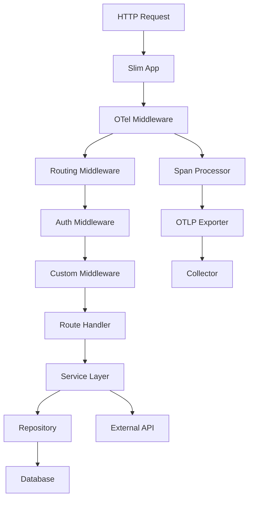

# How to Instrument Slim Framework with OpenTelemetry in PHP

Author: [nawazdhandala](https://www.github.com/nawazdhandala)

Tags: OpenTelemetry, PHP, Slim, Micro-Framework, REST, Tracing

Description: Learn how to add OpenTelemetry instrumentation to Slim Framework applications for distributed tracing, monitoring middleware performance, and tracking REST API operations.

Slim Framework is a popular PHP micro-framework for building APIs and web applications. Its minimalist design and middleware architecture make it ideal for microservices and REST APIs. OpenTelemetry instrumentation helps you understand request flow through middleware stacks, identify performance bottlenecks, and trace dependencies across distributed services.

## Why Instrument Slim Applications

Slim applications typically serve as API gateways or microservices in larger architectures. Without proper instrumentation, it's difficult to identify which middleware components add latency, how long database operations take, or where external API calls become bottlenecks. OpenTelemetry provides end-to-end visibility from the HTTP request through your middleware stack to database queries and external service calls.

## Architecture Overview

Here's how OpenTelemetry integrates with Slim's middleware-based architecture:



## Setting Up OpenTelemetry in Slim

Start by creating a new Slim project or adding OpenTelemetry to an existing one. First, install dependencies:

```bash
composer require slim/slim:"4.*"
composer require slim/psr7
composer require open-telemetry/sdk
composer require open-telemetry/exporter-otlp
```

Create a bootstrap file that initializes OpenTelemetry. Create `src/Bootstrap/OpenTelemetry.php`:

```php
<?php
declare(strict_types=1);

namespace App\Bootstrap;

use OpenTelemetry\API\Globals;
use OpenTelemetry\SDK\Trace\TracerProvider;
use OpenTelemetry\SDK\Trace\SpanProcessor\BatchSpanProcessor;
use OpenTelemetry\Contrib\Otlp\SpanExporter;
use OpenTelemetry\SDK\Resource\ResourceInfo;
use OpenTelemetry\SDK\Resource\ResourceInfoFactory;
use OpenTelemetry\SDK\Common\Attribute\Attributes;
use OpenTelemetry\SemConv\ResourceAttributes;

class OpenTelemetry
{
    public static function initialize(): void
    {
        $serviceName = getenv('OTEL_SERVICE_NAME') ?: 'slim-api';
        $environment = getenv('APP_ENV') ?: 'production';

        $resource = ResourceInfoFactory::defaultResource()->merge(
            ResourceInfo::create(Attributes::create([
                ResourceAttributes::SERVICE_NAME => $serviceName,
                ResourceAttributes::SERVICE_VERSION => '1.0.0',
                ResourceAttributes::DEPLOYMENT_ENVIRONMENT => $environment,
                'framework.name' => 'slim',
                'framework.version' => '4.12.0',
            ]))
        );

        $exporter = new SpanExporter(
            \OpenTelemetry\Contrib\Otlp\HttpTransportFactory::create(
                getenv('OTEL_EXPORTER_OTLP_ENDPOINT') ?: 'http://localhost:4318/v1/traces',
                'application/json'
            )
        );

        $tracerProvider = TracerProvider::builder()
            ->addSpanProcessor(new BatchSpanProcessor($exporter))
            ->setResource($resource)
            ->build();

        Globals::registerInitializer(fn() => $tracerProvider);
    }
}
```

## Creating OpenTelemetry Middleware

Slim's middleware system is perfect for implementing distributed tracing. Create `src/Middleware/TracingMiddleware.php`:

```php
<?php
declare(strict_types=1);

namespace App\Middleware;

use Psr\Http\Message\ResponseInterface;
use Psr\Http\Message\ServerRequestInterface;
use Psr\Http\Server\MiddlewareInterface;
use Psr\Http\Server\RequestHandlerInterface;
use OpenTelemetry\API\Globals;
use OpenTelemetry\API\Trace\SpanKind;
use OpenTelemetry\API\Trace\StatusCode;
use OpenTelemetry\Context\Context;

class TracingMiddleware implements MiddlewareInterface
{
    public function process(
        ServerRequestInterface $request,
        RequestHandlerInterface $handler
    ): ResponseInterface {
        $tracer = Globals::tracerProvider()->getTracer('slim-instrumentation');

        // Extract parent context from incoming request headers
        $parentContext = $this->extractParentContext($request);

        // Create root span for this request
        $span = $tracer
            ->spanBuilder($request->getMethod() . ' ' . $request->getUri()->getPath())
            ->setParent($parentContext)
            ->setSpanKind(SpanKind::KIND_SERVER)
            ->setAttribute('http.method', $request->getMethod())
            ->setAttribute('http.url', (string) $request->getUri())
            ->setAttribute('http.scheme', $request->getUri()->getScheme())
            ->setAttribute('http.host', $request->getUri()->getHost())
            ->setAttribute('http.target', $request->getUri()->getPath())
            ->setAttribute('http.user_agent', $request->getHeaderLine('User-Agent'))
            ->setAttribute('net.peer.ip', $this->getClientIp($request))
            ->startSpan();

        // Activate span context for this request
        $scope = $span->activate();

        // Store span in request attributes for access in controllers
        $request = $request->withAttribute('otel.span', $span);

        try {
            $response = $handler->handle($request);

            // Add response attributes to span
            $span
                ->setAttribute('http.status_code', $response->getStatusCode())
                ->setAttribute('http.response_content_length', $response->getHeaderLine('Content-Length'));

            // Set span status based on HTTP status code
            if ($response->getStatusCode() >= 500) {
                $span->setStatus(StatusCode::STATUS_ERROR, 'Server Error');
            } else {
                $span->setStatus(StatusCode::STATUS_OK);
            }

            return $response;
        } catch (\Throwable $e) {
            $span
                ->recordException($e)
                ->setStatus(StatusCode::STATUS_ERROR, $e->getMessage());
            throw $e;
        } finally {
            $span->end();
            $scope->detach();
        }
    }

    private function extractParentContext(ServerRequestInterface $request): Context
    {
        // Extract trace context from W3C Trace Context headers
        $traceparent = $request->getHeaderLine('traceparent');

        if (empty($traceparent)) {
            return Context::getCurrent();
        }

        // Parse traceparent header and create context
        // Format: version-trace_id-parent_id-trace_flags
        // Example: 00-0af7651916cd43dd8448eb211c80319c-b7ad6b7169203331-01

        return Context::getCurrent();
    }

    private function getClientIp(ServerRequestInterface $request): string
    {
        $serverParams = $request->getServerParams();

        // Check common forwarding headers
        $headers = [
            'HTTP_X_FORWARDED_FOR',
            'HTTP_X_REAL_IP',
            'HTTP_CLIENT_IP',
            'REMOTE_ADDR',
        ];

        foreach ($headers as $header) {
            if (!empty($serverParams[$header])) {
                $ip = $serverParams[$header];
                // Handle multiple IPs in X-Forwarded-For
                if (strpos($ip, ',') !== false) {
                    $ip = trim(explode(',', $ip)[0]);
                }
                return $ip;
            }
        }

        return 'unknown';
    }
}
```

## Tracing Route Handlers

Create a base controller that provides tracing utilities. Create `src/Controller/BaseController.php`:

```php
<?php
declare(strict_types=1);

namespace App\Controller;

use Psr\Http\Message\ServerRequestInterface;
use OpenTelemetry\API\Globals;
use OpenTelemetry\API\Trace\SpanKind;
use OpenTelemetry\API\Trace\SpanInterface;

abstract class BaseController
{
    protected function getTracer()
    {
        return Globals::tracerProvider()->getTracer('slim-instrumentation');
    }

    protected function getRootSpan(ServerRequestInterface $request): ?SpanInterface
    {
        return $request->getAttribute('otel.span');
    }

    protected function traceOperation(
        string $name,
        callable $operation,
        array $attributes = []
    ) {
        $tracer = $this->getTracer();

        $span = $tracer
            ->spanBuilder($name)
            ->setSpanKind(SpanKind::KIND_INTERNAL);

        foreach ($attributes as $key => $value) {
            $span->setAttribute($key, $value);
        }

        $span = $span->startSpan();
        $scope = $span->activate();

        try {
            $result = $operation();
            return $result;
        } catch (\Throwable $e) {
            $span
                ->recordException($e)
                ->setStatus(\OpenTelemetry\API\Trace\StatusCode::STATUS_ERROR, $e->getMessage());
            throw $e;
        } finally {
            $span->end();
            $scope->detach();
        }
    }
}
```

## Implementing a Sample API Controller

Create a sample controller that demonstrates instrumentation. Create `src/Controller/UserController.php`:

```php
<?php
declare(strict_types=1);

namespace App\Controller;

use Psr\Http\Message\ResponseInterface;
use Psr\Http\Message\ServerRequestInterface;
use OpenTelemetry\API\Trace\SpanKind;

class UserController extends BaseController
{
    private $db;

    public function __construct($db)
    {
        $this->db = $db;
    }

    public function getUser(
        ServerRequestInterface $request,
        ResponseInterface $response,
        array $args
    ): ResponseInterface {
        $userId = (int) $args['id'];

        // Trace database query
        $user = $this->traceOperation(
            'db.query.user',
            fn() => $this->fetchUserFromDatabase($userId),
            [
                'db.system' => 'mysql',
                'db.operation' => 'SELECT',
                'user.id' => $userId,
            ]
        );

        if (!$user) {
            $response->getBody()->write(json_encode(['error' => 'User not found']));
            return $response->withStatus(404)->withHeader('Content-Type', 'application/json');
        }

        // Trace external API call
        $enrichedUser = $this->traceOperation(
            'external.api.enrich_user',
            fn() => $this->enrichUserData($user),
            [
                'http.method' => 'GET',
                'http.url' => 'https://api.example.com/users/' . $userId,
            ]
        );

        $response->getBody()->write(json_encode($enrichedUser));
        return $response->withHeader('Content-Type', 'application/json');
    }

    public function listUsers(
        ServerRequestInterface $request,
        ResponseInterface $response
    ): ResponseInterface {
        $queryParams = $request->getQueryParams();
        $limit = (int) ($queryParams['limit'] ?? 10);
        $offset = (int) ($queryParams['offset'] ?? 0);

        // Trace pagination query
        $users = $this->traceOperation(
            'db.query.users.list',
            fn() => $this->fetchUsersFromDatabase($limit, $offset),
            [
                'db.system' => 'mysql',
                'db.operation' => 'SELECT',
                'query.limit' => $limit,
                'query.offset' => $offset,
            ]
        );

        $response->getBody()->write(json_encode([
            'data' => $users,
            'pagination' => [
                'limit' => $limit,
                'offset' => $offset,
                'total' => count($users),
            ],
        ]));

        return $response->withHeader('Content-Type', 'application/json');
    }

    private function fetchUserFromDatabase(int $userId): ?array
    {
        // Simulate database query
        $stmt = $this->db->prepare('SELECT * FROM users WHERE id = ?');
        $stmt->execute([$userId]);
        return $stmt->fetch(\PDO::FETCH_ASSOC) ?: null;
    }

    private function fetchUsersFromDatabase(int $limit, int $offset): array
    {
        // Simulate paginated query
        $stmt = $this->db->prepare('SELECT * FROM users LIMIT ? OFFSET ?');
        $stmt->execute([$limit, $offset]);
        return $stmt->fetchAll(\PDO::FETCH_ASSOC);
    }

    private function enrichUserData(array $user): array
    {
        // Simulate external API call
        $ch = curl_init("https://api.example.com/users/{$user['id']}/profile");
        curl_setopt($ch, CURLOPT_RETURNTRANSFER, true);
        curl_setopt($ch, CURLOPT_TIMEOUT, 2);

        $response = curl_exec($ch);
        $httpCode = curl_getinfo($ch, CURLINFO_HTTP_CODE);
        curl_close($ch);

        if ($httpCode === 200 && $response) {
            $profile = json_decode($response, true);
            return array_merge($user, ['profile' => $profile]);
        }

        return $user;
    }
}
```

## Setting Up the Application

Create your main application file `public/index.php`:

```php
<?php
declare(strict_types=1);

use App\Bootstrap\OpenTelemetry;
use App\Middleware\TracingMiddleware;
use App\Controller\UserController;
use Slim\Factory\AppFactory;
use Psr\Http\Message\ResponseInterface as Response;
use Psr\Http\Message\ServerRequestInterface as Request;

require __DIR__ . '/../vendor/autoload.php';

// Initialize OpenTelemetry
OpenTelemetry::initialize();

// Create Slim app
$app = AppFactory::create();

// Add error middleware
$app->addErrorMiddleware(true, true, true);

// Add OpenTelemetry tracing middleware
$app->add(new TracingMiddleware());

// Set up database connection (simplified for example)
$db = new PDO('mysql:host=localhost;dbname=testdb', 'user', 'password');

// Register routes
$app->get('/users/{id}', function (Request $request, Response $response, array $args) use ($db) {
    $controller = new UserController($db);
    return $controller->getUser($request, $response, $args);
});

$app->get('/users', function (Request $request, Response $response) use ($db) {
    $controller = new UserController($db);
    return $controller->listUsers($request, $response);
});

$app->get('/health', function (Request $request, Response $response) {
    $response->getBody()->write(json_encode(['status' => 'healthy']));
    return $response->withHeader('Content-Type', 'application/json');
});

$app->run();
```

## Tracing Middleware Chain

To see how long each middleware takes, create a timing middleware:

```php
<?php
declare(strict_types=1);

namespace App\Middleware;

use Psr\Http\Message\ResponseInterface;
use Psr\Http\Message\ServerRequestInterface;
use Psr\Http\Server\MiddlewareInterface;
use Psr\Http\Server\RequestHandlerInterface;
use OpenTelemetry\API\Globals;
use OpenTelemetry\API\Trace\SpanKind;

class MiddlewareTracingWrapper implements MiddlewareInterface
{
    private MiddlewareInterface $wrappedMiddleware;
    private string $middlewareName;

    public function __construct(MiddlewareInterface $middleware, string $name)
    {
        $this->wrappedMiddleware = $middleware;
        $this->middlewareName = $name;
    }

    public function process(
        ServerRequestInterface $request,
        RequestHandlerInterface $handler
    ): ResponseInterface {
        $tracer = Globals::tracerProvider()->getTracer('slim-instrumentation');

        $span = $tracer
            ->spanBuilder('middleware.' . $this->middlewareName)
            ->setSpanKind(SpanKind::KIND_INTERNAL)
            ->setAttribute('middleware.name', $this->middlewareName)
            ->startSpan();

        $scope = $span->activate();

        try {
            return $this->wrappedMiddleware->process($request, $handler);
        } finally {
            $span->end();
            $scope->detach();
        }
    }
}
```

## Configuration

Create a `.env` file for configuration:

```bash
OTEL_SERVICE_NAME=slim-api
OTEL_EXPORTER_OTLP_ENDPOINT=http://localhost:4318/v1/traces
OTEL_TRACES_SAMPLER=parentbased_traceidratio
OTEL_TRACES_SAMPLER_ARG=1.0
APP_ENV=development
```

Load environment variables in your bootstrap:

```php
// In public/index.php, before OpenTelemetry::initialize()
$dotenv = Dotenv\Dotenv::createImmutable(__DIR__ . '/..');
$dotenv->load();
```

## Analyzing Trace Data

After instrumentation is active, you'll see detailed traces showing:

- Total request duration from entry to response
- Time spent in each middleware component
- Individual route handler execution time
- Database query performance and parameters
- External API call latency
- Error rates and exception details

Look for patterns like slow database queries, inefficient middleware ordering, or external services with high latency.

## Performance Optimization

For production environments, optimize OpenTelemetry overhead:

1. Use batch span processors instead of simple processors
2. Adjust batch size and export timeouts based on traffic
3. Sample traces appropriately (100% for low traffic, 1-10% for high traffic)
4. Disable detailed SQL statement logging in production

Configure in your bootstrap:

```php
// Adjust batch processor settings
$batchProcessor = new BatchSpanProcessor(
    $exporter,
    null, // Clock
    2048, // Max queue size
    5000, // Scheduled delay (ms)
    512,  // Export timeout (ms)
    512   // Max export batch size
);
```

## Conclusion

OpenTelemetry provides comprehensive observability for Slim Framework applications, revealing how requests flow through your middleware stack and where time is spent. The lightweight instrumentation integrates seamlessly with Slim's architecture while adding minimal overhead. You can now identify slow routes, optimize middleware ordering, and track dependencies across distributed microservices, all with standardized OpenTelemetry traces.
