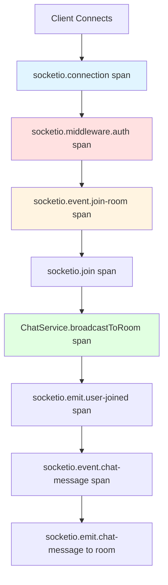

# How to Instrument Socket.io WebSockets with OpenTelemetry

Author: [nawazdhandala](https://www.github.com/nawazdhandala)

Tags: OpenTelemetry, Socket.io, WebSockets, Node.js, Real-Time, Tracing

Description: Learn how to instrument Socket.io WebSocket connections with OpenTelemetry for comprehensive tracing of real-time events, connection lifecycle, and bidirectional communication patterns.

Socket.io has become the standard for real-time bidirectional communication in Node.js applications. Unlike traditional HTTP requests, WebSocket connections maintain persistent bidirectional channels where either side can initiate communication. This creates unique observability challenges. OpenTelemetry instrumentation for Socket.io provides visibility into connection lifecycles, event flows, room operations, and performance characteristics of real-time applications.

## The Observability Challenge of WebSockets

Traditional HTTP instrumentation captures discrete request-response cycles. WebSockets fundamentally differ with long-lived connections that handle multiple events over time. Understanding your real-time application requires tracking:

- Connection establishment and authentication flows
- Event patterns and frequencies across different rooms
- Message propagation delays and latency
- Broadcasting performance to multiple clients
- Connection failures and reconnection patterns
- Resource consumption per connection

Without instrumentation, debugging production issues in Socket.io applications means examining logs without understanding the relationships between events, connections, and application state.

## Understanding Socket.io Architecture

Socket.io operates in layers. At the lowest level, the Engine.IO transport handles connection establishment, heartbeats, and binary/text framing. Above that, Socket.io adds namespaces, rooms, event emitters, and acknowledgment callbacks.

Each connection creates a socket object representing the client. Sockets can join rooms for selective broadcasting. Events flow bidirectionally, and the server can emit to individual sockets, rooms, or broadcast to all connections.

For comprehensive tracing, we instrument at multiple levels: connection lifecycle, event emission/reception, room operations, and middleware execution.

## Installing Dependencies

Set up OpenTelemetry and Socket.io:

```bash
npm install @opentelemetry/sdk-node \
            @opentelemetry/api \
            @opentelemetry/instrumentation \
            @opentelemetry/resources \
            @opentelemetry/semantic-conventions \
            @opentelemetry/exporter-trace-otlp-http \
            socket.io \
            express
```

Initialize OpenTelemetry before your application:

```javascript
// tracing.js
const { NodeSDK } = require('@opentelemetry/sdk-node');
const { getNodeAutoInstrumentations } = require('@opentelemetry/auto-instrumentations-node');
const { Resource } = require('@opentelemetry/resources');
const { SemanticResourceAttributes } = require('@opentelemetry/semantic-conventions');
const { OTLPTraceExporter } = require('@opentelemetry/exporter-trace-otlp-http');

// Configure trace exporter
const traceExporter = new OTLPTraceExporter({
  url: process.env.OTEL_EXPORTER_OTLP_ENDPOINT || 'http://localhost:4318/v1/traces',
});

// Initialize OpenTelemetry SDK
const sdk = new NodeSDK({
  resource: new Resource({
    [SemanticResourceAttributes.SERVICE_NAME]: 'socketio-app',
    [SemanticResourceAttributes.SERVICE_VERSION]: '1.0.0',
  }),
  traceExporter,
  instrumentations: [getNodeAutoInstrumentations()],
});

sdk.start();

process.on('SIGTERM', () => {
  sdk.shutdown()
    .then(() => console.log('Tracing terminated'))
    .catch((error) => console.log('Error terminating tracing', error))
    .finally(() => process.exit(0));
});

module.exports = sdk;
```

## Creating Socket.io Instrumentation

Build comprehensive instrumentation for Socket.io operations:

```javascript
// socketio-instrumentation.js
const { trace, context, SpanStatusCode, SpanKind } = require('@opentelemetry/api');

const tracer = trace.getTracer('socketio-instrumentation', '1.0.0');

/**
 * Instruments a Socket.io server instance with OpenTelemetry
 * Adds tracing for connections, events, and room operations
 */
function instrumentSocketIO(io) {
  // Instrument connection events
  io.on('connection', (socket) => {
    instrumentSocket(socket);
  });

  // Instrument namespace operations
  const originalTo = io.to.bind(io);
  io.to = function(...args) {
    return tracer.startActiveSpan('socketio.to', (span) => {
      span.setAttribute('socketio.room', args[0]);
      span.end();
      return originalTo(...args);
    });
  };

  // Add metrics for connection count
  instrumentConnectionMetrics(io);

  return io;
}

/**
 * Instruments an individual socket connection
 */
function instrumentSocket(socket) {
  // Create a span for the connection lifecycle
  const connectionSpan = tracer.startSpan('socketio.connection', {
    kind: SpanKind.SERVER,
    attributes: {
      'socketio.socket.id': socket.id,
      'socketio.transport': socket.conn.transport.name,
      'client.address': socket.handshake.address,
      'user.agent': socket.handshake.headers['user-agent'],
    },
  });

  // Store span in socket for later access
  socket._otelSpan = connectionSpan;

  // Instrument disconnect
  socket.on('disconnect', (reason) => {
    connectionSpan.addEvent('disconnect', {
      reason,
      'socketio.socket.id': socket.id,
    });
    connectionSpan.setStatus({ code: SpanStatusCode.OK });
    connectionSpan.end();
  });

  // Instrument error events
  socket.on('error', (error) => {
    connectionSpan.recordException(error);
    connectionSpan.setStatus({
      code: SpanStatusCode.ERROR,
      message: error.message,
    });
  });

  // Instrument custom events
  instrumentSocketEvents(socket, connectionSpan);

  // Instrument room operations
  instrumentRoomOperations(socket);
}

/**
 * Wraps socket event handlers with tracing
 */
function instrumentSocketEvents(socket, connectionSpan) {
  const originalOn = socket.on.bind(socket);

  socket.on = function(eventName, handler) {
    // Skip internal Socket.io events
    if (eventName === 'disconnect' || eventName === 'error') {
      return originalOn(eventName, handler);
    }

    // Wrap handler with tracing
    const wrappedHandler = function(...args) {
      return tracer.startActiveSpan(
        `socketio.event.${eventName}`,
        {
          kind: SpanKind.SERVER,
          attributes: {
            'socketio.event.name': eventName,
            'socketio.socket.id': socket.id,
            'socketio.event.args_count': args.length,
          },
        },
        async (span) => {
          try {
            // Check if last argument is an acknowledgment callback
            const hasAck = typeof args[args.length - 1] === 'function';
            if (hasAck) {
              span.setAttribute('socketio.event.has_acknowledgment', true);

              // Wrap acknowledgment callback
              const originalAck = args[args.length - 1];
              args[args.length - 1] = function(...ackArgs) {
                span.addEvent('acknowledgment_sent', {
                  'socketio.ack.args_count': ackArgs.length,
                });
                return originalAck(...ackArgs);
              };
            }

            // Execute the handler
            const result = await handler.apply(this, args);

            span.setStatus({ code: SpanStatusCode.OK });
            return result;
          } catch (error) {
            span.recordException(error);
            span.setStatus({
              code: SpanStatusCode.ERROR,
              message: error.message,
            });
            throw error;
          } finally {
            span.end();
          }
        }
      );
    };

    return originalOn(eventName, wrappedHandler);
  };

  // Instrument emit for outgoing events
  const originalEmit = socket.emit.bind(socket);
  socket.emit = function(eventName, ...args) {
    return tracer.startActiveSpan(
      `socketio.emit.${eventName}`,
      {
        kind: SpanKind.CLIENT,
        attributes: {
          'socketio.event.name': eventName,
          'socketio.socket.id': socket.id,
          'socketio.emit.args_count': args.length,
        },
      },
      (span) => {
        try {
          const result = originalEmit(eventName, ...args);
          span.setStatus({ code: SpanStatusCode.OK });
          return result;
        } catch (error) {
          span.recordException(error);
          span.setStatus({ code: SpanStatusCode.ERROR });
          throw error;
        } finally {
          span.end();
        }
      }
    );
  };
}

/**
 * Instruments room join/leave operations
 */
function instrumentRoomOperations(socket) {
  const originalJoin = socket.join.bind(socket);
  socket.join = function(room) {
    return tracer.startActiveSpan('socketio.join', async (span) => {
      span.setAttribute('socketio.room', room);
      span.setAttribute('socketio.socket.id', socket.id);

      try {
        await originalJoin(room);
        span.addEvent('room_joined', { room });
        span.setStatus({ code: SpanStatusCode.OK });
      } catch (error) {
        span.recordException(error);
        span.setStatus({ code: SpanStatusCode.ERROR });
        throw error;
      } finally {
        span.end();
      }
    });
  };

  const originalLeave = socket.leave.bind(socket);
  socket.leave = function(room) {
    return tracer.startActiveSpan('socketio.leave', async (span) => {
      span.setAttribute('socketio.room', room);
      span.setAttribute('socketio.socket.id', socket.id);

      try {
        await originalLeave(room);
        span.addEvent('room_left', { room });
        span.setStatus({ code: SpanStatusCode.OK });
      } catch (error) {
        span.recordException(error);
        span.setStatus({ code: SpanStatusCode.ERROR });
        throw error;
      } finally {
        span.end();
      }
    });
  };
}

/**
 * Adds connection metrics monitoring
 */
function instrumentConnectionMetrics(io) {
  const { metrics } = require('@opentelemetry/api');
  const meter = metrics.getMeter('socketio-metrics', '1.0.0');

  const connectionGauge = meter.createObservableGauge('socketio.connections.active', {
    description: 'Number of active Socket.io connections',
    unit: 'connections',
  });

  connectionGauge.addCallback((result) => {
    const sockets = io.sockets.sockets;
    result.observe(sockets.size);
  });

  const eventCounter = meter.createCounter('socketio.events.total', {
    description: 'Total number of Socket.io events',
    unit: 'events',
  });

  return { eventCounter };
}

module.exports = { instrumentSocketIO };
```

## Setting Up the Server

Create a Socket.io server with instrumentation:

```javascript
// server.js
require('./tracing');

const express = require('express');
const { createServer } = require('http');
const { Server } = require('socket.io');
const { instrumentSocketIO } = require('./socketio-instrumentation');

const app = express();
const httpServer = createServer(app);

// Create Socket.io server
const io = new Server(httpServer, {
  cors: {
    origin: process.env.CORS_ORIGIN || '*',
    methods: ['GET', 'POST'],
  },
});

// Instrument the Socket.io server
instrumentSocketIO(io);

// Serve static files
app.use(express.static('public'));

// Socket.io connection handling
io.on('connection', (socket) => {
  console.log(`Client connected: ${socket.id}`);

  // Handle authentication
  socket.on('authenticate', async (credentials) => {
    // Authentication logic would go here
    socket.emit('authenticated', { userId: 'user123' });
  });

  // Handle joining chat rooms
  socket.on('join-room', async (roomName) => {
    await socket.join(roomName);
    socket.emit('room-joined', { room: roomName });

    // Notify others in the room
    socket.to(roomName).emit('user-joined', {
      socketId: socket.id,
      room: roomName,
    });
  });

  // Handle chat messages
  socket.on('chat-message', (data) => {
    const { room, message } = data;

    // Broadcast to room
    io.to(room).emit('chat-message', {
      socketId: socket.id,
      message,
      timestamp: Date.now(),
    });
  });

  // Handle leaving rooms
  socket.on('leave-room', async (roomName) => {
    await socket.leave(roomName);
    socket.to(roomName).emit('user-left', { socketId: socket.id });
  });
});

const PORT = process.env.PORT || 3000;
httpServer.listen(PORT, () => {
  console.log(`Server running on port ${PORT}`);
});
```

## Creating a Service Layer with Tracing

Build services that handle business logic with proper tracing:

```javascript
// services/chat-service.js
const { trace, SpanStatusCode } = require('@opentelemetry/api');

const tracer = trace.getTracer('chat-service', '1.0.0');

class ChatService {
  constructor(io) {
    this.io = io;
  }

  /**
   * Broadcasts a message to a room with tracing
   */
  async broadcastToRoom(roomName, eventName, data) {
    return tracer.startActiveSpan('ChatService.broadcastToRoom', async (span) => {
      try {
        span.setAttribute('socketio.room', roomName);
        span.setAttribute('socketio.event', eventName);
        span.setAttribute('chat.message.length', data.message?.length || 0);

        // Get room size for metrics
        const room = this.io.sockets.adapter.rooms.get(roomName);
        const roomSize = room ? room.size : 0;

        span.setAttribute('socketio.room.size', roomSize);
        span.addEvent('broadcast_started', { recipients: roomSize });

        // Perform the broadcast
        this.io.to(roomName).emit(eventName, data);

        span.addEvent('broadcast_completed');
        span.setStatus({ code: SpanStatusCode.OK });
      } catch (error) {
        span.recordException(error);
        span.setStatus({ code: SpanStatusCode.ERROR });
        throw error;
      } finally {
        span.end();
      }
    });
  }

  /**
   * Sends a private message with tracing
   */
  async sendPrivateMessage(socketId, eventName, data) {
    return tracer.startActiveSpan('ChatService.sendPrivateMessage', async (span) => {
      try {
        span.setAttribute('socketio.target.socket_id', socketId);
        span.setAttribute('socketio.event', eventName);

        // Find the target socket
        const socket = this.io.sockets.sockets.get(socketId);

        if (!socket) {
          throw new Error(`Socket ${socketId} not found`);
        }

        span.addEvent('message_sent');
        socket.emit(eventName, data);

        span.setStatus({ code: SpanStatusCode.OK });
      } catch (error) {
        span.recordException(error);
        span.setStatus({ code: SpanStatusCode.ERROR });
        throw error;
      } finally {
        span.end();
      }
    });
  }

  /**
   * Gets room statistics
   */
  async getRoomStats(roomName) {
    return tracer.startActiveSpan('ChatService.getRoomStats', async (span) => {
      span.setAttribute('socketio.room', roomName);

      const room = this.io.sockets.adapter.rooms.get(roomName);
      const stats = {
        name: roomName,
        size: room ? room.size : 0,
        exists: !!room,
      };

      span.setAttribute('socketio.room.size', stats.size);
      span.setAttribute('socketio.room.exists', stats.exists);
      span.end();

      return stats;
    });
  }
}

module.exports = { ChatService };
```

## Adding Middleware with Tracing

Socket.io middleware can be instrumented for authentication and validation:

```javascript
// middleware/auth-middleware.js
const { trace, SpanStatusCode } = require('@opentelemetry/api');

const tracer = trace.getTracer('socketio-middleware', '1.0.0');

/**
 * Authentication middleware with tracing
 */
function authMiddleware(socket, next) {
  return tracer.startActiveSpan('socketio.middleware.auth', async (span) => {
    try {
      span.setAttribute('socketio.socket.id', socket.id);
      span.setAttribute('middleware.type', 'authentication');

      // Extract token from handshake
      const token = socket.handshake.auth.token;

      if (!token) {
        throw new Error('No authentication token provided');
      }

      span.setAttribute('auth.token.provided', true);

      // Verify token (simplified example)
      const user = await verifyToken(token);

      // Attach user to socket
      socket.user = user;

      span.setAttribute('auth.user.id', user.id);
      span.setAttribute('auth.success', true);
      span.setStatus({ code: SpanStatusCode.OK });

      next();
    } catch (error) {
      span.recordException(error);
      span.setStatus({ code: SpanStatusCode.ERROR });
      span.setAttribute('auth.success', false);
      next(error);
    } finally {
      span.end();
    }
  });
}

async function verifyToken(token) {
  // Token verification logic
  return { id: 'user123', name: 'Test User' };
}

module.exports = { authMiddleware };
```

## Visualizing Socket.io Trace Flow

The trace hierarchy for a typical Socket.io interaction:



## Adding Performance Metrics

Track Socket.io performance with detailed metrics:

```javascript
// metrics/socketio-metrics.js
const { metrics } = require('@opentelemetry/api');

const meter = metrics.getMeter('socketio-performance', '1.0.0');

// Create metrics
const messageLatencyHistogram = meter.createHistogram('socketio.message.latency', {
  description: 'Latency of Socket.io messages',
  unit: 'ms',
});

const roomSizeGauge = meter.createObservableGauge('socketio.room.size', {
  description: 'Size of Socket.io rooms',
  unit: 'clients',
});

const eventCounter = meter.createCounter('socketio.events.count', {
  description: 'Count of Socket.io events by type',
  unit: 'events',
});

/**
 * Records message latency
 */
function recordMessageLatency(eventName, latency) {
  messageLatencyHistogram.record(latency, {
    'event.name': eventName,
  });
}

/**
 * Sets up room size monitoring
 */
function setupRoomMonitoring(io) {
  roomSizeGauge.addCallback((result) => {
    const rooms = io.sockets.adapter.rooms;
    rooms.forEach((sockets, roomName) => {
      // Skip socket-specific rooms
      if (!io.sockets.sockets.has(roomName)) {
        result.observe(sockets.size, { room: roomName });
      }
    });
  });
}

module.exports = {
  recordMessageLatency,
  setupRoomMonitoring,
  eventCounter,
};
```

## Client-Side Instrumentation

Instrument the Socket.io client for end-to-end tracing:

```javascript
// public/client.js
// Client-side OpenTelemetry setup (using web SDK)
const { trace, context, propagation } = require('@opentelemetry/api');

const tracer = trace.getTracer('socketio-client', '1.0.0');

// Create Socket.io client with instrumentation
const socket = io('http://localhost:3000', {
  auth: {
    token: 'your-auth-token',
  },
});

/**
 * Wraps emit to add tracing
 */
const originalEmit = socket.emit.bind(socket);
socket.emit = function(eventName, ...args) {
  return tracer.startActiveSpan(`socketio.client.emit.${eventName}`, (span) => {
    span.setAttribute('event.name', eventName);
    span.setAttribute('event.timestamp', Date.now());

    // Serialize trace context
    const carrier = {};
    propagation.inject(context.active(), carrier);

    // Add trace context to message
    const enrichedArgs = args.concat([{ _traceContext: carrier }]);

    const result = originalEmit(eventName, ...enrichedArgs);
    span.end();

    return result;
  });
};
```

## Production Configuration

Configure Socket.io for production with proper resource limits:

```javascript
// production-config.js
const io = new Server(httpServer, {
  pingTimeout: 10000,
  pingInterval: 5000,
  upgradeTimeout: 10000,
  maxHttpBufferSize: 1e6, // 1MB
  cors: {
    origin: process.env.ALLOWED_ORIGINS?.split(',') || [],
    credentials: true,
  },
  transports: ['websocket', 'polling'],
});

// Add connection limits
io.use((socket, next) => {
  const connectionCount = io.sockets.sockets.size;
  if (connectionCount > 10000) {
    return next(new Error('Connection limit reached'));
  }
  next();
});
```

## Debugging Tips

**Issue**: Missing spans for Socket.io events

Ensure middleware and event handlers maintain async context:

```javascript
// Correct - maintains context
socket.on('event', async (data) => {
  await someAsyncOperation();
});

// Incorrect - may lose context
socket.on('event', (data) => {
  someAsyncOperation().then(() => {
    // Context potentially lost
  });
});
```

**Issue**: High cardinality in room metrics

Sample room metrics or aggregate by room patterns:

```javascript
function getRoomCategory(roomName) {
  if (roomName.startsWith('chat-')) return 'chat';
  if (roomName.startsWith('game-')) return 'game';
  return 'other';
}
```

## Conclusion

Instrumenting Socket.io with OpenTelemetry transforms opaque real-time communication into observable, traceable operations. The comprehensive instrumentation approach captures connection lifecycles, event flows, room operations, and broadcasting patterns. This visibility enables debugging production issues, optimizing message latency, and understanding user behavior in real-time applications.

The layered instrumentation strategy covers both server and client sides, creating end-to-end traces that show exactly how messages flow through your system. Combined with metrics for connection counts, room sizes, and message latencies, you gain complete observability of your Socket.io infrastructure.

Use this foundation to build reliable, performant real-time applications with the confidence that comes from comprehensive observability. Track every connection, trace every event, and measure every broadcast to ensure your WebSocket infrastructure scales efficiently.
