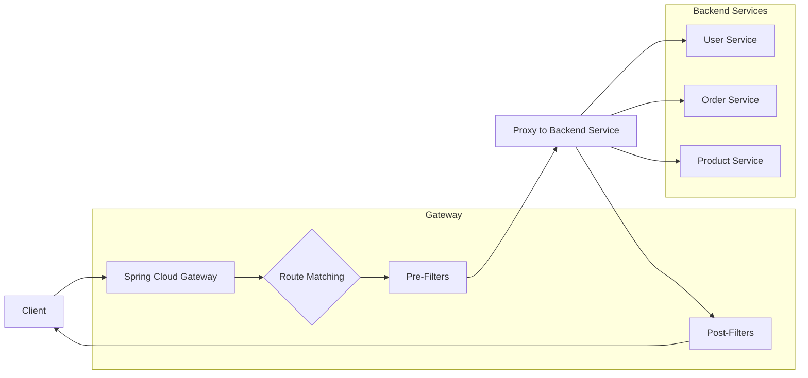
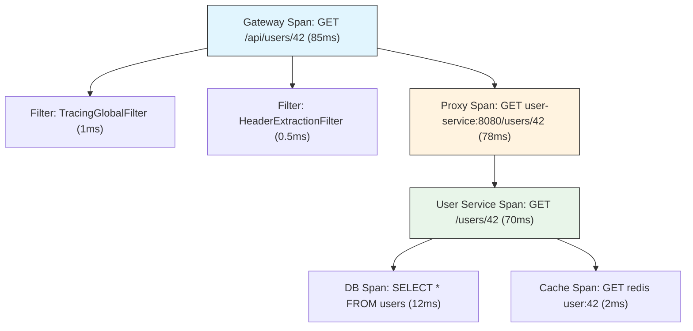

# How to Instrument Spring Cloud Gateway with OpenTelemetry

Author: [nawazdhandala](https://www.github.com/nawazdhandala)

Tags: OpenTelemetry, Spring Cloud Gateway, Java, Distributed Tracing, API Gateway, Spring Boot

Description: A step-by-step guide to instrumenting Spring Cloud Gateway with OpenTelemetry for distributed tracing, custom spans, and latency monitoring across your microservices.

---

Spring Cloud Gateway sits at the front door of your microservices architecture. Every request passes through it on the way in, and every response passes through it on the way out. That makes it the single best place to start your distributed tracing. If your gateway is properly instrumented, every downstream service call automatically gets a trace context, and you can measure the full request lifecycle from the moment it enters your system.

The good news is that OpenTelemetry's Java agent makes this almost zero-configuration. The better news is that you can go beyond the defaults with custom filters, route-level attributes, and gateway-specific metrics that give you real operational insight. This post covers both the quick setup and the deeper customizations.

## Architecture Overview

Before we instrument, let's understand what we're tracing. Spring Cloud Gateway is a reverse proxy built on Spring WebFlux and Project Reactor. Requests flow through a pipeline of filters before being routed to backend services.



Each of these stages is something we want to observe: route matching time, filter execution, backend service latency, and the total gateway overhead.

## Quick Start with the OpenTelemetry Java Agent

The fastest way to instrument Spring Cloud Gateway is with the OpenTelemetry Java agent. It automatically instruments the Netty HTTP server, WebFlux, and the outgoing HTTP client used for proxying. No code changes needed.

First, download the agent JAR:

```bash
# Download the latest OpenTelemetry Java agent
curl -L -o opentelemetry-javaagent.jar \
  https://github.com/open-telemetry/opentelemetry-java-instrumentation/releases/latest/download/opentelemetry-javaagent.jar
```

Then start your gateway with the agent attached:

```bash
# Start Spring Cloud Gateway with the OpenTelemetry Java agent
java -javaagent:opentelemetry-javaagent.jar \
  -Dotel.service.name=api-gateway \
  -Dotel.exporter.otlp.endpoint=http://otel-collector:4317 \
  -Dotel.exporter.otlp.protocol=grpc \
  -Dotel.traces.exporter=otlp \
  -Dotel.metrics.exporter=otlp \
  -jar spring-cloud-gateway.jar
```

That's it for the basics. The agent will create spans for incoming HTTP requests, outgoing proxy calls, and automatically propagate the W3C TraceContext headers to backend services.

## Configuring via application.yml

You can also configure OpenTelemetry through Spring Boot's configuration system. If you prefer `application.yml` over JVM flags, add these properties:

```yaml
# application.yml - OpenTelemetry configuration for Spring Cloud Gateway
spring:
  application:
    name: api-gateway

# Gateway routes configuration
  cloud:
    gateway:
      routes:
        - id: user-service
          uri: http://user-service:8080
          predicates:
            - Path=/api/users/**
          filters:
            - StripPrefix=1
        - id: order-service
          uri: http://order-service:8080
          predicates:
            - Path=/api/orders/**
          filters:
            - StripPrefix=1
        - id: product-service
          uri: http://product-service:8080
          predicates:
            - Path=/api/products/**
          filters:
            - StripPrefix=1

# OpenTelemetry SDK configuration
otel:
  exporter:
    otlp:
      endpoint: http://otel-collector:4317
  resource:
    attributes:
      service.name: api-gateway
      deployment.environment: production
```

## Adding the OpenTelemetry Spring Boot Starter

If you want programmatic control rather than using the Java agent, you can use the OpenTelemetry Spring Boot starter. Add these dependencies to your `build.gradle` or `pom.xml`:

```xml
<!-- pom.xml - OpenTelemetry dependencies for Spring Cloud Gateway -->
<dependencies>
    <!-- Spring Cloud Gateway -->
    <dependency>
        <groupId>org.springframework.cloud</groupId>
        <artifactId>spring-cloud-starter-gateway</artifactId>
    </dependency>

    <!-- OpenTelemetry Spring Boot auto-configuration -->
    <dependency>
        <groupId>io.opentelemetry.instrumentation</groupId>
        <artifactId>opentelemetry-spring-boot-starter</artifactId>
        <version>2.12.0</version>
    </dependency>

    <!-- OTLP exporter for sending traces to the collector -->
    <dependency>
        <groupId>io.opentelemetry</groupId>
        <artifactId>opentelemetry-exporter-otlp</artifactId>
    </dependency>
</dependencies>

<dependencyManagement>
    <dependencies>
        <dependency>
            <groupId>io.opentelemetry.instrumentation</groupId>
            <artifactId>opentelemetry-instrumentation-bom</artifactId>
            <version>2.12.0</version>
            <type>pom</type>
            <scope>import</scope>
        </dependency>
    </dependencies>
</dependencyManagement>
```

## Creating a Custom Tracing Filter

The auto-instrumentation gives you basic HTTP spans. But for a gateway, you often want more context: which route was matched, what filters executed, what the rate limiting status was, and so on. Custom gateway filters let you add this.

This global filter adds route metadata to every span:

```java
// TracingGlobalFilter.java - Adds route information to OpenTelemetry spans
package com.example.gateway.filters;

import io.opentelemetry.api.trace.Span;
import io.opentelemetry.api.trace.StatusCode;
import org.springframework.cloud.gateway.filter.GatewayFilterChain;
import org.springframework.cloud.gateway.filter.GlobalFilter;
import org.springframework.cloud.gateway.route.Route;
import org.springframework.cloud.gateway.support.ServerWebExchangeUtils;
import org.springframework.core.Ordered;
import org.springframework.stereotype.Component;
import org.springframework.web.server.ServerWebExchange;
import reactor.core.publisher.Mono;

@Component
public class TracingGlobalFilter implements GlobalFilter, Ordered {

    @Override
    public Mono<Void> filter(ServerWebExchange exchange, GatewayFilterChain chain) {
        // Get the current OpenTelemetry span for this request
        Span span = Span.current();

        // Extract the matched route from the exchange attributes
        Route route = exchange.getAttribute(ServerWebExchangeUtils.GATEWAY_ROUTE_ATTR);
        if (route != null) {
            // Add route metadata so you can filter traces by route
            span.setAttribute("gateway.route.id", route.getId());
            span.setAttribute("gateway.route.uri", route.getUri().toString());
        }

        // Add request metadata that's useful for debugging
        span.setAttribute("gateway.request.path", exchange.getRequest().getPath().value());
        String clientIp = exchange.getRequest().getRemoteAddress() != null
            ? exchange.getRequest().getRemoteAddress().getAddress().getHostAddress()
            : "unknown";
        span.setAttribute("gateway.client.ip", clientIp);

        long startTime = System.currentTimeMillis();

        return chain.filter(exchange).then(Mono.fromRunnable(() -> {
            // After the request completes, add response metadata
            long duration = System.currentTimeMillis() - startTime;
            span.setAttribute("gateway.total.duration_ms", duration);

            int statusCode = exchange.getResponse().getStatusCode() != null
                ? exchange.getResponse().getStatusCode().value()
                : 0;
            span.setAttribute("http.response.status_code", statusCode);

            // Mark errors for 5xx responses
            if (statusCode >= 500) {
                span.setStatus(StatusCode.ERROR, "Backend returned " + statusCode);
            }
        }));
    }

    @Override
    public int getOrder() {
        // Run very early in the filter chain to capture the full duration
        return Ordered.HIGHEST_PRECEDENCE + 10;
    }
}
```

## Tracing Rate Limiting

If you're using Spring Cloud Gateway's built-in rate limiter, you'll want to know when requests are being throttled. This filter creates a span event whenever rate limiting kicks in:

```java
// RateLimitTracingFilter.java - Traces rate limiting decisions
package com.example.gateway.filters;

import io.opentelemetry.api.trace.Span;
import org.springframework.cloud.gateway.filter.GatewayFilter;
import org.springframework.cloud.gateway.filter.factory.AbstractGatewayFilterFactory;
import org.springframework.http.HttpStatus;
import org.springframework.stereotype.Component;

@Component
public class RateLimitTracingFilter extends AbstractGatewayFilterFactory<Object> {

    @Override
    public GatewayFilter apply(Object config) {
        return (exchange, chain) -> {
            Span span = Span.current();

            return chain.filter(exchange).then(
                reactor.core.publisher.Mono.fromRunnable(() -> {
                    HttpStatus status = (HttpStatus) exchange.getResponse().getStatusCode();

                    // Check if the request was rate limited (HTTP 429)
                    if (status != null && status == HttpStatus.TOO_MANY_REQUESTS) {
                        span.setAttribute("gateway.rate_limited", true);
                        span.addEvent("gateway.rate_limit.triggered");
                    } else {
                        span.setAttribute("gateway.rate_limited", false);
                    }
                })
            );
        };
    }
}
```

## Tracing Circuit Breaker Integration

Spring Cloud Gateway often integrates with Resilience4j for circuit breaking. Tracing circuit breaker state transitions gives you visibility into cascading failures.

```java
// CircuitBreakerTracingFilter.java - Traces circuit breaker decisions
package com.example.gateway.filters;

import io.opentelemetry.api.trace.Span;
import io.opentelemetry.api.trace.StatusCode;
import io.opentelemetry.api.common.Attributes;
import io.opentelemetry.api.common.AttributeKey;
import org.springframework.cloud.gateway.filter.GatewayFilterChain;
import org.springframework.cloud.gateway.filter.GlobalFilter;
import org.springframework.cloud.gateway.support.ServerWebExchangeUtils;
import org.springframework.core.Ordered;
import org.springframework.stereotype.Component;
import org.springframework.web.server.ServerWebExchange;
import reactor.core.publisher.Mono;

@Component
public class CircuitBreakerTracingFilter implements GlobalFilter, Ordered {

    @Override
    public Mono<Void> filter(ServerWebExchange exchange, GatewayFilterChain chain) {
        return chain.filter(exchange).doOnError(throwable -> {
            Span span = Span.current();

            // Check if this error came from a circuit breaker
            if (throwable.getClass().getSimpleName().contains("CircuitBreaker")) {
                span.setAttribute("gateway.circuit_breaker.tripped", true);
                span.addEvent("circuit_breaker.open", Attributes.of(
                    AttributeKey.stringKey("error.type"), throwable.getClass().getSimpleName(),
                    AttributeKey.stringKey("error.message"), throwable.getMessage()
                ));
                span.setStatus(StatusCode.ERROR, "Circuit breaker open");
            }
        }).doFinally(signalType -> {
            Span span = Span.current();

            // Check if a fallback was used
            Boolean fallbackExecuted = exchange.getAttribute(
                ServerWebExchangeUtils.CIRCUITBREAKER_EXECUTION_EXCEPTION_ATTR) != null;
            if (Boolean.TRUE.equals(fallbackExecuted)) {
                span.setAttribute("gateway.fallback.executed", true);
                span.addEvent("circuit_breaker.fallback");
            }
        });
    }

    @Override
    public int getOrder() {
        // Run after the circuit breaker filter
        return Ordered.LOWEST_PRECEDENCE - 10;
    }
}
```

## Custom Metrics for Gateway Health

Beyond traces, you'll want metrics specific to gateway operations. This configuration creates histograms and counters for route-level monitoring:

```java
// GatewayMetrics.java - Custom OpenTelemetry metrics for gateway monitoring
package com.example.gateway.metrics;

import io.opentelemetry.api.metrics.LongCounter;
import io.opentelemetry.api.metrics.DoubleHistogram;
import io.opentelemetry.api.metrics.Meter;
import io.opentelemetry.api.GlobalOpenTelemetry;
import io.opentelemetry.api.common.Attributes;
import io.opentelemetry.api.common.AttributeKey;
import org.springframework.stereotype.Component;

@Component
public class GatewayMetrics {

    private final DoubleHistogram routeLatency;
    private final LongCounter requestCount;
    private final LongCounter errorCount;

    public GatewayMetrics() {
        // Create a meter for gateway-specific metrics
        Meter meter = GlobalOpenTelemetry.getMeter("api-gateway");

        // Histogram tracking per-route latency
        routeLatency = meter.histogramBuilder("gateway.route.duration")
            .setDescription("Latency of requests per gateway route")
            .setUnit("ms")
            .build();

        // Counter for total requests per route
        requestCount = meter.counterBuilder("gateway.route.requests")
            .setDescription("Total requests per gateway route")
            .build();

        // Counter for errors per route
        errorCount = meter.counterBuilder("gateway.route.errors")
            .setDescription("Total errors per gateway route")
            .build();
    }

    public void recordRequest(String routeId, double durationMs, int statusCode) {
        Attributes attrs = Attributes.of(
            AttributeKey.stringKey("route.id"), routeId,
            AttributeKey.longKey("http.status_code"), (long) statusCode
        );

        routeLatency.record(durationMs, attrs);
        requestCount.add(1, attrs);

        // Count 5xx as errors
        if (statusCode >= 500) {
            errorCount.add(1, Attributes.of(
                AttributeKey.stringKey("route.id"), routeId
            ));
        }
    }
}
```

## Collector Configuration

Configure the OpenTelemetry Collector to receive data from the gateway and forward it to your observability backend:

```yaml
# otel-collector-config.yaml
receivers:
  otlp:
    protocols:
      grpc:
        endpoint: "0.0.0.0:4317"
      http:
        endpoint: "0.0.0.0:4318"

processors:
  batch:
    timeout: 5s
    send_batch_size: 512

  # Enrich all telemetry with environment metadata
  resource:
    attributes:
      - key: deployment.environment
        value: production
        action: upsert

  # Sample aggressively for health check routes to reduce noise
  filter:
    traces:
      span:
        - 'attributes["http.target"] == "/actuator/health"'

exporters:
  otlp:
    endpoint: "https://your-oneuptime-instance.com:4317"

service:
  pipelines:
    traces:
      receivers: [otlp]
      processors: [filter, batch, resource]
      exporters: [otlp]
    metrics:
      receivers: [otlp]
      processors: [batch, resource]
      exporters: [otlp]
```

## Propagating Custom Headers

Sometimes you need to propagate custom headers (like tenant IDs or feature flags) alongside the trace context. You can configure the gateway to extract these and add them as span attributes:

```java
// HeaderExtractionFilter.java - Extract custom headers into span attributes
package com.example.gateway.filters;

import io.opentelemetry.api.trace.Span;
import org.springframework.cloud.gateway.filter.GatewayFilterChain;
import org.springframework.cloud.gateway.filter.GlobalFilter;
import org.springframework.core.Ordered;
import org.springframework.stereotype.Component;
import org.springframework.web.server.ServerWebExchange;
import reactor.core.publisher.Mono;

import java.util.List;

@Component
public class HeaderExtractionFilter implements GlobalFilter, Ordered {

    // Headers to extract into span attributes
    private static final List<String> EXTRACTED_HEADERS = List.of(
        "X-Tenant-Id",
        "X-Request-Id",
        "X-Feature-Flags",
        "X-Client-Version"
    );

    @Override
    public Mono<Void> filter(ServerWebExchange exchange, GatewayFilterChain chain) {
        Span span = Span.current();

        // Extract configured headers and add them as span attributes
        for (String header : EXTRACTED_HEADERS) {
            String value = exchange.getRequest().getHeaders().getFirst(header);
            if (value != null) {
                // Convert header name to attribute name: X-Tenant-Id -> gateway.header.tenant_id
                String attrName = "gateway.header." + header
                    .toLowerCase()
                    .replaceFirst("x-", "")
                    .replace("-", "_");
                span.setAttribute(attrName, value);
            }
        }

        return chain.filter(exchange);
    }

    @Override
    public int getOrder() {
        return Ordered.HIGHEST_PRECEDENCE + 20;
    }
}
```

## What Your Traces Look Like

Once everything is in place, a single request trace through the gateway will show:



The gateway span wraps everything. Inside it, you see the filter execution and the proxy call. The proxy call then continues into the backend service where the trace shows the actual work being done. This end-to-end view is incredibly valuable for understanding where time is really spent.

## Wrapping Up

Spring Cloud Gateway is the ideal starting point for distributed tracing in a Spring microservices ecosystem. The OpenTelemetry Java agent gets you basic instrumentation with zero code changes. Custom filters let you add gateway-specific context like route IDs, rate limiting status, and circuit breaker state. And gateway-level metrics give your operations team dashboards they can actually use. Start with the Java agent for quick wins, then layer on the custom filters as you figure out what questions your team needs answered.
