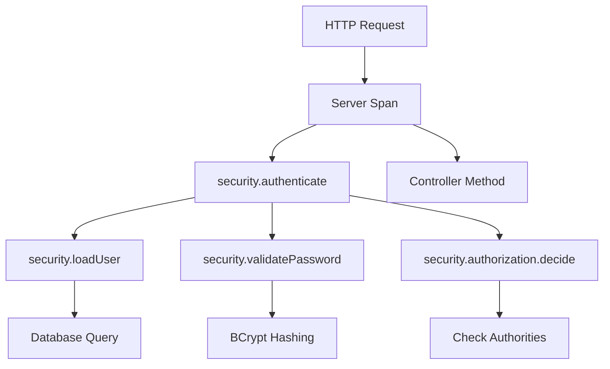

# How to Instrument Spring Security Authentication Flows with OpenTelemetry

Author: [nawazdhandala](https://www.github.com/nawazdhandala)

Tags: OpenTelemetry, Spring Security, Authentication, Java, Tracing

Description: Learn how to add comprehensive OpenTelemetry tracing to Spring Security authentication and authorization flows, including JWT validation, OAuth2 login, and custom authentication providers.

Authentication and authorization failures are among the most difficult issues to debug in distributed systems. Without proper tracing, determining why a user cannot access a resource requires digging through logs across multiple services. OpenTelemetry tracing for Spring Security authentication flows provides clear visibility into security decisions.

## Understanding Spring Security's Filter Chain

Spring Security operates through a chain of filters that process requests before they reach your controllers. Each filter performs specific security checks: authentication, authorization, CSRF protection, and more.

The key filters in a typical Spring Security setup:

1. **SecurityContextPersistenceFilter** - Restores security context from session
2. **UsernamePasswordAuthenticationFilter** - Handles form-based login
3. **BearerTokenAuthenticationFilter** - Processes JWT tokens
4. **OAuth2LoginAuthenticationFilter** - Handles OAuth2 authorization code flow
5. **AuthorizationFilter** - Checks permissions for resources

Tracing these filters reveals exactly where authentication fails and why.

## Setting Up Base Instrumentation

Start with the OpenTelemetry Java agent and Spring Security dependencies:

```xml
<!-- pom.xml -->
<dependencies>
    <!-- Spring Security -->
    <dependency>
        <groupId>org.springframework.boot</groupId>
        <artifactId>spring-boot-starter-security</artifactId>
    </dependency>

    <!-- OAuth2 Resource Server for JWT -->
    <dependency>
        <groupId>org.springframework.boot</groupId>
        <artifactId>spring-boot-starter-oauth2-resource-server</artifactId>
    </dependency>

    <!-- OpenTelemetry API -->
    <dependency>
        <groupId>io.opentelemetry</groupId>
        <artifactId>opentelemetry-api</artifactId>
        <version>1.35.0</version>
    </dependency>

    <!-- OpenTelemetry instrumentation annotations -->
    <dependency>
        <groupId>io.opentelemetry.instrumentation</groupId>
        <artifactId>opentelemetry-instrumentation-annotations</artifactId>
        <version>2.1.0</version>
    </dependency>
</dependencies>
```

The OpenTelemetry Java agent automatically creates spans for HTTP requests, but Spring Security's internal authentication logic needs explicit instrumentation.

## Tracing Custom Authentication Providers

Custom authentication providers contain business logic for validating credentials. Trace these to understand authentication performance and failure reasons.

```java
package com.company.security.auth;

import io.opentelemetry.api.trace.Span;
import io.opentelemetry.api.trace.StatusCode;
import io.opentelemetry.api.trace.Tracer;
import io.opentelemetry.context.Context;
import io.opentelemetry.context.Scope;
import org.springframework.security.authentication.AuthenticationProvider;
import org.springframework.security.authentication.BadCredentialsException;
import org.springframework.security.authentication.UsernamePasswordAuthenticationToken;
import org.springframework.security.core.Authentication;
import org.springframework.security.core.AuthenticationException;
import org.springframework.security.core.userdetails.UserDetails;
import org.springframework.security.core.userdetails.UserDetailsService;
import org.springframework.security.crypto.password.PasswordEncoder;
import org.springframework.stereotype.Component;

/**
 * Custom authentication provider with OpenTelemetry tracing.
 * Creates spans for credential validation and user lookup operations.
 */
@Component
public class TracedAuthenticationProvider implements AuthenticationProvider {

    private final UserDetailsService userDetailsService;
    private final PasswordEncoder passwordEncoder;
    private final Tracer tracer;

    public TracedAuthenticationProvider(
            UserDetailsService userDetailsService,
            PasswordEncoder passwordEncoder,
            Tracer tracer) {
        this.userDetailsService = userDetailsService;
        this.passwordEncoder = passwordEncoder;
        this.tracer = tracer;
    }

    @Override
    public Authentication authenticate(Authentication authentication) throws AuthenticationException {
        String username = authentication.getName();
        String password = authentication.getCredentials().toString();

        // Create span for authentication attempt
        Span span = tracer.spanBuilder("security.authenticate")
            .setAttribute("auth.username", username)
            .setAttribute("auth.method", "username_password")
            .startSpan();

        try (Scope scope = span.makeCurrent()) {
            span.addEvent("authentication.started");

            // Load user details with nested span
            UserDetails user = loadUserWithTracing(username);

            // Validate password with nested span
            validatePasswordWithTracing(password, user.getPassword(), span);

            span.addEvent("authentication.succeeded");
            span.setStatus(StatusCode.OK);

            // Create successful authentication token
            return new UsernamePasswordAuthenticationToken(
                user, password, user.getAuthorities());

        } catch (AuthenticationException e) {
            span.recordException(e);
            span.setAttribute("auth.failure.reason", e.getClass().getSimpleName());
            span.setStatus(StatusCode.ERROR, "Authentication failed");
            span.addEvent("authentication.failed");
            throw e;
        } finally {
            span.end();
        }
    }

    /**
     * Loads user details with a dedicated span.
     * Traces database/cache lookups for user information.
     */
    private UserDetails loadUserWithTracing(String username) {
        Span span = tracer.spanBuilder("security.loadUser")
            .setAttribute("auth.username", username)
            .startSpan();

        try (Scope scope = span.makeCurrent()) {
            UserDetails user = userDetailsService.loadUserByUsername(username);

            span.setAttribute("user.found", true);
            span.setAttribute("user.enabled", user.isEnabled());
            span.setAttribute("user.authorities.count", user.getAuthorities().size());

            return user;
        } catch (Exception e) {
            span.recordException(e);
            span.setAttribute("user.found", false);
            span.setStatus(StatusCode.ERROR, "User not found");
            throw e;
        } finally {
            span.end();
        }
    }

    /**
     * Validates password with tracing.
     * Captures timing information for password hashing operations.
     */
    private void validatePasswordWithTracing(String rawPassword, String encodedPassword, Span parentSpan) {
        Span span = tracer.spanBuilder("security.validatePassword")
            .startSpan();

        try (Scope scope = span.makeCurrent()) {
            long startTime = System.nanoTime();
            boolean matches = passwordEncoder.matches(rawPassword, encodedPassword);
            long duration = System.nanoTime() - startTime;

            span.setAttribute("password.validation.duration.ns", duration);
            span.setAttribute("password.valid", matches);

            if (!matches) {
                span.setStatus(StatusCode.ERROR, "Invalid password");
                throw new BadCredentialsException("Invalid password");
            }
        } finally {
            span.end();
        }
    }

    @Override
    public boolean supports(Class<?> authentication) {
        return UsernamePasswordAuthenticationToken.class.isAssignableFrom(authentication);
    }
}
```

This provider creates a span hierarchy showing the complete authentication flow: loading the user, validating the password, and building the authentication token.

## Tracing JWT Token Validation

JWT authentication involves parsing tokens, validating signatures, and checking claims. Each step should be traced for debugging token issues.

```java
package com.company.security.jwt;

import io.jsonwebtoken.Claims;
import io.jsonwebtoken.JwtException;
import io.jsonwebtoken.Jwts;
import io.opentelemetry.api.trace.Span;
import io.opentelemetry.api.trace.StatusCode;
import io.opentelemetry.api.trace.Tracer;
import io.opentelemetry.context.Scope;
import org.springframework.security.authentication.UsernamePasswordAuthenticationToken;
import org.springframework.security.core.Authentication;
import org.springframework.security.core.authority.SimpleGrantedAuthority;
import org.springframework.stereotype.Component;

import java.security.Key;
import java.util.Date;
import java.util.List;
import java.util.stream.Collectors;

/**
 * JWT token validator with comprehensive OpenTelemetry tracing.
 * Traces token parsing, signature validation, and claims extraction.
 */
@Component
public class TracedJwtTokenValidator {

    private final Key signingKey;
    private final Tracer tracer;

    public TracedJwtTokenValidator(Key signingKey, Tracer tracer) {
        this.signingKey = signingKey;
        this.tracer = tracer;
    }

    /**
     * Validates JWT token and extracts authentication information.
     * Creates detailed spans for each validation step.
     */
    public Authentication validateToken(String token) {
        Span span = tracer.spanBuilder("security.jwt.validate")
            .setAttribute("jwt.present", token != null && !token.isEmpty())
            .startSpan();

        try (Scope scope = span.makeCurrent()) {
            span.addEvent("jwt.validation.started");

            // Parse JWT with tracing
            Claims claims = parseTokenWithTracing(token, span);

            // Validate claims with tracing
            validateClaimsWithTracing(claims, span);

            // Extract authorities from claims
            List<String> roles = claims.get("roles", List.class);
            List<SimpleGrantedAuthority> authorities = roles.stream()
                .map(SimpleGrantedAuthority::new)
                .collect(Collectors.toList());

            String username = claims.getSubject();

            span.setAttribute("jwt.subject", username);
            span.setAttribute("jwt.roles.count", authorities.size());
            span.addEvent("jwt.validation.succeeded");
            span.setStatus(StatusCode.OK);

            return new UsernamePasswordAuthenticationToken(username, null, authorities);

        } catch (JwtException e) {
            span.recordException(e);
            span.setAttribute("jwt.validation.failed", true);
            span.setAttribute("jwt.failure.reason", e.getClass().getSimpleName());
            span.setStatus(StatusCode.ERROR, "JWT validation failed");
            throw e;
        } finally {
            span.end();
        }
    }

    /**
     * Parses JWT token with tracing.
     * Captures parsing errors and token structure information.
     */
    private Claims parseTokenWithTracing(String token, Span parentSpan) {
        Span span = tracer.spanBuilder("security.jwt.parse")
            .startSpan();

        try (Scope scope = span.makeCurrent()) {
            Claims claims = Jwts.parserBuilder()
                .setSigningKey(signingKey)
                .build()
                .parseClaimsJws(token)
                .getBody();

            span.setAttribute("jwt.claims.count", claims.size());
            span.setAttribute("jwt.issuer", claims.getIssuer());
            span.setAttribute("jwt.subject", claims.getSubject());

            return claims;
        } catch (JwtException e) {
            span.recordException(e);
            span.setAttribute("jwt.parse.error", e.getMessage());
            span.setStatus(StatusCode.ERROR, "Failed to parse JWT");
            throw e;
        } finally {
            span.end();
        }
    }

    /**
     * Validates JWT claims (expiration, issuer, etc.).
     * Each validation creates a span event for audit trail.
     */
    private void validateClaimsWithTracing(Claims claims, Span parentSpan) {
        Span span = tracer.spanBuilder("security.jwt.validateClaims")
            .startSpan();

        try (Scope scope = span.makeCurrent()) {
            // Validate expiration
            Date expiration = claims.getExpiration();
            boolean expired = expiration.before(new Date());

            span.setAttribute("jwt.expired", expired);
            span.setAttribute("jwt.expiration", expiration.toString());
            span.addEvent("jwt.expiration.checked");

            if (expired) {
                span.setStatus(StatusCode.ERROR, "Token expired");
                throw new JwtException("Token expired");
            }

            // Validate issuer
            String issuer = claims.getIssuer();
            String expectedIssuer = "https://api.company.com";
            boolean validIssuer = expectedIssuer.equals(issuer);

            span.setAttribute("jwt.issuer.valid", validIssuer);
            span.addEvent("jwt.issuer.checked");

            if (!validIssuer) {
                span.setStatus(StatusCode.ERROR, "Invalid issuer");
                throw new JwtException("Invalid token issuer");
            }

            span.addEvent("jwt.claims.validated");

        } finally {
            span.end();
        }
    }
}
```

JWT validation spans show exactly which validation step failed, making token issues easy to diagnose.

## Tracing Authorization Decisions

Spring Security's authorization system checks if authenticated users have permission to access resources. Trace these checks to understand access denial reasons.

```java
package com.company.security.authorization;

import io.opentelemetry.api.trace.Span;
import io.opentelemetry.api.trace.StatusCode;
import io.opentelemetry.api.trace.Tracer;
import io.opentelemetry.context.Scope;
import org.springframework.security.access.AccessDecisionManager;
import org.springframework.security.access.AccessDeniedException;
import org.springframework.security.access.ConfigAttribute;
import org.springframework.security.authentication.InsufficientAuthenticationException;
import org.springframework.security.core.Authentication;
import org.springframework.security.core.GrantedAuthority;
import org.springframework.stereotype.Component;

import java.util.Collection;
import java.util.stream.Collectors;

/**
 * Custom access decision manager with OpenTelemetry tracing.
 * Traces authorization decisions for debugging access control issues.
 */
@Component
public class TracedAccessDecisionManager implements AccessDecisionManager {

    private final Tracer tracer;

    public TracedAccessDecisionManager(Tracer tracer) {
        this.tracer = tracer;
    }

    @Override
    public void decide(Authentication authentication, Object object, Collection<ConfigAttribute> configAttributes)
            throws AccessDeniedException, InsufficientAuthenticationException {

        // Extract resource information
        String resource = object.toString();

        Span span = tracer.spanBuilder("security.authorization.decide")
            .setAttribute("auth.user", authentication.getName())
            .setAttribute("auth.authenticated", authentication.isAuthenticated())
            .setAttribute("auth.resource", resource)
            .startSpan();

        try (Scope scope = span.makeCurrent()) {
            // Get user authorities
            Collection<String> userAuthorities = authentication.getAuthorities().stream()
                .map(GrantedAuthority::getAuthority)
                .collect(Collectors.toList());

            span.setAttribute("auth.user.authorities", String.join(",", userAuthorities));

            // Get required authorities
            Collection<String> requiredAuthorities = configAttributes.stream()
                .map(ConfigAttribute::getAttribute)
                .collect(Collectors.toList());

            span.setAttribute("auth.required.authorities", String.join(",", requiredAuthorities));
            span.addEvent("authorization.checking");

            // Check if user has required authorities
            boolean hasAccess = userAuthorities.stream()
                .anyMatch(requiredAuthorities::contains);

            span.setAttribute("auth.access.granted", hasAccess);

            if (!hasAccess) {
                span.setStatus(StatusCode.ERROR, "Access denied");
                span.addEvent("authorization.denied");
                throw new AccessDeniedException("Insufficient permissions");
            }

            span.addEvent("authorization.granted");
            span.setStatus(StatusCode.OK);

        } finally {
            span.end();
        }
    }

    @Override
    public boolean supports(ConfigAttribute attribute) {
        return true;
    }

    @Override
    public boolean supports(Class<?> clazz) {
        return true;
    }
}
```

Authorization spans show which roles the user has, which roles are required, and why access was denied.

## Tracing OAuth2 Login Flow

OAuth2 authentication involves multiple redirects and token exchanges. Trace the complete flow to debug OAuth issues.

```java
package com.company.security.oauth2;

import io.opentelemetry.api.trace.Span;
import io.opentelemetry.api.trace.StatusCode;
import io.opentelemetry.api.trace.Tracer;
import io.opentelemetry.context.Scope;
import org.springframework.security.core.Authentication;
import org.springframework.security.oauth2.client.authentication.OAuth2AuthenticationToken;
import org.springframework.security.oauth2.core.user.OAuth2User;
import org.springframework.security.web.authentication.AuthenticationSuccessHandler;
import org.springframework.stereotype.Component;

import javax.servlet.ServletException;
import javax.servlet.http.HttpServletRequest;
import javax.servlet.http.HttpServletResponse;
import java.io.IOException;

/**
 * OAuth2 authentication success handler with tracing.
 * Captures OAuth2 provider information and user attributes.
 */
@Component
public class TracedOAuth2SuccessHandler implements AuthenticationSuccessHandler {

    private final Tracer tracer;

    public TracedOAuth2SuccessHandler(Tracer tracer) {
        this.tracer = tracer;
    }

    @Override
    public void onAuthenticationSuccess(
            HttpServletRequest request,
            HttpServletResponse response,
            Authentication authentication) throws IOException, ServletException {

        Span span = tracer.spanBuilder("security.oauth2.success")
            .setAttribute("auth.method", "oauth2")
            .startSpan();

        try (Scope scope = span.makeCurrent()) {
            if (authentication instanceof OAuth2AuthenticationToken) {
                OAuth2AuthenticationToken oauth2Token = (OAuth2AuthenticationToken) authentication;
                OAuth2User oauth2User = oauth2Token.getPrincipal();

                // Capture OAuth2 provider information
                String provider = oauth2Token.getAuthorizedClientRegistrationId();
                span.setAttribute("oauth2.provider", provider);
                span.setAttribute("oauth2.user.name", oauth2User.getName());

                // Capture user attributes
                String email = oauth2User.getAttribute("email");
                if (email != null) {
                    span.setAttribute("oauth2.user.email", email);
                }

                span.setAttribute("oauth2.attributes.count", oauth2User.getAttributes().size());
                span.addEvent("oauth2.authentication.completed");
            }

            span.setStatus(StatusCode.OK);
            response.sendRedirect("/dashboard");

        } catch (Exception e) {
            span.recordException(e);
            span.setStatus(StatusCode.ERROR, "OAuth2 success handling failed");
            throw e;
        } finally {
            span.end();
        }
    }
}
```

Configure the OAuth2 success handler in your security configuration:

```java
package com.company.security.config;

import com.company.security.oauth2.TracedOAuth2SuccessHandler;
import org.springframework.context.annotation.Bean;
import org.springframework.context.annotation.Configuration;
import org.springframework.security.config.annotation.web.builders.HttpSecurity;
import org.springframework.security.web.SecurityFilterChain;

@Configuration
public class SecurityConfig {

    private final TracedOAuth2SuccessHandler oauth2SuccessHandler;

    public SecurityConfig(TracedOAuth2SuccessHandler oauth2SuccessHandler) {
        this.oauth2SuccessHandler = oauth2SuccessHandler;
    }

    @Bean
    public SecurityFilterChain securityFilterChain(HttpSecurity http) throws Exception {
        http
            .oauth2Login(oauth2 -> oauth2
                .successHandler(oauth2SuccessHandler)
            )
            .authorizeHttpRequests(authz -> authz
                .requestMatchers("/public/**").permitAll()
                .anyRequest().authenticated()
            );

        return http.build();
    }
}
```

## Complete Authentication Flow Visualization

A traced authentication request creates a span hierarchy:



This visualization shows exactly where authentication time is spent and where failures occur.

## Tracing Configuration Bean

Register the OpenTelemetry tracer for dependency injection:

```java
package com.company.security.config;

import io.opentelemetry.api.GlobalOpenTelemetry;
import io.opentelemetry.api.trace.Tracer;
import org.springframework.context.annotation.Bean;
import org.springframework.context.annotation.Configuration;

@Configuration
public class TracingConfig {

    @Bean
    public Tracer tracer() {
        return GlobalOpenTelemetry.getTracer("spring-security", "1.0.0");
    }
}
```

## Security Considerations for Tracing

When tracing authentication, avoid capturing sensitive data:

1. **Never log passwords** - Even hashed passwords should not appear in traces
2. **Redact tokens** - Log token presence, not token values
3. **Hash user identifiers** - Consider hashing usernames in high-security environments
4. **Limit attribute size** - Avoid capturing full claim sets or large attributes

Example of safe attribute logging:

```java
// Safe - logs presence, not value
span.setAttribute("jwt.present", true);

// Unsafe - logs actual token
// span.setAttribute("jwt.token", actualToken); // NEVER DO THIS

// Safe - logs username
span.setAttribute("auth.username", username);

// Safe - logs token type
span.setAttribute("jwt.type", "Bearer");
```

Comprehensive tracing of Spring Security authentication flows provides invaluable debugging information. By instrumenting authentication providers, JWT validation, authorization decisions, and OAuth2 flows, you create an audit trail that shows exactly why authentication succeeded or failed. This visibility transforms security debugging from guesswork into systematic investigation.
