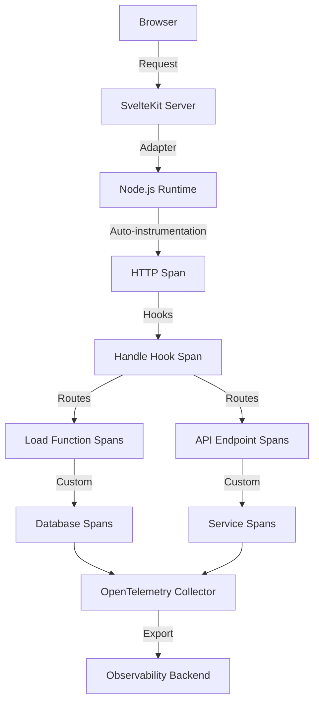

# How to Instrument SvelteKit with OpenTelemetry for Full-Stack Tracing

Author: [nawazdhandala](https://www.github.com/nawazdhandala)

Tags: OpenTelemetry, SvelteKit, Svelte, Full-Stack, Tracing, JavaScript

Description: Learn how to implement comprehensive distributed tracing in SvelteKit applications using OpenTelemetry to monitor server-side rendering, API routes, and client interactions.

SvelteKit provides a modern approach to building full-stack web applications with its file-based routing, server-side rendering, and API route system. As applications grow in complexity, understanding performance across the entire stack becomes essential for maintaining fast, reliable user experiences. OpenTelemetry offers standardized instrumentation to trace requests from the browser through SvelteKit's server components and into backend services.

This comprehensive guide covers implementing distributed tracing in SvelteKit applications, from initial setup through advanced patterns for monitoring server functions, API endpoints, and data loading operations.

## Understanding SvelteKit's Request Flow

SvelteKit applications handle requests through multiple layers. A typical page load might execute server-side load functions, render components on the server, hydrate in the browser, and make subsequent API calls to SvelteKit endpoints. Each layer represents an opportunity for performance issues.

OpenTelemetry tracing provides:

- Visibility into server-side load function execution times
- Tracking of API endpoint performance and error rates
- Correlation between client actions and server processing
- Identification of slow database queries or external API calls
- Analysis of server-side rendering performance

## Architecture Overview

The tracing architecture for a SvelteKit application spans both server and client:



## Setting Up Dependencies

Install the OpenTelemetry packages needed for Node.js instrumentation. SvelteKit runs on Node.js when using the Node adapter, allowing us to use standard Node.js instrumentation.

```bash
npm install @opentelemetry/api \
  @opentelemetry/sdk-node \
  @opentelemetry/auto-instrumentations-node \
  @opentelemetry/instrumentation-http \
  @opentelemetry/exporter-trace-otlp-http \
  @opentelemetry/resources \
  @opentelemetry/semantic-conventions
```

For SvelteKit, you'll also want to ensure you're using the Node adapter:

```bash
npm install -D @sveltejs/adapter-node
```

## Configuring OpenTelemetry Initialization

Create an instrumentation file that initializes OpenTelemetry before SvelteKit loads. This ensures all HTTP requests and framework operations are automatically traced.

```javascript
// instrumentation.js
// OpenTelemetry initialization for SvelteKit application
// Must be imported before any application code executes

const { NodeSDK } = require('@opentelemetry/sdk-node');
const { getNodeAutoInstrumentations } = require('@opentelemetry/auto-instrumentations-node');
const { OTLPTraceExporter } = require('@opentelemetry/exporter-trace-otlp-http');
const { Resource } = require('@opentelemetry/resources');
const { SemanticResourceAttributes } = require('@opentelemetry/semantic-conventions');

// Configure trace exporter to send data to OpenTelemetry collector
const traceExporter = new OTLPTraceExporter({
  url: process.env.OTEL_EXPORTER_OTLP_ENDPOINT || 'http://localhost:4318/v1/traces',
  headers: {
    // Add authentication headers if required
    // 'Authorization': `Bearer ${process.env.OTEL_AUTH_TOKEN}`
  },
});

// Define resource attributes to identify this service
const resource = Resource.default().merge(
  new Resource({
    [SemanticResourceAttributes.SERVICE_NAME]: 'sveltekit-app',
    [SemanticResourceAttributes.SERVICE_VERSION]: process.env.npm_package_version || '1.0.0',
    [SemanticResourceAttributes.DEPLOYMENT_ENVIRONMENT]: process.env.NODE_ENV || 'development',
    'app.framework': 'sveltekit',
    'app.framework.version': '2.0.0',
  })
);

// Initialize OpenTelemetry SDK with automatic instrumentations
const sdk = new NodeSDK({
  resource,
  traceExporter,
  instrumentations: [
    getNodeAutoInstrumentations({
      '@opentelemetry/instrumentation-http': {
        // Ignore health check and static asset requests
        ignoreIncomingRequestHook: (req) => {
          const ignorePaths = ['/health', '/_app/', '/favicon.ico'];
          return ignorePaths.some(path => req.url?.startsWith(path));
        },
        // Add custom attributes to HTTP spans
        requestHook: (span, request) => {
          span.setAttribute('http.user_agent', request.headers['user-agent'] || 'unknown');
        },
      },
      '@opentelemetry/instrumentation-fs': {
        enabled: false, // Reduce noise from filesystem operations
      },
    }),
  ],
});

// Start the SDK
sdk.start();
console.log('OpenTelemetry instrumentation started');

// Gracefully shutdown on process termination
process.on('SIGTERM', () => {
  sdk.shutdown()
    .then(() => console.log('OpenTelemetry SDK shutdown successfully'))
    .catch((error) => console.error('Error shutting down OpenTelemetry SDK', error))
    .finally(() => process.exit(0));
});
```

## Integrating with SvelteKit Server

Update your SvelteKit server entry point to load instrumentation before starting the server. For the Node adapter, create or modify the server file.

```javascript
// server.js
// SvelteKit server with OpenTelemetry initialization
// Import instrumentation FIRST before any other code

require('./instrumentation');

const { handler } = require('./build/handler.js');
const express = require('express');
const { trace } = require('@opentelemetry/api');

const app = express();
const tracer = trace.getTracer('sveltekit-server');

// Add custom tracing middleware before SvelteKit handler
app.use((req, res, next) => {
  const span = trace.getActiveSpan();
  if (span) {
    // Enrich the active span with SvelteKit-specific attributes
    span.setAttribute('sveltekit.path', req.path);
    span.setAttribute('sveltekit.method', req.method);
  }
  next();
});

// SvelteKit handler processes all requests
app.use(handler);

const port = process.env.PORT || 3000;
const server = app.listen(port, () => {
  console.log(`SvelteKit server listening on port ${port}`);
});

// Handle graceful shutdown
process.on('SIGTERM', () => {
  console.log('SIGTERM signal received: closing HTTP server');
  server.close(() => {
    console.log('HTTP server closed');
  });
});
```

Update your `svelte.config.js` to use the Node adapter:

```javascript
// svelte.config.js
import adapter from '@sveltejs/adapter-node';

/** @type {import('@sveltejs/kit').Config} */
const config = {
  kit: {
    adapter: adapter({
      out: 'build',
      precompress: false,
      envPrefix: '',
    }),
  },
};

export default config;
```

## Tracing Server Load Functions

SvelteKit's load functions run on the server during SSR. Instrumenting these functions helps you understand which data fetching operations are slowing down page renders.

```typescript
// src/routes/products/[id]/+page.server.ts
// Server load function with OpenTelemetry tracing

import { error } from '@sveltejs/kit';
import type { PageServerLoad } from './$types';
import { trace } from '@opentelemetry/api';

const tracer = trace.getTracer('sveltekit-load-functions');

interface Product {
  id: string;
  name: string;
  price: number;
  description: string;
}

interface Review {
  id: string;
  rating: number;
  comment: string;
  author: string;
}

export const load: PageServerLoad = async ({ params, fetch, depends }) => {
  const productId = params.id;

  // Create a span for the entire load function
  return await tracer.startActiveSpan('load.product.details', async (span) => {
    try {
      span.setAttribute('product.id', productId);
      span.setAttribute('load.type', 'server');
      span.setAttribute('route', '/products/[id]');

      // Indicate what this load function depends on for revalidation
      depends('app:product');

      // Fetch product data with custom span
      const product = await tracer.startActiveSpan('fetch.product', async (fetchSpan) => {
        fetchSpan.setAttribute('fetch.type', 'database');
        fetchSpan.setAttribute('product.id', productId);

        try {
          const data = await fetchProductFromDatabase(productId);
          if (!data) {
            throw new Error('Product not found');
          }
          fetchSpan.setStatus({ code: 1 }); // OK
          return data;
        } catch (err) {
          fetchSpan.recordException(err as Error);
          fetchSpan.setStatus({ code: 2, message: (err as Error).message }); // ERROR
          throw err;
        } finally {
          fetchSpan.end();
        }
      });

      // Fetch reviews in parallel with another custom span
      const reviews = await tracer.startActiveSpan('fetch.reviews', async (reviewSpan) => {
        reviewSpan.setAttribute('fetch.type', 'api');
        reviewSpan.setAttribute('product.id', productId);

        try {
          const data = await fetchProductReviews(productId);
          reviewSpan.setAttribute('reviews.count', data.length);
          reviewSpan.setStatus({ code: 1 });
          return data;
        } catch (err) {
          reviewSpan.recordException(err as Error);
          reviewSpan.setStatus({ code: 2, message: (err as Error).message });
          // Reviews are optional, don't fail the whole page
          return [];
        } finally {
          reviewSpan.end();
        }
      });

      span.setStatus({ code: 1 });
      return {
        product,
        reviews,
      };
    } catch (err) {
      span.recordException(err as Error);
      span.setStatus({ code: 2, message: (err as Error).message });
      throw error(404, 'Product not found');
    } finally {
      span.end();
    }
  });
};

// Simulate database fetch
async function fetchProductFromDatabase(id: string): Promise<Product> {
  await new Promise(resolve => setTimeout(resolve, 80));
  return {
    id,
    name: 'Sample Product',
    price: 29.99,
    description: 'A great product for your needs',
  };
}

// Simulate API call for reviews
async function fetchProductReviews(productId: string): Promise<Review[]> {
  await new Promise(resolve => setTimeout(resolve, 120));
  return [
    { id: '1', rating: 5, comment: 'Excellent product!', author: 'John' },
    { id: '2', rating: 4, comment: 'Good value', author: 'Jane' },
  ];
}
```

## Instrumenting API Routes

SvelteKit's API routes (endpoints) handle backend logic. Tracing these endpoints helps monitor their performance and error rates independently from page loads.

```typescript
// src/routes/api/products/+server.ts
// API endpoint with OpenTelemetry tracing

import { json } from '@sveltejs/kit';
import type { RequestHandler } from './$types';
import { trace } from '@opentelemetry/api';

const tracer = trace.getTracer('sveltekit-api');

interface CreateProductRequest {
  name: string;
  price: number;
  description: string;
}

// GET endpoint to list products
export const GET: RequestHandler = async ({ url }) => {
  return await tracer.startActiveSpan('api.products.list', async (span) => {
    try {
      span.setAttribute('http.method', 'GET');
      span.setAttribute('api.endpoint', '/api/products');

      // Parse query parameters
      const page = parseInt(url.searchParams.get('page') || '1');
      const limit = parseInt(url.searchParams.get('limit') || '10');

      span.setAttribute('query.page', page);
      span.setAttribute('query.limit', limit);

      // Fetch products from database with tracing
      const products = await tracer.startActiveSpan('db.query.products', async (dbSpan) => {
        dbSpan.setAttribute('db.operation', 'SELECT');
        dbSpan.setAttribute('db.table', 'products');
        dbSpan.setAttribute('db.page', page);
        dbSpan.setAttribute('db.limit', limit);

        try {
          const data = await queryProducts(page, limit);
          dbSpan.setAttribute('db.result.count', data.length);
          dbSpan.setStatus({ code: 1 });
          return data;
        } catch (err) {
          dbSpan.recordException(err as Error);
          dbSpan.setStatus({ code: 2, message: (err as Error).message });
          throw err;
        } finally {
          dbSpan.end();
        }
      });

      span.setAttribute('response.count', products.length);
      span.setStatus({ code: 1 });

      return json({
        products,
        page,
        limit,
        total: products.length,
      });
    } catch (err) {
      span.recordException(err as Error);
      span.setStatus({ code: 2, message: (err as Error).message });
      return json({ error: 'Failed to fetch products' }, { status: 500 });
    } finally {
      span.end();
    }
  });
};

// POST endpoint to create a product
export const POST: RequestHandler = async ({ request }) => {
  return await tracer.startActiveSpan('api.products.create', async (span) => {
    try {
      span.setAttribute('http.method', 'POST');
      span.setAttribute('api.endpoint', '/api/products');

      // Parse and validate request body
      const body: CreateProductRequest = await request.json();

      span.setAttribute('product.name', body.name);
      span.setAttribute('product.price', body.price);

      // Validate input with a custom span
      await tracer.startActiveSpan('validation.product', async (validationSpan) => {
        try {
          if (!body.name || body.name.length < 3) {
            throw new Error('Product name must be at least 3 characters');
          }
          if (!body.price || body.price <= 0) {
            throw new Error('Product price must be positive');
          }
          validationSpan.setStatus({ code: 1 });
        } catch (err) {
          validationSpan.recordException(err as Error);
          validationSpan.setStatus({ code: 2, message: (err as Error).message });
          throw err;
        } finally {
          validationSpan.end();
        }
      });

      // Insert into database with tracing
      const productId = await tracer.startActiveSpan('db.insert.product', async (dbSpan) => {
        dbSpan.setAttribute('db.operation', 'INSERT');
        dbSpan.setAttribute('db.table', 'products');

        try {
          const id = await insertProduct(body);
          dbSpan.setAttribute('product.id', id);
          dbSpan.setStatus({ code: 1 });
          return id;
        } catch (err) {
          dbSpan.recordException(err as Error);
          dbSpan.setStatus({ code: 2, message: (err as Error).message });
          throw err;
        } finally {
          dbSpan.end();
        }
      });

      span.setAttribute('product.id', productId);
      span.setStatus({ code: 1 });

      return json({ id: productId, ...body }, { status: 201 });
    } catch (err) {
      span.recordException(err as Error);
      span.setStatus({ code: 2, message: (err as Error).message });
      return json({ error: (err as Error).message }, { status: 400 });
    } finally {
      span.end();
    }
  });
};

// Simulate database query
async function queryProducts(page: number, limit: number) {
  await new Promise(resolve => setTimeout(resolve, 60));
  return Array.from({ length: limit }, (_, i) => ({
    id: `${page}-${i}`,
    name: `Product ${i}`,
    price: 19.99 + i,
  }));
}

// Simulate database insert
async function insertProduct(data: CreateProductRequest): Promise<string> {
  await new Promise(resolve => setTimeout(resolve, 90));
  return `prod-${Date.now()}`;
}
```

## Using Hooks for Global Tracing

SvelteKit hooks allow you to run code for every request. Use the handle hook to add tracing context and enrich spans with application-specific data.

```typescript
// src/hooks.server.ts
// Global hooks with OpenTelemetry context enrichment

import type { Handle } from '@sveltejs/kit';
import { trace, context } from '@opentelemetry/api';

const tracer = trace.getTracer('sveltekit-hooks');

// Handle hook runs for every server-side request
export const handle: Handle = async ({ event, resolve }) => {
  return await tracer.startActiveSpan('hook.handle', async (span) => {
    try {
      // Add request context to the span
      span.setAttribute('sveltekit.route.id', event.route.id || 'unknown');
      span.setAttribute('sveltekit.url.pathname', event.url.pathname);
      span.setAttribute('sveltekit.url.search', event.url.search);
      span.setAttribute('http.method', event.request.method);

      // Extract user information if available
      const userId = event.cookies.get('user_id');
      if (userId) {
        span.setAttribute('user.id', userId);
      }

      // Add custom attributes from headers
      const requestId = event.request.headers.get('x-request-id');
      if (requestId) {
        span.setAttribute('request.id', requestId);
      }

      // Resolve the request (this calls load functions, endpoints, etc.)
      const startTime = Date.now();
      const response = await resolve(event);
      const duration = Date.now() - startTime;

      // Add response metadata
      span.setAttribute('http.status_code', response.status);
      span.setAttribute('sveltekit.response.duration_ms', duration);

      // Set span status based on response
      if (response.status >= 500) {
        span.setStatus({ code: 2, message: 'Server error' });
      } else if (response.status >= 400) {
        span.setStatus({ code: 2, message: 'Client error' });
      } else {
        span.setStatus({ code: 1 });
      }

      return response;
    } catch (err) {
      span.recordException(err as Error);
      span.setStatus({ code: 2, message: (err as Error).message });
      throw err;
    } finally {
      span.end();
    }
  });
};

// HandleError hook for tracing errors
export const handleError = ({ error, event }) => {
  const span = trace.getActiveSpan();
  if (span) {
    span.recordException(error as Error);
    span.setStatus({ code: 2, message: (error as Error).message });
  }

  console.error('Error:', error, 'Event:', event);

  return {
    message: 'An error occurred',
  };
};
```

## Tracing Form Actions

SvelteKit form actions handle form submissions. Tracing these operations helps monitor critical user interactions like registrations or purchases.

```typescript
// src/routes/contact/+page.server.ts
// Form actions with OpenTelemetry tracing

import { fail } from '@sveltejs/kit';
import type { Actions } from './$types';
import { trace } from '@opentelemetry/api';

const tracer = trace.getTracer('sveltekit-actions');

export const actions: Actions = {
  // Default form action for contact form submission
  default: async ({ request }) => {
    return await tracer.startActiveSpan('action.contact.submit', async (span) => {
      try {
        span.setAttribute('action.name', 'contact');
        span.setAttribute('http.method', 'POST');

        // Parse form data
        const data = await request.formData();
        const name = data.get('name') as string;
        const email = data.get('email') as string;
        const message = data.get('message') as string;

        span.setAttribute('form.fields', JSON.stringify({ name, email }));

        // Validate input with tracing
        await tracer.startActiveSpan('validation.contact', async (validationSpan) => {
          try {
            const errors: Record<string, string> = {};

            if (!name || name.length < 2) {
              errors.name = 'Name must be at least 2 characters';
            }
            if (!email || !email.includes('@')) {
              errors.email = 'Invalid email address';
            }
            if (!message || message.length < 10) {
              errors.message = 'Message must be at least 10 characters';
            }

            if (Object.keys(errors).length > 0) {
              validationSpan.setAttribute('validation.failed', true);
              validationSpan.setAttribute('validation.errors', JSON.stringify(errors));
              throw errors;
            }

            validationSpan.setStatus({ code: 1 });
          } catch (err) {
            validationSpan.setStatus({ code: 2, message: 'Validation failed' });
            throw err;
          } finally {
            validationSpan.end();
          }
        });

        // Send email or save to database with tracing
        await tracer.startActiveSpan('service.send_email', async (emailSpan) => {
          emailSpan.setAttribute('email.to', 'contact@example.com');
          emailSpan.setAttribute('email.subject', 'New contact form submission');

          try {
            await sendContactEmail({ name, email, message });
            emailSpan.setStatus({ code: 1 });
          } catch (err) {
            emailSpan.recordException(err as Error);
            emailSpan.setStatus({ code: 2, message: (err as Error).message });
            throw err;
          } finally {
            emailSpan.end();
          }
        });

        span.setStatus({ code: 1 });
        return { success: true };
      } catch (err) {
        if (typeof err === 'object') {
          span.setAttribute('validation.errors', JSON.stringify(err));
          span.setStatus({ code: 2, message: 'Validation failed' });
          return fail(400, { errors: err });
        }

        span.recordException(err as Error);
        span.setStatus({ code: 2, message: (err as Error).message });
        return fail(500, { errors: { _form: 'Failed to submit contact form' } });
      } finally {
        span.end();
      }
    });
  },
};

// Simulate sending an email
async function sendContactEmail(data: { name: string; email: string; message: string }) {
  await new Promise(resolve => setTimeout(resolve, 150));
}
```

## Environment Configuration

Configure OpenTelemetry through environment variables for different deployment environments.

```bash
# .env.production
# OpenTelemetry configuration for SvelteKit production deployment

# OTLP exporter endpoint
OTEL_EXPORTER_OTLP_ENDPOINT=https://otel-collector.example.com:4318/v1/traces

# Service identification
OTEL_SERVICE_NAME=sveltekit-app
OTEL_SERVICE_VERSION=1.0.0

# Sampling configuration (reduce volume in production)
OTEL_TRACES_SAMPLER=parentbased_traceidratio
OTEL_TRACES_SAMPLER_ARG=0.1

# Resource attributes
OTEL_RESOURCE_ATTRIBUTES=deployment.environment=production,region=us-east-1

# Application settings
NODE_ENV=production
PORT=3000
```

## Monitoring Key Metrics

Focus on these critical metrics for SvelteKit applications:

**Load Function Duration**: Track how long server load functions take. Slow loads directly impact server-side rendering performance and time to first byte.

**API Endpoint Latency**: Monitor P95 and P99 latencies for each API route. Set alerts for endpoints exceeding SLA thresholds.

**Error Rates**: Calculate error rates per route, load function, and API endpoint. Track 4xx versus 5xx errors separately.

**Database Query Performance**: Analyze database spans to identify slow queries. Look for N+1 query patterns in load functions.

**Form Action Success Rates**: Monitor success versus failure rates for form submissions. Track validation errors separately from server errors.

## Best Practices

**Early Initialization**: Load instrumentation before any application code to ensure complete trace coverage, especially for auto-instrumentation.

**Consistent Naming**: Use a clear naming convention for spans like `operation.component.action` (e.g., `load.product.list`, `api.users.create`).

**Rich Attributes**: Add meaningful attributes to spans including route IDs, user identifiers, and operation-specific metadata for better filtering.

**Error Context**: Always record exceptions with `span.recordException()` and set appropriate status codes. Include error context in attributes.

**Sampling Strategy**: Use head-based sampling in production to control costs. Start with 10% sampling and adjust based on traffic volume.

**Trace Context Propagation**: When calling external services, ensure trace context is propagated through HTTP headers using OpenTelemetry standards.

## Troubleshooting

**No Traces Appearing**: Verify instrumentation loads before SvelteKit. Check that the OTLP endpoint is accessible and accepting traces.

**Incomplete Trace Trees**: Ensure async operations use `tracer.startActiveSpan()` for automatic context propagation rather than `tracer.startSpan()`.

**Performance Impact**: If instrumentation causes slowdowns, reduce sampling rate, disable filesystem tracing, or exclude static asset paths.

**Adapter Compatibility**: This guide focuses on the Node adapter. Other adapters (Vercel, Netlify, Cloudflare) may require different instrumentation approaches.

## Conclusion

OpenTelemetry provides comprehensive observability for SvelteKit applications, covering server-side rendering, API routes, form actions, and data loading operations. By implementing distributed tracing, you gain visibility into performance bottlenecks and can identify issues before they impact users.

Start with automatic HTTP instrumentation, then add custom spans for critical operations like database queries and external API calls. Use hooks to enrich traces with application context, and monitor key metrics like load function duration and API endpoint latency.

With proper instrumentation, you'll have the insights needed to optimize your SvelteKit application and deliver fast, reliable experiences to your users.
