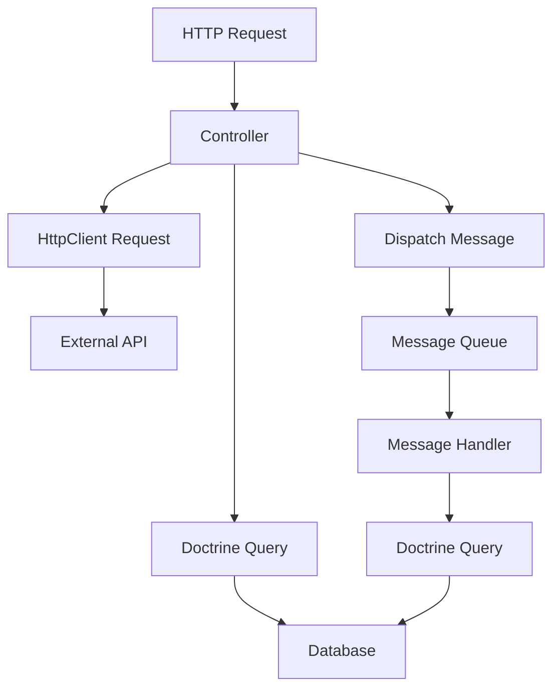

# How to Instrument Symfony Doctrine, HttpClient, and Messenger with OpenTelemetry

Author: [nawazdhandala](https://www.github.com/nawazdhandala)

Tags: OpenTelemetry, PHP, Symfony, Doctrine, HttpClient, Messenger

Description: Learn how to instrument Symfony's Doctrine ORM, HttpClient, and Messenger components with OpenTelemetry for comprehensive observability across database, HTTP, and messaging layers.

Symfony applications rely heavily on three core components for external interactions: Doctrine for database operations, HttpClient for external API calls, and Messenger for asynchronous message handling. Instrumenting these components with OpenTelemetry gives you complete visibility into your application's dependencies and communication patterns.

## Understanding the Instrumentation Architecture

Each component has different characteristics that affect how we instrument them:

Doctrine operations are synchronous and frequent, requiring efficient instrumentation that doesn't add significant overhead. We need to capture query text, parameters, and timing while being mindful of sensitive data.

HttpClient requests are often the slowest operations in your application, making them critical to trace. We need to propagate trace context to downstream services and capture request/response metadata.

Messenger handles asynchronous work that may execute minutes or hours after the initial request. We need to preserve trace context across process boundaries and connect async operations back to their originating traces.

## Setting Up Doctrine Instrumentation

Install the Doctrine DBAL middleware that hooks into query execution.

```bash
# Install required packages
composer require open-telemetry/sdk
composer require open-telemetry/exporter-otlp
```

Create a custom Doctrine middleware that creates spans for all database operations.

```php
// src/Doctrine/OpenTelemetryMiddleware.php

namespace App\Doctrine;

use Doctrine\DBAL\Driver\Middleware;
use Doctrine\DBAL\Driver;
use OpenTelemetry\API\Trace\TracerProviderInterface;

class OpenTelemetryMiddleware implements Middleware
{
    public function __construct(
        private TracerProviderInterface $tracerProvider,
        private bool $captureParameters = false,
        private int $slowQueryThreshold = 1000
    ) {}

    public function wrap(Driver $driver): Driver
    {
        return new OpenTelemetryDriver(
            $driver,
            $this->tracerProvider,
            $this->captureParameters,
            $this->slowQueryThreshold
        );
    }
}
```

Implement the driver wrapper that intercepts connections.

```php
// src/Doctrine/OpenTelemetryDriver.php

namespace App\Doctrine;

use Doctrine\DBAL\Driver;
use Doctrine\DBAL\Driver\Connection;
use OpenTelemetry\API\Trace\TracerProviderInterface;

class OpenTelemetryDriver implements Driver
{
    public function __construct(
        private Driver $driver,
        private TracerProviderInterface $tracerProvider,
        private bool $captureParameters,
        private int $slowQueryThreshold
    ) {}

    public function connect(array $params): Connection
    {
        $connection = $this->driver->connect($params);

        return new OpenTelemetryConnection(
            $connection,
            $this->tracerProvider,
            $this->captureParameters,
            $this->slowQueryThreshold,
            $params['dbname'] ?? 'unknown'
        );
    }

    public function getDatabasePlatform(): \Doctrine\DBAL\Platforms\AbstractPlatform
    {
        return $this->driver->getDatabasePlatform();
    }

    public function getSchemaManager(\Doctrine\DBAL\Connection $conn, \Doctrine\DBAL\Platforms\AbstractPlatform $platform): \Doctrine\DBAL\Schema\AbstractSchemaManager
    {
        return $this->driver->getSchemaManager($conn, $platform);
    }
}
```

Create the connection wrapper that instruments query execution.

```php
// src/Doctrine/OpenTelemetryConnection.php

namespace App\Doctrine;

use Doctrine\DBAL\Driver\Connection;
use Doctrine\DBAL\Driver\Result;
use Doctrine\DBAL\Driver\Statement;
use OpenTelemetry\API\Trace\TracerProviderInterface;
use OpenTelemetry\API\Trace\SpanKind;
use OpenTelemetry\API\Trace\StatusCode;

class OpenTelemetryConnection implements Connection
{
    private $tracer;

    public function __construct(
        private Connection $connection,
        TracerProviderInterface $tracerProvider,
        private bool $captureParameters,
        private int $slowQueryThreshold,
        private string $databaseName
    ) {
        $this->tracer = $tracerProvider->getTracer('doctrine.dbal');
    }

    public function prepare(string $sql): Statement
    {
        $statement = $this->connection->prepare($sql);

        return new OpenTelemetryStatement(
            $statement,
            $this->tracer,
            $sql,
            $this->captureParameters,
            $this->slowQueryThreshold,
            $this->databaseName
        );
    }

    public function query(string $sql): Result
    {
        $span = $this->tracer->spanBuilder('db.query')
            ->setSpanKind(SpanKind::KIND_CLIENT)
            ->setAttribute('db.system', 'mysql')
            ->setAttribute('db.name', $this->databaseName)
            ->setAttribute('db.statement', $this->sanitizeQuery($sql))
            ->setAttribute('db.operation', $this->extractOperation($sql))
            ->startSpan();

        try {
            $result = $this->connection->query($sql);
            $span->setStatus(StatusCode::STATUS_OK);
            return $result;

        } catch (\Throwable $e) {
            $span->recordException($e);
            $span->setStatus(StatusCode::STATUS_ERROR, $e->getMessage());
            throw $e;

        } finally {
            $span->end();
        }
    }

    public function exec(string $sql): int
    {
        $span = $this->tracer->spanBuilder('db.exec')
            ->setSpanKind(SpanKind::KIND_CLIENT)
            ->setAttribute('db.system', 'mysql')
            ->setAttribute('db.name', $this->databaseName)
            ->setAttribute('db.statement', $this->sanitizeQuery($sql))
            ->setAttribute('db.operation', $this->extractOperation($sql))
            ->startSpan();

        try {
            $result = $this->connection->exec($sql);
            $span->setAttribute('db.rows_affected', $result);
            $span->setStatus(StatusCode::STATUS_OK);
            return $result;

        } catch (\Throwable $e) {
            $span->recordException($e);
            $span->setStatus(StatusCode::STATUS_ERROR, $e->getMessage());
            throw $e;

        } finally {
            $span->end();
        }
    }

    private function extractOperation(string $sql): string
    {
        if (preg_match('/^\s*(SELECT|INSERT|UPDATE|DELETE|CREATE|DROP|ALTER)\b/i', $sql, $matches)) {
            return strtoupper($matches[1]);
        }
        return 'UNKNOWN';
    }

    private function sanitizeQuery(string $sql): string
    {
        if (!$this->captureParameters) {
            // Replace values with placeholders for privacy
            $sql = preg_replace("/('[^']*')/", '?', $sql);
            $sql = preg_replace('/(\d+)/', '?', $sql);
        }

        // Limit query length to avoid huge spans
        if (strlen($sql) > 2000) {
            $sql = substr($sql, 0, 2000) . '... [truncated]';
        }

        return $sql;
    }

    // Implement other Connection interface methods by delegating to $this->connection
    public function beginTransaction(): bool
    {
        return $this->connection->beginTransaction();
    }

    public function commit(): bool
    {
        return $this->connection->commit();
    }

    public function rollBack(): bool
    {
        return $this->connection->rollBack();
    }

    public function lastInsertId($name = null): string|int
    {
        return $this->connection->lastInsertId($name);
    }
}
```

Register the middleware in your Doctrine configuration.

```yaml
# config/packages/doctrine.yaml

doctrine:
  dbal:
    middlewares:
      - App\Doctrine\OpenTelemetryMiddleware

services:
  App\Doctrine\OpenTelemetryMiddleware:
    arguments:
      $tracerProvider: '@opentelemetry.trace.tracer_provider'
      $captureParameters: '%env(bool:OTEL_DOCTRINE_CAPTURE_PARAMETERS)%'
      $slowQueryThreshold: '%env(int:OTEL_DOCTRINE_SLOW_QUERY_THRESHOLD)%'
```

## Instrumenting Symfony HttpClient

Create an HttpClient decorator that adds tracing to all HTTP requests.

```php
// src/HttpClient/TracingHttpClient.php

namespace App\HttpClient;

use OpenTelemetry\API\Trace\TracerProviderInterface;
use OpenTelemetry\API\Trace\SpanKind;
use OpenTelemetry\API\Trace\StatusCode;
use OpenTelemetry\Context\Context;
use Symfony\Contracts\HttpClient\HttpClientInterface;
use Symfony\Contracts\HttpClient\ResponseInterface;
use Symfony\Contracts\HttpClient\ResponseStreamInterface;

class TracingHttpClient implements HttpClientInterface
{
    private $tracer;

    public function __construct(
        private HttpClientInterface $client,
        TracerProviderInterface $tracerProvider,
        private bool $captureHeaders = false
    ) {
        $this->tracer = $tracerProvider->getTracer('http.client');
    }

    public function request(string $method, string $url, array $options = []): ResponseInterface
    {
        $parsedUrl = parse_url($url);

        $span = $this->tracer->spanBuilder('http.client.request')
            ->setSpanKind(SpanKind::KIND_CLIENT)
            ->setAttribute('http.method', $method)
            ->setAttribute('http.url', $url)
            ->setAttribute('http.target', $parsedUrl['path'] ?? '/')
            ->setAttribute('http.host', $parsedUrl['host'] ?? 'unknown')
            ->setAttribute('http.scheme', $parsedUrl['scheme'] ?? 'https')
            ->setAttribute('net.peer.name', $parsedUrl['host'] ?? 'unknown')
            ->startSpan();

        $scope = $span->activate();

        try {
            // Inject trace context into HTTP headers for distributed tracing
            $propagationHeaders = [];
            $injector = Context::getCurrent()->propagate();

            foreach ($injector as $key => $value) {
                $propagationHeaders[$key] = $value;
            }

            $options['headers'] = array_merge(
                $options['headers'] ?? [],
                $propagationHeaders
            );

            if ($this->captureHeaders) {
                $span->setAttribute('http.request.headers', json_encode($options['headers'] ?? []));
            }

            $response = $this->client->request($method, $url, $options);

            // Wrap response to capture status code when available
            return new TracingResponse($response, $span, $this->captureHeaders);

        } catch (\Throwable $e) {
            $span->recordException($e);
            $span->setStatus(StatusCode::STATUS_ERROR, $e->getMessage());
            $span->end();
            $scope->detach();
            throw $e;
        }
    }

    public function stream($responses, float $timeout = null): ResponseStreamInterface
    {
        return $this->client->stream($responses, $timeout);
    }

    public function withOptions(array $options): static
    {
        return new self(
            $this->client->withOptions($options),
            $this->tracer,
            $this->captureHeaders
        );
    }
}
```

Create a response wrapper that captures HTTP response details.

```php
// src/HttpClient/TracingResponse.php

namespace App\HttpClient;

use OpenTelemetry\API\Trace\SpanInterface;
use OpenTelemetry\API\Trace\StatusCode;
use Symfony\Contracts\HttpClient\ResponseInterface;

class TracingResponse implements ResponseInterface
{
    private bool $spanEnded = false;

    public function __construct(
        private ResponseInterface $response,
        private SpanInterface $span,
        private bool $captureHeaders
    ) {}

    public function getStatusCode(): int
    {
        $statusCode = $this->response->getStatusCode();

        $this->span->setAttribute('http.status_code', $statusCode);

        if ($statusCode >= 400) {
            $this->span->setStatus(
                $statusCode >= 500 ? StatusCode::STATUS_ERROR : StatusCode::STATUS_OK
            );
        } else {
            $this->span->setStatus(StatusCode::STATUS_OK);
        }

        $this->endSpan();

        return $statusCode;
    }

    public function getHeaders(bool $throw = true): array
    {
        $headers = $this->response->getHeaders($throw);

        if ($this->captureHeaders) {
            $this->span->setAttribute('http.response.headers', json_encode($headers));
        }

        return $headers;
    }

    public function getContent(bool $throw = true): string
    {
        try {
            $content = $this->response->getContent($throw);
            $this->span->setAttribute('http.response.body_size', strlen($content));
            return $content;

        } catch (\Throwable $e) {
            $this->span->recordException($e);
            $this->span->setStatus(StatusCode::STATUS_ERROR, $e->getMessage());
            throw $e;

        } finally {
            $this->endSpan();
        }
    }

    public function toArray(bool $throw = true): array
    {
        return $this->response->toArray($throw);
    }

    public function cancel(): void
    {
        $this->response->cancel();
        $this->span->setAttribute('http.cancelled', true);
        $this->endSpan();
    }

    public function getInfo(string $type = null)
    {
        return $this->response->getInfo($type);
    }

    private function endSpan(): void
    {
        if (!$this->spanEnded) {
            $this->span->end();
            $this->spanEnded = true;
        }
    }

    public function __destruct()
    {
        $this->endSpan();
    }
}
```

Register the tracing client as a decorator.

```yaml
# config/services.yaml

services:
  App\HttpClient\TracingHttpClient:
    decorates: 'http_client'
    arguments:
      $client: '@.inner'
      $tracerProvider: '@opentelemetry.trace.tracer_provider'
      $captureHeaders: '%env(bool:OTEL_HTTP_CLIENT_CAPTURE_HEADERS)%'
```

## Instrumenting Symfony Messenger

Create a middleware that preserves trace context across message handling.

```php
// src/Messenger/OpenTelemetryMiddleware.php

namespace App\Messenger;

use OpenTelemetry\API\Trace\TracerProviderInterface;
use OpenTelemetry\API\Trace\SpanKind;
use OpenTelemetry\API\Trace\StatusCode;
use OpenTelemetry\Context\Context;
use Symfony\Component\Messenger\Envelope;
use Symfony\Component\Messenger\Middleware\MiddlewareInterface;
use Symfony\Component\Messenger\Middleware\StackInterface;
use Symfony\Component\Messenger\Stamp\ReceivedStamp;
use Symfony\Component\Messenger\Stamp\SentStamp;

class OpenTelemetryMiddleware implements MiddlewareInterface
{
    private $tracer;

    public function __construct(
        TracerProviderInterface $tracerProvider,
        private bool $capturePayload = false
    ) {
        $this->tracer = $tracerProvider->getTracer('messenger');
    }

    public function handle(Envelope $envelope, StackInterface $stack): Envelope
    {
        $message = $envelope->getMessage();
        $messageClass = get_class($message);

        // Determine if this is a send or receive operation
        $isReceiving = $envelope->last(ReceivedStamp::class) !== null;

        if ($isReceiving) {
            return $this->handleReceive($envelope, $stack, $messageClass);
        } else {
            return $this->handleSend($envelope, $stack, $messageClass);
        }
    }

    private function handleSend(Envelope $envelope, StackInterface $stack, string $messageClass): Envelope
    {
        $span = $this->tracer->spanBuilder("messenger.send {$messageClass}")
            ->setSpanKind(SpanKind::KIND_PRODUCER)
            ->setAttribute('messaging.system', 'symfony_messenger')
            ->setAttribute('messaging.operation', 'send')
            ->setAttribute('messaging.message.type', $messageClass)
            ->startSpan();

        if ($this->capturePayload) {
            $span->setAttribute('messaging.message.payload', json_encode($envelope->getMessage()));
        }

        $scope = $span->activate();

        try {
            // Inject trace context into message stamps
            $traceStamp = new TraceContextStamp(Context::getCurrent()->toArray());
            $envelope = $envelope->with($traceStamp);

            $result = $stack->next()->handle($envelope, $stack);

            $sentStamp = $result->last(SentStamp::class);
            if ($sentStamp) {
                $span->setAttribute('messaging.destination', $sentStamp->getSenderAlias() ?? 'unknown');
            }

            $span->setStatus(StatusCode::STATUS_OK);
            return $result;

        } catch (\Throwable $e) {
            $span->recordException($e);
            $span->setStatus(StatusCode::STATUS_ERROR, $e->getMessage());
            throw $e;

        } finally {
            $span->end();
            $scope->detach();
        }
    }

    private function handleReceive(Envelope $envelope, StackInterface $stack, string $messageClass): Envelope
    {
        // Extract parent context from message stamps
        $traceStamp = $envelope->last(TraceContextStamp::class);
        $parentContext = $traceStamp ? Context::fromArray($traceStamp->getContext()) : Context::getCurrent();

        $span = $this->tracer->spanBuilder("messenger.receive {$messageClass}")
            ->setSpanKind(SpanKind::KIND_CONSUMER)
            ->setParent($parentContext)
            ->setAttribute('messaging.system', 'symfony_messenger')
            ->setAttribute('messaging.operation', 'receive')
            ->setAttribute('messaging.message.type', $messageClass)
            ->startSpan();

        if ($this->capturePayload) {
            $span->setAttribute('messaging.message.payload', json_encode($envelope->getMessage()));
        }

        $scope = $span->activate();

        try {
            $result = $stack->next()->handle($envelope, $stack);
            $span->setStatus(StatusCode::STATUS_OK);
            return $result;

        } catch (\Throwable $e) {
            $span->recordException($e);
            $span->setStatus(StatusCode::STATUS_ERROR, $e->getMessage());
            throw $e;

        } finally {
            $span->end();
            $scope->detach();
        }
    }
}
```

Create a stamp to carry trace context through the message queue.

```php
// src/Messenger/TraceContextStamp.php

namespace App\Messenger;

use Symfony\Component\Messenger\Stamp\StampInterface;

class TraceContextStamp implements StampInterface
{
    public function __construct(
        private array $context
    ) {}

    public function getContext(): array
    {
        return $this->context;
    }
}
```

Register the middleware in your Messenger configuration.

```yaml
# config/packages/messenger.yaml

framework:
  messenger:
    buses:
      messenger.bus.default:
        middleware:
          - App\Messenger\OpenTelemetryMiddleware
          # Other middleware...

services:
  App\Messenger\OpenTelemetryMiddleware:
    arguments:
      $tracerProvider: '@opentelemetry.trace.tracer_provider'
      $capturePayload: '%env(bool:OTEL_MESSENGER_CAPTURE_PAYLOAD)%'
```

## Environment Configuration

Set up environment variables to control instrumentation behavior.

```bash
# .env

# Doctrine instrumentation
OTEL_DOCTRINE_CAPTURE_PARAMETERS=false
OTEL_DOCTRINE_SLOW_QUERY_THRESHOLD=1000

# HttpClient instrumentation
OTEL_HTTP_CLIENT_CAPTURE_HEADERS=false

# Messenger instrumentation
OTEL_MESSENGER_CAPTURE_PAYLOAD=false
```

For development environments, you can enable more verbose settings:

```bash
# .env.local

OTEL_DOCTRINE_CAPTURE_PARAMETERS=true
OTEL_HTTP_CLIENT_CAPTURE_HEADERS=true
OTEL_MESSENGER_CAPTURE_PAYLOAD=true
```

## Visualizing the Complete Request Flow

With all three components instrumented, you can trace a complete request through your application. Here's an example flow:



Each arrow in this flow generates a span, creating a complete distributed trace that shows:

- HTTP request handling time
- Database query performance
- External API latency
- Message queue processing time
- Async handler execution

This comprehensive instrumentation gives you end-to-end visibility into your Symfony application's behavior, making it easier to identify bottlenecks, debug issues, and optimize performance.
