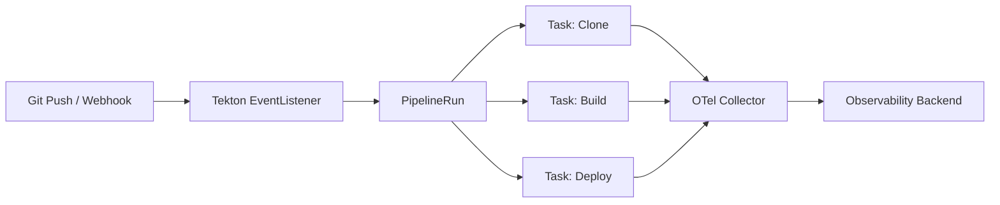

# How to Instrument Tekton Pipeline Tasks with OpenTelemetry

Author: [nawazdhandala](https://www.github.com/nawazdhandala)

Tags: OpenTelemetry, Tekton, CI/CD, Kubernetes, Tracing, Pipelines, Observability

Description: Learn how to instrument Tekton pipeline tasks with OpenTelemetry for full visibility into your Kubernetes-native CI/CD workflows.

---

Tekton runs your CI/CD pipelines as Kubernetes-native resources. Each TaskRun and PipelineRun is a pod that executes steps in containers. When things go wrong, you are often left digging through pod logs to figure out which step failed and why. OpenTelemetry gives you a better way to observe these pipelines by generating traces that capture timing, dependencies, and errors across every task.

This guide walks through instrumenting Tekton pipeline tasks so you can trace entire pipeline runs from start to finish.

---

## Architecture Overview



Each Tekton task emits spans to the OpenTelemetry Collector, which forwards them to your backend for visualization and analysis.

---

## Prerequisites

You need a Kubernetes cluster with Tekton Pipelines installed. You also need the OpenTelemetry Collector deployed in your cluster. Install Tekton if you have not already:

```bash
# Install Tekton Pipelines on your cluster
kubectl apply --filename https://storage.googleapis.com/tekton-releases/pipeline/latest/release.yaml

# Verify the installation
kubectl get pods -n tekton-pipelines
```

Deploy the OpenTelemetry Collector as a DaemonSet so every node can receive telemetry:

```bash
# Install the OTel Collector using the Helm chart
helm repo add open-telemetry https://open-telemetry.github.io/opentelemetry-helm-charts
helm repo update

helm install otel-collector open-telemetry/opentelemetry-collector \
  --set mode=daemonset \
  --set config.exporters.otlp.endpoint="https://your-backend:4317" \
  --namespace otel-system \
  --create-namespace
```

---

## Instrumenting Task Steps with the OpenTelemetry SDK

The most direct approach is to add OpenTelemetry instrumentation inside your task scripts. Here is a Python-based build task that creates spans for each phase of the build process:

```python
# instrument_build.py
# This script wraps the build process with OpenTelemetry tracing.
# Each major phase (dependency install, compile, test) gets its own span
# so you can see exactly where time is spent.

import subprocess
import sys
import os
from opentelemetry import trace
from opentelemetry.sdk.trace import TracerProvider
from opentelemetry.sdk.trace.export import BatchSpanProcessor
from opentelemetry.exporter.otlp.proto.grpc.trace_exporter import OTLPSpanExporter
from opentelemetry.sdk.resources import Resource

# Configure the tracer with pipeline metadata pulled from environment variables.
# Tekton sets several useful env vars that we can attach as resource attributes.
resource = Resource.create({
    "service.name": "tekton-pipeline",
    "pipeline.name": os.getenv("TEKTON_PIPELINE_NAME", "unknown"),
    "pipeline.run": os.getenv("TEKTON_PIPELINE_RUN", "unknown"),
    "task.name": os.getenv("TEKTON_TASK_NAME", "unknown"),
    "task.run": os.getenv("TEKTON_TASK_RUN", "unknown"),
})

provider = TracerProvider(resource=resource)
exporter = OTLPSpanExporter(
    endpoint=os.getenv("OTEL_EXPORTER_OTLP_ENDPOINT", "http://otel-collector:4317")
)
provider.add_span_processor(BatchSpanProcessor(exporter))
trace.set_tracer_provider(provider)

tracer = trace.get_tracer("tekton.build")

def run_command(name, cmd):
    """Run a shell command inside a traced span."""
    with tracer.start_as_current_span(name) as span:
        span.set_attribute("command", cmd)
        result = subprocess.run(cmd, shell=True, capture_output=True, text=True)
        span.set_attribute("exit_code", result.returncode)
        if result.returncode != 0:
            span.set_attribute("error.message", result.stderr[:500])
            span.set_status(trace.StatusCode.ERROR, result.stderr[:200])
        return result

# Run each build phase as a separate span
with tracer.start_as_current_span("build-pipeline-task"):
    run_command("install-dependencies", "pip install -r requirements.txt")
    run_command("compile", "python -m py_compile src/*.py")
    run_command("run-tests", "pytest tests/ -v")

# Flush all pending spans before the container exits
provider.shutdown()
```

The key detail here is calling `provider.shutdown()` at the end. Tekton task containers terminate as soon as the step finishes, so you need to make sure all spans are flushed before the process exits. Without this, you will lose telemetry data.

---

## Passing Trace Context Between Tasks

In a multi-task pipeline, you want spans from different tasks to connect under the same trace. Tekton tasks run in separate pods, so you need to propagate the trace context explicitly. The simplest approach is to write the trace context to a shared workspace:

```yaml
# pipeline-with-tracing.yaml
# This pipeline definition shows how to propagate trace context
# between tasks using a shared workspace. The first task writes
# the traceparent header to a file, and subsequent tasks read it.

apiVersion: tekton.dev/v1
kind: Pipeline
metadata:
  name: traced-build-pipeline
spec:
  workspaces:
    - name: shared-data
    - name: trace-context
  tasks:
    - name: clone
      taskRef:
        name: traced-git-clone
      workspaces:
        - name: output
          workspace: shared-data
        - name: trace-ctx
          workspace: trace-context

    - name: build
      taskRef:
        name: traced-build
      runAfter:
        - clone
      workspaces:
        - name: source
          workspace: shared-data
        - name: trace-ctx
          workspace: trace-context

    - name: deploy
      taskRef:
        name: traced-deploy
      runAfter:
        - build
      workspaces:
        - name: source
          workspace: shared-data
        - name: trace-ctx
          workspace: trace-context
```

Inside each task, you write and read the trace context from the shared workspace:

```python
# trace_context_utils.py
# Utility functions for propagating trace context between Tekton tasks.
# The producing task writes the traceparent to a file in the shared workspace.
# The consuming task reads it and sets up its tracer with that parent context.

import json
from opentelemetry import context, trace
from opentelemetry.trace.propagation.tracecontext import TraceContextTextMapPropagator

TRACE_FILE = "/workspace/trace-ctx/traceparent.json"
propagator = TraceContextTextMapPropagator()

def save_trace_context():
    """Save the current trace context to the shared workspace."""
    carrier = {}
    propagator.inject(carrier)
    with open(TRACE_FILE, "w") as f:
        json.dump(carrier, f)

def load_trace_context():
    """Load trace context from the shared workspace and activate it."""
    try:
        with open(TRACE_FILE, "r") as f:
            carrier = json.load(f)
        ctx = propagator.extract(carrier)
        context.attach(ctx)
        return ctx
    except FileNotFoundError:
        return None
```

This approach ensures all tasks in a pipeline run appear as children of the same root trace. You get a single waterfall view of the entire pipeline execution.

---

## Tekton Task with Built-in Tracing

Here is a complete Tekton Task definition that includes OpenTelemetry instrumentation. It uses a sidecar approach where the tracing setup is baked into the step image:

```yaml
# traced-build-task.yaml
# This task definition includes OpenTelemetry instrumentation directly.
# Environment variables are used to configure the exporter endpoint
# and pass Tekton metadata into the trace attributes.

apiVersion: tekton.dev/v1
kind: Task
metadata:
  name: traced-build
spec:
  workspaces:
    - name: source
    - name: trace-ctx
  steps:
    - name: build-with-tracing
      image: python:3.12-slim
      env:
        - name: OTEL_EXPORTER_OTLP_ENDPOINT
          value: "http://otel-collector.otel-system:4317"
        - name: OTEL_SERVICE_NAME
          value: "tekton-build-task"
        - name: TEKTON_TASK_NAME
          value: "$(context.task.name)"
        - name: TEKTON_PIPELINE_RUN
          value: "$(context.pipelineRun.name)"
      script: |
        #!/usr/bin/env python3
        pip install opentelemetry-api opentelemetry-sdk opentelemetry-exporter-otlp-proto-grpc

        python /workspace/source/instrument_build.py
```

The `$(context.*)` variables are Tekton's built-in variable substitution. They inject the pipeline run name, task name, and other metadata at runtime, which then become span attributes in your traces.

---

## Collector Configuration

Configure the OpenTelemetry Collector to receive traces from your Tekton tasks and export them to your backend:

```yaml
# otel-collector-config.yaml
# This collector config receives OTLP traces from Tekton task pods,
# enriches them with Kubernetes metadata, and exports to your backend.

receivers:
  otlp:
    protocols:
      grpc:
        endpoint: 0.0.0.0:4317
      http:
        endpoint: 0.0.0.0:4318

processors:
  batch:
    timeout: 5s
    send_batch_size: 512
  resource:
    attributes:
      - key: environment
        value: "ci-cd"
        action: upsert
  k8sattributes:
    extract:
      metadata:
        - k8s.pod.name
        - k8s.namespace.name

exporters:
  otlp:
    endpoint: "https://your-oneuptime-endpoint:4317"
    tls:
      insecure: false

service:
  pipelines:
    traces:
      receivers: [otlp]
      processors: [k8sattributes, resource, batch]
      exporters: [otlp]
```

The `k8sattributes` processor automatically attaches pod and namespace metadata to every span. This is especially useful for Tekton because each TaskRun creates a unique pod, and having that pod name in your traces makes it easy to correlate with Kubernetes events and logs.

---

## Querying Pipeline Traces

Once your pipeline runs are emitting traces, you can query them to answer practical questions. Here are some useful queries you might run against your trace data:

- Find all pipeline runs that took longer than 10 minutes
- Identify which task is the bottleneck in a pipeline
- Track the error rate of specific tasks over time
- Compare build times across different branches

The trace data gives you a timeline view of each pipeline run. You can see parallel tasks running side by side and sequential tasks forming a chain. When a task fails, the error span includes the exit code and stderr output, so you do not need to go hunting through pod logs.

---

## Monitoring Pipeline Health with Metrics

Beyond traces, you can emit custom metrics from your tasks to track pipeline health over time:

```python
# pipeline_metrics.py
# Emit custom metrics from Tekton tasks to track build success rates,
# duration distributions, and artifact sizes over time.

from opentelemetry import metrics
from opentelemetry.sdk.metrics import MeterProvider
from opentelemetry.sdk.metrics.export import PeriodicExportingMetricReader
from opentelemetry.exporter.otlp.proto.grpc.metric_exporter import OTLPMetricExporter

reader = PeriodicExportingMetricReader(
    OTLPMetricExporter(endpoint="http://otel-collector:4317"),
    export_interval_millis=10000,
)
provider = MeterProvider(metric_readers=[reader])
metrics.set_meter_provider(provider)

meter = metrics.get_meter("tekton.pipeline.metrics")

# Track how long each task takes
task_duration = meter.create_histogram(
    "tekton.task.duration",
    unit="s",
    description="Duration of Tekton task execution in seconds",
)

# Count task completions by status
task_counter = meter.create_counter(
    "tekton.task.completions",
    description="Number of completed Tekton tasks",
)

# Record a task completion with attributes
task_duration.record(45.2, {"task.name": "build", "status": "success"})
task_counter.add(1, {"task.name": "build", "status": "success"})
```

These metrics let you build dashboards showing trends like average build time, failure rates by task, and pipeline throughput over days or weeks.

---

## Summary

Instrumenting Tekton pipelines with OpenTelemetry turns opaque CI/CD runs into observable workflows. You get traces that show exactly how long each task takes, where failures happen, and how tasks relate to each other. The key pieces are: instrumenting your task scripts with the OpenTelemetry SDK, propagating trace context between tasks through shared workspaces, and running the Collector in your cluster to forward telemetry to your backend. Once this is in place, debugging slow or broken pipelines becomes a matter of looking at traces instead of scrolling through logs.
