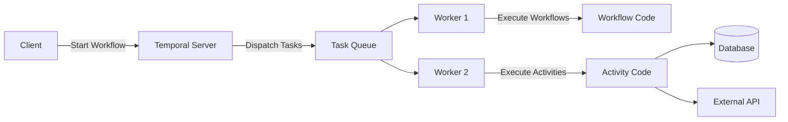
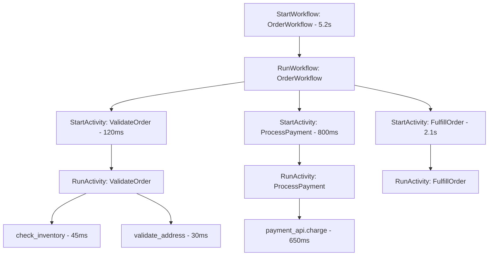

# How to Instrument Temporal.io Workflows with OpenTelemetry

Author: [nawazdhandala](https://www.github.com/nawazdhandala)

Tags: OpenTelemetry, Temporal, Workflows, Tracing, Observability, Distributed Systems

Description: A hands-on guide to instrumenting Temporal.io workflows and activities with OpenTelemetry for end-to-end distributed tracing.

---

Temporal.io is a workflow orchestration platform that makes it easier to build reliable distributed applications. It handles retries, timeouts, and state management for you, so your workflows can survive process crashes and infrastructure failures. But all that reliability comes with a tradeoff: understanding what's happening inside your workflows gets harder. A single workflow execution might span hours, involve dozens of activities, and retry failed steps multiple times across different workers.

OpenTelemetry can give you the visibility you need. In this post, we'll set up tracing for Temporal workflows and activities, connect the spans together across workflow and activity boundaries, and make sure you can follow a request from the moment it triggers a workflow through every activity execution.

## How Temporal Works (Quick Refresher)

If you're new to Temporal, here's the basic model. A workflow is a durable function that coordinates work. Activities are the individual tasks that do the actual work - making API calls, writing to databases, sending emails. The Temporal server orchestrates everything, and workers pick up workflow and activity tasks from task queues.



The tricky part for tracing is that workflows and activities might execute on different workers, and activities can be retried on different machines. Context propagation needs to work across all of these boundaries.

## Temporal's Built-in OpenTelemetry Support

Temporal SDKs come with built-in support for OpenTelemetry through interceptors. This is the recommended approach because it handles context propagation through the Temporal server automatically. You don't need to manually inject or extract trace context - the interceptor does it for you.

Let's start with the Go SDK, which has the most mature OpenTelemetry integration.

```go
// main.go - Set up a Temporal worker with OpenTelemetry tracing
package main

import (
    "go.opentelemetry.io/otel"
    "go.opentelemetry.io/otel/exporters/otlp/otlptrace/otlptracehttp"
    "go.opentelemetry.io/otel/sdk/resource"
    sdktrace "go.opentelemetry.io/otel/sdk/trace"
    semconv "go.opentelemetry.io/otel/semconv/v1.24.0"
    "go.temporal.io/sdk/client"
    "go.temporal.io/sdk/contrib/opentelemetry"
    "go.temporal.io/sdk/interceptor"
    "go.temporal.io/sdk/worker"
    "context"
    "log"
)

func main() {
    // Set up the OpenTelemetry trace exporter
    ctx := context.Background()
    exporter, err := otlptracehttp.New(ctx,
        otlptracehttp.WithEndpoint("localhost:4318"),
        otlptracehttp.WithInsecure(),
    )
    if err != nil {
        log.Fatal(err)
    }

    // Create a tracer provider with service name
    tp := sdktrace.NewTracerProvider(
        sdktrace.WithBatcher(exporter),
        sdktrace.WithResource(resource.NewWithAttributes(
            semconv.SchemaURL,
            semconv.ServiceNameKey.String("temporal-worker"),
        )),
    )
    otel.SetTracerProvider(tp)
    defer tp.Shutdown(ctx)

    // Create the Temporal OpenTelemetry interceptor
    // This automatically propagates trace context through Temporal headers
    tracingInterceptor, err := opentelemetry.NewTracingInterceptor(
        opentelemetry.TracerOptions{
            Tracer: otel.Tracer("temporal-workflow"),
        },
    )
    if err != nil {
        log.Fatal(err)
    }

    // Connect to the Temporal server with the interceptor
    c, err := client.Dial(client.Options{
        HostPort:     "localhost:7233",
        Interceptors: []interceptor.ClientInterceptor{tracingInterceptor},
    })
    if err != nil {
        log.Fatal(err)
    }
    defer c.Close()

    // Create and start the worker
    w := worker.New(c, "order-processing", worker.Options{
        Interceptors: []interceptor.WorkerInterceptor{tracingInterceptor},
    })

    // Register workflow and activity implementations
    w.RegisterWorkflow(OrderWorkflow)
    w.RegisterActivity(&OrderActivities{})

    if err := w.Run(worker.InterruptCh()); err != nil {
        log.Fatal(err)
    }
}
```

The `opentelemetry.NewTracingInterceptor` is doing the heavy lifting. It creates spans for workflow executions, activity executions, and signals. It also propagates the trace context through Temporal's internal header mechanism, so spans from different workers are connected.

## Writing Instrumented Workflows

With the interceptor in place, your workflow code automatically generates spans. But you can add more detail with custom spans inside the workflow.

```go
// workflows.go - Order processing workflow with custom spans
package main

import (
    "time"
    "go.temporal.io/sdk/workflow"
)

func OrderWorkflow(ctx workflow.Context, order Order) (OrderResult, error) {
    // The interceptor automatically creates a span for "OrderWorkflow"
    logger := workflow.GetLogger(ctx)
    logger.Info("Starting order workflow", "orderId", order.ID)

    // Configure activity options with timeouts and retry policy
    activityOptions := workflow.ActivityOptions{
        StartToCloseTimeout: 30 * time.Second,
        RetryPolicy: &temporal.RetryPolicy{
            InitialInterval:    time.Second,
            BackoffCoefficient: 2.0,
            MaximumAttempts:    3,
        },
    }
    ctx = workflow.WithActivityOptions(ctx, activityOptions)

    // Step 1: Validate the order
    // The interceptor creates a child span for this activity execution
    var validationResult ValidationResult
    err := workflow.ExecuteActivity(ctx, activities.ValidateOrder, order).Get(ctx, &validationResult)
    if err != nil {
        return OrderResult{}, err
    }

    // Step 2: Process payment
    var paymentResult PaymentResult
    err = workflow.ExecuteActivity(ctx, activities.ProcessPayment, order).Get(ctx, &paymentResult)
    if err != nil {
        // If payment fails, run compensation
        _ = workflow.ExecuteActivity(ctx, activities.CancelOrder, order).Get(ctx, nil)
        return OrderResult{Status: "cancelled"}, err
    }

    // Step 3: Fulfill the order
    var fulfillmentResult FulfillmentResult
    err = workflow.ExecuteActivity(ctx, activities.FulfillOrder, order).Get(ctx, &fulfillmentResult)
    if err != nil {
        return OrderResult{Status: "payment_received_fulfillment_failed"}, err
    }

    return OrderResult{
        Status:    "completed",
        TrackingID: fulfillmentResult.TrackingID,
    }, nil
}
```

## Instrumenting Activities

Activities are where the real work happens - network calls, database operations, file I/O. The interceptor creates a span for each activity execution, but you'll want to add more spans for the operations inside.

```go
// activities.go - Activity implementations with detailed tracing
package main

import (
    "context"
    "go.opentelemetry.io/otel"
    "go.opentelemetry.io/otel/attribute"
)

type OrderActivities struct {
    paymentClient PaymentClient
    inventoryDB   *sql.DB
}

var tracer = otel.Tracer("temporal-activities")

func (a *OrderActivities) ValidateOrder(ctx context.Context, order Order) (ValidationResult, error) {
    // The interceptor already created a span for "ValidateOrder"
    // Add custom child spans for sub-operations

    // Check inventory availability
    ctx, inventorySpan := tracer.Start(ctx, "check_inventory",
        trace.WithAttributes(
            attribute.String("order.id", order.ID),
            attribute.Int("order.item_count", len(order.Items)),
        ),
    )
    available, err := a.checkInventory(ctx, order.Items)
    if err != nil {
        inventorySpan.RecordError(err)
        inventorySpan.End()
        return ValidationResult{}, err
    }
    inventorySpan.SetAttributes(attribute.Bool("inventory.available", available))
    inventorySpan.End()

    // Validate shipping address
    ctx, addressSpan := tracer.Start(ctx, "validate_address",
        trace.WithAttributes(
            attribute.String("address.country", order.ShippingAddress.Country),
        ),
    )
    validAddress := a.validateAddress(ctx, order.ShippingAddress)
    addressSpan.SetAttributes(attribute.Bool("address.valid", validAddress))
    addressSpan.End()

    return ValidationResult{
        Valid:           available && validAddress,
        InventoryOK:     available,
        AddressValid:    validAddress,
    }, nil
}

func (a *OrderActivities) ProcessPayment(ctx context.Context, order Order) (PaymentResult, error) {
    // Create a span for the external payment API call
    ctx, span := tracer.Start(ctx, "payment_api.charge",
        trace.WithAttributes(
            attribute.String("order.id", order.ID),
            attribute.Float64("payment.amount", order.Total),
            attribute.String("payment.currency", order.Currency),
        ),
    )
    defer span.End()

    result, err := a.paymentClient.Charge(ctx, order.Total, order.Currency)
    if err != nil {
        span.RecordError(err)
        return PaymentResult{}, err
    }

    span.SetAttributes(
        attribute.String("payment.transaction_id", result.TransactionID),
        attribute.String("payment.status", result.Status),
    )
    return result, nil
}
```

## Python SDK Instrumentation

If you're using the Python Temporal SDK, the setup is similar but uses Python's OpenTelemetry packages.

```python
# worker.py - Temporal worker with OpenTelemetry in Python
from temporalio.client import Client
from temporalio.worker import Worker
from temporalio.contrib.opentelemetry import TracingInterceptor
from opentelemetry import trace
from opentelemetry.sdk.trace import TracerProvider
from opentelemetry.sdk.trace.export import BatchSpanProcessor
from opentelemetry.exporter.otlp.proto.http.trace_exporter import OTLPSpanExporter
from opentelemetry.sdk.resources import Resource

import asyncio

async def main():
    # Configure the OpenTelemetry tracer provider
    resource = Resource.create({"service.name": "temporal-worker-python"})
    provider = TracerProvider(resource=resource)
    exporter = OTLPSpanExporter(endpoint="http://localhost:4318/v1/traces")
    provider.add_span_processor(BatchSpanProcessor(exporter))
    trace.set_tracer_provider(provider)

    # Create the Temporal tracing interceptor
    tracing_interceptor = TracingInterceptor()

    # Connect to Temporal with the interceptor enabled
    client = await Client.connect(
        "localhost:7233",
        interceptors=[tracing_interceptor],
    )

    # Start the worker with workflows and activities registered
    worker = Worker(
        client,
        task_queue="order-processing",
        workflows=[OrderWorkflow],
        activities=[validate_order, process_payment, fulfill_order],
    )
    await worker.run()

asyncio.run(main())
```

And here's a Python workflow with activities.

```python
# workflows.py - Temporal workflow definition in Python
from datetime import timedelta
from temporalio import workflow
from temporalio.common import RetryPolicy

with workflow.unsafe.imports_passed_through():
    from activities import validate_order, process_payment, fulfill_order

@workflow.defn
class OrderWorkflow:
    @workflow.run
    async def run(self, order: dict) -> dict:
        # Each activity execution generates a traced span automatically
        validation = await workflow.execute_activity(
            validate_order,
            order,
            start_to_close_timeout=timedelta(seconds=30),
            retry_policy=RetryPolicy(maximum_attempts=3),
        )

        if not validation["valid"]:
            return {"status": "invalid", "reason": validation["reason"]}

        payment = await workflow.execute_activity(
            process_payment,
            order,
            start_to_close_timeout=timedelta(seconds=60),
            retry_policy=RetryPolicy(maximum_attempts=3),
        )

        fulfillment = await workflow.execute_activity(
            fulfill_order,
            order,
            start_to_close_timeout=timedelta(seconds=120),
        )

        return {"status": "completed", "tracking_id": fulfillment["tracking_id"]}
```

## Trace Structure

With the interceptor configured, here's what the trace looks like for a successful workflow execution:



Notice the distinction between `StartActivity` and `RunActivity`. The `StartActivity` span is created by the workflow when it schedules the activity. The `RunActivity` span is created by the worker when it actually executes the activity. The gap between them shows how long the activity was waiting in the task queue.

## Tracing Child Workflows and Signals

Temporal supports child workflows and signals. The interceptor traces these too.

```go
// Starting a child workflow - the interceptor propagates context automatically
func ParentWorkflow(ctx workflow.Context, input ParentInput) error {
    // Child workflow execution creates linked spans
    childCtx := workflow.WithChildOptions(ctx, workflow.ChildWorkflowOptions{
        WorkflowID: "child-" + input.ID,
        TaskQueue:  "child-processing",
    })

    var childResult ChildResult
    err := workflow.ExecuteChildWorkflow(childCtx, ChildWorkflow, input.Data).Get(ctx, &childResult)
    if err != nil {
        return err
    }

    return nil
}

// Handling a signal in a workflow
func OrderWorkflow(ctx workflow.Context, order Order) (OrderResult, error) {
    // Create a channel to receive signals
    cancelCh := workflow.GetSignalChannel(ctx, "cancel-order")

    // Use a selector to wait for either activity completion or signal
    selector := workflow.NewSelector(ctx)

    selector.AddReceive(cancelCh, func(ch workflow.ReceiveChannel, more bool) {
        // Signal handling is automatically traced by the interceptor
        ch.Receive(ctx, nil)
        // Handle cancellation
    })

    selector.Select(ctx)
    return OrderResult{}, nil
}
```

## Useful Attributes to Add

Beyond what the interceptor provides automatically, there are attributes worth adding for Temporal-specific debugging.

```go
// Add these attributes to help with Temporal-specific debugging
span.SetAttributes(
    attribute.String("temporal.workflow.id", workflow.GetInfo(ctx).WorkflowExecution.ID),
    attribute.String("temporal.workflow.run_id", workflow.GetInfo(ctx).WorkflowExecution.RunID),
    attribute.String("temporal.workflow.type", workflow.GetInfo(ctx).WorkflowType.Name),
    attribute.String("temporal.task_queue", workflow.GetInfo(ctx).TaskQueueName),
    attribute.Int("temporal.workflow.attempt", int(workflow.GetInfo(ctx).Attempt)),
    attribute.String("temporal.namespace", workflow.GetInfo(ctx).Namespace),
)
```

These attributes let you search for traces by workflow ID, filter by namespace, or find workflows that have been retried multiple times.

## Wrapping Up

Temporal's built-in OpenTelemetry interceptors handle the hardest part of distributed tracing - propagating context across workflow and activity boundaries, even when they execute on different workers. Set up the interceptor on both your client and worker, configure your tracer provider, and you get automatic spans for workflow executions, activity executions, signals, and child workflows. Add custom spans inside your activities for detailed sub-operation tracing, and include Temporal-specific attributes like workflow ID and task queue for easy filtering. The result is end-to-end traces that show you exactly what's happening inside your durable workflows.
