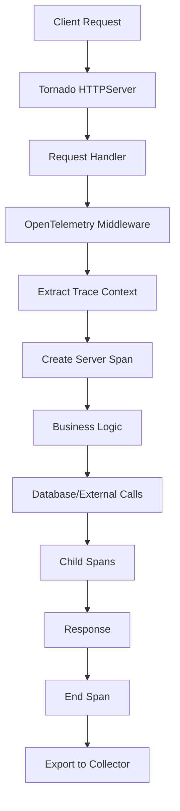

# How to Instrument Tornado Web Applications with OpenTelemetry

Author: [nawazdhandala](https://www.github.com/nawazdhandala)

Tags: OpenTelemetry, Tornado, Python, Web Framework, Async, Tracing

Description: Learn how to add distributed tracing and observability to Tornado async web applications using OpenTelemetry instrumentation.

Tornado is a powerful Python web framework and asynchronous networking library designed for high-performance applications. Originally developed at FriendFeed and later open-sourced by Facebook, Tornado excels at handling thousands of simultaneous connections through its non-blocking network I/O architecture.

When running Tornado applications in production, especially as part of a microservices architecture, observability becomes essential. OpenTelemetry provides instrumentation for Tornado that captures request flows, performance metrics, and distributed traces across your service mesh.

## Tornado Architecture and Instrumentation Points

Tornado's architecture is built around an event loop that handles asynchronous operations. OpenTelemetry instruments Tornado by wrapping request handlers and hooking into the application lifecycle.



## Installation and Setup

Install the necessary packages for Tornado instrumentation.

```bash
pip install tornado \
            opentelemetry-api \
            opentelemetry-sdk \
            opentelemetry-instrumentation-tornado \
            opentelemetry-exporter-otlp
```

## Basic Tornado Application with OpenTelemetry

Here's a complete example of a Tornado application instrumented with OpenTelemetry.

```python
import tornado.ioloop
import tornado.web
import asyncio
from opentelemetry import trace
from opentelemetry.sdk.trace import TracerProvider
from opentelemetry.sdk.trace.export import BatchSpanProcessor
from opentelemetry.exporter.otlp.proto.grpc.trace_exporter import OTLPSpanExporter
from opentelemetry.sdk.resources import Resource
from opentelemetry.instrumentation.tornado import TornadoInstrumentor

# Configure OpenTelemetry with service metadata
resource = Resource.create({
    "service.name": "tornado-api",
    "service.version": "2.0.0",
    "deployment.environment": "production",
    "service.instance.id": "tornado-001"
})

# Initialize tracer provider with OTLP exporter
provider = TracerProvider(resource=resource)
otlp_exporter = OTLPSpanExporter(
    endpoint="http://localhost:4317",
    insecure=True
)
span_processor = BatchSpanProcessor(otlp_exporter)
provider.add_span_processor(span_processor)
trace.set_tracer_provider(provider)

# Get tracer for creating custom spans
tracer = trace.get_tracer(__name__)

class MainHandler(tornado.web.RequestHandler):
    """Basic handler that returns a greeting"""

    async def get(self):
        """Handle GET requests to root endpoint"""
        # Access current span to add custom attributes
        current_span = trace.get_current_span()
        current_span.set_attribute("handler.type", "main")
        current_span.set_attribute("request.path", self.request.path)

        # Add request headers as span attributes
        user_agent = self.request.headers.get("User-Agent", "unknown")
        current_span.set_attribute("http.user_agent", user_agent)

        self.write({"message": "Welcome to Tornado API", "status": "healthy"})

class UserHandler(tornado.web.RequestHandler):
    """Handler for user-related operations"""

    async def get(self, user_id):
        """Fetch user details with custom span tracking"""

        # Create custom span for database operation
        with tracer.start_as_current_span("fetch-user-from-db") as span:
            span.set_attribute("user.id", user_id)
            span.set_attribute("db.operation", "SELECT")

            # Simulate database query
            await asyncio.sleep(0.05)
            user_data = {
                "id": user_id,
                "name": f"User {user_id}",
                "email": f"user{user_id}@example.com"
            }

            span.set_attribute("db.rows_returned", 1)

        # Add span for data processing
        with tracer.start_as_current_span("process-user-data") as span:
            span.set_attribute("processing.type", "serialization")

            # Add business logic tracking
            processed_data = {
                **user_data,
                "processed": True,
                "timestamp": tornado.ioloop.IOLoop.current().time()
            }

        self.write(processed_data)

    async def post(self):
        """Create new user with comprehensive tracing"""
        current_span = trace.get_current_span()
        current_span.set_attribute("http.method", "POST")

        try:
            # Parse request body
            body = tornado.escape.json_decode(self.request.body)

            with tracer.start_as_current_span("validate-user-input") as span:
                span.set_attribute("validation.fields", len(body))

                # Validation logic
                required_fields = ["name", "email"]
                missing = [f for f in required_fields if f not in body]

                if missing:
                    span.set_attribute("validation.failed", True)
                    span.set_attribute("validation.missing_fields", str(missing))
                    self.set_status(400)
                    self.write({"error": f"Missing fields: {missing}"})
                    return

            # Create user in database
            with tracer.start_as_current_span("create-user-db") as span:
                span.set_attribute("db.operation", "INSERT")
                span.set_attribute("user.email", body["email"])

                # Simulate database insert
                await asyncio.sleep(0.1)
                user_id = "12345"

                span.set_attribute("user.id", user_id)

            self.set_status(201)
            self.write({"id": user_id, "status": "created"})

        except Exception as e:
            # Record exception in span
            current_span.record_exception(e)
            current_span.set_status(
                trace.Status(trace.StatusCode.ERROR, str(e))
            )
            self.set_status(500)
            self.write({"error": "Internal server error"})

class AsyncTaskHandler(tornado.web.RequestHandler):
    """Handler demonstrating async operations with tracing"""

    async def get(self):
        """Execute multiple async operations with individual spans"""

        with tracer.start_as_current_span("async-workflow") as parent_span:
            parent_span.set_attribute("workflow.type", "parallel_processing")

            # Create multiple async tasks
            async def fetch_data_source_1():
                with tracer.start_as_current_span("fetch-source-1") as span:
                    span.set_attribute("data.source", "api-1")
                    await asyncio.sleep(0.1)
                    return {"source": 1, "data": [1, 2, 3]}

            async def fetch_data_source_2():
                with tracer.start_as_current_span("fetch-source-2") as span:
                    span.set_attribute("data.source", "api-2")
                    await asyncio.sleep(0.15)
                    return {"source": 2, "data": [4, 5, 6]}

            async def fetch_data_source_3():
                with tracer.start_as_current_span("fetch-source-3") as span:
                    span.set_attribute("data.source", "database")
                    await asyncio.sleep(0.08)
                    return {"source": 3, "data": [7, 8, 9]}

            # Execute all tasks concurrently
            results = await asyncio.gather(
                fetch_data_source_1(),
                fetch_data_source_2(),
                fetch_data_source_3()
            )

            parent_span.set_attribute("workflow.tasks_completed", len(results))

            # Aggregate results
            with tracer.start_as_current_span("aggregate-results") as span:
                all_data = []
                for result in results:
                    all_data.extend(result["data"])

                span.set_attribute("aggregate.total_items", len(all_data))

            self.write({"results": results, "aggregated": all_data})

class ErrorHandler(tornado.web.RequestHandler):
    """Handler demonstrating error tracking"""

    async def get(self):
        """Simulate various error conditions"""
        error_type = self.get_argument("type", "generic")

        current_span = trace.get_current_span()
        current_span.set_attribute("error.type", error_type)

        try:
            if error_type == "validation":
                raise ValueError("Invalid input parameters")
            elif error_type == "timeout":
                await asyncio.sleep(10)  # Would timeout
            elif error_type == "division":
                result = 1 / 0
            else:
                raise RuntimeError("Generic error for testing")

        except Exception as e:
            # Properly record exception in span
            current_span.record_exception(e)
            current_span.set_attribute("error", True)
            current_span.set_status(
                trace.Status(trace.StatusCode.ERROR, str(e))
            )

            self.set_status(500)
            self.write({
                "error": str(e),
                "type": error_type
            })

# Custom handler for adding global request attributes
class InstrumentedRequestHandler(tornado.web.RequestHandler):
    """Base handler with automatic span enrichment"""

    def prepare(self):
        """Called before each request handler method"""
        current_span = trace.get_current_span()

        # Add common attributes to all requests
        current_span.set_attribute("http.method", self.request.method)
        current_span.set_attribute("http.url", self.request.uri)
        current_span.set_attribute("http.scheme", self.request.protocol)

        # Add custom request ID if present
        request_id = self.request.headers.get("X-Request-ID")
        if request_id:
            current_span.set_attribute("request.id", request_id)

    def on_finish(self):
        """Called after request completes"""
        current_span = trace.get_current_span()
        current_span.set_attribute("http.status_code", self.get_status())

class HealthHandler(InstrumentedRequestHandler):
    """Health check endpoint"""

    async def get(self):
        """Return service health status"""
        self.write({"status": "healthy", "service": "tornado-api"})

def make_app():
    """Create and configure Tornado application"""
    return tornado.web.Application([
        (r"/", MainHandler),
        (r"/user/([^/]+)", UserHandler),
        (r"/users", UserHandler),
        (r"/async-task", AsyncTaskHandler),
        (r"/error", ErrorHandler),
        (r"/health", HealthHandler),
    ], debug=True)

if __name__ == "__main__":
    # Instrument Tornado before starting the application
    TornadoInstrumentor().instrument()

    # Create application and start server
    app = make_app()
    app.listen(8888)

    print("Tornado server running on http://localhost:8888")
    print("Traces exported to OTLP collector at localhost:4317")

    tornado.ioloop.IOLoop.current().start()
```

## Advanced Request Filtering

You can configure which requests to trace based on URL patterns or other criteria.

```python
from opentelemetry.instrumentation.tornado import TornadoInstrumentor

def client_request_hook(span, handler):
    """
    Hook called when processing requests.
    Add custom attributes based on request context.
    """
    # Add request metadata
    request = handler.request

    span.set_attribute("http.route", handler.request.path)
    span.set_attribute("http.client_ip", request.remote_ip)

    # Add custom business context from headers
    tenant_id = request.headers.get("X-Tenant-ID")
    if tenant_id:
        span.set_attribute("tenant.id", tenant_id)

    # Track API version
    api_version = request.headers.get("X-API-Version", "v1")
    span.set_attribute("api.version", api_version)

def client_response_hook(span, handler):
    """
    Hook called after response is sent.
    Add response-specific attributes.
    """
    # Add response status
    span.set_attribute("http.status_code", handler.get_status())

    # Track response size if available
    if hasattr(handler, "_write_buffer"):
        response_size = sum(len(chunk) for chunk in handler._write_buffer)
        span.set_attribute("http.response_content_length", response_size)

# Instrument with custom hooks
TornadoInstrumentor().instrument(
    client_request_hook=client_request_hook,
    client_response_hook=client_response_hook
)
```

## WebSocket Support

Tornado's WebSocket support can also be instrumented for tracing real-time connections.

```python
import tornado.websocket

class ChatWebSocket(tornado.websocket.WebSocketHandler):
    """WebSocket handler with tracing"""

    def open(self):
        """Called when WebSocket connection is established"""
        with tracer.start_as_current_span("websocket-open") as span:
            span.set_attribute("websocket.action", "open")
            span.set_attribute("client.id", id(self))

            print(f"WebSocket opened: {id(self)}")

    async def on_message(self, message):
        """Handle incoming WebSocket messages"""
        with tracer.start_as_current_span("websocket-message") as span:
            span.set_attribute("websocket.action", "message")
            span.set_attribute("message.length", len(message))
            span.set_attribute("client.id", id(self))

            # Process message
            with tracer.start_as_current_span("process-message") as process_span:
                # Simulate message processing
                await asyncio.sleep(0.01)
                response = f"Echo: {message}"
                process_span.set_attribute("response.length", len(response))

            # Send response
            self.write_message(response)

    def on_close(self):
        """Called when WebSocket connection closes"""
        with tracer.start_as_current_span("websocket-close") as span:
            span.set_attribute("websocket.action", "close")
            span.set_attribute("client.id", id(self))

            print(f"WebSocket closed: {id(self)}")
```

## Integrating with External Services

When your Tornado application calls external services, ensure trace context propagation works correctly.

```python
import aiohttp
from opentelemetry.instrumentation.aiohttp_client import AioHttpClientInstrumentor

# Instrument aiohttp client for outgoing requests
AioHttpClientInstrumentor().instrument()

class ProxyHandler(tornado.web.RequestHandler):
    """Handler that proxies requests to external services"""

    async def get(self):
        """Fetch data from external API"""

        with tracer.start_as_current_span("external-api-call") as span:
            span.set_attribute("external.service", "backend-api")

            # Make HTTP request to external service
            # Trace context is automatically propagated
            async with aiohttp.ClientSession() as session:
                async with session.get(
                    'http://backend-service:8080/api/data'
                ) as response:
                    span.set_attribute("external.status_code", response.status)

                    data = await response.json()
                    span.set_attribute("external.response_size", len(str(data)))

                    self.write(data)
```

## Middleware Pattern for Global Instrumentation

Create reusable middleware for consistent instrumentation across handlers.

```python
class TracingMiddleware:
    """Middleware for adding consistent tracing to all requests"""

    def __init__(self, application):
        self.application = application

    def __call__(self, request):
        """Process request with tracing context"""

        handler = self.application(request)

        # Wrap handler execution with span
        original_prepare = handler.prepare

        def traced_prepare():
            current_span = trace.get_current_span()

            # Add standard attributes
            current_span.set_attribute("http.method", request.method)
            current_span.set_attribute("http.target", request.path)
            current_span.set_attribute("http.host", request.host)

            # Add custom business attributes
            current_span.set_attribute("service.handler",
                                      handler.__class__.__name__)

            return original_prepare()

        handler.prepare = traced_prepare
        return handler
```

## Performance Monitoring

Track performance metrics alongside traces for comprehensive observability.

```python
class PerformanceHandler(tornado.web.RequestHandler):
    """Handler with detailed performance tracking"""

    async def get(self):
        """Execute operation with performance monitoring"""
        start_time = tornado.ioloop.IOLoop.current().time()

        with tracer.start_as_current_span("performance-operation") as span:

            # Track different operation phases
            with tracer.start_as_current_span("phase-1-init") as phase_span:
                await asyncio.sleep(0.05)
                phase_span.set_attribute("phase.duration_ms", 50)

            with tracer.start_as_current_span("phase-2-processing") as phase_span:
                await asyncio.sleep(0.1)
                phase_span.set_attribute("phase.duration_ms", 100)

            with tracer.start_as_current_span("phase-3-finalize") as phase_span:
                await asyncio.sleep(0.03)
                phase_span.set_attribute("phase.duration_ms", 30)

            # Calculate total duration
            total_duration = tornado.ioloop.IOLoop.current().time() - start_time
            span.set_attribute("operation.total_duration_ms",
                             int(total_duration * 1000))

        self.write({"status": "completed", "duration_ms": int(total_duration * 1000)})
```

## Sampling Configuration

For high-traffic applications, configure sampling to reduce overhead.

```python
from opentelemetry.sdk.trace.sampling import (
    TraceIdRatioBased,
    ParentBased,
    ALWAYS_ON,
    ALWAYS_OFF
)

# Sample 10% of traces
sampler = ParentBased(root=TraceIdRatioBased(0.1))

# Create provider with sampler
provider = TracerProvider(
    resource=resource,
    sampler=sampler
)
```

## Best Practices for Tornado Instrumentation

When instrumenting Tornado applications, follow these guidelines:

1. **Instrument early** - Call `TornadoInstrumentor().instrument()` before creating the application
2. **Use custom spans** for business-critical operations that aren't automatically traced
3. **Add meaningful attributes** that help with debugging and analysis
4. **Handle exceptions properly** - Always record exceptions in spans
5. **Avoid blocking operations** - Use async/await to prevent blocking the event loop
6. **Filter health checks** - Exclude high-frequency low-value endpoints from tracing
7. **Monitor async tasks** - Create spans for concurrent operations to track parallel execution
8. **Propagate context** - Ensure trace context flows through all async boundaries

Tornado's performance characteristics make it ideal for high-throughput services. With OpenTelemetry instrumentation, you gain visibility into request flows and performance bottlenecks without sacrificing the framework's efficiency.
