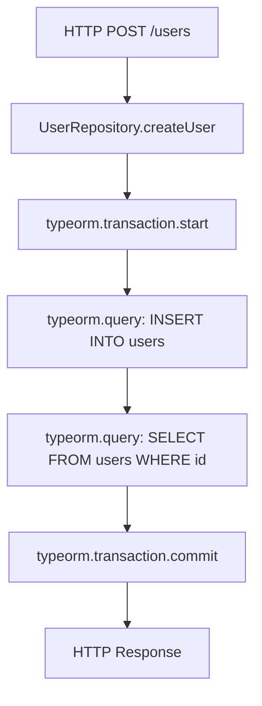

# How to Instrument TypeORM with OpenTelemetry for Database Tracing

Author: [nawazdhandala](https://www.github.com/nawazdhandala)

Tags: OpenTelemetry, TypeORM, Node.js, Database, Tracing, ORM

Description: Complete guide to instrumenting TypeORM with OpenTelemetry for comprehensive database tracing, including query monitoring, connection pool tracking, and transaction tracing.

TypeORM remains a popular choice for TypeScript and JavaScript applications, providing a robust ORM with support for multiple database systems. Understanding how your database layer performs is essential for maintaining responsive applications. OpenTelemetry integration with TypeORM enables detailed tracing of every database operation, from simple queries to complex transactions.

## The Value of TypeORM Instrumentation

Database operations in TypeORM can hide complexity behind elegant APIs. A simple repository method might trigger multiple SQL queries, joins, or lazy-loaded relationships. Without proper instrumentation, diagnosing performance issues becomes guesswork. OpenTelemetry reveals:

- Actual SQL queries generated by TypeORM
- Query execution times and connection acquisition overhead
- Lazy loading patterns that might cause N+1 problems
- Transaction boundaries and isolation levels
- Connection pool saturation and wait times

## TypeORM's Subscriber System

TypeORM provides an event subscriber system that hooks into the entity lifecycle. However, for comprehensive tracing, we need a lower-level approach using custom drivers or query runners. TypeORM's architecture allows us to intercept queries at multiple levels, giving us flexibility in instrumentation strategy.

The query execution pipeline in TypeORM flows through the QueryRunner interface, which handles the actual database communication. By wrapping or extending the QueryRunner, we can inject OpenTelemetry spans around every database operation.

## Installing Dependencies

Set up the OpenTelemetry SDK and required instrumentation packages:

```bash
npm install @opentelemetry/sdk-node \
            @opentelemetry/api \
            @opentelemetry/instrumentation \
            @opentelemetry/resources \
            @opentelemetry/semantic-conventions \
            @opentelemetry/exporter-trace-otlp-http \
            typeorm reflect-metadata
```

Initialize OpenTelemetry before your application code loads:

```javascript
// tracing.js
const { NodeSDK } = require('@opentelemetry/sdk-node');
const { getNodeAutoInstrumentations } = require('@opentelemetry/auto-instrumentations-node');
const { Resource } = require('@opentelemetry/resources');
const { SemanticResourceAttributes } = require('@opentelemetry/semantic-conventions');
const { OTLPTraceExporter } = require('@opentelemetry/exporter-trace-otlp-http');

// Configure the trace exporter
const traceExporter = new OTLPTraceExporter({
  url: process.env.OTEL_EXPORTER_OTLP_ENDPOINT || 'http://localhost:4318/v1/traces',
});

// Initialize SDK with service information
const sdk = new NodeSDK({
  resource: new Resource({
    [SemanticResourceAttributes.SERVICE_NAME]: 'typeorm-service',
    [SemanticResourceAttributes.SERVICE_VERSION]: '1.0.0',
    [SemanticResourceAttributes.DEPLOYMENT_ENVIRONMENT]: process.env.NODE_ENV || 'development',
  }),
  traceExporter,
  instrumentations: [getNodeAutoInstrumentations()],
});

sdk.start();

process.on('SIGTERM', () => {
  sdk.shutdown()
    .then(() => console.log('Tracing terminated'))
    .catch((error) => console.log('Error terminating tracing', error))
    .finally(() => process.exit(0));
});
```

## Creating a Custom QueryRunner

Implement a custom QueryRunner that wraps the original and adds tracing:

```typescript
// instrumented-query-runner.ts
import { QueryRunner, SelectQueryBuilder } from 'typeorm';
import { trace, context, SpanStatusCode, Span } from '@opentelemetry/api';

const tracer = trace.getTracer('typeorm-instrumentation', '1.0.0');

/**
 * Wraps a TypeORM QueryRunner to add OpenTelemetry tracing
 * Intercepts all query execution methods
 */
export class InstrumentedQueryRunner implements QueryRunner {
  constructor(private readonly originalRunner: QueryRunner) {}

  // Delegate all properties to the original runner
  get connection() { return this.originalRunner.connection; }
  get manager() { return this.originalRunner.manager; }
  get isReleased() { return this.originalRunner.isReleased; }
  get isTransactionActive() { return this.originalRunner.isTransactionActive; }
  get data() { return this.originalRunner.data; }

  /**
   * Wraps query execution with OpenTelemetry span
   * Captures SQL, parameters, and execution time
   */
  async query(query: string, parameters?: any[]): Promise<any> {
    const spanName = 'typeorm.query';

    return tracer.startActiveSpan(spanName, async (span: Span) => {
      try {
        // Add database semantic conventions
        span.setAttribute('db.system', this.connection.options.type);
        span.setAttribute('db.statement', query);
        span.setAttribute('db.operation', this.extractOperation(query));

        // Add database name if available
        if ('database' in this.connection.options) {
          span.setAttribute('db.name', this.connection.options.database as string);
        }

        // Add parameter count (not values to avoid sensitive data)
        if (parameters) {
          span.setAttribute('db.parameter.count', parameters.length);
        }

        // Execute the query
        const result = await this.originalRunner.query(query, parameters);

        // Add result metadata
        if (Array.isArray(result)) {
          span.setAttribute('db.result.count', result.length);
        }

        span.setStatus({ code: SpanStatusCode.OK });
        return result;
      } catch (error: any) {
        span.recordException(error);
        span.setStatus({
          code: SpanStatusCode.ERROR,
          message: error.message,
        });
        throw error;
      } finally {
        span.end();
      }
    });
  }

  /**
   * Extracts the operation type from SQL statement
   */
  private extractOperation(query: string): string {
    const normalized = query.trim().toUpperCase();
    if (normalized.startsWith('SELECT')) return 'SELECT';
    if (normalized.startsWith('INSERT')) return 'INSERT';
    if (normalized.startsWith('UPDATE')) return 'UPDATE';
    if (normalized.startsWith('DELETE')) return 'DELETE';
    if (normalized.startsWith('CREATE')) return 'CREATE';
    if (normalized.startsWith('DROP')) return 'DROP';
    if (normalized.startsWith('ALTER')) return 'ALTER';
    return 'UNKNOWN';
  }

  // Transaction methods with tracing
  async startTransaction(isolationLevel?: any): Promise<void> {
    return tracer.startActiveSpan('typeorm.transaction.start', async (span) => {
      try {
        if (isolationLevel) {
          span.setAttribute('db.transaction.isolation_level', isolationLevel);
        }
        await this.originalRunner.startTransaction(isolationLevel);
        span.setStatus({ code: SpanStatusCode.OK });
      } catch (error: any) {
        span.recordException(error);
        span.setStatus({ code: SpanStatusCode.ERROR });
        throw error;
      } finally {
        span.end();
      }
    });
  }

  async commitTransaction(): Promise<void> {
    return tracer.startActiveSpan('typeorm.transaction.commit', async (span) => {
      try {
        await this.originalRunner.commitTransaction();
        span.setStatus({ code: SpanStatusCode.OK });
      } catch (error: any) {
        span.recordException(error);
        span.setStatus({ code: SpanStatusCode.ERROR });
        throw error;
      } finally {
        span.end();
      }
    });
  }

  async rollbackTransaction(): Promise<void> {
    return tracer.startActiveSpan('typeorm.transaction.rollback', async (span) => {
      try {
        await this.originalRunner.rollbackTransaction();
        span.setStatus({ code: SpanStatusCode.OK });
      } catch (error: any) {
        span.recordException(error);
        span.setStatus({ code: SpanStatusCode.ERROR });
        throw error;
      } finally {
        span.end();
      }
    });
  }

  // Delegate other methods to original runner
  async connect(): Promise<any> {
    return this.originalRunner.connect();
  }

  async release(): Promise<void> {
    return this.originalRunner.release();
  }

  // Add other required QueryRunner methods as needed
  // (abbreviated for brevity - implement all QueryRunner interface methods)
}
```

## Creating an Instrumented DataSource

Extend TypeORM's DataSource to inject our instrumented QueryRunner:

```typescript
// instrumented-datasource.ts
import { DataSource, DataSourceOptions } from 'typeorm';
import { InstrumentedQueryRunner } from './instrumented-query-runner';

/**
 * Custom DataSource that provides instrumented QueryRunners
 */
export class InstrumentedDataSource extends DataSource {
  constructor(options: DataSourceOptions) {
    super(options);
  }

  /**
   * Override createQueryRunner to return instrumented version
   */
  createQueryRunner(mode?: 'master' | 'slave'): any {
    const originalRunner = super.createQueryRunner(mode);
    return new InstrumentedQueryRunner(originalRunner);
  }
}
```

## Setting Up the Database Connection

Configure your TypeORM connection using the instrumented DataSource:

```typescript
// database.ts
import 'reflect-metadata';
import { InstrumentedDataSource } from './instrumented-datasource';
import { User } from './entities/User';
import { Post } from './entities/Post';

// Create and export the instrumented data source
export const AppDataSource = new InstrumentedDataSource({
  type: 'postgres',
  host: process.env.DB_HOST || 'localhost',
  port: parseInt(process.env.DB_PORT || '5432'),
  username: process.env.DB_USER || 'postgres',
  password: process.env.DB_PASSWORD,
  database: process.env.DB_NAME || 'myapp',
  synchronize: process.env.NODE_ENV === 'development',
  logging: process.env.NODE_ENV === 'development',
  entities: [User, Post],
  migrations: ['src/migrations/**/*.ts'],
  subscribers: [],
  // Connection pool settings
  extra: {
    max: 20,
    min: 5,
    idleTimeoutMillis: 30000,
  },
});

// Initialize the connection
export async function initializeDatabase() {
  try {
    await AppDataSource.initialize();
    console.log('Database connection established');
  } catch (error) {
    console.error('Error connecting to database:', error);
    throw error;
  }
}
```

## Tracing Repository Operations

Create instrumented repositories that add higher-level spans:

```typescript
// repositories/user-repository.ts
import { Repository } from 'typeorm';
import { trace, SpanStatusCode } from '@opentelemetry/api';
import { User } from '../entities/User';
import { AppDataSource } from '../database';

const tracer = trace.getTracer('user-repository', '1.0.0');

export class UserRepository {
  private repository: Repository<User>;

  constructor() {
    this.repository = AppDataSource.getRepository(User);
  }

  /**
   * Find user by email with OpenTelemetry tracing
   */
  async findByEmail(email: string): Promise<User | null> {
    return tracer.startActiveSpan('UserRepository.findByEmail', async (span) => {
      try {
        span.setAttribute('user.email', email);

        // This will create child spans via InstrumentedQueryRunner
        const user = await this.repository.findOne({
          where: { email },
          relations: ['posts', 'profile'],
        });

        if (user) {
          span.setAttribute('user.found', true);
          span.setAttribute('user.id', user.id);
        } else {
          span.setAttribute('user.found', false);
        }

        span.setStatus({ code: SpanStatusCode.OK });
        return user;
      } catch (error: any) {
        span.recordException(error);
        span.setStatus({ code: SpanStatusCode.ERROR });
        throw error;
      } finally {
        span.end();
      }
    });
  }

  /**
   * Create user with transaction
   */
  async createUser(userData: Partial<User>): Promise<User> {
    return tracer.startActiveSpan('UserRepository.createUser', async (span) => {
      try {
        span.setAttribute('operation', 'create');

        const user = this.repository.create(userData);
        const savedUser = await this.repository.save(user);

        span.setAttribute('user.id', savedUser.id);
        span.setStatus({ code: SpanStatusCode.OK });

        return savedUser;
      } catch (error: any) {
        span.recordException(error);
        span.setStatus({ code: SpanStatusCode.ERROR });
        throw error;
      } finally {
        span.end();
      }
    });
  }
}
```

## Tracing Complex Queries

For complex query builder operations, add custom spans:

```typescript
// services/analytics-service.ts
import { trace, SpanStatusCode } from '@opentelemetry/api';
import { AppDataSource } from '../database';
import { User } from '../entities/User';
import { Post } from '../entities/Post';

const tracer = trace.getTracer('analytics-service', '1.0.0');

export class AnalyticsService {
  /**
   * Get user statistics with multiple aggregations
   */
  async getUserStatistics(userId: string) {
    return tracer.startActiveSpan('AnalyticsService.getUserStatistics', async (span) => {
      try {
        span.setAttribute('user.id', userId);

        // Each query will be traced by InstrumentedQueryRunner
        const postCount = await AppDataSource
          .getRepository(Post)
          .createQueryBuilder('post')
          .where('post.userId = :userId', { userId })
          .getCount();

        const totalViews = await AppDataSource
          .getRepository(Post)
          .createQueryBuilder('post')
          .select('SUM(post.views)', 'total')
          .where('post.userId = :userId', { userId })
          .getRawOne();

        const recentPosts = await AppDataSource
          .getRepository(Post)
          .createQueryBuilder('post')
          .where('post.userId = :userId', { userId })
          .orderBy('post.createdAt', 'DESC')
          .limit(10)
          .getMany();

        const stats = {
          postCount,
          totalViews: totalViews?.total || 0,
          recentPostCount: recentPosts.length,
        };

        span.setAttribute('stats.post_count', stats.postCount);
        span.setAttribute('stats.total_views', stats.totalViews);
        span.setStatus({ code: SpanStatusCode.OK });

        return stats;
      } catch (error: any) {
        span.recordException(error);
        span.setStatus({ code: SpanStatusCode.ERROR });
        throw error;
      } finally {
        span.end();
      }
    });
  }
}
```

## Monitoring Connection Pool

Add connection pool metrics using OpenTelemetry metrics API:

```typescript
// monitoring/pool-metrics.ts
import { metrics } from '@opentelemetry/api';
import { AppDataSource } from '../database';

const meter = metrics.getMeter('typeorm-pool-monitor', '1.0.0');

// Create observable gauges for connection pool metrics
const activeConnectionsGauge = meter.createObservableGauge(
  'db.typeorm.pool.active',
  {
    description: 'Number of active database connections',
    unit: 'connections',
  }
);

const idleConnectionsGauge = meter.createObservableGauge(
  'db.typeorm.pool.idle',
  {
    description: 'Number of idle database connections',
    unit: 'connections',
  }
);

const waitingConnectionsGauge = meter.createObservableGauge(
  'db.typeorm.pool.waiting',
  {
    description: 'Number of queries waiting for connections',
    unit: 'queries',
  }
);

/**
 * Setup connection pool monitoring
 * Collects metrics from the underlying connection driver
 */
export function setupPoolMonitoring() {
  activeConnectionsGauge.addCallback(async (observableResult) => {
    if (AppDataSource.isInitialized) {
      const driver = AppDataSource.driver as any;
      if (driver.master && driver.master.totalCount !== undefined) {
        const active = driver.master.totalCount - driver.master.idleCount;
        observableResult.observe(active);
      }
    }
  });

  idleConnectionsGauge.addCallback(async (observableResult) => {
    if (AppDataSource.isInitialized) {
      const driver = AppDataSource.driver as any;
      if (driver.master && driver.master.idleCount !== undefined) {
        observableResult.observe(driver.master.idleCount);
      }
    }
  });
}
```

## Visualizing TypeORM Trace Flow

The trace hierarchy for a typical operation:



## Handling Lazy Loading

Lazy loading can create unexpected query patterns. Trace them explicitly:

```typescript
// Lazy loading creates separate spans for each relationship
async function getUserWithPosts(userId: string) {
  return tracer.startActiveSpan('getUserWithPosts', async (span) => {
    const user = await userRepository.findOne({ where: { id: userId } });

    // This triggers a separate query - will create a new span
    const posts = await user?.posts;

    span.setAttribute('user.post_count', posts?.length || 0);
    span.end();

    return { user, posts };
  });
}
```

## Production Configuration

Configure sampling and batch processing for production:

```typescript
// tracing-prod.ts
import { BatchSpanProcessor } from '@opentelemetry/sdk-trace-base';
import { TraceIdRatioBasedSampler } from '@opentelemetry/sdk-trace-base';

const sdk = new NodeSDK({
  resource: new Resource({
    [SemanticResourceAttributes.SERVICE_NAME]: 'typeorm-service',
  }),
  spanProcessor: new BatchSpanProcessor(traceExporter, {
    maxQueueSize: 2048,
    maxExportBatchSize: 512,
    scheduledDelayMillis: 5000,
  }),
  sampler: new TraceIdRatioBasedSampler(0.1), // Sample 10% of traces
  traceExporter,
});
```

## Debugging Tips

**Issue**: Queries appear as separate traces instead of child spans

Ensure async context is maintained throughout your call stack. Use async/await consistently:

```typescript
// Correct - maintains context
async function correctExample() {
  const span = tracer.startActiveSpan('operation', async (span) => {
    const result = await repository.find();
    span.end();
    return result;
  });
}

// Incorrect - loses context
function incorrectExample() {
  tracer.startActiveSpan('operation', (span) => {
    repository.find().then(result => {
      span.end(); // Context might be lost
    });
  });
}
```

**Issue**: Too many spans overwhelming the system

Implement smarter sampling based on query type or duration:

```typescript
function shouldSampleQuery(query: string, duration: number): boolean {
  // Always sample slow queries
  if (duration > 1000) return true;

  // Sample 10% of fast queries
  return Math.random() < 0.1;
}
```

## Conclusion

Instrumenting TypeORM with OpenTelemetry provides comprehensive visibility into your database layer. The QueryRunner-based approach captures every SQL query, transaction, and connection operation without requiring changes to your application code. By extending TypeORM's architecture with OpenTelemetry, you gain the observability needed to optimize database performance, debug production issues, and maintain responsive applications at scale.

Start with basic query tracing, then add custom spans for business operations and repository methods. Monitor connection pool utilization and adjust pool sizes based on observed patterns. Use the detailed traces to identify N+1 queries, optimize slow queries, and understand the true cost of your ORM operations.
