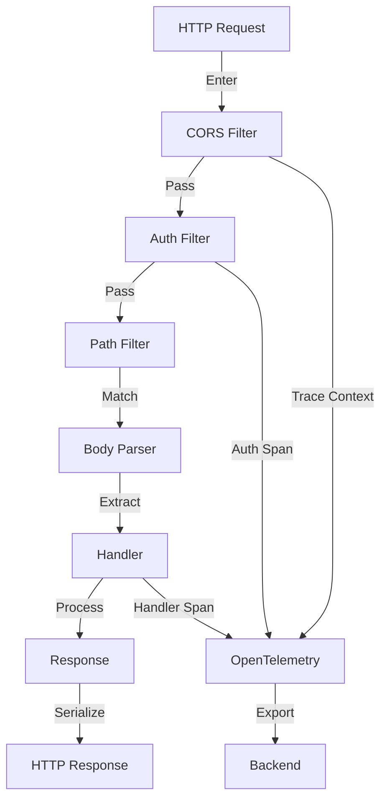

# How to Instrument Warp Web Framework with OpenTelemetry in Rust

Author: [nawazdhandala](https://www.github.com/nawazdhandala)

Tags: OpenTelemetry, Rust, Warp, Web Framework, Tracing, Filters

Description: Implement comprehensive distributed tracing for Warp web applications using OpenTelemetry to monitor HTTP requests, filters, and handler performance.

Warp provides a composable, fast web framework built on Rust's async ecosystem. Its filter-based architecture offers excellent performance but requires careful instrumentation to understand request flow through complex filter chains. OpenTelemetry integration reveals how requests traverse filters, identifies performance bottlenecks, and correlates backend operations with HTTP endpoints.

This guide shows you how to add OpenTelemetry tracing to Warp applications, instrument custom filters, propagate trace context, and monitor web service performance.

## Why Instrument Warp

Warp's functional composition creates powerful routing and middleware, but this abstraction makes debugging harder. Instrumentation provides:

- End-to-end request tracing across filter chains
- Performance breakdown by filter and handler
- Error tracking with full context
- Correlation between HTTP requests and backend operations
- Rate limiting and authentication flow visibility
- WebSocket connection lifecycle monitoring

## Warp Filter Architecture

Understanding Warp's filter composition helps design effective instrumentation:



## Dependencies Configuration

Add required crates to your `Cargo.toml`:

```toml
[dependencies]
# Warp web framework
warp = "0.3"

# OpenTelemetry ecosystem
opentelemetry = "0.22"
opentelemetry_sdk = { version = "0.22", features = ["rt-tokio"] }
opentelemetry-otlp = { version = "0.15", features = ["tonic"] }

# Tracing integration
tracing = "0.1"
tracing-subscriber = { version = "0.3", features = ["env-filter"] }
tracing-opentelemetry = "0.23"

# HTTP semantic conventions
opentelemetry-semantic-conventions = "0.14"

# Async runtime
tokio = { version = "1.35", features = ["full"] }

# Serialization
serde = { version = "1.0", features = ["derive"] }
serde_json = "1.0"
```

## Initialize OpenTelemetry Tracer

Set up the tracing pipeline with HTTP semantic conventions:

```rust
use opentelemetry::{global, trace::TracerProvider as _, KeyValue};
use opentelemetry_otlp::WithExportConfig;
use opentelemetry_sdk::{runtime, trace::TracerProvider, Resource};
use tracing_subscriber::{layer::SubscriberExt, util::SubscriberInitExt, EnvFilter};

fn init_tracer() -> Result<TracerProvider, Box<dyn std::error::Error>> {
    let exporter = opentelemetry_otlp::new_exporter()
        .tonic()
        .with_endpoint("http://localhost:4317");

    let provider = opentelemetry_otlp::new_pipeline()
        .tracing()
        .with_exporter(exporter)
        .with_trace_config(
            opentelemetry_sdk::trace::Config::default()
                .with_resource(Resource::new(vec![
                    KeyValue::new("service.name", "warp-web-service"),
                    KeyValue::new("service.version", "1.0.0"),
                    KeyValue::new("deployment.environment", "production"),
                ]))
        )
        .install_batch(runtime::Tokio)?;

    let telemetry = tracing_opentelemetry::layer()
        .with_tracer(provider.tracer("warp-service"));

    tracing_subscriber::registry()
        .with(EnvFilter::from_default_env())
        .with(telemetry)
        .with(tracing_subscriber::fmt::layer())
        .init();

    Ok(provider)
}
```

## Tracing Filter for HTTP Requests

Create a Warp filter that automatically traces all HTTP requests:

```rust
use warp::Filter;
use tracing::{info, info_span, Instrument};
use std::time::Instant;

fn with_tracing() -> impl Filter<Extract = (), Error = std::convert::Infallible> + Clone {
    warp::any()
        .and(warp::method())
        .and(warp::path::full())
        .and(warp::header::optional::<String>("user-agent"))
        .and_then(|method: warp::http::Method, path: warp::path::FullPath, user_agent: Option<String>| async move {
            let span = info_span!(
                "http_request",
                http.method = %method,
                http.target = %path.as_str(),
                http.user_agent = user_agent.as_deref().unwrap_or("unknown"),
            );

            let _enter = span.enter();

            info!("Request received");

            Ok::<_, std::convert::Infallible>(())
        })
        .untuple_one()
}

// Apply tracing to routes
fn traced_routes() -> impl Filter<Extract = impl warp::Reply, Error = warp::Rejection> + Clone {
    with_tracing()
        .and(api_routes())
}
```

## Instrument Request Handlers

Add instrumentation to individual route handlers:

```rust
use serde::{Deserialize, Serialize};
use tracing::instrument;

#[derive(Debug, Deserialize)]
struct CreateUserRequest {
    name: String,
    email: String,
}

#[derive(Debug, Serialize)]
struct User {
    id: u64,
    name: String,
    email: String,
}

// Instrumented handler with automatic span creation
#[instrument(skip(req), fields(user.email = %req.email))]
async fn create_user_handler(req: CreateUserRequest) -> Result<impl warp::Reply, warp::Rejection> {
    info!(user.name = %req.name, "Creating new user");

    // Simulate database operation
    tokio::time::sleep(tokio::time::Duration::from_millis(50)).await;

    let user = User {
        id: 1,
        name: req.name,
        email: req.email,
    };

    info!(user.id = user.id, "User created successfully");

    Ok(warp::reply::json(&user))
}

#[instrument(fields(user.id = user_id))]
async fn get_user_handler(user_id: u64) -> Result<impl warp::Reply, warp::Rejection> {
    info!("Fetching user");

    // Simulate database lookup
    tokio::time::sleep(tokio::time::Duration::from_millis(30)).await;

    let user = User {
        id: user_id,
        name: "John Doe".to_string(),
        email: "john@example.com".to_string(),
    };

    info!("User fetched successfully");

    Ok(warp::reply::json(&user))
}

#[instrument(fields(user.id = user_id))]
async fn delete_user_handler(user_id: u64) -> Result<impl warp::Reply, warp::Rejection> {
    info!("Deleting user");

    // Simulate database operation
    tokio::time::sleep(tokio::time::Duration::from_millis(40)).await;

    info!("User deleted successfully");

    Ok(warp::reply::with_status(
        "User deleted",
        warp::http::StatusCode::NO_CONTENT,
    ))
}
```

## Build Traced Route Definitions

Compose filters with tracing for complex routes:

```rust
fn api_routes() -> impl Filter<Extract = impl warp::Reply, Error = warp::Rejection> + Clone {
    users_routes()
        .or(health_route())
}

fn users_routes() -> impl Filter<Extract = impl warp::Reply, Error = warp::Rejection> + Clone {
    let create_user = warp::path!("users")
        .and(warp::post())
        .and(warp::body::json())
        .and_then(create_user_handler);

    let get_user = warp::path!("users" / u64)
        .and(warp::get())
        .and_then(get_user_handler);

    let delete_user = warp::path!("users" / u64)
        .and(warp::delete())
        .and_then(delete_user_handler);

    create_user.or(get_user).or(delete_user)
}

fn health_route() -> impl Filter<Extract = impl warp::Reply, Error = warp::Rejection> + Clone {
    warp::path!("health")
        .and(warp::get())
        .and_then(health_handler)
}

#[instrument]
async fn health_handler() -> Result<impl warp::Reply, warp::Rejection> {
    info!("Health check requested");

    #[derive(Serialize)]
    struct HealthResponse {
        status: String,
        timestamp: u64,
    }

    let response = HealthResponse {
        status: "healthy".to_string(),
        timestamp: std::time::SystemTime::now()
            .duration_since(std::time::UNIX_EPOCH)
            .unwrap()
            .as_secs(),
    };

    Ok(warp::reply::json(&response))
}
```

## Custom Authentication Filter with Tracing

Implement an authentication filter that creates child spans:

```rust
use warp::http::StatusCode;
use warp::reject::Rejection;

#[derive(Debug)]
struct Unauthorized;

impl warp::reject::Reject for Unauthorized {}

fn with_auth() -> impl Filter<Extract = (String,), Error = Rejection> + Clone {
    warp::header::optional::<String>("authorization")
        .and_then(|auth_header: Option<String>| async move {
            let span = info_span!(
                "authentication",
                auth.type = "bearer"
            );

            async move {
                let token = auth_header
                    .and_then(|h| h.strip_prefix("Bearer ").map(String::from))
                    .ok_or_else(|| warp::reject::custom(Unauthorized))?;

                info!(token.length = token.len(), "Validating token");

                // Simulate token validation
                tokio::time::sleep(tokio::time::Duration::from_millis(10)).await;

                if token.len() < 10 {
                    tracing::warn!("Invalid token");
                    return Err(warp::reject::custom(Unauthorized));
                }

                info!("Token validated successfully");

                Ok::<String, Rejection>(token)
            }
            .instrument(span)
            .await
        })
}

// Apply auth filter to protected routes
fn protected_routes() -> impl Filter<Extract = impl warp::Reply, Error = Rejection> + Clone {
    warp::path!("protected" / "data")
        .and(warp::get())
        .and(with_auth())
        .and_then(protected_handler)
}

#[instrument(skip(token), fields(auth.token.length = token.len()))]
async fn protected_handler(token: String) -> Result<impl warp::Reply, Rejection> {
    info!("Accessing protected resource");

    #[derive(Serialize)]
    struct ProtectedData {
        message: String,
        data: Vec<String>,
    }

    let response = ProtectedData {
        message: "Access granted".to_string(),
        data: vec!["sensitive".to_string(), "data".to_string()],
    };

    Ok(warp::reply::json(&response))
}
```

## Request Timing Middleware

Create middleware that measures request duration:

```rust
use std::time::Instant;
use tracing::warn;

fn with_timing() -> impl Filter<Extract = (), Error = std::convert::Infallible> + Clone {
    warp::any()
        .map(|| Instant::now())
        .untuple_one()
}

async fn log_timing(start: Instant) {
    let duration = start.elapsed();

    info!(
        duration_ms = duration.as_millis(),
        "Request completed"
    );

    // Warn on slow requests
    if duration.as_millis() > 100 {
        warn!(
            duration_ms = duration.as_millis(),
            "Slow request detected"
        );
    }
}

// Combine timing with other filters
fn timed_routes() -> impl Filter<Extract = impl warp::Reply, Error = Rejection> + Clone {
    with_timing()
        .and(api_routes())
        .then(|start: Instant, reply| async move {
            log_timing(start).await;
            reply
        })
}
```

## Error Handling with Trace Context

Implement rejection handling that maintains trace context:

```rust
use tracing::error;

async fn handle_rejection(err: Rejection) -> Result<impl warp::Reply, std::convert::Infallible> {
    let code;
    let message;

    if err.is_not_found() {
        code = StatusCode::NOT_FOUND;
        message = "Not Found";
        error!("Route not found");
    } else if let Some(Unauthorized) = err.find() {
        code = StatusCode::UNAUTHORIZED;
        message = "Unauthorized";
        error!("Authentication failed");
    } else if err.find::<warp::reject::MethodNotAllowed>().is_some() {
        code = StatusCode::METHOD_NOT_ALLOWED;
        message = "Method Not Allowed";
        error!("Method not allowed");
    } else {
        code = StatusCode::INTERNAL_SERVER_ERROR;
        message = "Internal Server Error";
        error!(error = ?err, "Unhandled error");
    }

    #[derive(Serialize)]
    struct ErrorResponse {
        error: String,
        status: u16,
    }

    let json = warp::reply::json(&ErrorResponse {
        error: message.into(),
        status: code.as_u16(),
    });

    Ok(warp::reply::with_status(json, code))
}
```

## WebSocket Connection Tracing

Instrument WebSocket connections for real-time communication:

```rust
use warp::ws::{Message, WebSocket};
use futures::{StreamExt, SinkExt};

fn websocket_route() -> impl Filter<Extract = impl warp::Reply, Error = Rejection> + Clone {
    warp::path!("ws")
        .and(warp::ws())
        .and_then(websocket_handler)
}

#[instrument]
async fn websocket_handler(ws: warp::ws::Ws) -> Result<impl warp::Reply, Rejection> {
    info!("WebSocket connection initiated");

    Ok(ws.on_upgrade(|socket| handle_websocket(socket)))
}

#[instrument(skip(websocket))]
async fn handle_websocket(websocket: WebSocket) {
    info!("WebSocket connected");

    let (mut tx, mut rx) = websocket.split();

    let mut message_count = 0u64;

    // Process incoming messages
    while let Some(result) = rx.next().await {
        message_count += 1;

        match result {
            Ok(msg) => {
                info!(
                    message_number = message_count,
                    "WebSocket message received"
                );

                if msg.is_text() {
                    let text = msg.to_str().unwrap_or("");
                    info!(message_length = text.len(), "Text message");

                    // Echo back
                    let response = format!("Echo: {}", text);
                    if tx.send(Message::text(response)).await.is_err() {
                        error!("Failed to send WebSocket message");
                        break;
                    }
                } else if msg.is_close() {
                    info!("WebSocket close frame received");
                    break;
                }
            }
            Err(e) => {
                error!(error = %e, "WebSocket error");
                break;
            }
        }
    }

    info!(
        total_messages = message_count,
        "WebSocket disconnected"
    );
}
```

## Complete Application Assembly

Bring all components together in a production-ready server:

```rust
use warp::Filter;

#[tokio::main]
async fn main() -> Result<(), Box<dyn std::error::Error>> {
    // Initialize OpenTelemetry
    let provider = init_tracer()?;

    info!("Starting Warp server with OpenTelemetry");

    // Build complete route tree
    let routes = with_tracing()
        .and(
            api_routes()
                .or(protected_routes())
                .or(websocket_route())
        )
        .recover(handle_rejection);

    // Add CORS if needed
    let cors = warp::cors()
        .allow_any_origin()
        .allow_methods(vec!["GET", "POST", "DELETE"])
        .allow_headers(vec!["content-type", "authorization"]);

    let routes_with_cors = routes.with(cors);

    info!("Server listening on http://0.0.0.0:3030");

    // Run server
    let server = warp::serve(routes_with_cors)
        .run(([0, 0, 0, 0], 3030));

    // Graceful shutdown
    tokio::select! {
        _ = server => {},
        _ = tokio::signal::ctrl_c() => {
            info!("Shutdown signal received");
        }
    }

    // Flush spans before exit
    opentelemetry::global::shutdown_tracer_provider();
    provider.shutdown()?;

    info!("Server shutdown complete");

    Ok(())
}
```

## Testing with Trace Propagation

Write tests that verify trace context propagation:

```rust
#[cfg(test)]
mod tests {
    use super::*;
    use warp::test::request;

    #[tokio::test]
    async fn test_traced_endpoint() {
        let provider = init_tracer().unwrap();

        let api = api_routes();

        let response = request()
            .method("GET")
            .path("/health")
            .reply(&api)
            .await;

        assert_eq!(response.status(), 200);

        provider.shutdown().unwrap();
    }

    #[tokio::test]
    async fn test_auth_filter() {
        let provider = init_tracer().unwrap();

        let api = protected_routes();

        // Test without auth
        let response = request()
            .method("GET")
            .path("/protected/data")
            .reply(&api)
            .await;

        assert_eq!(response.status(), 401);

        // Test with auth
        let response = request()
            .method("GET")
            .path("/protected/data")
            .header("authorization", "Bearer valid-token-here")
            .reply(&api)
            .await;

        assert_eq!(response.status(), 200);

        provider.shutdown().unwrap();
    }
}
```

## Performance Monitoring

Track key performance indicators for your Warp service:

```rust
use std::sync::atomic::{AtomicU64, Ordering};
use std::sync::Arc;

#[derive(Clone)]
struct Metrics {
    request_count: Arc<AtomicU64>,
    error_count: Arc<AtomicU64>,
}

impl Metrics {
    fn new() -> Self {
        Self {
            request_count: Arc::new(AtomicU64::new(0)),
            error_count: Arc::new(AtomicU64::new(0)),
        }
    }

    fn record_request(&self) {
        self.request_count.fetch_add(1, Ordering::Relaxed);
    }

    fn record_error(&self) {
        self.error_count.fetch_add(1, Ordering::Relaxed);
    }

    fn get_counts(&self) -> (u64, u64) {
        (
            self.request_count.load(Ordering::Relaxed),
            self.error_count.load(Ordering::Relaxed),
        )
    }
}

fn with_metrics(metrics: Metrics) -> impl Filter<Extract = (Metrics,), Error = std::convert::Infallible> + Clone {
    warp::any()
        .map(move || {
            let m = metrics.clone();
            m.record_request();
            m
        })
}
```

## Production Deployment Tips

When deploying instrumented Warp services:

**Trace Sampling**: Configure sampling rates based on traffic volume. High-traffic endpoints may need lower sampling rates to manage storage costs.

**Filter Ordering**: Place tracing filters early in the chain to capture complete request lifecycle, but after authentication to include auth context in spans.

**Error Context**: Always include relevant request information in error spans to facilitate debugging production issues.

**Connection Pooling**: Instrument database connection pools and HTTP clients used within handlers to track backend dependencies.

**Resource Limits**: Monitor spawned task counts and connection limits to prevent resource exhaustion under load.

**Context Propagation**: Ensure trace context propagates to all spawned tasks and background jobs triggered by HTTP requests.

Instrumenting Warp applications with OpenTelemetry provides comprehensive visibility into your web service behavior. The filter-based architecture integrates naturally with OpenTelemetry's span model, creating detailed traces that show exactly how requests flow through your application. This observability enables rapid debugging, performance optimization, and confident scaling of production Rust web services.
