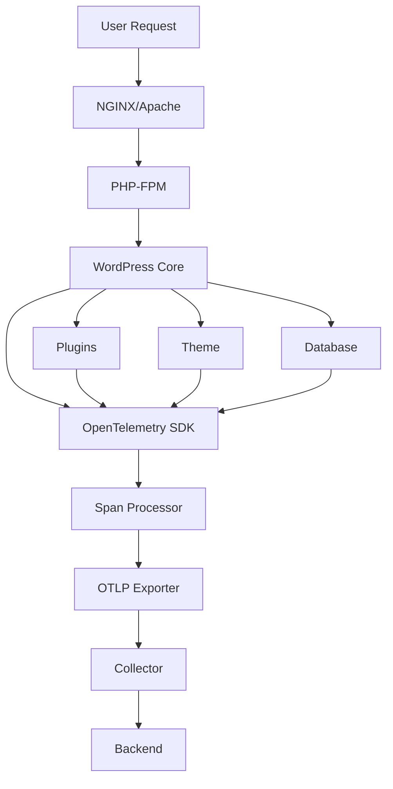

# How to Instrument WordPress with OpenTelemetry for Performance Monitoring

Author: [nawazdhandala](https://www.github.com/nawazdhandala)

Tags: OpenTelemetry, PHP, WordPress, Performance, Monitoring, CMS

Description: Learn how to instrument WordPress with OpenTelemetry to track page load times, database queries, plugin performance, and identify bottlenecks in your WordPress site.

WordPress powers over 40% of all websites on the internet, making performance monitoring critical for user experience and SEO. OpenTelemetry provides comprehensive observability for WordPress installations, helping you identify slow database queries, problematic plugins, and theme rendering issues before they impact your users.

## Why Monitor WordPress with OpenTelemetry

WordPress sites often suffer from performance issues due to poorly coded plugins, unoptimized themes, or inefficient database queries. Traditional monitoring tools give you surface-level metrics, but OpenTelemetry provides distributed tracing that shows exactly where time is spent during each request. You can see which plugin hooks are slowing down page loads, which database queries need optimization, and how your caching layers are performing.

## Architecture Overview

Here's how OpenTelemetry integrates with a typical WordPress installation:



## Installing OpenTelemetry Dependencies

First, add the OpenTelemetry SDK and required packages to your WordPress installation. Since WordPress doesn't use Composer by default, you'll need to set up a custom directory structure.

Create a `composer.json` file in your WordPress root directory:

```json
{
    "require": {
        "open-telemetry/sdk": "^1.0",
        "open-telemetry/exporter-otlp": "^1.0",
        "open-telemetry/opentelemetry-auto-wordpress": "^0.0.1"
    },
    "config": {
        "vendor-dir": "wp-content/vendor"
    }
}
```

Install the dependencies:

```bash
composer install
```

## Creating a Must-Use Plugin for Instrumentation

WordPress must-use plugins load before regular plugins, making them perfect for instrumentation. Create the file `wp-content/mu-plugins/opentelemetry-instrumentation.php`:

```php
<?php
/**
 * Plugin Name: OpenTelemetry Instrumentation
 * Description: Provides distributed tracing for WordPress
 * Version: 1.0.0
 */

require_once ABSPATH . 'wp-content/vendor/autoload.php';

use OpenTelemetry\API\Globals;
use OpenTelemetry\API\Trace\SpanKind;
use OpenTelemetry\API\Trace\StatusCode;
use OpenTelemetry\SDK\Trace\TracerProvider;
use OpenTelemetry\SDK\Trace\SpanProcessor\SimpleSpanProcessor;
use OpenTelemetry\Contrib\Otlp\SpanExporter;
use OpenTelemetry\SDK\Resource\ResourceInfo;
use OpenTelemetry\SDK\Resource\ResourceInfoFactory;
use OpenTelemetry\SDK\Common\Attribute\Attributes;
use OpenTelemetry\SemConv\ResourceAttributes;

class WordPressOTelInstrumentation {
    private $tracer;
    private $rootSpan;

    public function __construct() {
        $this->initializeTracer();
        $this->setupHooks();
    }

    private function initializeTracer() {
        // Configure resource attributes to identify this WordPress instance
        $resource = ResourceInfoFactory::defaultResource()->merge(
            ResourceInfo::create(Attributes::create([
                ResourceAttributes::SERVICE_NAME => 'wordpress',
                ResourceAttributes::SERVICE_VERSION => get_bloginfo('version'),
                ResourceAttributes::DEPLOYMENT_ENVIRONMENT => wp_get_environment_type(),
                'wordpress.site.url' => get_site_url(),
            ]))
        );

        // Set up the OTLP exporter to send traces to your collector
        $exporter = new SpanExporter(
            \OpenTelemetry\Contrib\Otlp\HttpTransportFactory::create(
                getenv('OTEL_EXPORTER_OTLP_ENDPOINT') ?: 'http://localhost:4318/v1/traces',
                'application/json'
            )
        );

        // Create tracer provider with the exporter
        $tracerProvider = TracerProvider::builder()
            ->addSpanProcessor(new SimpleSpanProcessor($exporter))
            ->setResource($resource)
            ->build();

        Globals::registerInitializer(fn() => $tracerProvider);
        $this->tracer = $tracerProvider->getTracer('wordpress-instrumentation');
    }

    private function setupHooks() {
        // Create root span for the entire request
        add_action('muplugins_loaded', [$this, 'startRootSpan'], 1);

        // Track plugin loading performance
        add_action('plugin_loaded', [$this, 'trackPluginLoad']);

        // Track database queries
        add_filter('query', [$this, 'trackDatabaseQuery']);

        // Track theme rendering
        add_action('template_redirect', [$this, 'startTemplateSpan']);

        // Track REST API requests
        add_filter('rest_pre_dispatch', [$this, 'startRestApiSpan'], 10, 3);

        // Track WP_Query performance
        add_action('pre_get_posts', [$this, 'startQuerySpan']);
        add_action('the_posts', [$this, 'endQuerySpan'], 10, 2);

        // End root span when request completes
        add_action('shutdown', [$this, 'endRootSpan'], 999);
    }

    public function startRootSpan() {
        $this->rootSpan = $this->tracer
            ->spanBuilder($_SERVER['REQUEST_METHOD'] . ' ' . $_SERVER['REQUEST_URI'])
            ->setSpanKind(SpanKind::KIND_SERVER)
            ->setAttribute('http.method', $_SERVER['REQUEST_METHOD'])
            ->setAttribute('http.url', $_SERVER['REQUEST_URI'])
            ->setAttribute('http.scheme', is_ssl() ? 'https' : 'http')
            ->setAttribute('http.host', $_SERVER['HTTP_HOST'])
            ->setAttribute('http.user_agent', $_SERVER['HTTP_USER_AGENT'] ?? 'unknown')
            ->startSpan();

        $scope = $this->rootSpan->activate();
    }

    public function trackPluginLoad($plugin) {
        // This creates a span for each plugin that loads
        $span = $this->tracer
            ->spanBuilder('plugin.load')
            ->setAttribute('plugin.name', $plugin)
            ->startSpan();

        // Plugin already loaded, so we end immediately
        $span->end();
    }

    public function trackDatabaseQuery($query) {
        global $wpdb;

        // Start a span before the query executes
        $span = $this->tracer
            ->spanBuilder('db.query')
            ->setSpanKind(SpanKind::KIND_CLIENT)
            ->setAttribute('db.system', 'mysql')
            ->setAttribute('db.name', DB_NAME)
            ->setAttribute('db.statement', $query)
            ->setAttribute('db.operation', $this->extractOperation($query))
            ->startSpan();

        // Store span to end it after query completes
        $GLOBALS['otel_db_span'] = $span;

        // Hook to end span after query
        add_filter('posts_results', function($results) {
            if (isset($GLOBALS['otel_db_span'])) {
                $GLOBALS['otel_db_span']->end();
                unset($GLOBALS['otel_db_span']);
            }
            return $results;
        });

        return $query;
    }

    private function extractOperation($query) {
        // Extract SQL operation type from query
        preg_match('/^(SELECT|INSERT|UPDATE|DELETE|CREATE|ALTER|DROP)/i', trim($query), $matches);
        return strtoupper($matches[1] ?? 'UNKNOWN');
    }

    public function startTemplateSpan() {
        $template = get_page_template_slug() ?: 'default';

        $span = $this->tracer
            ->spanBuilder('template.render')
            ->setAttribute('template.name', $template)
            ->setAttribute('template.type', $this->getTemplateType())
            ->startSpan();

        $GLOBALS['otel_template_span'] = $span;

        // End span on wp_footer
        add_action('wp_footer', function() {
            if (isset($GLOBALS['otel_template_span'])) {
                $GLOBALS['otel_template_span']->end();
            }
        }, 999);
    }

    private function getTemplateType() {
        if (is_front_page()) return 'front_page';
        if (is_home()) return 'blog';
        if (is_single()) return 'single';
        if (is_page()) return 'page';
        if (is_archive()) return 'archive';
        if (is_search()) return 'search';
        if (is_404()) return '404';
        return 'unknown';
    }

    public function startRestApiSpan($result, $server, $request) {
        $route = $request->get_route();

        $span = $this->tracer
            ->spanBuilder('rest.api')
            ->setSpanKind(SpanKind::KIND_SERVER)
            ->setAttribute('http.route', $route)
            ->setAttribute('http.method', $request->get_method())
            ->startSpan();

        $GLOBALS['otel_rest_span'] = $span;

        // End span after REST response
        add_filter('rest_post_dispatch', function($response) {
            if (isset($GLOBALS['otel_rest_span'])) {
                $GLOBALS['otel_rest_span']
                    ->setAttribute('http.status_code', $response->get_status())
                    ->end();
            }
            return $response;
        }, 999);

        return $result;
    }

    public function startQuerySpan($query) {
        if (!isset($GLOBALS['otel_query_count'])) {
            $GLOBALS['otel_query_count'] = 0;
        }
        $GLOBALS['otel_query_count']++;

        $span = $this->tracer
            ->spanBuilder('wp.query')
            ->setAttribute('query.type', $query->query_vars['post_type'] ?? 'post')
            ->setAttribute('query.number', $GLOBALS['otel_query_count'])
            ->startSpan();

        $query->otel_span = $span;
    }

    public function endQuerySpan($posts, $query) {
        if (isset($query->otel_span)) {
            $query->otel_span
                ->setAttribute('query.post_count', count($posts))
                ->setAttribute('query.found_posts', $query->found_posts)
                ->end();
        }
        return $posts;
    }

    public function endRootSpan() {
        if ($this->rootSpan) {
            $this->rootSpan
                ->setAttribute('http.status_code', http_response_code())
                ->setAttribute('wordpress.memory_peak', memory_get_peak_usage(true))
                ->setAttribute('wordpress.queries', get_num_queries())
                ->setStatus(StatusCode::STATUS_OK)
                ->end();
        }
    }
}

// Initialize instrumentation
new WordPressOTelInstrumentation();
```

## Configuration

Set environment variables in your `wp-config.php` file or server configuration:

```php
// Add to wp-config.php before the database constants
putenv('OTEL_EXPORTER_OTLP_ENDPOINT=http://localhost:4318/v1/traces');
putenv('OTEL_SERVICE_NAME=wordpress');
putenv('OTEL_TRACES_SAMPLER=parentbased_traceidratio');
putenv('OTEL_TRACES_SAMPLER_ARG=0.1'); // Sample 10% of traces
```

## Monitoring Specific Plugins

To track performance of specific plugins, add custom instrumentation:

```php
// Track WooCommerce checkout performance
add_action('woocommerce_checkout_process', function() {
    $tracer = Globals::tracerProvider()->getTracer('wordpress-instrumentation');
    $span = $tracer->spanBuilder('woocommerce.checkout')->startSpan();
    $GLOBALS['wc_checkout_span'] = $span;
});

add_action('woocommerce_checkout_order_processed', function($order_id) {
    if (isset($GLOBALS['wc_checkout_span'])) {
        $GLOBALS['wc_checkout_span']
            ->setAttribute('order.id', $order_id)
            ->end();
    }
});
```

## Analyzing Performance Data

Once instrumentation is active, you'll see traces showing:

- Total request duration broken down by WordPress lifecycle stages
- Individual plugin load times and their hooks
- Database query performance with full SQL statements
- Template rendering time
- REST API endpoint performance
- WP_Query execution time and result counts

Look for spans with long durations to identify bottlenecks. Common issues include:

- Plugins executing dozens of database queries on every page load
- Unoptimized WP_Query calls without proper caching
- Slow external API calls blocking page rendering
- Heavy template files with excessive logic

## Production Considerations

For production environments, adjust your sampling rate to balance observability with performance overhead. A 1-5% sample rate typically provides sufficient visibility while minimizing impact:

```php
putenv('OTEL_TRACES_SAMPLER_ARG=0.01'); // Sample 1% of traces
```

Consider using head-based sampling for critical pages like checkout flows while sampling less important pages at lower rates.

## Conclusion

OpenTelemetry transforms WordPress performance monitoring from guesswork into data-driven optimization. You can now see exactly which plugins, queries, and templates consume the most time, enabling targeted improvements that directly impact user experience. The instrumentation runs with minimal overhead and integrates seamlessly with WordPress's hook system, making it suitable for production use on high-traffic sites.
