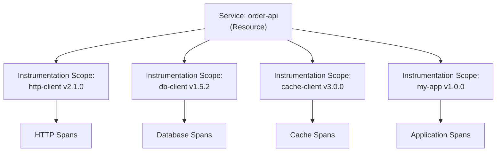
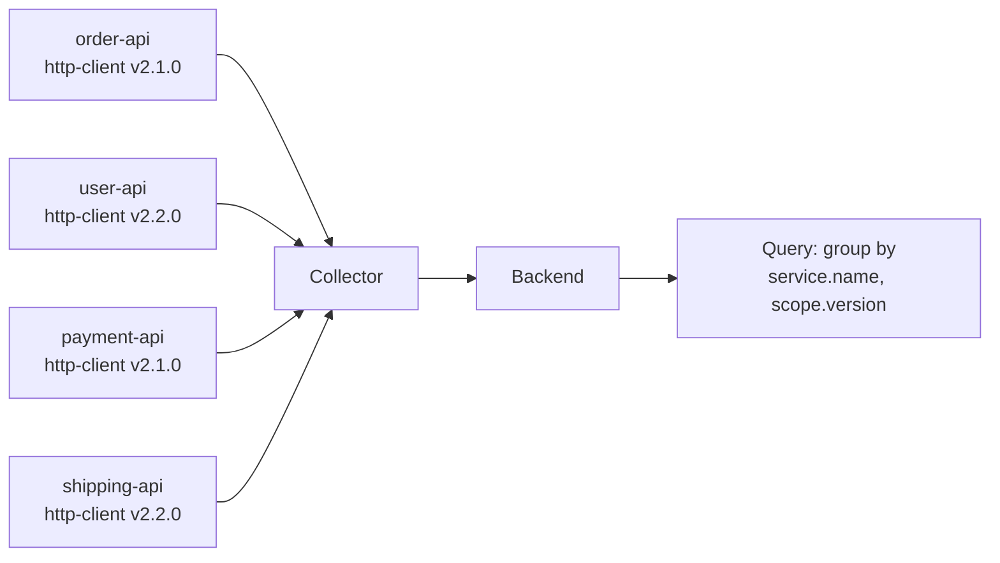

# How to Use Instrumentation Scope to Organize Telemetry by Library Version

Author: [nawazdhandala](https://www.github.com/nawazdhandala)

Tags: OpenTelemetry, Instrumentation Scope, Tracing, Metrics, Logging, SDK, Versioning, Observability

Description: Learn how to use OpenTelemetry's Instrumentation Scope to organize and filter telemetry data by instrumentation library name and version.

---

When you call `tracer_provider.get_tracer("my.library", "1.2.3")`, that name and version pair is the Instrumentation Scope. Every span, metric, and log record produced by that tracer (or meter, or logger) carries this scope as metadata. Instrumentation Scope is one of those features that seems minor at first but becomes essential as your system grows. It lets you filter telemetry by the library that produced it, track which version of your instrumentation is running, and diagnose issues that are specific to a particular library version. This post covers what Instrumentation Scope is, how to set it correctly, and practical ways to use it for organizing telemetry.

## What is Instrumentation Scope

The OpenTelemetry specification defines Instrumentation Scope as a logical unit of instrumentation code. It has three fields:

- **Name**: A unique identifier for the instrumentation library (e.g., `io.opentelemetry.contrib.jdbc` or `my.company.auth-lib`)
- **Version**: The version of the instrumentation library (e.g., `1.2.3`)
- **Schema URL**: An optional URL pointing to the telemetry schema used by this instrumentation (e.g., `https://opentelemetry.io/schemas/1.21.0`)

Every telemetry signal (span, metric, log) carries the scope of the instrumentation that created it. This is different from the resource, which identifies the service or process. A single service might use multiple instrumentation libraries, each with its own scope.



## Setting the Instrumentation Scope

You set the scope when you acquire a tracer, meter, or logger from the provider. The scope is fixed for the lifetime of that tracer instance.

### Python

```python
from opentelemetry import trace, metrics
from opentelemetry.sdk.trace import TracerProvider
from opentelemetry.sdk.metrics import MeterProvider

# Set up providers
trace.set_tracer_provider(TracerProvider())
metrics.set_meter_provider(MeterProvider())

# Each get_tracer call defines an instrumentation scope
# The name should identify the instrumentation library, not the service
http_tracer = trace.get_tracer(
    "com.mycompany.http-client",  # Instrumentation library name
    "2.1.0",                       # Instrumentation library version
    schema_url="https://opentelemetry.io/schemas/1.21.0",
)

db_tracer = trace.get_tracer(
    "com.mycompany.db-client",
    "1.5.2",
)

# Same pattern for meters
http_meter = metrics.get_meter(
    "com.mycompany.http-client",
    "2.1.0",
)

db_meter = metrics.get_meter(
    "com.mycompany.db-client",
    "1.5.2",
)
```

The key point is that the name and version identify the code that produces the telemetry, not the service that runs it. If you write a shared HTTP client library used by 10 services, all 10 services will report spans with the same instrumentation scope name and version.

### Java

```java
import io.opentelemetry.api.OpenTelemetry;
import io.opentelemetry.api.trace.Tracer;
import io.opentelemetry.api.metrics.Meter;

public class InstrumentedHttpClient {
    // The instrumentation scope is defined once for the library
    private static final String INSTRUMENTATION_NAME = "com.mycompany.http-client";
    private static final String INSTRUMENTATION_VERSION = "2.1.0";

    private final Tracer tracer;
    private final Meter meter;

    public InstrumentedHttpClient(OpenTelemetry openTelemetry) {
        // Acquire tracer and meter with the library's scope
        this.tracer = openTelemetry.getTracer(
            INSTRUMENTATION_NAME,
            INSTRUMENTATION_VERSION
        );
        this.meter = openTelemetry.getMeter(
            INSTRUMENTATION_NAME,
            INSTRUMENTATION_VERSION
        );
    }

    public Response execute(Request request) {
        // All spans created by this tracer carry the scope
        // "com.mycompany.http-client" version "2.1.0"
        var span = tracer.spanBuilder("HTTP " + request.method())
            .setAttribute("http.method", request.method())
            .setAttribute("http.url", request.url())
            .startSpan();

        try (var scope = span.makeCurrent()) {
            return doExecute(request);
        } finally {
            span.end();
        }
    }
}
```

### Node.js

```javascript
const { trace, metrics } = require('@opentelemetry/api');

// Define the instrumentation scope for this library
const INSTRUMENTATION_NAME = 'com.mycompany.http-client';
const INSTRUMENTATION_VERSION = '2.1.0';

// Get a tracer with the library's scope
const tracer = trace.getTracer(
    INSTRUMENTATION_NAME,
    INSTRUMENTATION_VERSION
);

// Get a meter with the same scope
const meter = metrics.getMeter(
    INSTRUMENTATION_NAME,
    INSTRUMENTATION_VERSION
);

async function executeRequest(url, method) {
    // Spans carry the instrumentation scope metadata
    const span = tracer.startSpan(`HTTP ${method}`);
    span.setAttribute('http.method', method);
    span.setAttribute('http.url', url);

    try {
        const response = await fetch(url, { method });
        span.setAttribute('http.status_code', response.status);
        return response;
    } finally {
        span.end();
    }
}
```

## Naming Conventions

The instrumentation scope name should follow a consistent convention across your organization. The OpenTelemetry specification recommends using the instrumentation library's package name or a reverse domain name:

```python
# Good: reverse domain notation, identifies the library
tracer = trace.get_tracer("com.mycompany.payments.client", "3.1.0")
tracer = trace.get_tracer("io.opentelemetry.instrumentation.flask", "0.45b0")

# Good: package name
tracer = trace.get_tracer("@mycompany/http-client", "2.0.0")

# Bad: too generic, not useful for filtering
tracer = trace.get_tracer("tracer", "1.0")

# Bad: service name (use resource attributes for this)
tracer = trace.get_tracer("order-api", "1.0")

# Bad: no version (makes it hard to track instrumentation changes)
tracer = trace.get_tracer("com.mycompany.http-client")
```

Always include the version. Without it, you cannot tell which version of the instrumentation produced a particular span. This matters when you are rolling out a new version that changes span names, attributes, or behavior.

## How Scope Appears in Exported Data

When spans are exported in OTLP format, they are grouped by instrumentation scope. This grouping happens at the protocol level, not just as metadata on individual spans:

```json
{
  "resourceSpans": [
    {
      "resource": {
        "attributes": [
          { "key": "service.name", "value": { "stringValue": "order-api" } }
        ]
      },
      "scopeSpans": [
        {
          "scope": {
            "name": "com.mycompany.http-client",
            "version": "2.1.0"
          },
          "spans": [
            { "name": "HTTP GET", "traceId": "abc...", "spanId": "def..." },
            { "name": "HTTP POST", "traceId": "ghi...", "spanId": "jkl..." }
          ]
        },
        {
          "scope": {
            "name": "com.mycompany.db-client",
            "version": "1.5.2"
          },
          "spans": [
            { "name": "SELECT orders", "traceId": "abc...", "spanId": "mno..." },
            { "name": "INSERT order", "traceId": "ghi...", "spanId": "pqr..." }
          ]
        }
      ]
    }
  ]
}
```

This grouping is efficient because the scope metadata is not repeated for every span. It also makes filtering straightforward: a backend can index by scope name and version, allowing queries like "show me all spans from http-client version 2.1.0".

## Filtering Telemetry by Scope

Backends that understand the OTLP data model let you filter by instrumentation scope. This is useful for several scenarios.

### Debugging a specific library version

If you suspect a bug in version 2.1.0 of your HTTP client library, filter for spans with that scope:

```
# Pseudo-query for a trace backend
scope.name = "com.mycompany.http-client" AND scope.version = "2.1.0"
```

### Comparing versions during a rollout

When rolling out version 2.2.0, compare its behavior against the existing 2.1.0:

```
# Find error rates by version
scope.name = "com.mycompany.http-client"
| group by scope.version
| calculate error_rate = count(status = ERROR) / count(*)
```

### Identifying noisy instrumentation

If your telemetry volume spikes unexpectedly, group by scope to find which library is producing the most data:

```
# Count spans by instrumentation scope
group by scope.name, scope.version
| sort by count desc
```

## Using Scope in the Collector

The OpenTelemetry Collector can filter, transform, and route telemetry based on instrumentation scope. The `filter` processor supports scope-based conditions:

```yaml
# Collector configuration: drop telemetry from a specific scope
processors:
  filter/drop-noisy:
    traces:
      span:
        # Drop spans from a known noisy instrumentation library
        - 'instrumentation_scope.name == "com.thirdparty.verbose-lib"'

  filter/keep-important:
    traces:
      span:
        # Only keep spans from specific instrumentation libraries
        - 'instrumentation_scope.name != "com.mycompany.http-client"'
        - 'instrumentation_scope.name != "com.mycompany.db-client"'

receivers:
  otlp:
    protocols:
      grpc:
        endpoint: 0.0.0.0:4317

exporters:
  otlp:
    endpoint: backend.example.com:4317

service:
  pipelines:
    traces:
      receivers: [otlp]
      processors: [filter/drop-noisy]
      exporters: [otlp]
```

You can also use the `transform` processor to modify scope-based attributes:

```yaml
# Add an attribute based on instrumentation scope
processors:
  transform:
    trace_statements:
      - context: span
        statements:
          # Tag spans from internal libraries for easy filtering
          - set(attributes["instrumentation.origin"], "internal")
            where instrumentation_scope.name startswith "com.mycompany"
          - set(attributes["instrumentation.origin"], "third-party")
            where not(instrumentation_scope.name startswith "com.mycompany")
```

## Organizing Metrics by Scope

Instrumentation Scope is equally important for metrics. Each meter creates metrics under its scope, which helps prevent naming collisions and enables scope-based filtering:

```python
from opentelemetry import metrics

# HTTP client meter
http_meter = metrics.get_meter("com.mycompany.http-client", "2.1.0")
http_duration = http_meter.create_histogram(
    "http.client.duration",
    unit="ms",
    description="HTTP request duration",
)

# Database client meter
db_meter = metrics.get_meter("com.mycompany.db-client", "1.5.2")
db_duration = db_meter.create_histogram(
    "db.client.duration",
    unit="ms",
    description="Database query duration",
)

# Both metrics have the same base name pattern but different scopes
# The scope prevents ambiguity in the backend
```

When both meters create a histogram called `duration`, the scope differentiates them. Without scope, you would need unique metric names like `http_client_duration` and `db_client_duration`. With scope, the metric name can follow semantic conventions while the scope provides context.

## Scope and Auto-Instrumentation

Auto-instrumentation libraries set their own instrumentation scope automatically. When you use the OpenTelemetry Python auto-instrumentation for Flask, for example, it creates a tracer with a scope like `opentelemetry.instrumentation.flask` and the instrumentation package version. You do not need to configure this.

```python
# Auto-instrumentation sets scope automatically
# You only need to set scope for your own manual instrumentation

from opentelemetry import trace

# Your application's manual instrumentation
# Use a scope that identifies YOUR code, not the auto-instrumentation
app_tracer = trace.get_tracer(
    "com.mycompany.order-processing",  # Your library name
    "1.0.0",                            # Your library version
)

# The auto-instrumented Flask spans will have scope:
#   name: "opentelemetry.instrumentation.flask"
#   version: "0.45b0" (or whatever version is installed)

# Your manual spans will have scope:
#   name: "com.mycompany.order-processing"
#   version: "1.0.0"
```

This separation lets you filter for auto-instrumented spans versus manual spans, which is useful for understanding how much of your telemetry comes from automatic versus custom instrumentation.

## Tracking Instrumentation Upgrades

One of the most practical uses of Instrumentation Scope is tracking library upgrades across a fleet of services. If you have 50 microservices using your HTTP client library, the scope version tells you which services are running which version:



A backend query grouping by `service.name` and `scope.version` gives you a fleet-wide view of which services have upgraded and which have not. This is invaluable during a staged rollout of a new library version.

## Best Practices

Here are guidelines for making the most of Instrumentation Scope:

1. **One scope per library**: Each instrumentation library should use exactly one scope. Do not create multiple tracers with different names within the same library.

2. **Always include the version**: The version field is optional in the API but should always be set. It is your primary tool for tracking which instrumentation produced which telemetry.

3. **Use semantic versioning**: Follow semver for your instrumentation library versions. This makes it clear when a version change includes breaking changes to the telemetry it produces.

4. **Keep the name stable**: The scope name should not change between versions. Changing the name breaks queries and dashboards that filter by scope.

5. **Use schema URLs for schema-aware backends**: If your backend supports schema-based telemetry evolution, set the schema URL to enable automatic attribute migration when schemas change.

6. **Do not use scope for runtime context**: Scope identifies the instrumentation code, not runtime context like request ID or tenant. Use attributes for runtime context.

```python
# Good: scope identifies the instrumentation library
tracer = trace.get_tracer("com.mycompany.http-client", "2.1.0")

# Bad: scope changes per request (creates unbounded tracers)
tracer = trace.get_tracer(f"com.mycompany.http-client.{request_id}")
```

Creating a new tracer for each request would produce an unbounded number of scopes, consuming memory and making scope-based filtering useless. The scope should be a compile-time constant, not a runtime value.

## Conclusion

Instrumentation Scope is the metadata layer that connects telemetry to the code that produced it. By setting meaningful names and versions on your tracers, meters, and loggers, you enable filtering, comparison, and fleet-wide tracking of instrumentation. The scope travels with every span, metric, and log record through the OpenTelemetry pipeline, from SDK to collector to backend. Use it to debug specific library versions, compare behavior during rollouts, identify noisy instrumentation, and organize your telemetry into logical groups. It takes just two extra arguments on `get_tracer()`, but the operational value it provides is substantial.
