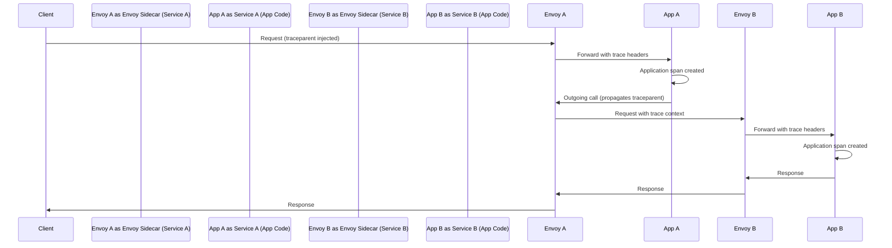
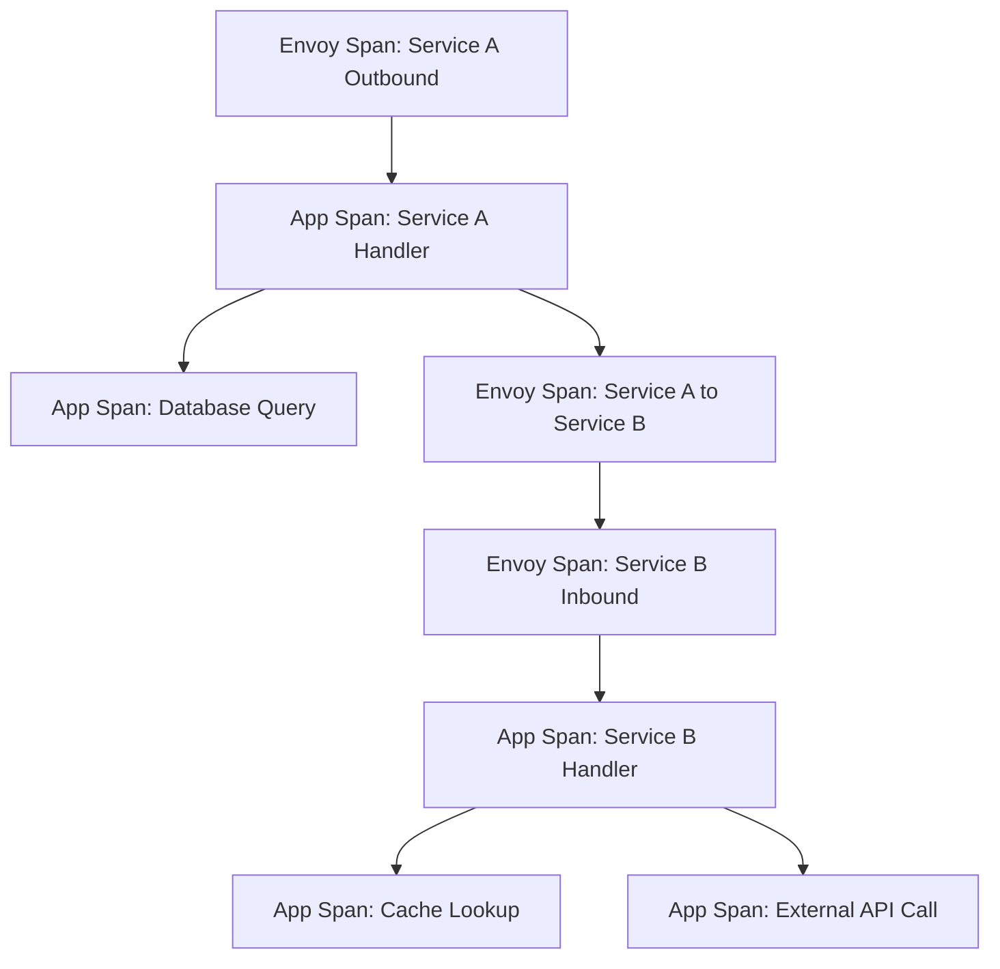

# How to Integrate OpenTelemetry with Istio Service Mesh for Full Visibility

Author: [nawazdhandala](https://www.github.com/nawazdhandala)

Tags: OpenTelemetry, Istio, Service Mesh, Distributed Tracing, Kubernetes, Envoy, Observability

Description: Learn how to integrate OpenTelemetry with Istio service mesh to get complete distributed tracing and observability across your microservices running on Kubernetes.

---

If you're running microservices on Kubernetes with Istio, you already get some observability out of the box. Istio's sidecar proxies (Envoy) generate metrics, logs, and traces for every request flowing through the mesh. But that default telemetry only covers the network layer. It won't tell you what's happening inside your application code. That's where OpenTelemetry comes in.

By integrating OpenTelemetry with Istio, you can stitch together the infrastructure-level traces from Envoy with application-level spans from your code. The result is full end-to-end visibility, from the moment a request enters the mesh to the deepest database query inside your service.

## How Istio Tracing Works

Istio injects an Envoy sidecar proxy alongside every pod in the mesh. Envoy intercepts all inbound and outbound traffic and automatically generates trace spans for each request. These spans capture timing, HTTP status codes, request headers, and upstream/downstream service identity.

However, Envoy can only trace what it can see at the network boundary. It creates spans for the ingress and egress of each service, but it has no idea what your application does between receiving a request and sending a response.

The key mechanism that ties everything together is context propagation. Envoy injects trace context headers (like `traceparent` from the W3C Trace Context standard) into requests. Your application must propagate these headers on any outgoing calls it makes. Without this propagation, Envoy spans from different services won't connect into a single trace.



## Configuring Istio to Export Traces via OTLP

Starting with Istio 1.20+, the mesh supports exporting traces directly using the OpenTelemetry Protocol (OTLP). Earlier versions relied on Zipkin or Jaeger formats, but OTLP is now the recommended approach.

You configure the tracing backend in Istio's `MeshConfig`. Here's how to point Istio at an OpenTelemetry Collector running inside the cluster.

```yaml
# Istio MeshConfig - configure tracing to send OTLP data to the OTel Collector
apiVersion: install.istio.io/v1alpha1
kind: IstioOperator
spec:
  meshConfig:
    # Enable distributed tracing across the mesh
    enableTracing: true
    defaultConfig:
      tracing:
        # Sample 100% of traces in dev; use a lower value in production
        sampling: 100.0
    extensionProviders:
      - name: otel-tracing
        opentelemetry:
          # The OTel Collector service endpoint inside the cluster
          service: otel-collector.observability.svc.cluster.local
          # OTLP gRPC port
          port: 4317
          # Use the resource detector to add mesh metadata
          resource_detectors:
            - environment
```

After applying the operator config, you also need a Telemetry resource to activate the provider for your workloads.

```yaml
# Telemetry resource - activate the OTLP tracing provider for the entire mesh
apiVersion: telemetry.istio.io/v1
kind: Telemetry
metadata:
  name: mesh-tracing
  namespace: istio-system
spec:
  tracing:
    - providers:
        - name: otel-tracing
      # Customize the random sampling rate (0.0 to 100.0)
      randomSamplingPercentage: 10.0
      customTags:
        # Add a custom tag to identify traces coming from the mesh
        mesh.id:
          literal:
            value: "production-mesh"
```

## Deploying the OpenTelemetry Collector

You'll need an OpenTelemetry Collector running in the cluster to receive traces from both Istio/Envoy and your application code. A common pattern is to run it as a Deployment in a dedicated namespace.

```yaml
# OpenTelemetry Collector configuration
# Receives traces from both Istio sidecars and application SDKs
apiVersion: v1
kind: ConfigMap
metadata:
  name: otel-collector-config
  namespace: observability
data:
  config.yaml: |
    receivers:
      otlp:
        protocols:
          # gRPC receiver for both Istio and application traces
          grpc:
            endpoint: 0.0.0.0:4317
          # HTTP receiver as a fallback option
          http:
            endpoint: 0.0.0.0:4318

    processors:
      # Batch spans together before exporting for better efficiency
      batch:
        timeout: 5s
        send_batch_size: 1024

      # Add Kubernetes metadata to enrich trace data
      k8sattributes:
        auth_type: "serviceAccount"
        extract:
          metadata:
            - k8s.pod.name
            - k8s.namespace.name
            - k8s.deployment.name
            - k8s.node.name

    exporters:
      # Export to your backend of choice (OneUptime, Jaeger, etc.)
      otlp/backend:
        endpoint: "https://your-oneuptime-instance.com:4317"
        tls:
          insecure: false

    service:
      pipelines:
        traces:
          receivers: [otlp]
          processors: [k8sattributes, batch]
          exporters: [otlp/backend]
```

## Instrumenting Your Application Code

The Collector and Istio configuration handle the infrastructure side. Now you need to instrument your services with OpenTelemetry SDKs. The critical piece is making sure your application extracts and propagates the W3C Trace Context headers that Envoy injects.

Here's a Node.js example using the OpenTelemetry SDK. The W3CTraceContextPropagator is essential for connecting your application spans with the Envoy spans.

```javascript
// tracing.js - OpenTelemetry SDK setup for a Node.js service running in Istio
const { NodeSDK } = require('@opentelemetry/sdk-node');
const { OTLPTraceExporter } = require('@opentelemetry/exporter-trace-otlp-grpc');
const { HttpInstrumentation } = require('@opentelemetry/instrumentation-http');
const { ExpressInstrumentation } = require('@opentelemetry/instrumentation-express');
const { W3CTraceContextPropagator } = require('@opentelemetry/core');
const { Resource } = require('@opentelemetry/resources');

// Create the OTLP exporter pointing to the Collector
const traceExporter = new OTLPTraceExporter({
  // The collector service running in the observability namespace
  url: 'grpc://otel-collector.observability.svc.cluster.local:4317',
});

const sdk = new NodeSDK({
  resource: new Resource({
    'service.name': 'order-service',
    'service.version': '1.2.0',
    'deployment.environment': 'production',
  }),
  traceExporter,
  // W3C Trace Context propagator is key - it reads the traceparent header
  // that Envoy injects and continues the same trace
  textMapPropagator: new W3CTraceContextPropagator(),
  instrumentations: [
    // Auto-instrument HTTP calls to propagate context on outgoing requests
    new HttpInstrumentation(),
    // Auto-instrument Express routes for incoming request spans
    new ExpressInstrumentation(),
  ],
});

// Start the SDK before your application code runs
sdk.start();
console.log('OpenTelemetry tracing initialized');
```

For a Python service using Flask, the setup is similar. The important thing is that the HTTP instrumentation library automatically reads and propagates the `traceparent` header.

```python
# tracing.py - OpenTelemetry setup for a Python Flask service in Istio
from opentelemetry import trace
from opentelemetry.sdk.trace import TracerProvider
from opentelemetry.sdk.trace.export import BatchSpanProcessor
from opentelemetry.exporter.otlp.proto.grpc.trace_exporter import OTLPSpanExporter
from opentelemetry.sdk.resources import Resource
from opentelemetry.instrumentation.flask import FlaskInstrumentor
from opentelemetry.instrumentation.requests import RequestsInstrumentor
from opentelemetry.propagators.composite import CompositePropagator
from opentelemetry.trace.propagation import get_current_span

# Define the service resource with identifying attributes
resource = Resource.create({
    "service.name": "payment-service",
    "service.version": "2.0.1",
})

# Set up the tracer provider with OTLP export to the Collector
provider = TracerProvider(resource=resource)
exporter = OTLPSpanExporter(
    endpoint="otel-collector.observability.svc.cluster.local:4317",
    insecure=True,  # Within cluster, TLS handled by mTLS from Istio
)
provider.add_span_processor(BatchSpanProcessor(exporter))
trace.set_tracer_provider(provider)

# Instrument Flask to automatically extract traceparent from incoming requests
FlaskInstrumentor().instrument()
# Instrument outgoing HTTP calls to propagate trace context downstream
RequestsInstrumentor().instrument()
```

## Connecting Envoy Spans with Application Spans

When everything is wired correctly, a single trace will contain spans from multiple sources. Let's say a request flows from Service A to Service B. The trace will contain:

1. An Envoy span for the outbound call from Service A's sidecar
2. An application span from Service A's code
3. An Envoy span for the inbound call at Service B's sidecar
4. An application span from Service B's code

The thread that holds all of these together is the `traceparent` header. As long as your application reads it on incoming requests and attaches it to outgoing requests, the spans will share the same trace ID.

If you're seeing disconnected traces (Envoy spans in one trace, application spans in another), check that your application is not generating a new trace ID on incoming requests. The HTTP instrumentation libraries for OpenTelemetry handle this automatically, but custom HTTP clients or frameworks might need manual propagation.



## Tips for Production

A few things to keep in mind when running this in production.

**Sampling alignment matters.** If Istio samples at 10% and your application samples at 5%, you'll end up with incomplete traces. Set the application SDK to use a parent-based sampler that respects the sampling decision already made by Istio.

```javascript
// Use parent-based sampling so the app follows Istio's sampling decision
const { ParentBasedSampler, AlwaysOnSampler } = require('@opentelemetry/sdk-trace-base');

const sampler = new ParentBasedSampler({
  // If there's no parent (rare in a mesh), always sample
  root: new AlwaysOnSampler(),
  // If parent says sample, we sample. If parent says don't, we don't.
});
```

**Use resource attributes consistently.** Add `k8s.namespace.name`, `k8s.pod.name`, and `service.name` to your spans. The Collector's `k8sattributes` processor can add Kubernetes metadata automatically, but the service name should come from the SDK.

**Watch your Collector resources.** In a busy mesh, the Collector can receive a high volume of trace data. Use the `memory_limiter` processor to prevent OOM kills, and consider running the Collector as a DaemonSet for lower latency or a Deployment with horizontal autoscaling for centralized collection.

**Disable Istio's built-in telemetry if duplicating.** If you're using OpenTelemetry for everything, you might want to disable Istio's default Prometheus metrics and access logging to avoid duplication. Or route everything through the OTel Collector and let it fan out to multiple backends.

## Wrapping Up

Integrating OpenTelemetry with Istio gives you the best of both worlds. You get automatic network-level tracing from Envoy sidecars without touching your code, plus deep application-level tracing from OpenTelemetry instrumentation. The key is proper context propagation through W3C Trace Context headers and a shared Collector that receives spans from all sources. Once it's set up, you'll have end-to-end traces that show exactly what happened at every layer of your stack.
