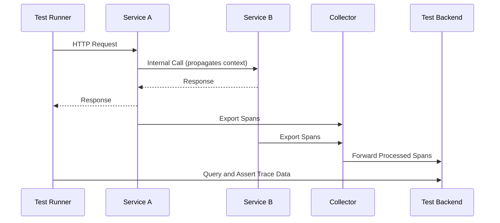

# How to Write Integration Tests That Verify Trace Data with OpenTelemetry

Author: [nawazdhandala](https://www.github.com/nawazdhandala)

Tags: OpenTelemetry, Integration Testing, Tracing, Observability, End-to-End Testing, Test Automation

Description: Learn how to write integration tests that verify complete trace data across service boundaries using OpenTelemetry with practical code examples.

---

Unit tests with in-memory exporters tell you that individual functions produce the right spans. But they cannot tell you whether a trace survives a network call between two services, whether baggage propagates correctly through a message queue, or whether your collector pipeline transforms data the way you expect. That is what integration tests are for.

Integration tests for OpenTelemetry operate at a higher level. They spin up real (or containerized) services, send traffic through them, and then verify that the resulting trace data is complete and correctly structured. This guide covers the practical strategies for building these tests.

## What Integration Tests Should Verify

Before writing any code, it helps to be clear about what you are testing. Integration tests for trace data typically answer these questions:

- Do traces span across service boundaries correctly?
- Is the trace context (trace ID, span ID, trace flags) propagated through HTTP headers or message metadata?
- Do all expected spans appear in the trace, with correct parent-child relationships?
- Are span attributes, events, and links preserved end to end?
- Does the collector pipeline (processors, filtering, sampling) produce the expected output?



The diagram shows the typical flow. The test runner sends a request that triggers work across multiple services. Each service exports its spans to a collector, which forwards them to a test-friendly backend. The test runner then queries that backend and asserts on the trace structure.

## Setting Up the Test Infrastructure

You need a lightweight backend that can receive and store trace data during test runs. There are several approaches, each with trade-offs.

The simplest option is to run a collector with a file exporter that writes spans to a JSON file. Your test code reads the file after the test scenario completes.

```yaml
# collector-test-config.yaml
receivers:
  otlp:
    protocols:
      grpc:
        # Collector listens for spans on this port
        endpoint: 0.0.0.0:4317
      http:
        endpoint: 0.0.0.0:4318

exporters:
  file:
    # Write all telemetry to a JSON file for test assertions
    path: /tmp/test-traces.json

  logging:
    # Also log spans to stdout for debugging test failures
    loglevel: debug

service:
  pipelines:
    traces:
      receivers: [otlp]
      # No processors, so spans are exported exactly as received
      exporters: [file, logging]
```

A more robust approach is to use an in-memory OTLP server that exposes an API for querying received spans. Here is a minimal one in Node.js:

```typescript
// test-trace-server.ts
import { createServer, IncomingMessage, ServerResponse } from "http";

interface StoredSpan {
    traceId: string;
    spanId: string;
    parentSpanId: string;
    name: string;
    attributes: Record<string, unknown>;
    // Store the raw span data for detailed assertions
    raw: unknown;
}

// In-memory storage for received spans
const spans: StoredSpan[] = [];

// Simple HTTP server that accepts OTLP/HTTP JSON spans
const server = createServer((req: IncomingMessage, res: ServerResponse) => {
    if (req.method === "POST" && req.url === "/v1/traces") {
        let body = "";
        req.on("data", (chunk) => (body += chunk));
        req.on("end", () => {
            // Parse the OTLP JSON payload and extract spans
            const payload = JSON.parse(body);
            for (const resourceSpan of payload.resourceSpans || []) {
                for (const scopeSpan of resourceSpan.scopeSpans || []) {
                    for (const span of scopeSpan.spans || []) {
                        spans.push({
                            traceId: span.traceId,
                            spanId: span.spanId,
                            parentSpanId: span.parentSpanId || "",
                            name: span.name,
                            attributes: span.attributes || {},
                            raw: span,
                        });
                    }
                }
            }
            res.writeHead(200);
            res.end("{}");
        });
    } else if (req.method === "GET" && req.url?.startsWith("/spans")) {
        // Endpoint for tests to query stored spans
        const url = new URL(req.url, `http://${req.headers.host}`);
        const traceId = url.searchParams.get("traceId");

        const filtered = traceId
            ? spans.filter((s) => s.traceId === traceId)
            : spans;

        res.writeHead(200, { "Content-Type": "application/json" });
        res.end(JSON.stringify(filtered));
    } else if (req.method === "DELETE" && req.url === "/spans") {
        // Reset endpoint for cleaning up between tests
        spans.length = 0;
        res.writeHead(204);
        res.end();
    } else {
        res.writeHead(404);
        res.end();
    }
});

server.listen(9999, () => {
    console.log("Test trace server listening on port 9999");
});
```

This gives you a queryable store that tests can hit to verify trace structure.

## Using Docker Compose for Multi-Service Tests

For testing cross-service trace propagation, Docker Compose provides an isolated environment where services can communicate just like they would in production.

```yaml
# docker-compose.test.yaml
version: "3.8"
services:
  # The OpenTelemetry Collector receives spans from both services
  collector:
    image: otel/opentelemetry-collector-contrib:latest
    volumes:
      - ./collector-test-config.yaml:/etc/otelcol/config.yaml
    ports:
      - "4317:4317"
      - "4318:4318"

  # Service A is the entry point that calls Service B
  service-a:
    build: ./service-a
    environment:
      - OTEL_EXPORTER_OTLP_ENDPOINT=http://collector:4317
      - OTEL_SERVICE_NAME=service-a
      - SERVICE_B_URL=http://service-b:8080
    depends_on:
      - collector
      - service-b
    ports:
      - "8080:8080"

  # Service B handles downstream work
  service-b:
    build: ./service-b
    environment:
      - OTEL_EXPORTER_OTLP_ENDPOINT=http://collector:4317
      - OTEL_SERVICE_NAME=service-b
    depends_on:
      - collector
    ports:
      - "8081:8080"
```

## Writing the Integration Test

With the infrastructure running, you write tests that send requests and then verify the resulting traces. Here is an example using Python with pytest.

```python
# test_cross_service_traces.py
import requests
import time
import pytest

GATEWAY_URL = "http://localhost:8080"
TRACE_SERVER_URL = "http://localhost:9999"

@pytest.fixture(autouse=True)
def clear_traces():
    """Clear stored traces before each test."""
    requests.delete(f"{TRACE_SERVER_URL}/spans")
    yield

def wait_for_spans(trace_id: str, expected_count: int, timeout: float = 10.0):
    """
    Poll the trace server until the expected number of spans arrive.
    Spans may take a moment to be processed and exported.
    """
    deadline = time.time() + timeout
    while time.time() < deadline:
        response = requests.get(
            f"{TRACE_SERVER_URL}/spans",
            params={"traceId": trace_id}
        )
        spans = response.json()
        if len(spans) >= expected_count:
            return spans
        time.sleep(0.5)

    # Return whatever we have, even if incomplete
    response = requests.get(
        f"{TRACE_SERVER_URL}/spans",
        params={"traceId": trace_id}
    )
    return response.json()

def test_trace_propagates_across_services():
    """Verify that a single trace ID connects spans from both services."""
    # Send a request that triggers cross-service communication
    response = requests.post(
        f"{GATEWAY_URL}/api/orders",
        json={"item": "widget", "quantity": 5}
    )

    assert response.status_code == 200
    order_data = response.json()

    # Extract the trace ID from the response header
    # (services should include this for correlation)
    trace_id = response.headers.get("X-Trace-Id")
    assert trace_id is not None, "Response should include X-Trace-Id header"

    # Wait for spans to arrive at the test backend
    spans = wait_for_spans(trace_id, expected_count=3, timeout=15.0)

    # We expect at least 3 spans:
    # 1. HTTP server span in Service A
    # 2. HTTP client span from Service A to Service B
    # 3. HTTP server span in Service B
    assert len(spans) >= 3, f"Expected at least 3 spans, got {len(spans)}"

    # All spans should share the same trace ID
    trace_ids = set(s["traceId"] for s in spans)
    assert len(trace_ids) == 1, "All spans should belong to the same trace"

    # Verify we have spans from both services
    span_names = [s["name"] for s in spans]
    service_a_spans = [s for s in spans if "service-a" in str(s.get("raw", {}))]
    service_b_spans = [s for s in spans if "service-b" in str(s.get("raw", {}))]

    assert len(service_a_spans) > 0, "Should have spans from service-a"
    assert len(service_b_spans) > 0, "Should have spans from service-b"

def test_parent_child_chain_is_complete():
    """Verify the span parent-child chain has no gaps."""
    response = requests.get(f"{GATEWAY_URL}/api/health")
    trace_id = response.headers.get("X-Trace-Id")

    spans = wait_for_spans(trace_id, expected_count=1, timeout=10.0)

    # Build a set of all span IDs and parent span IDs
    span_ids = set(s["spanId"] for s in spans)
    parent_ids = set(s["parentSpanId"] for s in spans if s["parentSpanId"])

    # Every parent span ID should reference an existing span in the trace
    # (except the root span which has no parent)
    orphaned = parent_ids - span_ids
    assert len(orphaned) == 0, (
        f"Found orphaned parent references: {orphaned}. "
        "This indicates broken context propagation."
    )
```

The `wait_for_spans` helper is crucial. In integration tests, there is always a delay between when a service finishes processing and when the collector delivers spans to the backend. Polling with a timeout handles this gracefully without resorting to arbitrary sleep calls.

## Verifying Collector Pipeline Behavior

Integration tests can also verify that your collector processors work correctly. For example, if you have a processor that redacts sensitive attributes, you can assert that the redaction actually happened.

```python
def test_collector_redacts_sensitive_attributes():
    """Verify the collector's attribute processor removes PII."""
    # Send a request that generates spans with sensitive data
    response = requests.post(
        f"{GATEWAY_URL}/api/users",
        json={"email": "test@example.com", "ssn": "123-45-6789"}
    )

    trace_id = response.headers.get("X-Trace-Id")
    spans = wait_for_spans(trace_id, expected_count=1, timeout=10.0)

    for span in spans:
        attrs = span.get("attributes", {})
        # The collector should have removed SSN attributes
        for attr in attrs:
            attr_key = attr.get("key", "") if isinstance(attr, dict) else str(attr)
            assert "ssn" not in attr_key.lower(), (
                f"Sensitive attribute 'ssn' was not redacted in span {span['name']}"
            )
```

## Running Tests in CI/CD

Integration tests for traces fit naturally into a CI/CD pipeline. Use Docker Compose to spin up the test environment, run your test suite, and tear everything down.

```yaml
# .github/workflows/trace-integration-tests.yaml
name: Trace Integration Tests

on: [push, pull_request]

jobs:
  integration-test:
    runs-on: ubuntu-latest
    steps:
      - uses: actions/checkout@v4

      - name: Start test infrastructure
        run: docker compose -f docker-compose.test.yaml up -d

      - name: Wait for services to be ready
        # Give services time to start and register with the collector
        run: sleep 15

      - name: Run integration tests
        run: pytest tests/integration/ -v --timeout=60

      - name: Collect logs on failure
        if: failure()
        run: docker compose -f docker-compose.test.yaml logs

      - name: Tear down
        if: always()
        run: docker compose -f docker-compose.test.yaml down -v
```

## Practical Advice

Start small. Begin with a single test that verifies trace context propagation between two services. Once that works, expand to cover more scenarios like error propagation, baggage forwarding, and sampling behavior.

Use deterministic trace IDs when possible. Some OpenTelemetry SDKs let you inject a custom ID generator. Using predictable trace IDs makes it much easier to query for specific traces in your test assertions.

Set generous timeouts for span collection. The collector batch processor, network latency, and service startup time all add variability. A 10 to 15 second timeout is reasonable for most integration test environments.

Log everything during test failures. Dump the collector logs, service logs, and raw span data when a test fails. Trace integration tests can be tricky to debug, and having all the context available saves significant troubleshooting time.

## Wrapping Up

Integration tests for trace data give you confidence that your observability pipeline works end to end. They catch the bugs that unit tests miss: broken context propagation between services, misconfigured collector processors, and serialization issues in exporters. While they require more infrastructure than unit tests, the investment protects you from discovering trace data gaps during a production incident when you need that data most.
