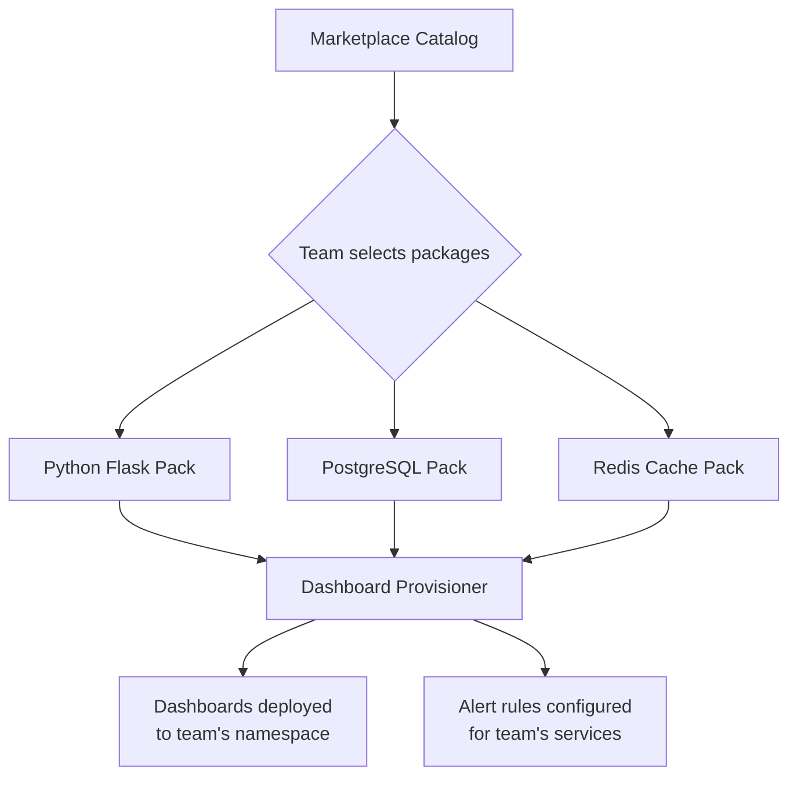

# How to Build an Internal Observability Marketplace with Pre-Built OpenTelemetry Dashboards and Alerts

Author: [nawazdhandala](https://www.github.com/nawazdhandala)

Tags: OpenTelemetry, Dashboards, Alerts, Platform Engineering

Description: Build an internal marketplace where teams can browse, install, and customize pre-built observability dashboards and alert rules based on OpenTelemetry data.

Most teams do not want to build dashboards from scratch. They want to pick a "Python Flask Service" dashboard pack, click install, and see their RED metrics, database query performance, and downstream dependency health show up immediately. An internal observability marketplace makes this possible by packaging dashboards, alert rules, and runbooks into installable bundles that work with your OpenTelemetry data.

This is similar to what Grafana does with its public dashboard marketplace, but scoped to your organization's internal standards, naming conventions, and backend infrastructure.

## Marketplace Architecture

The marketplace is a catalog of observability packages. Each package targets a specific technology stack and contains dashboard definitions, alert rules, and documentation. Teams browse the catalog, select packages that match their stack, and the platform provisions everything automatically.



## Package Definition Format

Each marketplace package is a directory in a Git repository with a standard structure. The `manifest.yaml` describes the package, its requirements, and what it provisions.

```yaml
# marketplace/packages/python-flask/manifest.yaml
name: python-flask
display_name: "Python Flask Service"
description: "Dashboards and alerts for Flask services instrumented with OpenTelemetry"
version: 2.3.0
category: web-framework

# What OTel instrumentation this package expects
required_instrumentation:
  - opentelemetry-instrumentation-flask
  - opentelemetry-instrumentation-requests

# Expected metric names (from OTel semantic conventions)
expected_metrics:
  - http_server_request_duration_seconds
  - http_server_active_requests
  - http_client_request_duration_seconds

# What gets installed
contents:
  dashboards:
    - file: dashboards/overview.json
      title: "Flask Service Overview"
    - file: dashboards/endpoints.json
      title: "Flask Endpoint Breakdown"
  alerts:
    - file: alerts/error-rate.yaml
      title: "High Error Rate"
    - file: alerts/latency-spike.yaml
      title: "Latency Spike Detection"
  runbooks:
    - file: runbooks/high-error-rate.md
      title: "Responding to High Error Rates"

# Variables that get substituted during installation
parameters:
  - name: service_name
    description: "The OTEL service name to filter on"
    required: true
  - name: error_rate_threshold
    description: "Error rate percentage to trigger alerts"
    default: "5"
  - name: latency_p99_threshold_ms
    description: "p99 latency in ms to trigger alerts"
    default: "500"
```

## Dashboard Template with Variables

Dashboard definitions use template variables that get replaced during installation with the team's specific values. This makes one package work for any service using the same technology.

```json
{
  "title": "Flask Service Overview - {{ service_name }}",
  "panels": [
    {
      "title": "Request Rate",
      "type": "timeseries",
      "query": "sum(rate(http_server_request_duration_seconds_count{service_name=\"{{ service_name }}\"}[5m]))",
      "description": "Total requests per second across all endpoints"
    },
    {
      "title": "Error Rate (%)",
      "type": "timeseries",
      "query": "sum(rate(http_server_request_duration_seconds_count{service_name=\"{{ service_name }}\", http_response_status_code=~\"5..\"}[5m])) / sum(rate(http_server_request_duration_seconds_count{service_name=\"{{ service_name }}\"}[5m])) * 100",
      "thresholds": [
        {"value": "{{ error_rate_threshold }}", "color": "red"}
      ]
    },
    {
      "title": "p99 Latency",
      "type": "timeseries",
      "query": "histogram_quantile(0.99, sum(rate(http_server_request_duration_seconds_bucket{service_name=\"{{ service_name }}\"}[5m])) by (le))",
      "unit": "seconds"
    },
    {
      "title": "Top Endpoints by Latency",
      "type": "table",
      "query": "topk(10, histogram_quantile(0.99, sum(rate(http_server_request_duration_seconds_bucket{service_name=\"{{ service_name }}\"}[5m])) by (le, http_route)))",
      "unit": "seconds"
    }
  ]
}
```

## Alert Rule Templates

Alert rules follow the same templating pattern. They reference the OTel metric names and use the team's configured thresholds.

```yaml
# marketplace/packages/python-flask/alerts/error-rate.yaml
# Alert: High Error Rate for Flask Service
# Installed from marketplace package: python-flask v2.3.0

groups:
  - name: "{{ service_name }}-flask-alerts"
    rules:
      - alert: HighErrorRate
        expr: |
          (
            sum(rate(http_server_request_duration_seconds_count{
              service_name="{{ service_name }}",
              http_response_status_code=~"5.."
            }[5m]))
            /
            sum(rate(http_server_request_duration_seconds_count{
              service_name="{{ service_name }}"
            }[5m]))
          ) * 100 > {{ error_rate_threshold }}
        for: 5m
        labels:
          severity: critical
          team: "{{ team_name }}"
          package: python-flask
        annotations:
          summary: "{{ service_name }} error rate is above {{ error_rate_threshold }}%"
          runbook: "https://marketplace.internal/runbooks/python-flask/high-error-rate"
```

## Installation API

The marketplace backend handles package installation. It reads the manifest, substitutes variables, and provisions dashboards and alerts through your backend APIs.

```python
# marketplace_api/installer.py
import yaml
import json
from jinja2 import Template
from pathlib import Path

def install_package(
    package_name: str,
    team_name: str,
    parameters: dict,
) -> dict:
    """
    Install a marketplace package for a team.
    Renders templates with the team's parameters and
    provisions dashboards and alerts.
    """
    package_dir = Path(f"packages/{package_name}")
    manifest = yaml.safe_load((package_dir / "manifest.yaml").read_text())

    # Merge defaults with provided parameters
    resolved_params = {
        p["name"]: parameters.get(p["name"], p.get("default"))
        for p in manifest["parameters"]
    }
    resolved_params["team_name"] = team_name

    results = {"dashboards": [], "alerts": []}

    # Install dashboards
    for dash_spec in manifest["contents"]["dashboards"]:
        raw = (package_dir / dash_spec["file"]).read_text()
        rendered = Template(raw).render(**resolved_params)
        dashboard = json.loads(rendered)

        # Provision through your dashboard API
        dash_id = provision_dashboard(dashboard, team_name)
        results["dashboards"].append({
            "title": dash_spec["title"],
            "id": dash_id,
        })

    # Install alert rules
    for alert_spec in manifest["contents"]["alerts"]:
        raw = (package_dir / alert_spec["file"]).read_text()
        rendered = Template(raw).render(**resolved_params)
        alert_config = yaml.safe_load(rendered)

        rule_id = provision_alert_rules(alert_config, team_name)
        results["alerts"].append({
            "title": alert_spec["title"],
            "id": rule_id,
        })

    return results
```

## Keeping Packages Current

The marketplace is only useful if the packages are maintained. When OpenTelemetry semantic conventions change (for example, metric name updates), packages need corresponding updates. Version the packages and send notifications to teams when upgrades are available.

Track installation metrics to understand which packages are popular and which are never used. A package with zero installs is either solving a problem nobody has or is too hard to find. Both are fixable. A package installed by every team is a candidate for becoming a default that gets applied automatically during service onboarding.

The marketplace turns observability from a bespoke effort into a catalog of proven, reusable components. Teams get working dashboards in minutes instead of hours, and the platform team maintains consistency by updating packages in one place rather than fixing dashboards across hundreds of services.
