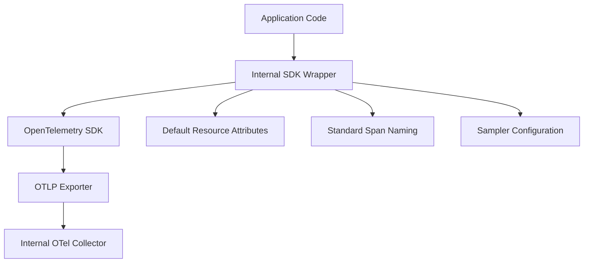

# How to Create an Internal OpenTelemetry SDK Wrapper for Consistent Instrumentation Across Teams

Author: [nawazdhandala](https://www.github.com/nawazdhandala)

Tags: OpenTelemetry, SDK, Platform Engineering, Instrumentation

Description: Learn how to build an internal OpenTelemetry SDK wrapper that enforces consistent instrumentation patterns and reduces boilerplate across engineering teams.

When you have dozens of teams each instrumenting their services independently, the result is predictable: wildly different attribute names, inconsistent span structures, and a telemetry backend full of data that is hard to correlate. One team calls it `user.id`, another uses `userId`, and a third picks `user_identifier`. Dashboards break, alerts misfire, and nobody trusts the data.

The fix is straightforward - build a thin wrapper around the OpenTelemetry SDK that encodes your organization's conventions. Teams still use OpenTelemetry under the hood, but your wrapper handles the defaults, required attributes, and common patterns so individual developers do not need to think about them.

## What the Wrapper Should Handle

A good internal wrapper is not a fork of OpenTelemetry. It is a configuration layer that sits on top of the official SDK. The wrapper should handle:

- Default resource attributes (service name, team, environment, version)
- Standard span naming conventions
- Required baggage propagation
- Exporter configuration pointing to your internal collector
- Sampler defaults appropriate for your scale



## Building the Wrapper in Python

Start with a module that initializes the OpenTelemetry SDK with your organization's defaults. The wrapper reads service metadata and applies it as resource attributes automatically.

Here is the core initialization module:

```python
# internal_telemetry/setup.py
import os
from opentelemetry import trace
from opentelemetry.sdk.trace import TracerProvider
from opentelemetry.sdk.trace.export import BatchSpanProcessor
from opentelemetry.exporter.otlp.proto.grpc.trace_exporter import OTLPSpanExporter
from opentelemetry.sdk.resources import Resource

# Standard resource attributes every service must have
REQUIRED_ATTRIBUTES = ["service.name", "team.name", "deployment.environment"]

def init_telemetry(
    service_name: str,
    team_name: str,
    version: str = "unknown",
    environment: str = None,
    collector_endpoint: str = None,
):
    """
    Initialize OpenTelemetry with organization-wide defaults.
    This is the single entry point teams use instead of raw SDK setup.
    """
    env = environment or os.getenv("DEPLOY_ENV", "development")
    endpoint = collector_endpoint or os.getenv(
        "OTEL_COLLECTOR_ENDPOINT", "http://otel-collector.internal:4317"
    )

    # Build resource with mandatory attributes
    resource = Resource.create({
        "service.name": service_name,
        "service.version": version,
        "team.name": team_name,
        "deployment.environment": env,
        "telemetry.sdk.wrapper": "internal-v2",
    })

    # Configure the tracer provider with org defaults
    provider = TracerProvider(resource=resource)
    exporter = OTLPSpanExporter(endpoint=endpoint, insecure=(env != "production"))
    provider.add_span_processor(BatchSpanProcessor(exporter))

    trace.set_tracer_provider(provider)
    return trace.get_tracer(service_name, version)
```

Teams then use the wrapper with a single function call instead of 30 lines of boilerplate:

```python
# app.py - What a team's code looks like
from internal_telemetry.setup import init_telemetry

tracer = init_telemetry(
    service_name="order-service",
    team_name="commerce",
    version="1.4.2",
)

# Standard span creation - nothing unusual here
with tracer.start_as_current_span("process_order") as span:
    span.set_attribute("order.id", order_id)
    span.set_attribute("order.total", total)
    result = handle_order(order_id)
```

## Adding Span Name Validation

One of the most common drift problems is span naming. Without guardrails, you end up with spans named `GET /api/v1/users/12345` where the user ID leaks into the span name, creating high-cardinality issues. Add a validation layer to the wrapper.

```python
# internal_telemetry/naming.py
import re

# Patterns that suggest high-cardinality span names
HIGH_CARDINALITY_PATTERNS = [
    r'/\d{2,}',           # Numeric IDs in paths
    r'/[0-9a-f]{8}-',     # UUIDs in paths
    r'SELECT .* WHERE',   # Raw SQL queries as span names
]

def validate_span_name(name: str) -> str:
    """
    Check span names against org conventions.
    Logs a warning if the name looks like it contains
    high-cardinality values that should be attributes instead.
    """
    for pattern in HIGH_CARDINALITY_PATTERNS:
        if re.search(pattern, name):
            import logging
            logging.getLogger("internal_telemetry").warning(
                f"Span name '{name}' may contain high-cardinality data. "
                "Use attributes for variable values like IDs."
            )
    return name
```

## Distributing the Wrapper

Package the wrapper as an internal library. Use your organization's private package registry so teams can pin versions and receive updates through normal dependency management.

Here is a minimal `pyproject.toml` for the wrapper package:

```toml
# pyproject.toml
[project]
name = "internal-telemetry"
version = "2.1.0"
description = "Organization-wide OpenTelemetry wrapper"
requires-python = ">=3.9"
dependencies = [
    "opentelemetry-api>=1.20.0",
    "opentelemetry-sdk>=1.20.0",
    "opentelemetry-exporter-otlp-proto-grpc>=1.20.0",
]

[project.optional-dependencies]
# Teams can opt into auto-instrumentation libraries
flask = ["opentelemetry-instrumentation-flask>=0.41b0"]
django = ["opentelemetry-instrumentation-django>=0.41b0"]
fastapi = ["opentelemetry-instrumentation-fastapi>=0.41b0"]
```

## Handling Multiple Languages

Most organizations use more than one language. Build equivalent wrappers for each language your teams use, but keep the configuration contract identical. The wrapper in Go, Java, or Node.js should accept the same parameters and produce the same resource attributes.

A shared configuration schema helps keep wrappers in sync:

```yaml
# telemetry-config-schema.yaml
# This schema defines what every language wrapper must support
required_resource_attributes:
  - service.name
  - team.name
  - deployment.environment
  - service.version
  - telemetry.sdk.wrapper

default_exporter:
  protocol: otlp-grpc
  endpoint_env_var: OTEL_COLLECTOR_ENDPOINT
  default_endpoint: "otel-collector.internal:4317"

span_naming:
  max_length: 128
  disallow_patterns:
    - '/[0-9a-f]{8}-[0-9a-f]{4}'  # UUIDs
    - '/\d{3,}'                     # Long numeric IDs
```

## Versioning and Migration

Treat the wrapper like any internal API. Use semantic versioning, publish changelogs, and give teams a migration window when breaking changes are necessary. The `telemetry.sdk.wrapper` resource attribute (set to something like `internal-v2`) makes it straightforward to query your backend and see which services are running outdated versions.

The goal is not to replace OpenTelemetry or hide it from developers. Teams should still understand spans, attributes, and context propagation. The wrapper simply removes the decisions that should be made once at the organization level, so individual teams can focus on instrumenting their business logic rather than debating attribute names.
