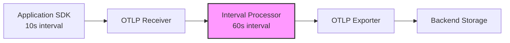
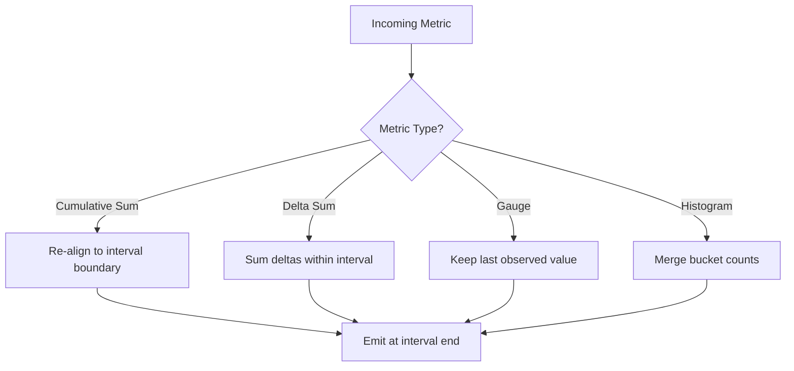

# How to Use Interval Processor to Downsample High-Frequency Metrics

Author: [nawazdhandala](https://www.github.com/nawazdhandala)

Tags: OpenTelemetry, Metrics, Collector, Performance, Downsampling

Description: Learn how to use the OpenTelemetry Collector's interval processor to downsample high-frequency metrics and reduce storage costs without losing critical data.

---

If you run infrastructure at any reasonable scale, you have probably noticed that metric volumes can get out of hand quickly. A single Kubernetes cluster with a few hundred pods can generate millions of metric data points per minute. Your Prometheus or OTLP backend starts groaning under the weight. Storage costs climb. Query performance degrades. And the worst part? Most of those high-frequency data points are redundant for the kind of analysis you actually do.

The OpenTelemetry Collector's interval processor solves this problem. It aggregates metric data points over configurable time intervals, effectively downsampling your metrics before they leave the collector. You keep the trends and patterns you care about while dramatically cutting the volume of data you ship and store.

## What the Interval Processor Does

The interval processor works by holding metric data points in memory and re-aggregating them at a specified interval. Instead of forwarding every single data point the moment it arrives, the processor waits, collects all data points for a given metric series within the interval window, and then emits a single aggregated data point.

For gauge metrics, it takes the last observed value. For cumulative sums and histograms, it re-aligns the data points to the interval boundaries. The result is a steady stream of metrics at a predictable, lower frequency.

Here is how the data flow looks at a high level:



The applications emit metrics every 10 seconds, but the interval processor only forwards aggregated data points every 60 seconds. That is a 6x reduction in data volume right at the collector level.

## When You Should Use It

Not every deployment needs downsampling. But if any of these sound familiar, the interval processor is worth configuring:

- Your backend ingestion costs are tied to the number of data points (most managed observability platforms charge this way)
- You have high-cardinality metrics coming from many sources at short intervals
- Your dashboards and alerts operate on 1-minute or 5-minute windows anyway, so 10-second granularity is wasted
- You are hitting rate limits on your metrics backend
- Collector memory usage is growing because of large metric payloads

The key insight is that for many operational use cases, 60-second resolution is perfectly fine. CPU utilization averaged over a minute tells you the same story as six 10-second samples in most alerting scenarios.

## Installing the Interval Processor

The interval processor is a contrib component, so you need to use the OpenTelemetry Collector Contrib distribution or build a custom collector that includes it. If you are using the core distribution, it will not be available.

Check that your collector includes the processor by looking at its components:

```bash
# List all available components in your collector binary
otelcol-contrib components

# Look for the interval processor in the output
otelcol-contrib components | grep interval
```

If you are building a custom collector with the OpenTelemetry Collector Builder (ocb), add it to your builder configuration:

```yaml
# builder-config.yaml - OCB configuration to include interval processor
processors:
  - gomod: github.com/open-telemetry/opentelemetry-collector-contrib/processor/intervalprocessor v0.96.0
```

## Basic Configuration

The simplest configuration just sets the interval duration. This tells the processor how often to emit aggregated data points.

```yaml
# collector-config.yaml - Basic interval processor setup
processors:
  interval:
    # Aggregate and emit metrics every 60 seconds
    interval: 60s

service:
  pipelines:
    metrics:
      receivers: [otlp]
      processors: [interval]
      exporters: [otlp/backend]
```

With this configuration, no matter how frequently your applications push metrics, the collector will only forward data points once per minute.

## Handling Different Metric Types

The interval processor behaves differently depending on the metric type and temporality. Understanding this is important to avoid surprises.

**Cumulative Sums** get re-aligned to the interval boundary. The processor tracks the cumulative value and emits a data point at the end of each interval that reflects the correct cumulative total.

**Delta Sums** are aggregated within the interval. All delta values that arrive during the window get summed together into a single delta for the interval period.

**Gauges** use last-value semantics. The processor emits the most recently observed value at the end of each interval. This makes sense because a gauge represents the current state, not an accumulation.

**Histograms** get merged. Bucket counts are summed, and the sum/count/min/max fields are combined appropriately.



## Advanced Configuration: Selective Downsampling

You probably do not want to downsample everything uniformly. Some metrics need high resolution (like latency percentiles for SLO tracking) while others can tolerate aggressive downsampling (like disk usage that changes slowly).

You can combine the interval processor with the filter processor to build selective downsampling pipelines:

```yaml
# collector-config.yaml - Selective downsampling with two pipelines
processors:
  # High-frequency pipeline: no downsampling for critical metrics
  filter/critical:
    metrics:
      include:
        match_type: regexp
        metric_names:
          - "http.server.request.duration"
          - "http.server.active_requests"

  # Low-frequency pipeline: aggressive downsampling for infrastructure metrics
  filter/infra:
    metrics:
      include:
        match_type: regexp
        metric_names:
          - "system.cpu.*"
          - "system.memory.*"
          - "system.disk.*"
          - "system.network.*"

  # 5-minute interval for slow-moving infra metrics
  interval/infra:
    interval: 300s

  # 30-second interval for app metrics that aren't critical
  interval/standard:
    interval: 30s

service:
  pipelines:
    # Critical metrics pass through unmodified
    metrics/critical:
      receivers: [otlp]
      processors: [filter/critical]
      exporters: [otlp/backend]

    # Infrastructure metrics get heavily downsampled
    metrics/infra:
      receivers: [otlp]
      processors: [filter/infra, interval/infra]
      exporters: [otlp/backend]
```

This approach gives you the best of both worlds. Your SLO-critical latency metrics keep their full resolution while your infrastructure gauges get downsampled to 5-minute intervals, saving significant storage.

## Memory Considerations

The interval processor holds data points in memory for the duration of the interval. The longer your interval and the higher your metric cardinality, the more memory the processor needs. Keep this in mind when setting interval durations.

For a rough estimate: if you have 10,000 unique metric series and a 60-second interval, the memory overhead is modest, likely under 50 MB. But if you have 500,000 unique series with a 5-minute interval, you could be looking at several hundred megabytes.

Monitor the collector's own metrics to keep an eye on this:

```yaml
# collector-config.yaml - Enable telemetry to monitor collector health
service:
  telemetry:
    metrics:
      # Expose collector internal metrics on port 8888
      address: 0.0.0.0:8888
      level: detailed
```

Then watch the `otelcol_processor_accepted_metric_points` and `otelcol_processor_dropped_metric_points` counters for the interval processor. If you see dropped points, your collector is under memory pressure and you may need to either reduce the interval or add more collector instances.

## Measuring the Impact

Before and after enabling the interval processor, you should measure the actual impact on your pipeline. Here is a quick way to do that using the count connector:

```yaml
# collector-config.yaml - Measure data point reduction
connectors:
  count/before:
    metrics:
      metric.point.count:
        description: "Data points before downsampling"
  count/after:
    metrics:
      metric.point.count:
        description: "Data points after downsampling"

service:
  pipelines:
    metrics/measure_before:
      receivers: [otlp]
      exporters: [count/before]

    metrics/process:
      receivers: [count/before]
      processors: [interval]
      exporters: [count/after, otlp/backend]
```

Compare the before and after counts to see your actual reduction ratio. In most deployments, you will see a 3x to 10x reduction depending on how your source intervals compare to the configured downsampling interval.

## Common Pitfalls

There are a few things to watch out for. First, do not set the interval shorter than your source emission interval. If your apps emit every 60 seconds and you set the interval to 30 seconds, you will not gain anything and will add unnecessary processing overhead.

Second, be careful with delta temporality metrics and very long intervals. If the processor accumulates deltas over a 5-minute window and something goes wrong (collector restart, OOM kill), you lose that entire window of data. For delta metrics, shorter intervals with more frequent flushes are safer.

Third, remember that the interval processor does not reduce cardinality. If your problem is too many unique time series rather than too many data points per series, you need a different approach, like the attributes processor to drop high-cardinality labels.

## Wrapping Up

The interval processor is one of those components that delivers outsized value for very little configuration effort. A few lines of YAML can cut your metric volume by 80% or more. Start with a conservative interval (30 seconds), measure the impact on your dashboards and alerts, and then tune upward from there. Your storage costs and backend query performance will thank you.
