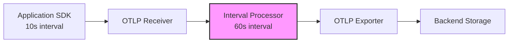
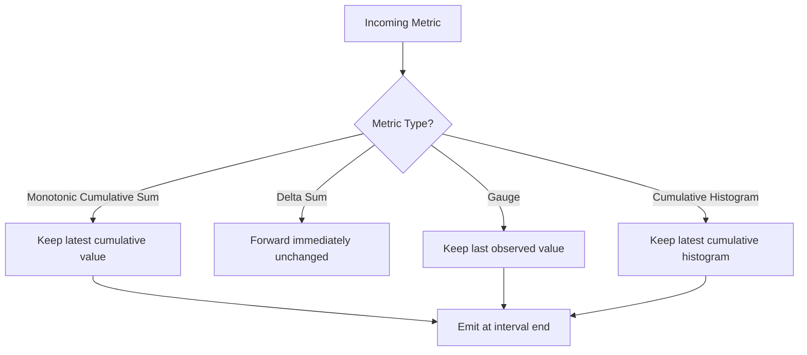

# How to Use Interval Processor to Downsample High-Frequency Metrics

Author: [nawazdhandala](https://www.github.com/nawazdhandala)

Tags: OpenTelemetry, Metric, Collector, Performance, Downsampling

Description: Learn how to use the OpenTelemetry Collector's interval processor to downsample high-frequency metrics and reduce storage costs without losing critical data.

---

If you run infrastructure at any reasonable scale, you have probably noticed that metric volumes can get out of hand quickly. A single Kubernetes cluster with a few hundred pods can generate millions of metric data points per minute. Your Prometheus or OTLP backend starts groaning under the weight. Storage costs climb. Query performance degrades. And the worst part? Most of those high-frequency data points are redundant for the kind of analysis you actually do.

The OpenTelemetry Collector's interval processor solves this problem. It periodically forwards the latest values for supported metric streams over configurable time intervals, effectively downsampling your metrics before they leave the collector. You keep the trends and patterns you care about while dramatically cutting the volume of data you ship and store.

## What the Interval Processor Does

The interval processor works by holding the latest supported metric data points in memory and forwarding them at a specified interval. Instead of forwarding every supported data point the moment it arrives, the processor waits, tracks the newest data point for a given metric series within the interval window, and then emits that latest data point.

For gauge metrics, it takes the last observed value. For monotonically increasing cumulative sums, cumulative histograms, and cumulative exponential histograms, it forwards the latest cumulative value seen during the interval. Delta metrics and non-monotonic sums are not aggregated by the processor; they pass through unchanged. The result is a steady stream of supported metrics at a predictable, lower frequency.

Here is how the data flow looks at a high level:


```mermaid
flowchart LR
    A[Application SDK\n10s interval] --> B[OTLP Receiver]
    B --> C[Interval Processor\n60s interval]
    C --> D[OTLP Exporter]
    D --> E[Backend Storage]

    style C fill:#f9f,stroke:#333,stroke-width:2px
```

The applications emit metrics every 10 seconds, but the interval processor only forwards supported data points every 60 seconds. For those supported streams, that is up to a 6x reduction in data volume right at the collector level.

## When You Should Use It

Not every deployment needs downsampling. But if any of these sound familiar, the interval processor is worth configuring:

- Your backend ingestion costs are tied to the number of data points (most managed observability platforms charge this way)
- You have high-cardinality metrics coming from many sources at short intervals
- Your dashboards and alerts operate on 1-minute or 5-minute windows anyway, so 10-second granularity is wasted
- You are hitting rate limits on your metrics backend
- Collector memory usage is growing because of large metric payloads

The key insight is that for many operational use cases, 60-second resolution is perfectly fine. CPU utilization averaged over a minute tells you the same story as six 10-second samples in most alerting scenarios.

## Installing the Interval Processor

The interval processor is a contrib component, so you need to use the OpenTelemetry Collector Contrib distribution or build a custom collector that includes it. If you are using the core distribution, it will not be available.

Check that your collector includes the processor by looking at its components:

```bash
# List all available components in your collector binary

otelcol-contrib components

# Look for the interval processor in the output
otelcol-contrib components | grep interval
```

If you are building a custom collector with the OpenTelemetry Collector Builder (ocb), add it to your builder configuration:

```yaml
# builder-config.yaml - OCB configuration to include interval processor
processors:
  - gomod: github.com/open-telemetry/opentelemetry-collector-contrib/processor/intervalprocessor v0.153.0
```

## Basic Configuration

The simplest configuration just sets the interval duration. This tells the processor how often to forward supported data points.

```yaml
# collector-config.yaml - Basic interval processor setup
processors:
  interval:
    # Forward supported metrics every 60 seconds
    interval: 60s

service:
  pipelines:
    metrics:
      receivers: [otlp]
      processors: [interval]
      exporters: [otlp/backend]
```

With this configuration, no matter how frequently your applications push supported metrics, the collector will only forward those data points once per minute.

## Handling Different Metric Types

The interval processor behaves differently depending on the metric type and temporality. Understanding this is important to avoid surprises.

**Monotonic Cumulative Sums** keep latest-value semantics. The processor tracks the latest cumulative value and emits that data point at the end of each interval.

**Delta Sums** are not aggregated. They are passed through unchanged, so the interval processor does not reduce delta metric volume.

**Gauges** use last-value semantics. The processor emits the most recently observed value at the end of each interval. This makes sense because a gauge represents the current state, not an accumulation.

**Cumulative Histograms and Exponential Histograms** also use latest-value semantics. The processor keeps the newest cumulative histogram data point for each stream and emits it at the end of the interval.

**Summaries** are supported with latest-value semantics, but this is lossy in the same way gauge aggregation is lossy. If you do not want gauges or summaries aggregated, use the processor's `pass_through` settings.


```mermaid
flowchart TD
    A[Incoming Metric] --> B{Metric Type?}
    B -->|Monotonic Cumulative Sum| C[Keep latest cumulative value]
    B -->|Delta Sum| D[Forward immediately unchanged]
    B -->|Gauge| E[Keep last observed value]
    B -->|Cumulative Histogram| F[Keep latest cumulative histogram]
    C --> G[Emit at interval end]
    E --> G
    F --> G
```

## Advanced Configuration: Selective Downsampling

You probably do not want to downsample everything uniformly. Some metrics need high resolution (like latency percentiles for SLO tracking) while others can tolerate aggressive downsampling (like disk usage that changes slowly).

You can combine the interval processor with the filter processor to build selective downsampling pipelines:

```yaml
# collector-config.yaml - Selective downsampling with two pipelines
processors:
  # High-frequency pipeline: no downsampling for critical metrics
  filter/critical:
    error_mode: ignore
    metric_conditions:
      - 'not (metric.name == "http.server.request.duration" or metric.name == "http.server.active_requests")'

  # Low-frequency pipeline: aggressive downsampling for infrastructure metrics
  filter/infra:
    error_mode: ignore
    metric_conditions:
      - 'not (IsMatch(metric.name, "^system\\.cpu\\.") or IsMatch(metric.name, "^system\\.memory\\.") or IsMatch(metric.name, "^system\\.disk\\.") or IsMatch(metric.name, "^system\\.network\\."))'

  # 5-minute interval for slow-moving infra metrics
  interval/infra:
    interval: 300s

service:
  pipelines:
    # Critical metrics pass through unmodified
    metrics/critical:
      receivers: [otlp]
      processors: [filter/critical]
      exporters: [otlp/backend]

    # Infrastructure metrics get heavily downsampled
    metrics/infra:
      receivers: [otlp]
      processors: [filter/infra, interval/infra]
      exporters: [otlp/backend]
```

This approach gives you the best of both worlds. Your SLO-critical latency metrics keep their full resolution while your infrastructure gauges get downsampled to 5-minute intervals, saving significant storage.

## Memory Considerations

The interval processor holds the latest supported data points in memory for the duration of the interval. The longer your interval and the higher your metric cardinality, the more memory the processor needs. Keep this in mind when setting interval durations.

For a rough estimate: if you have 10,000 unique metric series and a 60-second interval, the memory overhead is modest, likely under 50 MB. But if you have 500,000 unique series with a 5-minute interval, you could be looking at several hundred megabytes.

Monitor the collector's own metrics to keep an eye on this:

```yaml
# collector-config.yaml - Enable telemetry to monitor collector health
service:
  telemetry:
    metrics:
      level: detailed
      readers:
        - pull:
            exporter:
              prometheus:
                # Expose collector internal metrics on port 8888
                host: 0.0.0.0
                port: 8888
```

Then watch the collector's process memory metrics along with `otelcol_processor_incoming_items` and `otelcol_processor_outgoing_items` for the interval processor. If memory keeps climbing or downstream export starts failing, you may need to either reduce the interval or add more collector instances.

## Measuring the Impact

Before and after enabling the interval processor, you should measure the actual impact on your pipeline. Here is a quick way to do that using the count connector:

```yaml
# collector-config.yaml - Measure data point reduction
connectors:
  count/before:
    datapoints:
      metric.datapoint.count.before:
        description: "Data points before downsampling"
  count/after:
    datapoints:
      metric.datapoint.count.after:
        description: "Data points after downsampling"

service:
  pipelines:
    metrics/measure_before:
      receivers: [otlp]
      exporters: [count/before]

    metrics/process:
      receivers: [otlp]
      processors: [interval]
      exporters: [count/after, otlp/backend]

    metrics/counts:
      receivers: [count/before, count/after]
      exporters: [otlp/backend]
```

Compare the before and after counts to see your actual reduction ratio. In most deployments, you will see a 3x to 10x reduction depending on how your source intervals compare to the configured downsampling interval.

## Common Pitfalls

There are a few things to watch out for. First, do not set the interval shorter than your source emission interval. If your apps emit every 60 seconds and you set the interval to 30 seconds, you will not gain anything and will add unnecessary processing overhead.

Second, do not expect the interval processor to downsample delta temporality metrics. Delta metrics are passed through unchanged, so if your metric stream is mostly delta temporality, this processor will not give you much reduction.

Third, remember that the interval processor does not reduce cardinality. If your problem is too many unique time series rather than too many data points per series, you need a different approach, like the attributes processor to drop high-cardinality labels.

## Wrapping Up

The interval processor is one of those components that delivers outsized value for very little configuration effort. A few lines of YAML can cut your metric volume by 80% or more. Start with a conservative interval (30 seconds), measure the impact on your dashboards and alerts, and then tune upward from there. Your storage costs and backend query performance will thank you.
