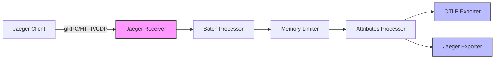

# How to Configure the Jaeger Receiver in the OpenTelemetry Collector

Author: [nawazdhandala](https://www.github.com/nawazdhandala)

Tags: OpenTelemetry, Collector, Jaeger, Distributed Tracing, Observability

Description: Learn how to configure the Jaeger receiver in OpenTelemetry Collector to ingest trace data from Jaeger clients. Complete guide with YAML configuration examples and best practices.

The Jaeger receiver is one of the most commonly used receivers in the OpenTelemetry Collector. It enables the collector to receive trace data in Jaeger format, making it easy to migrate from Jaeger to OpenTelemetry or run both systems in parallel. This guide covers everything you need to know about configuring the Jaeger receiver effectively.

## Understanding the Jaeger Receiver

The Jaeger receiver supports multiple protocols that Jaeger uses for trace ingestion. These protocols include Thrift over HTTP, Thrift over binary, Thrift Compact, and gRPC. Each protocol serves different use cases and has specific performance characteristics.

When you configure the Jaeger receiver, you're essentially setting up endpoints that can accept trace data from Jaeger clients. The receiver then processes this data and forwards it through the collector's pipeline to your configured exporters.

## Basic Configuration

Here's a minimal configuration to get the Jaeger receiver running with default settings:

```yaml
receivers:
  jaeger:
    protocols:
      grpc:
        endpoint: 0.0.0.0:14250
      thrift_http:
        endpoint: 0.0.0.0:14268
      thrift_compact:
        endpoint: 0.0.0.0:6831
      thrift_binary:
        endpoint: 0.0.0.0:6832

processors:
  batch:
    timeout: 1s
    send_batch_size: 1024

exporters:
  logging:
    verbosity: detailed

service:
  pipelines:
    traces:
      receivers: [jaeger]
      processors: [batch]
      exporters: [logging]
```

This configuration sets up all four Jaeger protocols on their standard ports. The collector listens on all network interfaces (0.0.0.0) and forwards received traces through a batch processor to a logging exporter.

## Protocol-Specific Configuration

### gRPC Protocol

The gRPC protocol is the most modern and efficient option for Jaeger. It provides better performance and supports advanced features like flow control and backpressure.

```yaml
receivers:
  jaeger:
    protocols:
      grpc:
        # Listen on all interfaces, port 14250
        endpoint: 0.0.0.0:14250

        # Transport configuration
        transport: tcp

        # Maximum message size (default: 4MB)
        max_recv_msg_size_mib: 4

        # Maximum concurrent streams
        max_concurrent_streams: 100

        # TLS configuration (optional)
        tls:
          cert_file: /path/to/cert.pem
          key_file: /path/to/key.pem
          client_ca_file: /path/to/ca.pem

        # Keep-alive settings
        keepalive:
          server_parameters:
            max_connection_idle: 11s
            max_connection_age: 12s
            max_connection_age_grace: 13s
            time: 30s
            timeout: 5s
```

### Thrift HTTP Protocol

Thrift HTTP is widely used for Jaeger agent-to-collector communication. It's a good choice when you need HTTP-based communication.

```yaml
receivers:
  jaeger:
    protocols:
      thrift_http:
        endpoint: 0.0.0.0:14268

        # CORS configuration for browser-based applications
        cors:
          allowed_origins:
            - "https://example.com"
            - "https://app.example.com"
          allowed_headers:
            - "Content-Type"
            - "Authorization"
          max_age: 7200
```

### Thrift Compact and Binary Protocols

These protocols use UDP and are typically employed by Jaeger agents for local communication.

```yaml
receivers:
  jaeger:
    protocols:
      thrift_compact:
        # UDP endpoint for compact protocol
        endpoint: 0.0.0.0:6831

        # Queue size for incoming messages
        queue_size: 1000

        # Maximum packet size
        max_packet_size: 65000

        # Workers for processing packets
        workers: 10

        # Socket buffer size
        socket_buffer_size: 0

      thrift_binary:
        # UDP endpoint for binary protocol
        endpoint: 0.0.0.0:6832
        queue_size: 1000
        max_packet_size: 65000
        workers: 10
```

## Advanced Configuration Options

### Remote Sampling Configuration

The Jaeger receiver can serve sampling strategies to Jaeger clients. This allows centralized control of sampling decisions.

```yaml
receivers:
  jaeger:
    protocols:
      grpc:
        endpoint: 0.0.0.0:14250

    # Remote sampling configuration
    remote_sampling:
      # Strategy file location
      strategy_file: /etc/otel/sampling-strategies.json

      # Host:port for the sampling strategy endpoint
      host_endpoint: 0.0.0.0:5778

      # gRPC endpoint for sampling strategies
      grpc_host_endpoint: 0.0.0.0:14250
```

The sampling strategy file might look like this:

```json
{
  "service_strategies": [
    {
      "service": "frontend-service",
      "type": "probabilistic",
      "param": 0.5
    },
    {
      "service": "backend-service",
      "type": "ratelimiting",
      "param": 100
    }
  ],
  "default_strategy": {
    "type": "probabilistic",
    "param": 0.1
  }
}
```

### TLS Configuration

For production environments, securing your Jaeger receiver with TLS is essential.

```yaml
receivers:
  jaeger:
    protocols:
      grpc:
        endpoint: 0.0.0.0:14250
        tls:
          # Server certificate and key
          cert_file: /etc/otel/certs/server-cert.pem
          key_file: /etc/otel/certs/server-key.pem

          # Client certificate verification
          client_ca_file: /etc/otel/certs/ca-cert.pem

          # Minimum TLS version
          min_version: "1.2"

          # Maximum TLS version
          max_version: "1.3"

          # Cipher suites (optional)
          cipher_suites:
            - TLS_ECDHE_RSA_WITH_AES_128_GCM_SHA256
            - TLS_ECDHE_RSA_WITH_AES_256_GCM_SHA384
```

## Data Flow Architecture

Understanding how data flows through the collector helps optimize your configuration:



## Complete Production Configuration

Here's a production-ready configuration that combines multiple features:

```yaml
receivers:
  jaeger:
    protocols:
      # gRPC for modern clients
      grpc:
        endpoint: 0.0.0.0:14250
        max_recv_msg_size_mib: 8
        max_concurrent_streams: 200
        tls:
          cert_file: /etc/otel/certs/server-cert.pem
          key_file: /etc/otel/certs/server-key.pem
          client_ca_file: /etc/otel/certs/ca-cert.pem
        keepalive:
          server_parameters:
            max_connection_idle: 300s
            max_connection_age: 390s
            time: 30s
            timeout: 5s

      # HTTP for web clients and legacy systems
      thrift_http:
        endpoint: 0.0.0.0:14268
        cors:
          allowed_origins:
            - "https://frontend.example.com"
          allowed_headers:
            - "Content-Type"

      # UDP for local agents
      thrift_compact:
        endpoint: 0.0.0.0:6831
        queue_size: 2000
        max_packet_size: 65000
        workers: 20

    # Remote sampling configuration
    remote_sampling:
      strategy_file: /etc/otel/sampling-strategies.json
      host_endpoint: 0.0.0.0:5778

processors:
  # Protect against memory overload
  memory_limiter:
    check_interval: 1s
    limit_mib: 2000
    spike_limit_mib: 400

  # Batch for efficiency
  batch:
    timeout: 1s
    send_batch_size: 2048
    send_batch_max_size: 4096

  # Add resource attributes
  resource:
    attributes:
      - key: service.instance.id
        value: collector-01
        action: insert
      - key: deployment.environment
        value: production
        action: insert

exporters:
  # Export to OTLP backend
  otlp:
    endpoint: backend.example.com:4317
    tls:
      insecure: false
      cert_file: /etc/otel/certs/client-cert.pem
      key_file: /etc/otel/certs/client-key.pem
    compression: gzip
    timeout: 10s

  # Fallback Jaeger exporter
  jaeger:
    endpoint: jaeger-collector.example.com:14250
    tls:
      insecure: false

service:
  pipelines:
    traces:
      receivers: [jaeger]
      processors: [memory_limiter, batch, resource]
      exporters: [otlp, jaeger]

  # Enable telemetry
  telemetry:
    logs:
      level: info
    metrics:
      address: 0.0.0.0:8888
```

## Performance Tuning

### UDP Buffer Optimization

For high-throughput scenarios using UDP protocols, increase system socket buffer sizes:

```bash
# Increase UDP receive buffer size
sudo sysctl -w net.core.rmem_max=26214400
sudo sysctl -w net.core.rmem_default=26214400
```

Then configure the receiver to use larger buffers:

```yaml
receivers:
  jaeger:
    protocols:
      thrift_compact:
        endpoint: 0.0.0.0:6831
        socket_buffer_size: 26214400
        workers: 30
        queue_size: 5000
```

### Connection Limits

For gRPC receivers handling many clients, adjust connection parameters:

```yaml
receivers:
  jaeger:
    protocols:
      grpc:
        endpoint: 0.0.0.0:14250
        max_concurrent_streams: 500
        keepalive:
          server_parameters:
            max_connection_idle: 600s
            max_connection_age: 1200s
            max_connection_age_grace: 20s
```

## Troubleshooting Common Issues

### Port Conflicts

If you see binding errors, check if ports are already in use:

```bash
# Check if port 14250 is in use
lsof -i :14250
netstat -an | grep 14250
```

### UDP Packet Loss

Monitor for dropped UDP packets:

```bash
# Check UDP statistics
netstat -s | grep -i udp
```

If you see packet loss, increase buffer sizes and worker count as shown in the performance tuning section.

### Connection Refused

Ensure the endpoint configuration matches your network setup. Use 0.0.0.0 to listen on all interfaces or specify a particular IP address:

```yaml
receivers:
  jaeger:
    protocols:
      grpc:
        # Listen only on localhost
        endpoint: 127.0.0.1:14250
```

## Integration with OneUptime

OneUptime provides comprehensive monitoring for your OpenTelemetry infrastructure. You can export traces from the Jaeger receiver directly to OneUptime for visualization and analysis:

```yaml
exporters:
  otlp:
    endpoint: otlp.oneuptime.com:4317
    headers:
      x-oneuptime-token: "your-token-here"

service:
  pipelines:
    traces:
      receivers: [jaeger]
      processors: [batch]
      exporters: [otlp]
```

## Related Resources

For more information about OpenTelemetry Collector configuration, check out these related articles:

- https://oneuptime.com/blog/post/zipkin-receiver-opentelemetry-collector/view
- https://oneuptime.com/blog/post/kafka-receiver-opentelemetry-collector/view

## Conclusion

The Jaeger receiver is a powerful component that enables seamless integration between Jaeger-instrumented applications and the OpenTelemetry Collector. By supporting multiple protocols and offering extensive configuration options, it provides flexibility for various deployment scenarios.

Start with a basic configuration and gradually add features like TLS, remote sampling, and performance optimizations based on your specific requirements. Monitor your collector's performance metrics to ensure optimal operation and adjust configuration parameters as needed.

With proper configuration, the Jaeger receiver can handle high-throughput production workloads while providing reliable trace ingestion for your observability pipeline.
