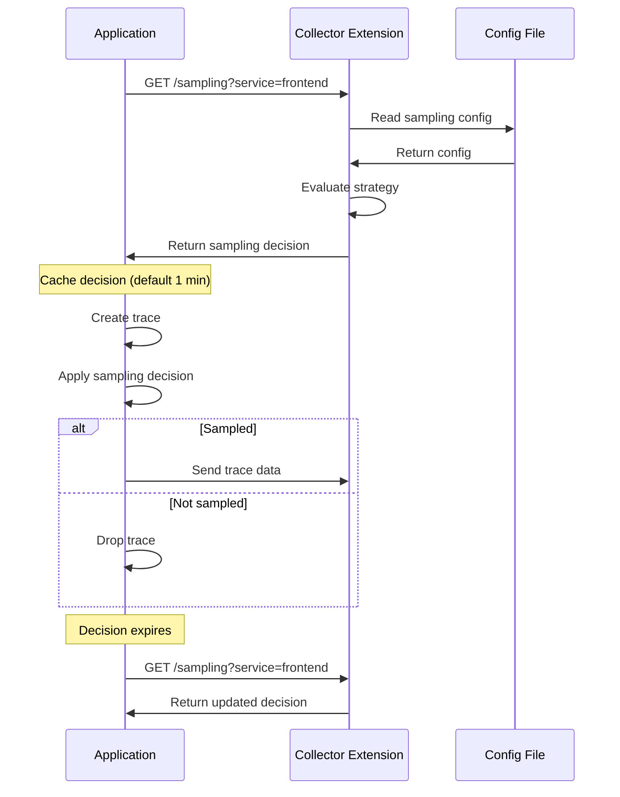
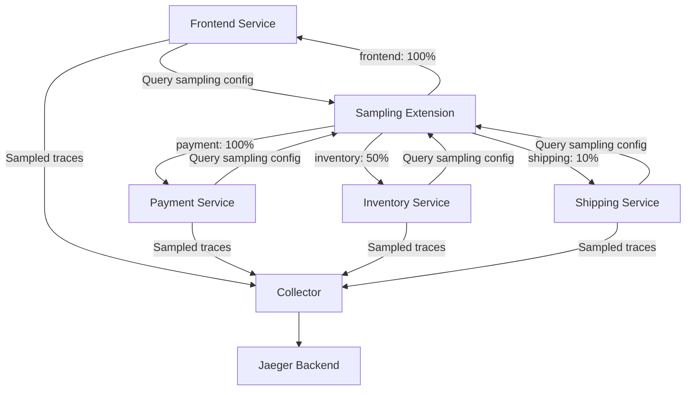

# How to Configure Jaeger Remote Sampling Extension in the OpenTelemetry Collector

Author: [nawazdhandala](https://www.github.com/nawazdhandala)

Tags: OpenTelemetry, Collector, Extensions, Jaeger, Sampling, Distributed Tracing, Performance

Description: Master the configuration of Jaeger Remote Sampling extension in OpenTelemetry Collector to implement dynamic, centralized sampling strategies for distributed tracing systems.

Sampling is critical for managing the volume and cost of distributed tracing in production systems. The Jaeger Remote Sampling extension enables centralized, dynamic sampling configuration that can be adjusted without redeploying applications, providing fine-grained control over which traces are collected.

## Understanding Jaeger Remote Sampling

The Jaeger Remote Sampling extension implements the Jaeger remote sampling protocol, allowing OpenTelemetry-instrumented applications to retrieve sampling decisions from a central configuration service. This approach separates sampling policy from application code, enabling runtime adjustments to sampling rates based on traffic patterns, system load, or debugging needs.

Remote sampling is particularly valuable in microservices architectures where consistent sampling decisions across services are essential for trace completeness. By centralizing sampling configuration, you can ensure that when a trace is sampled, all participating services record their spans.

## Why Use Remote Sampling?

Traditional head-based sampling makes sampling decisions at trace initiation, but these decisions are static and embedded in application configuration. Remote sampling provides several advantages:

**Dynamic adjustment**: Change sampling rates in real-time without redeploying applications.

**Service-specific policies**: Apply different sampling strategies to different services based on their importance or traffic volume.

**Operation-level granularity**: Sample specific endpoints or operations at different rates.

**Centralized management**: Maintain sampling configuration in one place rather than across multiple application deployments.

**Cost optimization**: Reduce storage and processing costs by intelligently sampling while maintaining observability for critical paths.

## Basic Configuration

Here's a minimal configuration to enable the Jaeger Remote Sampling extension:

```yaml
# collector-config.yaml
extensions:
  # Configure Jaeger Remote Sampling extension
  jaeger_remote_sampling:
    # HTTP endpoint for sampling configuration queries
    http:
      endpoint: 0.0.0.0:5778

    # Source of sampling configuration
    source:
      # Use file-based configuration
      file: "/etc/otel/sampling-config.json"

      # Reload interval for file changes
      reload_interval: 10s

receivers:
  otlp:
    protocols:
      grpc:
        endpoint: 0.0.0.0:4317
      http:
        endpoint: 0.0.0.0:4318

processors:
  batch:
    timeout: 10s

exporters:
  otlp:
    endpoint: "jaeger:4317"
    tls:
      insecure: true

service:
  extensions: [jaeger_remote_sampling]
  pipelines:
    traces:
      receivers: [otlp]
      processors: [batch]
      exporters: [otlp]
```

The extension exposes an HTTP endpoint at port 5778 where applications query for sampling decisions. The sampling configuration is loaded from a file and automatically reloaded when changes are detected.

## Sampling Configuration File

Create a sampling configuration file that defines sampling strategies:

```json
{
  "service_strategies": [
    {
      "service": "frontend-service",
      "type": "probabilistic",
      "param": 1.0,
      "operation_strategies": [
        {
          "operation": "GET /api/health",
          "type": "probabilistic",
          "param": 0.01
        },
        {
          "operation": "POST /api/checkout",
          "type": "probabilistic",
          "param": 1.0
        }
      ]
    },
    {
      "service": "payment-service",
      "type": "probabilistic",
      "param": 0.5
    },
    {
      "service": "inventory-service",
      "type": "ratelimiting",
      "param": 100
    }
  ],
  "default_strategy": {
    "type": "probabilistic",
    "param": 0.1
  }
}
```

This configuration demonstrates several sampling strategies:

**Frontend service**: Samples all traces by default (1.0 = 100%) but reduces health check sampling to 1% while ensuring all checkout operations are traced.

**Payment service**: Uses probabilistic sampling at 50% for all operations.

**Inventory service**: Limits sampling to 100 traces per second using rate limiting.

**Default strategy**: Applies 10% probabilistic sampling to any service not explicitly configured.

## Sampling Strategy Types

The Jaeger Remote Sampling extension supports multiple sampling strategy types:

**Probabilistic Sampling**: Samples traces based on a probability value between 0.0 (0%) and 1.0 (100%). This is the most common strategy for reducing trace volume proportionally.

**Rate Limiting Sampling**: Samples up to a specified number of traces per second. Useful for controlling costs while ensuring minimum trace collection.

**Const Sampling**: Always samples (param: 1) or never samples (param: 0). Used for debugging or excluding specific services/operations.

Here's a comprehensive example demonstrating all strategy types:

```json
{
  "service_strategies": [
    {
      "service": "api-gateway",
      "type": "probabilistic",
      "param": 1.0,
      "operation_strategies": [
        {
          "operation": "GET /health",
          "type": "const",
          "param": 0
        },
        {
          "operation": "GET /metrics",
          "type": "const",
          "param": 0
        },
        {
          "operation": "POST /api/orders",
          "type": "const",
          "param": 1
        },
        {
          "operation": "GET /api/products",
          "type": "probabilistic",
          "param": 0.1
        }
      ]
    },
    {
      "service": "background-worker",
      "type": "ratelimiting",
      "param": 50
    },
    {
      "service": "analytics-service",
      "type": "probabilistic",
      "param": 0.01
    }
  ],
  "default_strategy": {
    "type": "probabilistic",
    "param": 0.1
  }
}
```

This configuration excludes health and metrics endpoints, always traces order creation, applies 10% sampling to product browsing, rate-limits background workers, and minimally samples analytics operations.

## Sampling Decision Flow

The following diagram illustrates how applications interact with the remote sampling extension:



Applications periodically query the sampling endpoint and cache decisions locally. This reduces network overhead while allowing sampling configuration to propagate within the cache timeout period (typically 60 seconds).

## Advanced Configuration with gRPC

In addition to HTTP, the extension supports gRPC for sampling queries:

```yaml
extensions:
  jaeger_remote_sampling:
    # HTTP endpoint for legacy clients
    http:
      endpoint: 0.0.0.0:5778

    # gRPC endpoint for modern clients
    grpc:
      endpoint: 0.0.0.0:14250

      # TLS configuration
      tls:
        cert_file: "/etc/certs/server-cert.pem"
        key_file: "/etc/certs/server-key.pem"
        client_ca_file: "/etc/certs/client-ca.pem"
        client_auth_type: "RequireAndVerifyClientCert"

    source:
      file: "/etc/otel/sampling-config.json"
      reload_interval: 10s

receivers:
  otlp:
    protocols:
      grpc:
        endpoint: 0.0.0.0:4317

processors:
  batch:
    timeout: 10s

exporters:
  otlp:
    endpoint: "jaeger:4317"
    tls:
      insecure: true

service:
  extensions: [jaeger_remote_sampling]
  pipelines:
    traces:
      receivers: [otlp]
      processors: [batch]
      exporters: [otlp]
```

The gRPC endpoint provides better performance and supports TLS mutual authentication for secure sampling configuration distribution.

## Remote Configuration Source

Instead of file-based configuration, you can fetch sampling strategies from a remote service:

```yaml
extensions:
  jaeger_remote_sampling:
    http:
      endpoint: 0.0.0.0:5778

    source:
      # Fetch configuration from remote endpoint
      remote:
        endpoint: "http://config-service:8080/sampling/strategies"

        # Refresh interval
        refresh_interval: 30s

        # Timeout for remote requests
        timeout: 10s

        # Authentication
        headers:
          - key: "Authorization"
            value: "Bearer ${CONFIG_SERVICE_TOKEN}"

receivers:
  otlp:
    protocols:
      grpc:
        endpoint: 0.0.0.0:4317

processors:
  batch:
    timeout: 10s

exporters:
  otlp:
    endpoint: "jaeger:4317"
    tls:
      insecure: true

service:
  extensions: [jaeger_remote_sampling]
  pipelines:
    traces:
      receivers: [otlp]
      processors: [batch]
      exporters: [otlp]
```

Remote configuration enables dynamic updates from a central management system, allowing sampling strategies to be adjusted based on real-time conditions.

## Integration with Tail Sampling

Combine remote sampling (head-based) with tail sampling (decision after trace completion) for optimal results:

```yaml
extensions:
  jaeger_remote_sampling:
    http:
      endpoint: 0.0.0.0:5778

    source:
      file: "/etc/otel/sampling-config.json"
      reload_interval: 10s

receivers:
  otlp:
    protocols:
      grpc:
        endpoint: 0.0.0.0:4317

processors:
  batch:
    timeout: 10s

  # Tail sampling processor for additional filtering
  tail_sampling:
    # Wait for complete traces
    decision_wait: 10s

    # Number of traces to keep in memory
    num_traces: 100000

    # Sampling policies
    policies:
      # Always sample errors
      - name: error-traces
        type: status_code
        status_code:
          status_codes:
            - ERROR

      # Sample slow traces
      - name: slow-traces
        type: latency
        latency:
          threshold_ms: 1000

      # Probabilistic sampling for normal traces
      - name: probabilistic-policy
        type: probabilistic
        probabilistic:
          sampling_percentage: 10

exporters:
  otlp:
    endpoint: "jaeger:4317"
    tls:
      insecure: true

service:
  extensions: [jaeger_remote_sampling]
  pipelines:
    traces:
      receivers: [otlp]
      processors: [tail_sampling, batch]
      exporters: [otlp]
```

This configuration uses remote sampling for initial decisions at trace creation, then applies tail sampling to ensure all errors and slow traces are captured regardless of the initial sampling decision.

## Per-Service Sampling Architecture

Here's how to implement service-specific sampling in a microservices environment:



## Dynamic Sampling Adjustment

Create a script to update sampling rates based on system conditions:

```yaml
extensions:
  jaeger_remote_sampling:
    http:
      endpoint: 0.0.0.0:5778

    source:
      file: "/etc/otel/sampling-config.json"
      # Frequent reload for dynamic adjustments
      reload_interval: 5s

receivers:
  otlp:
    protocols:
      grpc:
        endpoint: 0.0.0.0:4317

processors:
  batch:
    timeout: 10s

exporters:
  otlp:
    endpoint: "jaeger:4317"
    tls:
      insecure: true

service:
  extensions: [jaeger_remote_sampling]
  pipelines:
    traces:
      receivers: [otlp]
      processors: [batch]
      exporters: [otlp]
```

Companion script to adjust sampling based on time of day:

```bash
#!/bin/bash
# adjust-sampling.sh

HOUR=$(date +%H)

if [ $HOUR -ge 9 ] && [ $HOUR -le 17 ]; then
  # Business hours: higher sampling
  RATE=0.5
else
  # Off hours: lower sampling
  RATE=0.1
fi

cat > /etc/otel/sampling-config.json <<EOF
{
  "default_strategy": {
    "type": "probabilistic",
    "param": $RATE
  }
}
EOF

echo "Updated sampling rate to $RATE"
```

Run this script as a cron job to automatically adjust sampling based on traffic patterns.

## Monitoring Sampling Effectiveness

Track sampling metrics to optimize your configuration:

```yaml
extensions:
  jaeger_remote_sampling:
    http:
      endpoint: 0.0.0.0:5778

    source:
      file: "/etc/otel/sampling-config.json"
      reload_interval: 10s

    # Enable metrics
    telemetry:
      metrics:
        enabled: true
        address: ":8888"

receivers:
  otlp:
    protocols:
      grpc:
        endpoint: 0.0.0.0:4317

  # Scrape sampling metrics
  prometheus:
    config:
      scrape_configs:
        - job_name: "otel-collector"
          static_configs:
            - targets: ["localhost:8888"]

processors:
  batch:
    timeout: 10s

exporters:
  otlp:
    endpoint: "jaeger:4317"
    tls:
      insecure: true

  prometheusremotewrite:
    endpoint: "http://prometheus:9090/api/v1/write"

service:
  extensions: [jaeger_remote_sampling]

  telemetry:
    metrics:
      address: ":8888"

  pipelines:
    traces:
      receivers: [otlp]
      processors: [batch]
      exporters: [otlp]

    metrics:
      receivers: [prometheus]
      processors: [batch]
      exporters: [prometheusremotewrite]
```

Monitor metrics like sampling_requests_total, sampling_decisions_sampled, and sampling_decisions_not_sampled to understand sampling effectiveness.

## Best Practices

**Start with conservative sampling**: Begin with lower sampling rates and increase as needed. It's easier to add more data than deal with overwhelming volumes.

**Sample critical paths at 100%**: Always trace business-critical operations like payment processing, order creation, and authentication.

**Exclude health checks**: Set health check and monitoring endpoints to 0% sampling to reduce noise.

**Use rate limiting for high-volume services**: Protect storage costs while ensuring some trace representation from every service.

**Monitor trace completeness**: Track the percentage of complete traces (all spans present) to ensure sampling decisions propagate correctly.

**Version your configuration**: Keep sampling configurations in version control to track changes and enable rollback.

**Test before production**: Validate sampling changes in staging environments to understand their impact on trace volumes.

## Troubleshooting

**Applications not respecting sampling decisions**: Verify applications are configured to query the remote sampling endpoint. Check network connectivity to port 5778.

**Incomplete traces**: Ensure all services in the trace path query the same sampling service and receive consistent decisions.

**Configuration not updating**: Check the reload_interval setting and verify the file modification timestamp changes when updating the configuration.

**High trace volumes despite low sampling rates**: Some libraries implement their own sampling in addition to remote sampling. Review application-level sampling configuration.

**Sampling endpoint unreachable**: Verify firewall rules allow traffic to port 5778. Check collector logs for binding errors.

## Conclusion

The Jaeger Remote Sampling extension provides powerful centralized control over trace sampling in distributed systems. By implementing dynamic, service-specific, and operation-level sampling strategies, you can maintain observability for critical paths while optimizing storage and processing costs.

For related topics, explore [OpAMP Extension for remote management](https://oneuptime.com/blog/post/opamp-extension-remote-collector-management/view) and [HTTP Forwarder configuration](https://oneuptime.com/blog/post/http-forwarder-extension-opentelemetry-collector/view).
