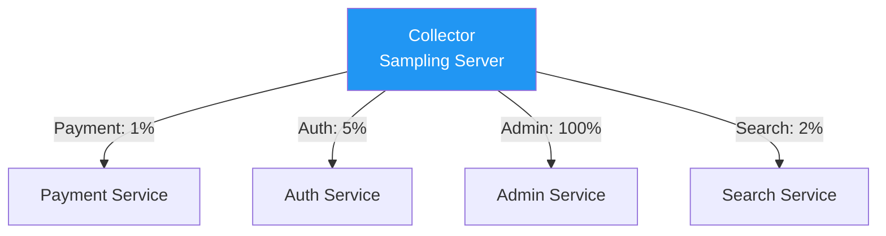
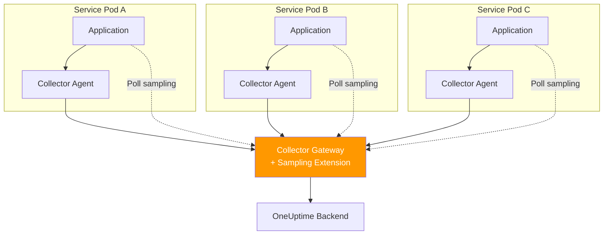

# How to Configure Jaeger Remote Sampling with the OpenTelemetry Collector

Author: [nawazdhandala](https://www.github.com/nawazdhandala)

Tags: OpenTelemetry, Jaeger, Remote Sampling, Collector, Tracing, Distributed Systems

Description: Learn how to configure Jaeger remote sampling with the OpenTelemetry Collector to centrally manage trace sampling rates across all your services.

---

Managing sampling rates across dozens or hundreds of microservices is painful when each service has its own hardcoded configuration. Every time you want to adjust the sampling rate, you need to update environment variables and redeploy. Jaeger remote sampling solves this by letting you define sampling strategies in a central location and having your services fetch those strategies at runtime. The OpenTelemetry Collector can serve as that central sampling configuration server, which means you do not need to run a separate Jaeger backend just for sampling decisions.

## Why Remote Sampling Matters

In a typical microservice environment, you might have 50 services all generating traces. Some of those services handle thousands of requests per second while others handle a handful per minute. A flat 10% sampling rate makes no sense across the board. Your high-traffic payment service might need 1% sampling to keep costs down, while your low-traffic admin service can afford 100% sampling for better debugging coverage.



Remote sampling lets you change these rates from a single configuration file without touching any application code or triggering deployments. You update the collector config, reload it, and every service picks up the new rates on its next polling interval.

## Setting Up the Collector as a Sampling Server

The OpenTelemetry Collector has a built-in Jaeger remote sampling extension that serves sampling strategies over HTTP. Services configured with the Jaeger remote sampler will poll this endpoint to get their sampling configuration.

```yaml
# collector-config.yaml
# OpenTelemetry Collector with Jaeger remote sampling extension

extensions:
  # Jaeger remote sampling extension serves strategies to clients
  jaeger_remote_sampling:
    # HTTP endpoint where services fetch sampling strategies
    source:
      # Reload strategies from this file without restarting
      file: /etc/otel/sampling-strategies.json
    # Optional: serve on a specific port
    http:
      endpoint: 0.0.0.0:5778

receivers:
  otlp:
    protocols:
      grpc:
        endpoint: 0.0.0.0:4317
      http:
        endpoint: 0.0.0.0:4318

processors:
  batch:
    timeout: 5s
    send_batch_size: 512

exporters:
  otlp:
    endpoint: https://otel.oneuptime.com:4317

service:
  extensions: [jaeger_remote_sampling]
  pipelines:
    traces:
      receivers: [otlp]
      processors: [batch]
      exporters: [otlp]
```

The extension reads sampling strategies from a JSON file and serves them on port 5778, which is the standard Jaeger sampling port. Services query this endpoint with their service name, and the collector returns the appropriate sampling strategy.

## Defining Sampling Strategies

The sampling strategies file follows the Jaeger sampling format. You define a default strategy that applies to all services, then override it for specific services that need different rates.

```json
{
  "default_strategy": {
    "type": "probabilistic",
    "param": 0.10
  },
  "service_strategies": [
    {
      "service": "payment-service",
      "type": "probabilistic",
      "param": 0.01
    },
    {
      "service": "auth-service",
      "type": "probabilistic",
      "param": 0.05
    },
    {
      "service": "admin-dashboard",
      "type": "probabilistic",
      "param": 1.0
    },
    {
      "service": "search-api",
      "type": "ratelimiting",
      "param": 5.0
    }
  ]
}
```

This configuration sets a default 10% sampling rate for any service not explicitly listed. The payment service gets 1% because it handles massive traffic. The admin dashboard gets 100% because it is low traffic and you want full visibility. The search API uses rate limiting instead of probabilistic sampling, which caps it at 5 traces per second regardless of traffic volume.

## Per-Operation Sampling Strategies

You can go even more granular and define different sampling rates for different operations within a single service. This is useful when a service has both high-traffic health check endpoints and lower-traffic business logic endpoints.

```json
{
  "default_strategy": {
    "type": "probabilistic",
    "param": 0.10
  },
  "service_strategies": [
    {
      "service": "api-gateway",
      "type": "probabilistic",
      "param": 0.05,
      "operation_strategies": [
        {
          "operation": "/health",
          "type": "probabilistic",
          "param": 0.001
        },
        {
          "operation": "/api/v1/checkout",
          "type": "probabilistic",
          "param": 0.50
        },
        {
          "operation": "/api/v1/search",
          "type": "ratelimiting",
          "param": 10.0
        }
      ]
    }
  ]
}
```

The API gateway defaults to 5% sampling for most operations. Health check endpoints get 0.1% because they produce enormous volumes of nearly identical traces. The checkout endpoint gets 50% because you want deep visibility into the purchase flow. The search endpoint is rate limited to 10 traces per second.

## Configuring the Java SDK for Remote Sampling

The OpenTelemetry Java agent has built-in support for Jaeger remote sampling. You configure it through environment variables or system properties.

```bash
# Run a Java service with Jaeger remote sampling
java -javaagent:opentelemetry-javaagent.jar \
  -Dotel.service.name=payment-service \
  -Dotel.traces.sampler=jaeger_remote \
  -Dotel.traces.sampler.arg=endpoint=http://collector:5778/sampling \
  -Dotel.exporter.otlp.endpoint=http://collector:4317 \
  -jar payment-service.jar
```

The agent will poll the collector's sampling endpoint periodically (every 60 seconds by default) and update its local sampling strategy accordingly. If the collector becomes unreachable, the agent falls back to the last known strategy, so a temporary collector outage does not cause all sampling to stop.

For applications not using the Java agent, you can configure remote sampling programmatically.

```java
import io.opentelemetry.sdk.trace.SdkTracerProvider;
import io.opentelemetry.sdk.trace.samplers.Sampler;
import io.opentelemetry.sdk.extension.jaeger.remoteSampler.JaegerRemoteSampler;
import java.time.Duration;

public class RemoteSamplingConfig {
    public static SdkTracerProvider createTracerProvider() {
        // Build a Jaeger remote sampler that polls the collector
        JaegerRemoteSampler sampler = JaegerRemoteSampler.builder()
            // Service name used to look up the strategy
            .setServiceName("payment-service")
            // Collector sampling endpoint
            .setEndpoint("http://collector:5778")
            // How often to poll for strategy updates
            .setPollingInterval(Duration.ofSeconds(30))
            // Fallback sampler if the collector is unreachable
            .setInitialSampler(Sampler.traceIdRatioBased(0.05))
            .build();

        return SdkTracerProvider.builder()
            .setSampler(sampler)
            .build();
    }
}
```

The `setInitialSampler` call is important. It defines what sampling strategy to use when the service first starts and has not yet fetched a strategy from the collector. Setting it to a reasonable default prevents the service from either dropping everything or keeping everything during that initial window.

## Configuring the Python SDK for Remote Sampling

Python applications can use the Jaeger remote sampler through the `opentelemetry-sdk-extension-aws` package or by implementing a polling mechanism. Here is a practical approach using the built-in HTTP client to fetch strategies.

```python
import requests
import threading
import time
from opentelemetry import trace
from opentelemetry.sdk.trace import TracerProvider
from opentelemetry.sdk.trace.sampling import TraceIdRatioBased, ParentBased
from opentelemetry.sdk.trace.export import BatchSpanProcessor
from opentelemetry.exporter.otlp.proto.grpc.trace_exporter import OTLPSpanExporter

class RemoteSamplingManager:
    """Polls the Jaeger sampling endpoint and updates the sampler."""

    def __init__(self, service_name, endpoint, poll_interval=60):
        self.service_name = service_name
        self.endpoint = endpoint
        self.poll_interval = poll_interval
        # Start with a sensible default rate
        self.current_rate = 0.10
        self._running = True

    def start(self):
        # Run the polling loop in a background thread
        thread = threading.Thread(target=self._poll_loop, daemon=True)
        thread.start()

    def _poll_loop(self):
        while self._running:
            try:
                # Fetch the sampling strategy for this service
                url = f"{self.endpoint}?service={self.service_name}"
                response = requests.get(url, timeout=5)
                strategy = response.json()

                # Extract the sampling rate from the response
                if "probabilisticSampling" in strategy.get(
                    "strategyType", ""
                ):
                    self.current_rate = strategy[
                        "probabilisticSampling"
                    ]["samplingRate"]
            except Exception:
                # Keep using the last known rate if polling fails
                pass
            time.sleep(self.poll_interval)

# Initialize the sampling manager
manager = RemoteSamplingManager(
    service_name="order-service",
    endpoint="http://collector:5778/sampling",
    poll_interval=30,
)
manager.start()

# Set up the tracer provider with the initial rate
sampler = ParentBased(root=TraceIdRatioBased(manager.current_rate))
provider = TracerProvider(sampler=sampler)

exporter = OTLPSpanExporter(endpoint="http://collector:4317")
provider.add_span_processor(BatchSpanProcessor(exporter))

trace.set_tracer_provider(provider)
```

This implementation polls the collector every 30 seconds and updates the sampling rate. The `ParentBased` wrapper ensures that child spans still respect parent decisions even when the local sampling rate changes.

## Deployment Architecture

In production, you typically deploy the collector as both a sidecar/agent and a central gateway. The sampling extension runs on the gateway collectors since you want a single source of truth for sampling strategies.



Applications poll the gateway collector for sampling strategies (dashed lines) and send trace data through their local agent collectors (solid lines). The agent collectors forward data to the gateway, which exports to your backend.

## Hot-Reloading Strategies

One of the best features of file-based remote sampling is that you can update strategies without restarting the collector. The collector watches the strategies file for changes and reloads it automatically.

```bash
# Update the sampling rate for payment-service on the fly
# Edit the strategies file
vim /etc/otel/sampling-strategies.json

# The collector detects the file change and reloads
# Services pick up the new strategy on their next poll
# No restarts needed anywhere in the stack
```

This makes it practical to respond to incidents in real time. If you are debugging an issue in the payment service, bump its sampling rate to 100%, investigate the problem, and then set it back to 1% when you are done. The entire change takes effect within one polling interval.

## Wrapping Up

Jaeger remote sampling through the OpenTelemetry Collector gives you centralized control over trace sampling across your entire fleet. You can set different rates per service and per operation, adjust them on the fly without deployments, and fall back to sensible defaults when the collector is unreachable. It is one of the most practical improvements you can make to a distributed tracing setup, especially as your number of services grows beyond what manual per-service configuration can reasonably manage.
