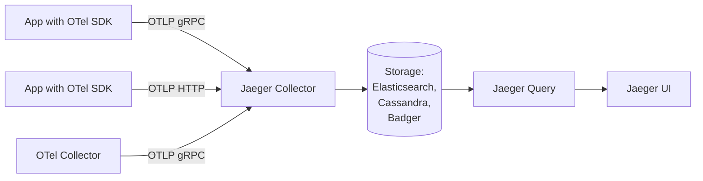

# How to Set Up Jaeger as a Trace Backend for OpenTelemetry

Author: [nawazdhandala](https://www.github.com/nawazdhandala)

Tags: OpenTelemetry, Jaeger, Distributed Tracing, Traces, Collector, Observability

Description: Complete guide to deploying Jaeger as a distributed tracing backend for OpenTelemetry, covering OTLP ingestion, storage options, and production configuration.

---

Jaeger is one of the most widely used distributed tracing platforms. Originally developed at Uber and now a graduated CNCF project, Jaeger provides trace collection, storage, and visualization. With native OTLP support added in recent versions, Jaeger works seamlessly as a trace backend for OpenTelemetry instrumented applications.

This guide covers deploying Jaeger, configuring it to receive OpenTelemetry traces, setting up the OpenTelemetry Collector to export to Jaeger, and running the whole stack in production.

## Jaeger and OpenTelemetry

Jaeger has fully embraced OpenTelemetry. Starting with Jaeger v2, the project actually uses the OpenTelemetry Collector as its core pipeline. Jaeger v1 (which many teams still run) also added OTLP ingestion support, so you can send traces from OTel SDKs or the OTel Collector directly to Jaeger without any format translation.

The architecture is straightforward.



Applications instrumented with OpenTelemetry SDKs can send traces directly to Jaeger, or you can route them through the OpenTelemetry Collector first for processing and then forward to Jaeger.

## Quick Start with Docker

The fastest way to get Jaeger running is the all-in-one Docker image, which includes the collector, query service, and UI in a single container with in-memory storage. This is perfect for development and testing.

```bash
# Run Jaeger all-in-one with OTLP ports exposed
docker run -d \
  --name jaeger \
  -p 16686:16686 \
  -p 4317:4317 \
  -p 4318:4318 \
  -p 14250:14250 \
  -p 14268:14268 \
  -p 9411:9411 \
  jaegertracing/all-in-one:1.62

# Port reference:
# 16686 - Jaeger UI
# 4317  - OTLP gRPC receiver
# 4318  - OTLP HTTP receiver
# 14250 - Jaeger gRPC receiver (legacy)
# 14268 - Jaeger HTTP receiver (legacy)
# 9411  - Zipkin receiver
```

Once Jaeger is running, open `http://localhost:16686` in your browser to access the Jaeger UI. You can send OTLP traces to `localhost:4317` (gRPC) or `localhost:4318` (HTTP) immediately.

Here is a quick test using a Python application with the OpenTelemetry SDK.

```python
# app.py - Send traces directly to Jaeger's OTLP endpoint
from opentelemetry import trace
from opentelemetry.sdk.trace import TracerProvider
from opentelemetry.sdk.trace.export import BatchSpanProcessor
from opentelemetry.exporter.otlp.proto.grpc.trace_exporter import OTLPSpanExporter
from opentelemetry.sdk.resources import Resource

# Define the service identity
resource = Resource.create({
    "service.name": "order-service",
    "service.version": "1.2.0",
    "deployment.environment": "development",
})

# Configure the OTLP exporter pointing at Jaeger
exporter = OTLPSpanExporter(
    endpoint="localhost:4317",  # Jaeger OTLP gRPC endpoint
    insecure=True,              # No TLS for local dev
)

# Set up the tracer provider with batch processing
provider = TracerProvider(resource=resource)
provider.add_span_processor(BatchSpanProcessor(exporter))
trace.set_tracer_provider(provider)

# Create a tracer and generate some spans
tracer = trace.get_tracer("order-service")

with tracer.start_as_current_span("process-order") as span:
    span.set_attribute("order.id", "ORD-12345")
    span.set_attribute("customer.id", "CUST-678")

    with tracer.start_as_current_span("validate-payment"):
        span.add_event("payment_validated", {"amount": 99.99})

    with tracer.start_as_current_span("update-inventory"):
        span.add_event("inventory_updated", {"sku": "WIDGET-01"})

print("Traces sent to Jaeger. Check http://localhost:16686")
```

After running this script, you should see the `order-service` in the Jaeger UI with the trace containing three spans.

## Production Deployment with Elasticsearch

For production, you need persistent storage. Jaeger supports Elasticsearch, OpenSearch, Cassandra, and Badger (embedded key-value store). Elasticsearch is the most popular choice for its search capabilities and scalability.

Here is a Docker Compose setup for Jaeger with Elasticsearch.

```yaml
# docker-compose.yml
version: "3.8"

services:
  # Elasticsearch for trace storage
  elasticsearch:
    image: docker.elastic.co/elasticsearch/elasticsearch:8.12.0
    environment:
      # Single-node mode for simplicity
      - discovery.type=single-node
      - ES_JAVA_OPTS=-Xms1g -Xmx1g
      # Disable security for local setup (enable in production)
      - xpack.security.enabled=false
    ports:
      - "9200:9200"
    volumes:
      - es-data:/usr/share/elasticsearch/data

  # Jaeger Collector - receives and stores traces
  jaeger-collector:
    image: jaegertracing/jaeger-collector:1.62
    environment:
      # Use Elasticsearch as the storage backend
      - SPAN_STORAGE_TYPE=elasticsearch
      - ES_SERVER_URLS=http://elasticsearch:9200
      # Index prefix to avoid conflicts
      - ES_INDEX_PREFIX=jaeger
      # Number of index shards
      - ES_NUM_SHARDS=3
      # Number of replicas
      - ES_NUM_REPLICAS=1
    ports:
      # OTLP gRPC
      - "4317:4317"
      # OTLP HTTP
      - "4318:4318"
      # Jaeger gRPC
      - "14250:14250"
    depends_on:
      - elasticsearch

  # Jaeger Query - serves the UI and API
  jaeger-query:
    image: jaegertracing/jaeger-query:1.62
    environment:
      - SPAN_STORAGE_TYPE=elasticsearch
      - ES_SERVER_URLS=http://elasticsearch:9200
      - ES_INDEX_PREFIX=jaeger
    ports:
      # Jaeger UI
      - "16686:16686"
      # Jaeger Query API
      - "16687:16687"
    depends_on:
      - elasticsearch

volumes:
  es-data:
    driver: local
```

This separates the collector and query components, which is the recommended pattern for production. The collector handles ingestion and can be scaled horizontally to handle more traffic. The query service handles UI requests and API queries.

## Using the OpenTelemetry Collector with Jaeger

While you can send traces directly from your applications to Jaeger, running an OpenTelemetry Collector in between gives you processing capabilities like sampling, filtering, and attribute enrichment.

```yaml
# otel-collector-config.yaml
receivers:
  otlp:
    protocols:
      grpc:
        # Accept traces from applications
        endpoint: 0.0.0.0:4317
      http:
        endpoint: 0.0.0.0:4318

processors:
  # Limit memory usage
  memory_limiter:
    check_interval: 1s
    limit_mib: 512
    spike_limit_mib: 128

  # Add resource attributes to all spans
  resource:
    attributes:
      - key: deployment.environment
        value: production
        action: upsert
      - key: collector.name
        value: otel-gateway
        action: upsert

  # Tail-based sampling for intelligent trace selection
  tail_sampling:
    decision_wait: 10s
    policies:
      # Keep all error traces
      - name: errors
        type: status_code
        status_code:
          status_codes: [ERROR]
      # Keep traces slower than 500ms
      - name: slow-traces
        type: latency
        latency:
          threshold_ms: 500
      # Sample 10% of everything else
      - name: default
        type: probabilistic
        probabilistic:
          sampling_percentage: 10

  # Batch spans for efficient export
  batch:
    timeout: 5s
    send_batch_size: 1024

exporters:
  # Send traces to Jaeger via OTLP
  otlp/jaeger:
    endpoint: jaeger-collector:4317
    tls:
      insecure: true  # Set to false with proper certs in production

    # Retry failed exports
    retry_on_failure:
      enabled: true
      initial_interval: 5s
      max_interval: 30s

    # Queue for backpressure handling
    sending_queue:
      enabled: true
      num_consumers: 10
      queue_size: 5000

service:
  pipelines:
    traces:
      receivers: [otlp]
      processors: [memory_limiter, resource, tail_sampling, batch]
      exporters: [otlp/jaeger]
```

The tail sampling processor is particularly valuable here. It lets you keep all error traces and slow traces while sampling a percentage of normal traffic. This reduces storage costs in Jaeger without losing the traces that matter most for debugging.

## Kubernetes Deployment

For Kubernetes environments, you can deploy Jaeger using the Jaeger Operator or Helm charts. Here is a Helm-based approach.

```bash
# Add the Jaeger Helm repository
helm repo add jaegertracing https://jaegertracing.github.io/helm-charts
helm repo update

# Install Jaeger with Elasticsearch storage
helm install jaeger jaegertracing/jaeger \
  --namespace observability \
  --create-namespace \
  --set provisionDataStore.cassandra=false \
  --set provisionDataStore.elasticsearch=true \
  --set storage.type=elasticsearch \
  --set elasticsearch.replicas=3 \
  --set collector.replicaCount=2 \
  --set query.replicaCount=2
```

Then deploy the OpenTelemetry Collector as a DaemonSet to collect traces from all pods and forward them to Jaeger.

```yaml
# otel-collector-daemonset.yaml
apiVersion: apps/v1
kind: DaemonSet
metadata:
  name: otel-collector
  namespace: observability
spec:
  selector:
    matchLabels:
      app: otel-collector
  template:
    metadata:
      labels:
        app: otel-collector
    spec:
      containers:
        - name: collector
          image: otel/opentelemetry-collector-contrib:0.96.0
          ports:
            - containerPort: 4317
              hostPort: 4317
              protocol: TCP
            - containerPort: 4318
              hostPort: 4318
              protocol: TCP
          volumeMounts:
            - name: config
              mountPath: /etc/otel
          command:
            - "/otelcol-contrib"
            - "--config=/etc/otel/config.yaml"
          resources:
            requests:
              memory: 256Mi
              cpu: 100m
            limits:
              memory: 512Mi
              cpu: 500m
      volumes:
        - name: config
          configMap:
            name: otel-collector-config
```

Applications running on any node can send traces to `localhost:4317`, which the DaemonSet collector picks up and forwards to Jaeger.

## Index Management and Retention

Jaeger creates daily indices in Elasticsearch. Without management, these grow indefinitely. Use Jaeger's built-in index cleaner or Elasticsearch ILM (Index Lifecycle Management) to handle retention.

```bash
# Run the Jaeger index cleaner to remove traces older than 14 days
docker run -e ROLLOVER=true \
  -e ES_SERVER_URLS=http://elasticsearch:9200 \
  jaegertracing/jaeger-es-index-cleaner:1.62 \
  14
```

For automated cleanup in Kubernetes, run the index cleaner as a CronJob.

```yaml
# jaeger-index-cleaner-cronjob.yaml
apiVersion: batch/v1
kind: CronJob
metadata:
  name: jaeger-index-cleaner
  namespace: observability
spec:
  # Run daily at 2 AM
  schedule: "0 2 * * *"
  jobTemplate:
    spec:
      template:
        spec:
          containers:
            - name: cleaner
              image: jaegertracing/jaeger-es-index-cleaner:1.62
              args: ["14"]
              env:
                - name: ES_SERVER_URLS
                  value: "http://elasticsearch:9200"
          restartPolicy: OnFailure
```

## Performance Tuning

For high-throughput environments, tune both Jaeger and the collector.

On the Jaeger collector side, increase the queue size and number of workers.

```bash
# Jaeger Collector environment variables for high throughput
COLLECTOR_QUEUE_SIZE=5000
COLLECTOR_NUM_WORKERS=100
COLLECTOR_OTLP_GRPC_MAX_RECV_MSG_SIZE_MIB=32
```

On the Elasticsearch side, tune bulk indexing parameters.

```bash
# Elasticsearch tuning for Jaeger
ES_BULK_SIZE=10000000
ES_BULK_WORKERS=5
ES_BULK_FLUSH_INTERVAL=1s
```

Monitor Jaeger's internal metrics (exposed on port 14269 by default) to identify bottlenecks. Watch `jaeger_collector_spans_received_total`, `jaeger_collector_spans_saved_by_svc_total`, and `jaeger_collector_queue_length` to understand throughput and queuing behavior.

Jaeger is a battle-tested tracing backend that pairs naturally with OpenTelemetry. Whether you send traces directly from your SDKs or route them through the OpenTelemetry Collector for processing, the setup is straightforward. Start with the all-in-one image for development, and move to separated components with Elasticsearch when you are ready for production.
