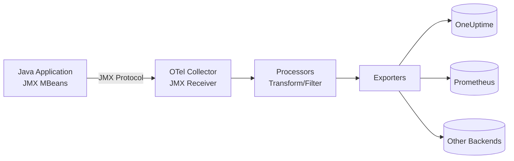

# How to Configure the JMX Receiver in the OpenTelemetry Collector

Author: [nawazdhandala](https://www.github.com/nawazdhandala)

Tags: OpenTelemetry, Collector, JMX, Java, JVM, Observability, Metrics, Monitoring

Description: Learn how to configure the JMX receiver in OpenTelemetry Collector to monitor Java applications and JVM performance with practical YAML examples and MBean configuration.

---

Java Management Extensions (JMX) is the standard mechanism for monitoring and managing Java applications. JMX exposes runtime information about the JVM, thread pools, garbage collection, memory usage, and application-specific metrics through MBeans. The OpenTelemetry Collector's JMX receiver provides standardized access to these metrics, enabling centralized observability for Java workloads.

This guide covers JMX receiver configuration from basics through production deployment, including MBean selection, authentication, remote JMX setup, and monitoring multiple Java applications.

## Understanding the JMX Receiver

The JMX receiver connects to Java applications via JMX protocol and collects metrics from MBeans (Managed Beans). These MBeans expose operational data about the JVM and application components.

Key metrics collected include:

- JVM memory usage (heap, non-heap, pools)
- Garbage collection statistics and pause times
- Thread counts and states
- Class loading metrics
- CPU usage and system load
- Application-specific MBeans (Tomcat, Kafka, etc.)
- Database connection pools
- Custom application metrics

The receiver translates JMX attributes into OpenTelemetry metrics that flow through your Collector pipeline for processing and export.

## Prerequisites: Enable JMX in Java Applications

Before configuring the receiver, enable JMX in your Java applications. Add these JVM arguments:

**Local JMX (no authentication)**:

```bash
java \
  -Dcom.sun.management.jmxremote \
  -Dcom.sun.management.jmxremote.port=9999 \
  -Dcom.sun.management.jmxremote.authenticate=false \
  -Dcom.sun.management.jmxremote.ssl=false \
  -Dcom.sun.management.jmxremote.local.only=false \
  -jar your-application.jar
```

**Production JMX (with authentication and SSL)**:

```bash
java \
  -Dcom.sun.management.jmxremote \
  -Dcom.sun.management.jmxremote.port=9999 \
  -Dcom.sun.management.jmxremote.rmi.port=9999 \
  -Dcom.sun.management.jmxremote.authenticate=true \
  -Dcom.sun.management.jmxremote.ssl=true \
  -Dcom.sun.management.jmxremote.password.file=/path/to/jmxremote.password \
  -Dcom.sun.management.jmxremote.access.file=/path/to/jmxremote.access \
  -Djavax.net.ssl.keyStore=/path/to/keystore.jks \
  -Djavax.net.ssl.keyStorePassword=password \
  -jar your-application.jar
```

Verify JMX is accessible:

```bash
# Using jconsole (GUI)
jconsole localhost:9999

# Using jmxterm (CLI)
java -jar jmxterm.jar -l localhost:9999
```

## Data Flow Architecture

The following diagram shows how metrics flow from Java applications through the Collector:



The receiver connects to the JMX endpoint, queries configured MBeans, and converts attributes into OpenTelemetry metrics.

## Basic Configuration

Here's a minimal configuration to monitor a local Java application:

```yaml
# receivers: Define how telemetry enters the Collector
receivers:
  # JMX receiver collects metrics from Java applications
  jmx:
    # JMX service URL
    # Format: service:jmx:rmi:///jndi/rmi://host:port/jmxrmi
    endpoint: service:jmx:rmi:///jndi/rmi://localhost:9999/jmxrmi

    # How often to scrape metrics
    collection_interval: 30s

    # Target system type for predefined metric mappings
    # Options: jvm, tomcat, cassandra, kafka, activemq, jetty, wildfly
    target_system: jvm

# exporters: Define where telemetry is sent
exporters:
  # Export to OneUptime using OTLP over HTTP
  otlphttp:
    endpoint: https://oneuptime.com/otlp
    headers:
      x-oneuptime-token: ${ONEUPTIME_TOKEN}

# service: Wire receivers and exporters into pipelines
service:
  pipelines:
    # Metrics pipeline for JMX data
    metrics:
      receivers: [jmx]
      exporters: [otlphttp]
```

This basic setup connects to a local JMX endpoint, collects standard JVM metrics every 30 seconds, and exports to OneUptime.

## Production Configuration with Authentication

Production environments require authentication, SSL, and comprehensive metric collection:

```yaml
receivers:
  # JMX receiver with full production settings
  jmx:
    # Production JMX endpoint with authentication
    endpoint: service:jmx:rmi:///jndi/rmi://java-app.example.com:9999/jmxrmi

    # Collection interval - balance freshness vs overhead
    # 10-30s for production applications
    collection_interval: 15s

    # Target system for predefined metrics
    target_system: jvm

    # JMX authentication credentials
    username: ${JMX_USERNAME}
    password: ${JMX_PASSWORD}

    # Additional JVM options for the JMX connection
    # Useful for SSL and truststore configuration
    additional_jars:
      # Include custom client libraries if needed
      # - /path/to/custom-client.jar

    # Keystore configuration for SSL
    keystore: /etc/ssl/keystore.jks
    keystore_password: ${KEYSTORE_PASSWORD}
    keystore_type: JKS

    # Truststore configuration for SSL
    truststore: /etc/ssl/truststore.jks
    truststore_password: ${TRUSTSTORE_PASSWORD}

    # Remote profile for connecting to remote JVMs
    # Uses JMX over RMI
    remote_profile: true

    # Timeout for JMX operations
    timeout: 30s

# processors: Transform and enrich metrics
processors:
  # Add resource attributes for context
  resource:
    attributes:
      - key: service.name
        value: java-app-production
        action: upsert
      - key: deployment.environment
        value: production
        action: upsert
      - key: host.name
        value: ${HOSTNAME}
        action: upsert
      - key: java.app.name
        value: order-service
        action: upsert
      - key: java.app.version
        value: 2.1.0
        action: upsert

  # Batch metrics to reduce network overhead
  batch:
    timeout: 10s
    send_batch_size: 512

  # Prevent collector from exhausting memory
  memory_limiter:
    check_interval: 5s
    limit_mib: 512
    spike_limit_mib: 128

  # Filter metrics if needed to reduce cardinality
  # filter/metrics:
  #   metrics:
  #     exclude:
  #       match_type: regexp
  #       metric_names:
  #         - "jvm\\.classes\\..*"

exporters:
  # Export to OneUptime with retry and queuing
  otlphttp:
    endpoint: https://oneuptime.com/otlp
    headers:
      x-oneuptime-token: ${ONEUPTIME_TOKEN}
    timeout: 30s

    # Retry configuration for reliability
    retry_on_failure:
      enabled: true
      initial_interval: 5s
      max_interval: 30s
      max_elapsed_time: 300s

    # Queue metrics during backend outages
    sending_queue:
      enabled: true
      num_consumers: 10
      queue_size: 1000

service:
  pipelines:
    metrics:
      receivers: [jmx]
      processors: [memory_limiter, resource, batch]
      exporters: [otlphttp]
```

This production configuration includes authentication, SSL, resource tagging, and reliable export with retry logic.

## Custom MBean Configuration

Beyond predefined target systems, you can collect custom MBeans specific to your application:

```yaml
receivers:
  jmx:
    endpoint: service:jmx:rmi:///jndi/rmi://localhost:9999/jmxrmi
    collection_interval: 30s
    target_system: jvm

    # Custom MBean configurations
    # This allows collecting application-specific metrics
    mbeans:
      # Example: Custom application metrics
      - object_name: "com.example.app:type=RequestProcessor,name=*"
        attributes:
          - name: RequestCount
            alias: app.request.count
            description: "Total requests processed"
            type: counter
          - name: AverageResponseTime
            alias: app.response.time.avg
            description: "Average response time in milliseconds"
            type: gauge
          - name: ErrorCount
            alias: app.error.count
            description: "Total errors encountered"
            type: counter

      # Example: Database connection pool
      - object_name: "com.zaxxer.hikari:type=Pool,name=*"
        attributes:
          - name: ActiveConnections
            alias: db.pool.connections.active
            type: gauge
          - name: IdleConnections
            alias: db.pool.connections.idle
            type: gauge
          - name: TotalConnections
            alias: db.pool.connections.total
            type: gauge
          - name: ThreadsAwaitingConnection
            alias: db.pool.threads.waiting
            type: gauge

      # Example: Cache metrics
      - object_name: "com.example.cache:type=CacheManager,name=*"
        attributes:
          - name: HitCount
            alias: cache.hits
            type: counter
          - name: MissCount
            alias: cache.misses
            type: counter
          - name: Size
            alias: cache.size
            type: gauge
          - name: EvictionCount
            alias: cache.evictions
            type: counter

processors:
  batch:
    timeout: 10s

exporters:
  otlphttp:
    endpoint: https://oneuptime.com/otlp
    headers:
      x-oneuptime-token: ${ONEUPTIME_TOKEN}

service:
  pipelines:
    metrics:
      receivers: [jmx]
      processors: [batch]
      exporters: [otlphttp]
```

This configuration collects both standard JVM metrics and custom application-specific MBeans.

## Monitoring Multiple Java Applications

To monitor multiple Java applications, define multiple receiver instances:

```yaml
receivers:
  # Order service
  jmx/order-service:
    endpoint: service:jmx:rmi:///jndi/rmi://order-service.example.com:9999/jmxrmi
    collection_interval: 15s
    target_system: jvm
    username: ${JMX_USERNAME}
    password: ${JMX_PASSWORD}

  # Payment service
  jmx/payment-service:
    endpoint: service:jmx:rmi:///jndi/rmi://payment-service.example.com:9999/jmxrmi
    collection_interval: 15s
    target_system: jvm
    username: ${JMX_USERNAME}
    password: ${JMX_PASSWORD}

  # Inventory service
  jmx/inventory-service:
    endpoint: service:jmx:rmi:///jndi/rmi://inventory-service.example.com:9999/jmxrmi
    collection_interval: 15s
    target_system: jvm
    username: ${JMX_USERNAME}
    password: ${JMX_PASSWORD}

  # Kafka cluster
  jmx/kafka:
    endpoint: service:jmx:rmi:///jndi/rmi://kafka-broker.example.com:9999/jmxrmi
    collection_interval: 30s
    target_system: kafka
    username: ${JMX_USERNAME}
    password: ${JMX_PASSWORD}

processors:
  # Tag order service
  resource/order:
    attributes:
      - key: service.name
        value: order-service
        action: upsert
      - key: service.type
        value: microservice
        action: upsert

  # Tag payment service
  resource/payment:
    attributes:
      - key: service.name
        value: payment-service
        action: upsert
      - key: service.type
        value: microservice
        action: upsert

  # Tag inventory service
  resource/inventory:
    attributes:
      - key: service.name
        value: inventory-service
        action: upsert
      - key: service.type
        value: microservice
        action: upsert

  # Tag Kafka
  resource/kafka:
    attributes:
      - key: service.name
        value: kafka
        action: upsert
      - key: service.type
        value: message-broker
        action: upsert

  batch:
    timeout: 10s

exporters:
  otlphttp:
    endpoint: https://oneuptime.com/otlp
    headers:
      x-oneuptime-token: ${ONEUPTIME_TOKEN}

service:
  pipelines:
    # Separate pipelines for independent processing
    metrics/order:
      receivers: [jmx/order-service]
      processors: [resource/order, batch]
      exporters: [otlphttp]

    metrics/payment:
      receivers: [jmx/payment-service]
      processors: [resource/payment, batch]
      exporters: [otlphttp]

    metrics/inventory:
      receivers: [jmx/inventory-service]
      processors: [resource/inventory, batch]
      exporters: [otlphttp]

    metrics/kafka:
      receivers: [jmx/kafka]
      processors: [resource/kafka, batch]
      exporters: [otlphttp]
```

Separate pipelines allow independent tagging and processing per application.

## Key Metrics Explained

The JMX receiver exposes critical JVM and application metrics:

**jvm.memory.heap.used**
- Current heap memory usage in bytes
- Monitor for memory leaks
- Alert when consistently above 80% of max heap

**jvm.memory.heap.committed**
- Amount of heap memory guaranteed available
- Should grow/shrink with usage patterns
- Sudden changes may indicate configuration issues

**jvm.gc.collections.count**
- Number of garbage collection cycles
- High frequency indicates memory pressure
- Track separately for young and old generation

**jvm.gc.collections.elapsed**
- Total time spent in GC pauses
- High values impact application latency
- Alert when GC time exceeds 5% of CPU time

**jvm.threads.count**
- Current number of live threads
- Growing thread count may indicate thread leaks
- Set alerts for unusual increases

**jvm.threads.daemon.count**
- Number of daemon threads
- Usually stable, sudden changes are suspicious

**jvm.threads.peak.count**
- Peak thread count since JVM started
- Useful for capacity planning

**jvm.classes.loaded**
- Number of classes currently loaded
- Growing without bounds indicates classloader leaks

**jvm.cpu.usage**
- JVM process CPU utilization (0.0 to 1.0)
- High sustained values indicate CPU bottleneck

**jvm.system.cpu.usage**
- Overall system CPU utilization
- Context for JVM CPU usage

## Predefined Target Systems

The JMX receiver includes predefined configurations for common Java systems:

**jvm**: Standard JVM metrics (memory, GC, threads, classes)

```yaml
receivers:
  jmx:
    endpoint: service:jmx:rmi:///jndi/rmi://localhost:9999/jmxrmi
    target_system: jvm
```

**tomcat**: Apache Tomcat web server metrics

```yaml
receivers:
  jmx:
    endpoint: service:jmx:rmi:///jndi/rmi://tomcat:9999/jmxrmi
    target_system: tomcat
```

**kafka**: Apache Kafka broker metrics

```yaml
receivers:
  jmx:
    endpoint: service:jmx:rmi:///jndi/rmi://kafka-broker:9999/jmxrmi
    target_system: kafka
```

**cassandra**: Apache Cassandra database metrics

```yaml
receivers:
  jmx:
    endpoint: service:jmx:rmi:///jndi/rmi://cassandra:9999/jmxrmi
    target_system: cassandra
```

**activemq**: Apache ActiveMQ message broker metrics

```yaml
receivers:
  jmx:
    endpoint: service:jmx:rmi:///jndi/rmi://activemq:9999/jmxrmi
    target_system: activemq
```

## Deployment Patterns

### Pattern 1: Sidecar Agent

Deploy a Collector container alongside each Java application (Kubernetes):

```yaml
# Kubernetes Pod with sidecar collector
apiVersion: v1
kind: Pod
metadata:
  name: java-app
spec:
  containers:
    # Main application container
    - name: app
      image: myapp:latest
      env:
        - name: JAVA_OPTS
          value: "-Dcom.sun.management.jmxremote -Dcom.sun.management.jmxremote.port=9999 -Dcom.sun.management.jmxremote.authenticate=false -Dcom.sun.management.jmxremote.ssl=false"
      ports:
        - containerPort: 8080
          name: http
        - containerPort: 9999
          name: jmx

    # Sidecar collector
    - name: otel-collector
      image: otel/opentelemetry-collector-contrib:latest
      args: ["--config=/etc/otel/config.yaml"]
      volumeMounts:
        - name: config
          mountPath: /etc/otel

  volumes:
    - name: config
      configMap:
        name: otel-collector-config
```

**Pros**: Isolated, scales with application, no cross-pod networking
**Cons**: Resource overhead per pod

### Pattern 2: DaemonSet Collector

Deploy collectors as DaemonSets that monitor all Java pods on a node:

```yaml
receivers:
  # Use Kubernetes service discovery
  jmx:
    endpoint: service:jmx:rmi:///jndi/rmi://pod-ip:9999/jmxrmi
    # Configure discovery to find Java pods
```

**Pros**: Fewer collector instances, centralized per node
**Cons**: Requires service discovery, more complex configuration

### Pattern 3: Centralized Collector

One collector monitors multiple Java services:

```yaml
receivers:
  jmx/service-01:
    endpoint: service:jmx:rmi:///jndi/rmi://service-01:9999/jmxrmi
  jmx/service-02:
    endpoint: service:jmx:rmi:///jndi/rmi://service-02:9999/jmxrmi
  # ... more services
```

**Pros**: Simple deployment, single config
**Cons**: Single point of failure, network dependency

## Troubleshooting Common Issues

**Connection Refused**

Verify JMX port is open and accessible:

```bash
# Test network connectivity
telnet java-app.example.com 9999

# Check JMX is enabled
jconsole java-app.example.com:9999
```

Ensure firewall rules allow JMX port:

```bash
# Allow JMX port in firewall
sudo firewall-cmd --permanent --add-port=9999/tcp
sudo firewall-cmd --reload
```

**Authentication Failures**

Verify credentials in JMX password file:

```bash
# /path/to/jmxremote.password
monitorRole  QED
controlRole  R&D
```

Ensure password file has correct permissions:

```bash
chmod 600 /path/to/jmxremote.password
chown javauser:javauser /path/to/jmxremote.password
```

**SSL/TLS Issues**

Verify keystore and truststore are accessible:

```bash
# Test keystore
keytool -list -keystore /etc/ssl/keystore.jks

# Test truststore
keytool -list -keystore /etc/ssl/truststore.jks
```

**RMI Connection Issues**

Set RMI hostname explicitly:

```bash
java \
  -Djava.rmi.server.hostname=java-app.example.com \
  -Dcom.sun.management.jmxremote \
  -Dcom.sun.management.jmxremote.port=9999 \
  -Dcom.sun.management.jmxremote.rmi.port=9999 \
  -jar your-app.jar
```

**High Cardinality Metrics**

Filter out high-cardinality MBeans:

```yaml
processors:
  filter/metrics:
    metrics:
      exclude:
        match_type: regexp
        metric_names:
          - ".*\\.heap\\.pool\\..*"  # Exclude per-pool metrics
```

## Integration with OneUptime

Once metrics flow to OneUptime, you can:

1. **Create dashboards** showing JVM memory usage, GC behavior, and thread counts across all Java applications
2. **Set up alerts** for high heap usage, frequent GC pauses, or thread count anomalies
3. **Correlate with application traces** to see how JVM performance affects request latency
4. **Track memory leak trends** by analyzing heap usage over time
5. **Compare JVM configurations** to optimize performance across environments

OpenTelemetry's standard format integrates Java metrics with infrastructure metrics, application logs, and distributed traces.

## Best Practices

**Choose appropriate collection intervals**:
- 15-30s for production applications
- 60s for less critical services
- Avoid intervals < 10s to prevent overhead

**Monitor garbage collection**:
```yaml
receivers:
  jmx:
    target_system: jvm
    # Automatically includes GC metrics
```

**Use resource attributes**:
```yaml
processors:
  resource:
    attributes:
      - key: service.name
        value: order-service
      - key: java.version
        value: "17"
```

**Secure JMX endpoints**:
- Always use authentication in production
- Enable SSL for remote connections
- Restrict access with firewalls

**Collect custom MBeans**:
```yaml
receivers:
  jmx:
    mbeans:
      - object_name: "com.example:type=CustomMetrics"
        attributes:
          - name: MetricName
            alias: custom.metric
```

**Protect credentials**:
```bash
export JMX_USERNAME="monitor"
export JMX_PASSWORD="secure-password"
export ONEUPTIME_TOKEN="your-token"
```

**Monitor the Collector**:
```yaml
service:
  telemetry:
    metrics:
      readers:
        - periodic:
            exporter:
              otlp:
                endpoint: https://oneuptime.com/otlp
```

## Related Resources

For more on OpenTelemetry Collector:

- [OpenTelemetry Collector: What It Is, When You Need It, and When You Don't](https://oneuptime.com/blog/post/2025-09-18-what-is-opentelemetry-collector-and-why-use-one/view)
- [How to collect internal metrics from OpenTelemetry Collector](https://oneuptime.com/blog/post/2025-01-22-how-to-collect-opentelemetry-collector-internal-metrics/view)

For monitoring other infrastructure:
- [How to Configure the Elasticsearch Receiver in the OpenTelemetry Collector](https://oneuptime.com/blog/post/2026-02-06-elasticsearch-receiver-opentelemetry-collector/view)
- [How to Configure the Nginx Receiver in the OpenTelemetry Collector](https://oneuptime.com/blog/post/2026-02-06-nginx-receiver-opentelemetry-collector/view)

## Final Thoughts

The JMX receiver brings standardized monitoring to Java applications and JVM-based systems. Configure JMX endpoints with authentication, collect standard JVM metrics plus custom MBeans, and export to vendor-neutral backends.

OpenTelemetry's standard format means your Java metrics integrate seamlessly with metrics from other languages, infrastructure components, and cloud services. Monitor your entire stack with consistent tooling.

Need a backend for your OpenTelemetry metrics? OneUptime provides native OTLP support with powerful dashboards, alerting, and correlation capabilities without vendor lock-in.
