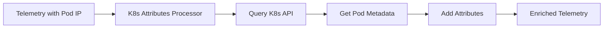

# How to Configure the K8s Attributes Processor in the OpenTelemetry Collector

Author: [nawazdhandala](https://www.github.com/nawazdhandala)

Tags: OpenTelemetry, Collector, Processors, Kubernetes, K8s, Container Orchestration, Observability

Description: Learn how to configure the Kubernetes attributes processor in OpenTelemetry Collector to automatically enrich telemetry data with pod, namespace, deployment, and node metadata.

The Kubernetes attributes processor automatically enriches your telemetry data with Kubernetes metadata. Instead of manually tagging every span, metric, or log with pod names, namespaces, labels, and annotations, this processor queries the Kubernetes API and adds this context automatically. This makes it easy to filter, group, and analyze telemetry by Kubernetes concepts.

## Why K8s Attributes Matter

In containerized environments, knowing that a request took 500ms is less useful than knowing it came from pod `checkout-service-abc123` in namespace `production`, running on node `worker-3`, with label `version=v2.1.0`. Kubernetes metadata provides the context needed to understand and debug distributed systems.

For more on structuring observability data, see our guide on [structured logging in OpenTelemetry](https://oneuptime.com/blog/post/2025-08-28-how-to-structure-logs-properly-in-opentelemetry/view).

## How the Processor Works

The K8s attributes processor uses the Kubernetes API to look up metadata based on the pod IP address. When a span, metric, or log arrives with a source IP, the processor queries Kubernetes for the corresponding pod and adds attributes like pod name, namespace, labels, and annotations.



## Basic Configuration

Here's a minimal configuration that adds common Kubernetes attributes:

```yaml
# Basic Kubernetes attributes processor configuration
# Automatically adds pod, namespace, and node metadata
receivers:
  otlp:
    protocols:
      grpc:
        endpoint: 0.0.0.0:4317

processors:
  # K8s attributes processor queries Kubernetes API
  # Requires appropriate RBAC permissions
  k8sattributes:
    # How to authenticate with Kubernetes API
    # "serviceAccount" uses the pod's service account
    auth_type: "serviceAccount"

    # Extract pod IP from connection context
    # Works when collector receives traces from pods directly
    passthrough: false

    # Which metadata fields to add
    extract:
      metadata:
        - k8s.namespace.name
        - k8s.deployment.name
        - k8s.statefulset.name
        - k8s.daemonset.name
        - k8s.cronjob.name
        - k8s.job.name
        - k8s.node.name
        - k8s.pod.name
        - k8s.pod.uid
        - k8s.pod.start_time

exporters:
  otlp:
    endpoint: https://oneuptime.com/otlp
    headers:
      x-oneuptime-token: YOUR_ONEUPTIME_TOKEN

service:
  pipelines:
    traces:
      receivers: [otlp]
      processors: [k8sattributes]
      exporters: [otlp]
```

## Kubernetes RBAC Configuration

The processor needs permissions to read Kubernetes resources. Create a ServiceAccount, ClusterRole, and ClusterRoleBinding:

```yaml
# ServiceAccount for the collector
apiVersion: v1
kind: ServiceAccount
metadata:
  name: otel-collector
  namespace: observability

---
# ClusterRole with required permissions
# Allows reading pods, namespaces, and other resources
apiVersion: rbac.authorization.k8s.io/v1
kind: ClusterRole
metadata:
  name: otel-collector
rules:
  # Read pods and pod metadata
  - apiGroups: [""]
    resources:
      - pods
      - namespaces
    verbs:
      - get
      - watch
      - list

  # Read replicasets for deployment info
  - apiGroups: ["apps"]
    resources:
      - replicasets
    verbs:
      - get
      - list
      - watch

  # Read nodes for node metadata
  - apiGroups: [""]
    resources:
      - nodes
    verbs:
      - get
      - list
      - watch

---
# Bind the role to the service account
apiVersion: rbac.authorization.k8s.io/v1
kind: ClusterRoleBinding
metadata:
  name: otel-collector
subjects:
  - kind: ServiceAccount
    name: otel-collector
    namespace: observability
roleRef:
  kind: ClusterRole
  name: otel-collector
  apiGroup: rbac.authorization.k8s.io
```

Deploy the collector with this ServiceAccount:

```yaml
apiVersion: apps/v1
kind: Deployment
metadata:
  name: otel-collector
  namespace: observability
spec:
  replicas: 3
  selector:
    matchLabels:
      app: otel-collector
  template:
    metadata:
      labels:
        app: otel-collector
    spec:
      # Use the service account with K8s API permissions
      serviceAccountName: otel-collector
      containers:
        - name: otel-collector
          image: otel/opentelemetry-collector-contrib:latest
          ports:
            - containerPort: 4317
              name: otlp-grpc
            - containerPort: 4318
              name: otlp-http
          volumeMounts:
            - name: config
              mountPath: /etc/otel
      volumes:
        - name: config
          configMap:
            name: otel-collector-config
```

## Extracting Labels and Annotations

Add Kubernetes labels and annotations to your telemetry:

```yaml
processors:
  k8sattributes:
    auth_type: "serviceAccount"
    passthrough: false

    extract:
      metadata:
        - k8s.namespace.name
        - k8s.pod.name
        - k8s.pod.uid
        - k8s.deployment.name
        - k8s.node.name

      # Extract pod labels
      # Labels help categorize and filter telemetry
      labels:
        # Extract specific labels
        - tag_name: app.name
          key: app
          from: pod

        - tag_name: app.version
          key: version
          from: pod

        - tag_name: environment
          key: environment
          from: pod

      # Extract pod annotations
      # Annotations provide additional metadata
      annotations:
        - tag_name: deployment.strategy
          key: deployment.strategy
          from: pod

        - tag_name: owner.team
          key: owner.team
          from: pod

        - tag_name: cost.center
          key: cost.center
          from: pod

exporters:
  otlp:
    endpoint: https://oneuptime.com/otlp
    headers:
      x-oneuptime-token: YOUR_ONEUPTIME_TOKEN

service:
  pipelines:
    traces:
      receivers: [otlp]
      processors: [k8sattributes]
      exporters: [otlp]
```

Example pod with labels and annotations:

```yaml
apiVersion: v1
kind: Pod
metadata:
  name: checkout-service-abc123
  namespace: production
  labels:
    app: checkout-service
    version: v2.1.0
    environment: production
  annotations:
    deployment.strategy: blue-green
    owner.team: payments
    cost.center: engineering
spec:
  containers:
    - name: app
      image: checkout-service:v2.1.0
```

## Pod Association Strategies

The processor supports multiple ways to associate telemetry with pods:

### IP Address Association (Default)

Associates telemetry based on source IP address:

```yaml
processors:
  k8sattributes:
    auth_type: "serviceAccount"

    # IP-based association (default)
    # Looks up pod by IP address from connection
    passthrough: false

    # Where to find the pod IP
    # Default: uses connection's remote address
    extract:
      metadata:
        - k8s.pod.name
        - k8s.namespace.name
```

### Resource Attribute Association

Associates using existing resource attributes:

```yaml
processors:
  k8sattributes:
    auth_type: "serviceAccount"
    passthrough: false

    # Use pod name from resource attributes
    # Requires applications to set k8s.pod.name
    pod_association:
      - sources:
          - from: resource_attribute
            name: k8s.pod.name

    # Fallback to IP if pod name not found
      - sources:
          - from: connection

    extract:
      metadata:
        - k8s.namespace.name
        - k8s.deployment.name
        - k8s.node.name
```

### Environment Variable Association

Associates using environment variables in application:

```yaml
processors:
  k8sattributes:
    auth_type: "serviceAccount"
    passthrough: false

    # Application sets POD_NAME env var
    # SDK reads it and adds to resource attributes
    pod_association:
      - sources:
          - from: resource_attribute
            name: k8s.pod.name

    extract:
      metadata:
        - k8s.namespace.name
        - k8s.deployment.name
```

Configure the application pod to expose pod name:

```yaml
apiVersion: v1
kind: Pod
metadata:
  name: my-app
spec:
  containers:
    - name: app
      image: my-app:latest
      env:
        # Expose pod name to application
        - name: POD_NAME
          valueFrom:
            fieldRef:
              fieldPath: metadata.name
        - name: POD_NAMESPACE
          valueFrom:
            fieldRef:
              fieldPath: metadata.namespace
        - name: POD_IP
          valueFrom:
            fieldRef:
              fieldPath: status.podIP
```

## Filter Configuration

Control which pods to process:

```yaml
processors:
  k8sattributes:
    auth_type: "serviceAccount"
    passthrough: false

    # Filter pods by namespace
    # Only process specific namespaces
    filter:
      namespace: production

    # Or filter by multiple criteria
    filter:
      # Match specific namespace
      namespace: production
      # Match pods with specific label
      labels:
        - key: environment
          value: production
          op: equals

      # Match pods in specific node
      node_from_env_var: KUBE_NODE_NAME

    extract:
      metadata:
        - k8s.pod.name
        - k8s.namespace.name

exporters:
  otlp:
    endpoint: https://oneuptime.com/otlp
    headers:
      x-oneuptime-token: YOUR_ONEUPTIME_TOKEN

service:
  pipelines:
    traces:
      receivers: [otlp]
      processors: [k8sattributes]
      exporters: [otlp]
```

## Field Extraction Options

Extract specific fields from various Kubernetes resources:

```yaml
processors:
  k8sattributes:
    auth_type: "serviceAccount"
    passthrough: false

    extract:
      # Standard metadata fields
      metadata:
        - k8s.namespace.name
        - k8s.pod.name
        - k8s.pod.uid
        - k8s.pod.start_time
        - k8s.deployment.name
        - k8s.replicaset.name
        - k8s.statefulset.name
        - k8s.daemonset.name
        - k8s.cronjob.name
        - k8s.job.name
        - k8s.node.name
        - k8s.cluster.uid

      # Pod labels (all or specific)
      labels:
        # Extract all pod labels
        - tag_name: ""
          key: "*"
          from: pod

      # Namespace labels
      labels:
        - tag_name: namespace.tier
          key: tier
          from: namespace

      # Pod annotations (specific)
      annotations:
        - tag_name: prometheus.io/scrape
          key: prometheus.io/scrape
          from: pod

        - tag_name: prometheus.io/port
          key: prometheus.io/port
          from: pod

exporters:
  otlp:
    endpoint: https://oneuptime.com/otlp
    headers:
      x-oneuptime-token: YOUR_ONEUPTIME_TOKEN

service:
  pipelines:
    traces:
      receivers: [otlp]
      processors: [k8sattributes]
      exporters: [otlp]
    metrics:
      receivers: [otlp]
      processors: [k8sattributes]
      exporters: [otlp]
    logs:
      receivers: [otlp]
      processors: [k8sattributes]
      exporters: [otlp]
```

## Owner Reference Extraction

Extract owner information (Deployments, StatefulSets, etc.):

```yaml
processors:
  k8sattributes:
    auth_type: "serviceAccount"
    passthrough: false

    extract:
      metadata:
        - k8s.pod.name
        - k8s.namespace.name

        # Extract owner reference info
        # Traces pods back to their controllers
        - k8s.deployment.name
        - k8s.statefulset.name
        - k8s.daemonset.name
        - k8s.replicaset.name
        - k8s.job.name
        - k8s.cronjob.name

    # Enable owner lookup
    # Queries API for owner references
    owner_lookup_enabled: true

exporters:
  otlp:
    endpoint: https://oneuptime.com/otlp
    headers:
      x-oneuptime-token: YOUR_ONEUPTIME_TOKEN

service:
  pipelines:
    traces:
      receivers: [otlp]
      processors: [k8sattributes]
      exporters: [otlp]
```

## Production Configuration

Here's a comprehensive production setup with all features:

```yaml
receivers:
  otlp:
    protocols:
      grpc:
        endpoint: 0.0.0.0:4317
      http:
        endpoint: 0.0.0.0:4318

processors:
  # Batch before K8s attributes for efficiency
  batch:
    timeout: 1s
    send_batch_size: 1024

  k8sattributes:
    # Authentication with K8s API
    auth_type: "serviceAccount"

    # Don't pass through without enrichment
    passthrough: false

    # How to associate telemetry with pods
    pod_association:
      # Try resource attribute first (if app sets it)
      - sources:
          - from: resource_attribute
            name: k8s.pod.name
      # Try pod IP from resource attributes
      - sources:
          - from: resource_attribute
            name: k8s.pod.ip
      # Fallback to connection IP
      - sources:
          - from: connection

    # Filter to production namespace only
    filter:
      namespace: production

    # Extract comprehensive metadata
    extract:
      metadata:
        - k8s.namespace.name
        - k8s.pod.name
        - k8s.pod.uid
        - k8s.pod.start_time
        - k8s.deployment.name
        - k8s.node.name
        - k8s.cluster.uid

      # Extract business-relevant labels
      labels:
        - tag_name: app
          key: app
          from: pod
        - tag_name: version
          key: version
          from: pod
        - tag_name: environment
          key: environment
          from: pod
        - tag_name: team
          key: team
          from: pod
        - tag_name: cost.center
          key: cost-center
          from: namespace

      # Extract operational annotations
      annotations:
        - tag_name: deployment.strategy
          key: deployment.strategy
          from: pod
        - tag_name: sla.tier
          key: sla.tier
          from: pod
        - tag_name: runbook.url
          key: runbook.url
          from: pod

    # Enable owner reference lookups
    owner_lookup_enabled: true

  # Add resource detection after K8s attributes
  # Combines K8s metadata with cloud provider info
  resourcedetection:
    detectors: [env, system, gcp, eks, aks]
    timeout: 5s

exporters:
  otlp:
    endpoint: ${OTEL_EXPORTER_OTLP_ENDPOINT:https://oneuptime.com/otlp}
    headers:
      x-oneuptime-token: ${OTEL_EXPORTER_OTLP_TOKEN}

    timeout: 30s
    retry_on_failure:
      enabled: true
      initial_interval: 5s
      max_interval: 30s
      max_elapsed_time: 300s

    compression: gzip

service:
  pipelines:
    traces:
      receivers: [otlp]
      processors: [batch, k8sattributes, resourcedetection]
      exporters: [otlp]

    metrics:
      receivers: [otlp]
      processors: [batch, k8sattributes, resourcedetection]
      exporters: [otlp]

    logs:
      receivers: [otlp]
      processors: [batch, k8sattributes, resourcedetection]
      exporters: [otlp]

  # Monitor K8s attributes processor performance
  telemetry:
    metrics:
      level: detailed
      readers:
        - periodic:
            exporter:
              otlp:
                protocol: http/protobuf
                endpoint: https://oneuptime.com/otlp
                headers:
                  x-oneuptime-token: ${OTEL_EXPORTER_OTLP_TOKEN}
```

## DaemonSet Deployment Pattern

Deploy as DaemonSet for optimal performance (reduces API queries):

```yaml
apiVersion: apps/v1
kind: DaemonSet
metadata:
  name: otel-collector
  namespace: observability
spec:
  selector:
    matchLabels:
      app: otel-collector
  template:
    metadata:
      labels:
        app: otel-collector
    spec:
      serviceAccountName: otel-collector
      hostNetwork: true
      containers:
        - name: otel-collector
          image: otel/opentelemetry-collector-contrib:latest
          env:
            # Pass node name to collector
            - name: KUBE_NODE_NAME
              valueFrom:
                fieldRef:
                  fieldPath: spec.nodeName
            - name: POD_NAME
              valueFrom:
                fieldRef:
                  fieldPath: metadata.name
            - name: POD_NAMESPACE
              valueFrom:
                fieldRef:
                  fieldPath: metadata.namespace
          ports:
            - containerPort: 4317
              name: otlp-grpc
            - containerPort: 4318
              name: otlp-http
          resources:
            requests:
              memory: 256Mi
              cpu: 100m
            limits:
              memory: 512Mi
              cpu: 500m
          volumeMounts:
            - name: config
              mountPath: /etc/otel
      volumes:
        - name: config
          configMap:
            name: otel-collector-config
```

## Caching Configuration

Configure caching to reduce Kubernetes API load:

```yaml
processors:
  k8sattributes:
    auth_type: "serviceAccount"
    passthrough: false

    # Cache pod metadata to reduce API calls
    # TTL of 10 minutes balances freshness with API load
    extract:
      metadata:
        - k8s.pod.name
        - k8s.namespace.name
        - k8s.deployment.name

    # Pod association with caching
    pod_association:
      - sources:
          - from: connection

exporters:
  otlp:
    endpoint: https://oneuptime.com/otlp
    headers:
      x-oneuptime-token: YOUR_ONEUPTIME_TOKEN

service:
  pipelines:
    traces:
      receivers: [otlp]
      processors: [k8sattributes]
      exporters: [otlp]
```

## Troubleshooting

### Missing Kubernetes Attributes

**Issue**: Telemetry doesn't have Kubernetes metadata.

**Solutions**:
- Verify ServiceAccount has proper RBAC permissions
- Check that `auth_type` is set to `serviceAccount`
- Confirm pod IP is being extracted correctly
- Check processor logs for API errors
- Verify namespace filter isn't excluding pods

### High Kubernetes API Load

**Issue**: Collector generating too many API requests.

**Solutions**:
- Deploy as DaemonSet instead of Deployment
- Increase cache TTL
- Use more specific filters to reduce pod count
- Consider using passthrough mode for non-critical metadata

### Incorrect Pod Association

**Issue**: Telemetry associated with wrong pod.

**Solutions**:
- Verify `pod_association` sources are correct
- Check that pod IPs are unique (avoid host networking)
- Confirm resource attributes are set correctly in apps
- Use multiple association sources with fallback

## Performance Considerations

The K8s attributes processor adds overhead:

- **API calls**: Each unique pod requires API query
- **Caching**: Reduces API load but uses memory
- **Processing time**: Adds 1-10ms per span depending on cache hits
- **Network**: Requires connectivity to Kubernetes API

Optimize by:
- Deploying as DaemonSet (one collector per node)
- Using selective extraction (only needed fields)
- Applying namespace filters
- Enabling owner lookup only when needed

## Summary

| Configuration | Purpose | Key Parameter |
|---------------|---------|---------------|
| **auth_type** | K8s API authentication | serviceAccount |
| **pod_association** | How to find pods | sources (connection, resource_attribute) |
| **extract.metadata** | Standard K8s fields | List of k8s.* fields |
| **extract.labels** | Pod/namespace labels | tag_name, key, from |
| **extract.annotations** | Pod annotations | tag_name, key, from |
| **filter** | Limit processing | namespace, labels, node |
| **owner_lookup_enabled** | Get controller info | true/false |

The Kubernetes attributes processor automatically enriches telemetry with pod, namespace, deployment, and other Kubernetes metadata. This context is essential for filtering, grouping, and analyzing observability data in containerized environments, making it easier to understand and debug distributed systems running on Kubernetes.

For more on Kubernetes observability, see our guides on [Kubernetes health checks](https://oneuptime.com/blog/post/2026-01-06-nodejs-health-checks-kubernetes/view) and [debugging Kubernetes DNS issues](https://oneuptime.com/blog/post/2026-01-06-debug-kubernetes-dns-issues/view).
