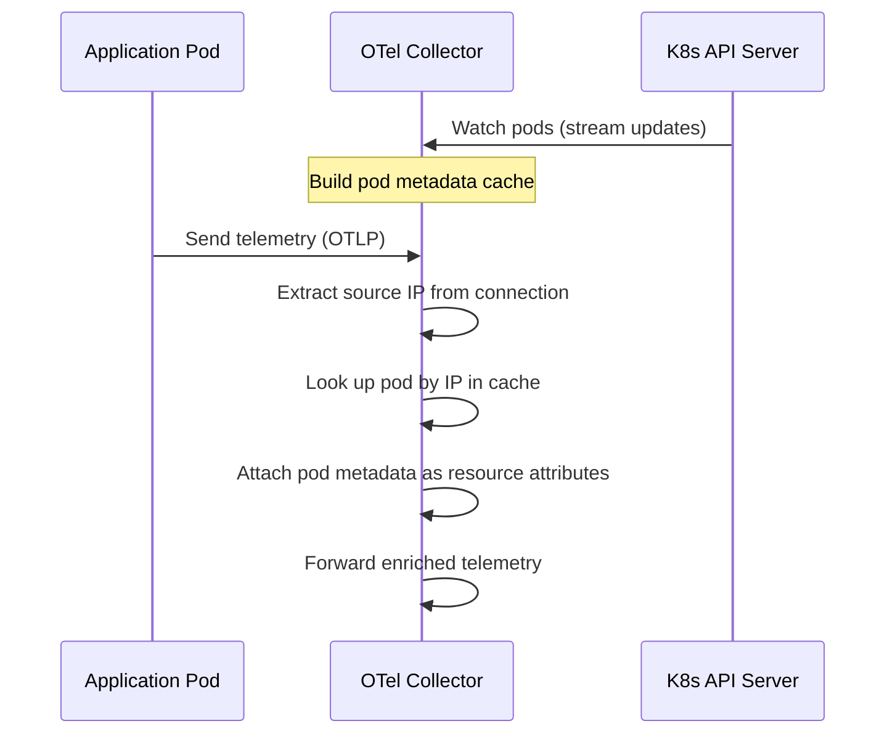
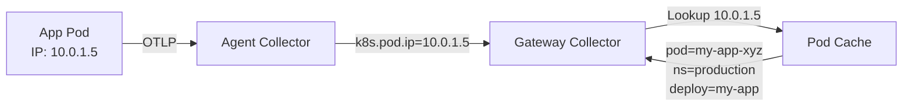

# How to Use the K8s Attributes Processor for Pod Metadata Enrichment

Author: [nawazdhandala](https://www.github.com/nawazdhandala)

Tags: OpenTelemetry, Kubernetes, K8s Attributes Processor, Metadata, Collector, Enrichment

Description: A hands-on guide to configuring the OpenTelemetry Collector K8s Attributes Processor to automatically enrich telemetry with Kubernetes pod metadata.

---

When you look at a trace or a log line in your observability backend, the first question is usually "which pod did this come from?" Without Kubernetes metadata, your telemetry is just a stream of anonymous data points. You know something is slow or broken, but you do not know where to look.

The K8s Attributes Processor solves this by automatically enriching all telemetry flowing through the OpenTelemetry Collector with Kubernetes metadata. Pod name, namespace, deployment, node, labels, annotations - it adds all of this without any changes to your application code. This guide covers how to configure it properly and get the most out of it.

## How the K8s Attributes Processor Works

The processor watches the Kubernetes API to build an in-memory cache of pod metadata. When telemetry arrives at the collector, the processor looks up the source pod (based on IP address or other identifiers) and attaches the relevant metadata as resource attributes.



The processor is part of the OpenTelemetry Collector Contrib distribution. It is one of the most widely used processors in Kubernetes deployments because it adds context that is impossible to get any other way without modifying every application.

## Basic Configuration

At its simplest, you enable the processor and tell it which metadata fields to extract. The processor uses a Kubernetes service account to access the API server, so you need the right RBAC permissions.

This configuration extracts the most commonly needed Kubernetes metadata fields from the pod where the telemetry originated.

```yaml
# collector-config.yaml
processors:
  k8sattributes:
    # Use the collector's service account for API access
    auth_type: "serviceAccount"

    # Which metadata fields to extract
    extract:
      metadata:
        - k8s.pod.name
        - k8s.pod.uid
        - k8s.namespace.name
        - k8s.node.name
        - k8s.deployment.name
        - k8s.replicaset.name
        - k8s.statefulset.name
        - k8s.daemonset.name
        - k8s.job.name
        - k8s.cronjob.name
        - k8s.container.name
        - container.image.name
        - container.image.tag

    # How to match telemetry to pods
    pod_association:
      - sources:
          - from: connection
```

The `pod_association` section is critical. It tells the processor how to figure out which pod sent the telemetry. The `from: connection` setting uses the source IP address from the network connection. When the collector runs as a DaemonSet with `hostPort` enabled, this is the pod's IP address, which maps directly to a pod in the cache.

## Setting Up RBAC

The processor needs read access to the Kubernetes API. Here is the minimal RBAC configuration.

These RBAC resources grant the collector the minimum permissions needed to watch pods, replicasets, and namespaces.

```yaml
# rbac.yaml
apiVersion: v1
kind: ServiceAccount
metadata:
  name: otel-collector
  namespace: observability
---
apiVersion: rbac.authorization.k8s.io/v1
kind: ClusterRole
metadata:
  name: otel-collector
rules:
  # Read pods for metadata enrichment
  - apiGroups: [""]
    resources: ["pods", "namespaces"]
    verbs: ["get", "list", "watch"]
  # Read replicasets to resolve deployment names
  - apiGroups: ["apps"]
    resources: ["replicasets"]
    verbs: ["get", "list", "watch"]
---
apiVersion: rbac.authorization.k8s.io/v1
kind: ClusterRoleBinding
metadata:
  name: otel-collector
subjects:
  - kind: ServiceAccount
    name: otel-collector
    namespace: observability
roleRef:
  kind: ClusterRole
  name: otel-collector
  apiGroup: rbac.authorization.k8s.io
```

The replicaset permission is important. Kubernetes does not directly associate pods with deployments. The processor needs to read the replicaset to find the owning deployment. Without this permission, you get pod and replicaset names but not the deployment name.

## Extracting Labels and Annotations

Beyond standard metadata, you often want to extract specific pod labels or annotations. Team names, application versions, cost center tags - these live as labels on your pods, and the processor can pull them into your telemetry.

This configuration extracts specific labels and annotations from pods and maps them to custom resource attribute names.

```yaml
processors:
  k8sattributes:
    auth_type: "serviceAccount"
    extract:
      metadata:
        - k8s.pod.name
        - k8s.namespace.name
        - k8s.deployment.name

      # Extract specific labels
      labels:
        # Map the "app" label to a resource attribute
        - tag_name: app.label.name
          key: app
          from: pod
        # Map the team label for cost attribution
        - tag_name: team.name
          key: team
          from: pod
        # Extract version from label
        - tag_name: app.version
          key: version
          from: pod

      # Extract specific annotations
      annotations:
        # Pull the git commit SHA from pod annotation
        - tag_name: app.git.commit
          key: git-commit-sha
          from: pod
        # Extract the oncall team annotation
        - tag_name: oncall.team
          key: oncall-team
          from: pod

    pod_association:
      - sources:
          - from: connection
```

You can also use regex to extract labels that match a pattern. This is useful when you have many labels with a common prefix.

This configuration uses a regex pattern to extract all labels that start with a given prefix.

```yaml
processors:
  k8sattributes:
    auth_type: "serviceAccount"
    extract:
      labels:
        # Extract all labels matching "app.kubernetes.io/*"
        - tag_name: k8s.label.$1
          key_regex: "app\\.kubernetes\\.io/(.*)"
          from: pod
```

## Pod Association Strategies

The `from: connection` method works great when the collector runs as a DaemonSet on the same node as the pods. But in a gateway topology where the collector runs centrally, the source IP might be the agent collector, not the application pod.

There are several association strategies to handle different deployment models.

This configuration shows multiple pod association methods, listed in priority order from most specific to least specific.

```yaml
processors:
  k8sattributes:
    auth_type: "serviceAccount"
    extract:
      metadata:
        - k8s.pod.name
        - k8s.namespace.name
        - k8s.deployment.name

    pod_association:
      # Try resource attributes first (most reliable)
      - sources:
          - from: resource_attribute
            name: k8s.pod.ip
      # Then try resource attribute for pod UID
      - sources:
          - from: resource_attribute
            name: k8s.pod.uid
      # Fall back to connection IP
      - sources:
          - from: connection
```

When running in gateway mode, the best approach is to have the agent collector add the pod IP as a resource attribute using the `resource` processor or the `k8sattributes` processor at the agent level. The gateway processor then uses `from: resource_attribute` to look up the pod.



## Filtering Which Pods Are Watched

In large clusters, watching every pod consumes memory and API server resources. You can filter which pods the processor watches.

This configuration restricts the processor to only watch pods in specific namespaces and with specific labels.

```yaml
processors:
  k8sattributes:
    auth_type: "serviceAccount"
    extract:
      metadata:
        - k8s.pod.name
        - k8s.namespace.name
        - k8s.deployment.name

    # Only watch pods in these namespaces
    filter:
      namespace: production

    # Or filter by node when running as DaemonSet
    # This dramatically reduces memory usage
    filter:
      node_from_env_var: KUBE_NODE_NAME

    pod_association:
      - sources:
          - from: connection
```

The `node_from_env_var` filter is particularly important for DaemonSet deployments. It tells the processor to only cache pods running on the same node as the collector. On a 1,000-node cluster, this reduces the cache from all pods cluster-wide to just the pods on the local node.

Set the environment variable in your DaemonSet spec:

```yaml
# In your DaemonSet container spec
env:
  - name: KUBE_NODE_NAME
    valueFrom:
      fieldRef:
        fieldPath: spec.nodeName
```

## Complete Pipeline Example

Here is a full collector configuration that combines the K8s Attributes Processor with other common processors in the correct order.

This complete pipeline configuration shows the K8s Attributes Processor working alongside memory limiting, filtering, and batching in a production-ready setup.

```yaml
receivers:
  otlp:
    protocols:
      grpc:
        endpoint: 0.0.0.0:4317
      http:
        endpoint: 0.0.0.0:4318

processors:
  # Always put memory_limiter first
  memory_limiter:
    check_interval: 1s
    limit_mib: 512
    spike_limit_mib: 128

  # Enrich with Kubernetes metadata
  k8sattributes:
    auth_type: "serviceAccount"
    extract:
      metadata:
        - k8s.pod.name
        - k8s.pod.uid
        - k8s.namespace.name
        - k8s.node.name
        - k8s.deployment.name
        - k8s.container.name
        - container.image.name
        - container.image.tag
      labels:
        - tag_name: app.name
          key: app
          from: pod
        - tag_name: team
          key: team
          from: pod
    filter:
      node_from_env_var: KUBE_NODE_NAME
    pod_association:
      - sources:
          - from: resource_attribute
            name: k8s.pod.ip
      - sources:
          - from: connection

  # Add the cluster name for multi-cluster setups
  resource:
    attributes:
      - key: k8s.cluster.name
        value: "production-us-east-1"
        action: upsert

  # Batch for efficient export
  batch:
    send_batch_size: 1024
    timeout: 5s

exporters:
  otlp:
    endpoint: your-backend.example.com:4317

service:
  pipelines:
    traces:
      receivers: [otlp]
      processors: [memory_limiter, k8sattributes, resource, batch]
      exporters: [otlp]
    metrics:
      receivers: [otlp]
      processors: [memory_limiter, k8sattributes, resource, batch]
      exporters: [otlp]
    logs:
      receivers: [otlp]
      processors: [memory_limiter, k8sattributes, resource, batch]
      exporters: [otlp]
```

## What the Enriched Telemetry Looks Like

After passing through the processor, a span that originally had minimal attributes will now carry rich Kubernetes context. Here is what a span's resource attributes look like after enrichment:

```json
{
  "resource": {
    "attributes": {
      "service.name": "order-service",
      "k8s.pod.name": "order-service-7f8b9d6c4-x2k9j",
      "k8s.pod.uid": "a1b2c3d4-e5f6-7890-abcd-ef1234567890",
      "k8s.namespace.name": "production",
      "k8s.node.name": "worker-node-03",
      "k8s.deployment.name": "order-service",
      "k8s.container.name": "order-service",
      "container.image.name": "registry.example.com/order-service",
      "container.image.tag": "v2.3.1",
      "app.name": "order-service",
      "team": "checkout-team",
      "k8s.cluster.name": "production-us-east-1"
    }
  }
}
```

This makes it trivial to filter traces by namespace, group errors by deployment, or attribute costs to teams.

## Troubleshooting Common Issues

**No metadata appearing**: Check RBAC permissions. The collector logs will show 403 errors if it cannot access the Kubernetes API. Also verify that your pod association method matches your deployment topology.

**Deployment name missing**: Make sure you have `get`, `list`, and `watch` permissions on `replicasets` in the `apps` API group. The processor resolves pod -> replicaset -> deployment, so it needs access to the intermediate resource.

**High memory usage**: Use the `node_from_env_var` filter for DaemonSet deployments. Without it, every agent caches metadata for every pod in the cluster.

**Stale metadata after pod restarts**: The processor watches for pod changes in real-time. If you see stale data, the Kubernetes watch connection may have been interrupted. Check collector logs for reconnection messages.

## Conclusion

The K8s Attributes Processor is one of those components that should be in every Kubernetes-based OpenTelemetry deployment. It adds critical context to your telemetry without requiring any application changes. Configure it once, deploy it with proper RBAC, and every trace, metric, and log flowing through your collector automatically gets tagged with the Kubernetes context you need for debugging and analysis.

The most important things to get right are the RBAC permissions, the pod association strategy that matches your topology, and the node filter for DaemonSet deployments. Get those three right and the rest is straightforward.
